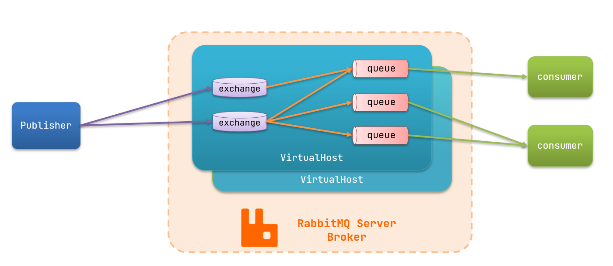
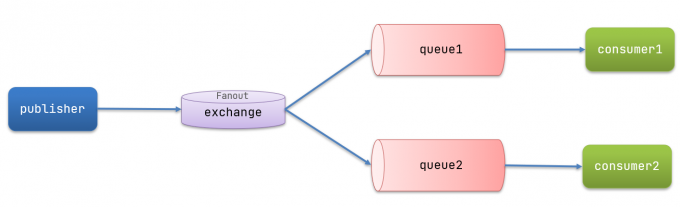
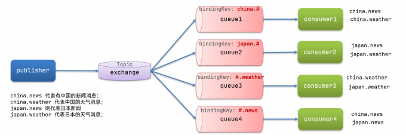
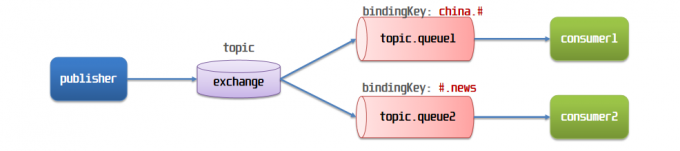

## 初识MQ

### 同步和异步通讯

- 微服务间通讯有同步和异步两种方式
  - 同步通讯：就像打电话，需要实时响应，而且通话期间，不能响应其他的电话，当有其他妹子给你打电话的时候，就容易错失`良机`。时效性强
  - 异步通讯：就像发邮件，QQ/微信聊天，不需要马上回复。可以同时给多个妹子发消息，支持多线操作，`时间`管理大师的必备技能。时效性弱
- 两种方式各有优劣，打电话可以立即得到响应，但是却不能与多个人同时通话，发送邮件可以同时与多个人收发邮件，但是往往响应会有延迟

#### 同步通讯

- 我们之前学习的Feign调用就属于同步方式，虽然调用可以实时得到结果，但是存在一些问题。订单服务，仓储服务，短信服务是和我们的支付服务耦合在一起的。

  ```java
  public void PaymentService() {
      orderService.doSth();
      storageService.doSth();
      messageService.doSth();
      ...
  }
  ```

- 例如产品经理一拍脑门，让加一个业务，然后你就需要去支付服务中改动代码，让你删除某个服务，也需要去支付服务中改动代码，耦合度太高了

- 同时，性能也是一个问题，例如支付服务需要50ms，另外三个服务各需要150ms，那么一个完整的支付服务就需要恐怖的0.5s，也就是一秒只能完成两个请求，这么低的并发，还玩个锤子。

- 支付服务在等待订单服务完成的时候，也在占用着CPU和内存，却啥也不干，浪费系统资源。

- 假如这时仓储服务还挂掉了，那么请求就会卡在这里，如果积压了很多的请求，支付服务就会将系统资源耗尽，从而整个支付服务都挂掉了

- 综上所述，同步调用存在以下问题

  1. 耦合度高：每次加入新的请求，都需要修改原来的代码
  2. 性能下降：调用者需要等待服务提供者响应，如果调用链过长，则响应时间等于每次调用服务的时间之和
  3. 资源浪费：调用链中的每个服务在等待响应过程中，不能释放请求占用资源，高并发场景下会极度浪费系统资源
  4. 级联失败：如果服务提供者出现问题，那么调用方都会跟着出现问题，就像多米诺骨牌一样，迅速导致整个微服务故障

#### 异步通讯

- 异步调用可以避免上述问题
  - 我们以购买商品为例，用户支付后需要调用订单服务完成订单状态修改，调用物流服务，从仓库分配响应的库存并准备发货
  - 在事件模式中，支付服务是事件发布者(publisher)，在支付完成后只需要发布一个支付成功的事件(event)，事件中带上订单id，
  - 订单服务和物流服务是事件订阅者(Consumer)，订阅支付成功的事件，监听到事件后完成自己的业务即可
- 为了解除事件发布者与订阅者之间的耦合，两者并不是直接通信，而是由一个中间人(Broker)来代理。发布者发布事件到Broker，不关心谁来订阅的事件。而订阅者从Broker订阅事件，不关心是谁发布的事件
- 那么此时产品经理让你添加一个新服务时，你只需要让新服务来订阅事件就好了，而取消一个服务，也只需要让其取消订阅事件，并不需要修改订单服务，这样就解除了服务之间的耦合
- 同时也能带来性能上的提升，之前我们完成一个支付服务，需要耗时500ms，而现在支付服务只需要向Broker发布一个支付成功的事件，剩下的就不用它管了，这样只需要60ms就能完成支付服务
- 服务没有强依赖，不用担心级联失败问题。在之前，如果仓储服务挂掉了，那么支付服务无法完成，占用资源。此时更多的请求过来，支付服务就会耗尽系统资源，从而整个支付服务都瘫痪了。但是现在，仓储服务就算挂掉了，也丝毫不会影响到我们的支付服务，同时支付服务也不需要等待存储服务完成，期间也不会占用无意义的系统资源。
- 流量削峰：不管发布事件的流量波动多大，都由Broker接收，订阅者可以按照自己的速度去处理事件。
- 我们发现整个异步通讯过程中，所有东西都是依赖于Broker来实现的，那么如果Broker挂了，整个微服务也完蛋了。
- 异步通讯的优点
  - 耦合度低
  - 吞吐量提升
  - 故障隔离
  - 流量削峰
- 异步通讯的缺点
  - 依赖于Broker的可靠性、安全性、吞吐能力
  - 架构复杂时，业务没有明确的流程线，不好追踪管理（出了bug都不好找）
- 好在现在开源平台上的 Broker 的软件是非常成熟的，比较常见的一种就是我们这里要学习的MQ技术。

### 技术对比

- MQ(MessageQueue)中文是消息队列，字面意思就是存放消息的队列，也就是事件驱动中的Broker
- 比较常见的MQ实现
  - ActiveMQ
  - RabbitMQ
  - RockerMQ
  - Kafka
- 几种常见的MQ对比

|            |      **RabbitMQ**       |          **ActiveMQ**          | **RocketMQ** | **Kafka**  |
| :--------: | :---------------------: | :----------------------------: | :----------: | :--------: |
| 公司/社区  |         Rabbit          |             Apache             |     阿里     |   Apache   |
|  开发语言  |         Erlang          |              Java              |     Java     | Scala&Java |
|  协议支持  | AMQP，XMPP，SMTP，STOMP | OpenWire,STOMP，REST,XMPP,AMQP |  自定义协议  | 自定义协议 |
|   可用性   |           高            |              一般              |      高      |     高     |
| 单机吞吐量 |          一般           |               差               |      高      |   非常高   |
|  消息延迟  |         微秒级          |             毫秒级             |    毫秒级    |  毫秒以内  |
| 消息可靠性 |           高            |              一般              |      高      |    一般    |

- 追求可用性：Kafka、RockerMQ、RabbitMQ
- 追求可靠性：RabbitMQ、RocketMQ
- 追求吞吐能力：RocketMQ、Kafka
- 追求消息低延迟：RabbitMQ、Kafka

## 快速入门

### 安装RabbitMQ

- 这里是在CentOS 7虚拟机中使用Docker安装的

- 拉取镜像

  ```java
  docker pull rabbitmq:3-management
  ```

- 使用docker images查看是否已经成功拉取，之后启动一个RabbitMQ容器

  ```java
  docker run \
    -e RABBITMQ_DEFAULT_USER=root \
    -e RABBITMQ_DEFAULT_PASS=root \
    --name mq \
    --hostname mq1 \
    -p 15672:15672 \
    -p 5672:5672 \
    -d \
    rabbitmq:3-management
  ```

- 其中：两个环境变量分别配置登录用户和密码，15672是rabbitMQ的管理平台的端口，5672是将来做消息通信的端口

- 容器启动成功之后，我们输入`虚拟机ip:15672`访问RabbitMQ的管理平台

RabbitMQ中的一些角色：

- publisher：生产者
- consumer：消费者
- exchange：交换机，负责消息路由
- queue：队列，存储消息
- virtualHost：虚拟主机，隔离不同租户的exchange、queue、消息的隔离



### RabbitMQ消息类型

- RabbitMQ官方提供了5个不同的Demo实例，对应了不同的消息模型

  1. 基本消息类型(BasicQueue)
  2. 工作消息队列(WorkQueue)

  - 其中发布订阅(Publish、Subscribe)，又根据交换机类型不同，分为三种
    1. 广播(Fanout Exchange)
    2. 路由(Direct Exchange)
    3. 主题(Topic Exchange)

### 导入Demo工程

- 包括三部分：
  - mq-demo：父工程，管理项目依赖
  - publisher：消息的发送者
  - consumer：消息的消费者

### 入门案例

https://www.rabbitmq.com/tutorials/tutorial-one-java

RabbitMQ 是一个消息代理：它接受和转发消息。您可以把它想象成一个邮局：当您将要投寄的邮件放入邮箱时，您可以确定邮递员最终会将邮件投递给您的收件人。在这个类比中，RabbitMQ 是一个邮箱、一个邮局和一个邮递员。
RabbitMQ 和邮局之间的主要区别在于它不处理纸张，而是接受、存储和转发`二进制`数据块——消息。

- 官方的HelloWorld是基于最基础的消息队列模型来实现的，只包括三个角色：
  - publisher：消息发布者，将消息发送到队列queue
  - queue：消息队列，负责接受并缓存消息
  - consumer：订阅队列，处理队列中的消息


#### publisher实现

1. 建立连接
2. 创建Channel
3. 声明队列
4. 发送消息
5. 关闭连接和Channel

```java
import com.rabbitmq.client.Channel;
import com.rabbitmq.client.Connection;
import com.rabbitmq.client.ConnectionFactory;
import org.junit.Test;

import java.io.IOException;
import java.util.concurrent.TimeoutException;

public class PublisherTest {
    @Test
    public void testSendMessage() throws IOException, TimeoutException {
        // 1.建立连接
        ConnectionFactory factory = new ConnectionFactory();
        // 1.1.设置连接参数，分别是：主机名、端口号、vhost、用户名、密码
        factory.setHost("192.168.150.101");
        factory.setPort(5672);
        factory.setVirtualHost("/");
        factory.setUsername("root");
        factory.setPassword("root");
        // 1.2.建立连接
        Connection connection = factory.newConnection();

        // 2.创建通道Channel
        Channel channel = connection.createChannel();

        // 3.声明队列
        String queueName = "simple.queue";
        channel.queueDeclare(queueName, false, false, false, null);

        // 4.发送消息
        String message = "hello, rabbitmq!";
        channel.basicPublish("", queueName, null, message.getBytes());
        System.out.println("发送消息成功：【" + message + "】");

        // 5.关闭通道和连接
        channel.close();
        connection.close();

    }
}
```

#### consumer实现

1. 建立连接
2. 创建Channel
3. 声明队列
4. 订阅消息

```java
import com.rabbitmq.client.Channel;
import com.rabbitmq.client.Connection;
import com.rabbitmq.client.ConnectionFactory;

import java.io.IOException;
import java.util.concurrent.TimeoutException;

public class ConsumerTest {

    public static void main(String[] args) throws IOException, TimeoutException {
        // 1.建立连接
        ConnectionFactory factory = new ConnectionFactory();
        // 1.1.设置连接参数，分别是：主机名、端口号、vhost、用户名、密码
        factory.setHost("192.168.150.101");
        factory.setPort(5672);
        factory.setVirtualHost("/");
        factory.setUsername("root");
        factory.setPassword("root");
        // 1.2.建立连接
        Connection connection = factory.newConnection();

        // 2.创建通道Channel
        Channel channel = connection.createChannel();

        // 3.声明队列，声明一个队列是幂等的——只有当它不存在时才会被创建，我们在这里再次声明队列可以防止队列为null
        String queueName = "simple.queue";
        channel.queueDeclare(queueName, false, false, false, null);

        // 4.订阅消息
        channel.basicConsume(queueName, true, new DefaultConsumer(channel){
            @Override
            public void handleDelivery(String consumerTag, Envelope envelope,
                                       AMQP.BasicProperties properties, byte[] body) throws IOException {
                // 5.处理消息
                String message = new String(body);
                System.out.println("接收到消息：【" + message + "】");
            }
        });
        System.out.println("等待接收消息。。。。");
    }
}
```

- 但是这种写法，看着就很麻烦，其中设置连接参数时，和我们之前学JDBC一样，手动在代码中设置连接四要素，但是后来我们数据库的连接参数都是写在yml文件中来简化代码的，这里同理，所以我们继续往下学SpringAMQP

### 总结

- 基本消息队列的消息发送流程
  1. 建立connection
  2. 创建channel
  3. 使用channel声明队列
  4. 使用channel向队列发送消息
- 基本消息队列的消息接收流程
  1. 建立connection
  2. 创建channel
  3. 使用channel声明队列
  4. 定义consumer的消费行为handleDelivery()，也就是接收到消息后要执行的业务逻辑
  5. 利用channel将消费者与队列绑定

## 3. SpringAMQP

- SpringAMQP官方地址：https://spring.io/projects/spring-amqp， 它是基于RabbitMQ封装的一套模板，提供了模板来发送和接收消息。包含两部分，其中spring-amqp是基础抽象，spring-rabbit是底层的默认实现，并且利用SpringBoot对其实现了自动装配，使用起来十分方便
- AMQP(Advanced Message Queuing Portocol)，是用于在应用程序中传递业务消息的开放标准。该协议与语言和平台无关，更符合微服务中独立性的要求
- SpringAMQP提供了三个功能
  1. 自动声明队列、交换机及其绑定关系
  2. 基于注解的监听模式，异步接收消息
  3. 封装了RabbitTemplate工具，用于发送消息(之前在Redis中我们也接触过RedisTemplate)

### 3.1 Basic Queue

- 在父工程mq-demo中引入依赖

  ```java
  <!--AMQP依赖，包含RabbitMQ-->
  <dependency>
      <groupId>org.springframework.boot</groupId>
      <artifactId>spring-boot-starter-amqp</artifactId>
  </dependency>
  ```

#### 消息发送

- 首先配置MQ地址，在publisher服务的application.yml中添加配置

  ```java
  spring:
    rabbitmq:
      host: 192.168.128.130 ## 主机名
      port: 5672 #端口
      username: root ## 用户名
      password: root ## 密码
      virtual-host: / ## 虚拟主机
  ```

- 然后在publisher服务中编写测试类SpringAmqpTest，并利用RabbitTemplate实现消息发送，如果没有创建simple.queue，可以在RabbitMQ管理平台

  ```java
  import org.junit.Test;
  import org.junit.runner.RunWith;
  import org.springframework.amqp.rabbit.core.RabbitTemplate;
  import org.springframework.beans.factory.annotation.Autowired;
  import org.springframework.boot.test.context.SpringBootTest;
  import org.springframework.test.context.junit4.SpringRunner;
  
  @RunWith(SpringRunner.class)
  @SpringBootTest
  public class SpringAmqpTest {
      @Autowired
      private RabbitTemplate rabbitTemplate;
  
      @Test
      public void testSimpleQueue() {
          String queueName = "simple.queue";
          String message = "Hello, SpringAMQP! ";
          rabbitTemplate.convertAndSend(queueName, message);
      }
  }
  ```

#### 消息接收

- 刚刚我们已经完成了消息的发送，那么现在我们来完成消息的监听

- 首先配置MQ地址，在consumer服务的application.yml中添加配置

  ```java
  spring:
    rabbitmq:
      host: 192.168.128.130 ## 主机名
      port: 5672 #端口
      username: root ## 用户名
      password: root ## 密码
      virtual-host: / ## 虚拟主机
  ```

- 消费者要做的事情是监听消息，Spring已经帮我们跟MQ建立了连接，所以消费者只需要关心要监听哪个队列，以及监听到队列了，要干什么事儿

- 在consumer服务新建一个类，编写消费逻辑，其中@Component

  注解是将该类声明为一个Bean，这样Spring才能找到它，然后使用@RabbitListener

  注解声明要监听的队列，msg参数就是接收到的消息，我们可以在方法体内编写对消息的处理逻辑，但这里只是简单的输出了一下

  ```java
  @Component
  public class SpringRabbitListener {
      @RabbitListener(queues = "simple.queue")
      public void listenSimpleQueueMessage(String msg) {
          System.out.println("Spring 消费者接收到消息：【" + msg + "】");
      }
  }
  ```

- 启动consumer服务，控制台可以看到接收到的消息，并且如果多次使用publisher服务发送消息，consumer服务也会接收多次消息，表现为控制台也输出多次语句

  ```repl
  Spring 消费者接收到消息：【Hello, SpringAMQP! 】
  Spring 消费者接收到消息：【Hello, SpringAMQP! 】
  ```

#### 小结

- SpringAMQP如何接收消息？

  - 引入amqp的starter依赖

  - 配置RabbitMQ地址

  - 定义类，添加@Component注解

  - 类中声明方法，添加@RabbitListener

    注解，方法参数就时消息

    注意：消息一旦消费就会从队列删除，RabbitMQ没有消息回溯功能

### 3.2 Wrok Queue

- `Work Queue`，也被称为(Task queues)，任务模型。简单来说就是`让多个消费者绑定到一个队列，共同消费队列中的信息。`
- 当消息处理比较耗时的时候，可能生产消息的速度会远远大于消息的消费速度，长此以往，消息就会堆积的越来越多，无法及时处理。
- 此时就可以使用`Work模型`，多个消费者共同处理消息，那么处理速度就能大大提高了

- 这次我们循环发送消息，模拟大量消息堆积的场景

- 在publisher服务中的SpringAmqpTest类中新增测试方法

  ```java
  @Test
  public void testWorkQueue() throws InterruptedException {
      String queueName = "simple.queue";
      String message = "Hello, SpringAMQP! __ ";
      for (int i = 1; i <= 50; i++) {
          // 循环发送50条消息，带上消息编号
          rabbitTemplate.convertAndSend(queueName, message + i);
          // 休眠20ms，模拟在1s内发送完
          Thread.sleep(20);
      }
  }
  ```

  

#### 消息接收

- 要模拟多个消费者绑定同一个队列，我们在consumer

  服务的SpringRabbitListener中添加两个方法

  ```java
  //RabbitMQ 消费者方法,监听同一个队列 simple.queue
  @RabbitListener(queues = "simple.queue")
  public void listenWorkQueueMessage1(String msg) throws InterruptedException {
      System.out.println("消费者1 接收到消息：【" + msg + "】" + LocalDateTime.now());
      // 休眠20ms，1s大致能处理50条消息
      Thread.sleep(20);
  }
  
  @RabbitListener(queues = "simple.queue")
  public void listenWorkQueueMessage2(String msg) throws InterruptedException {
      System.err.println("消费者2........接收到消息：【" + msg + "】" + LocalDateTime.now());
      // 休眠200ms，1s大概能处理5条消息
      Thread.sleep(200);
  }
  ```

  - @RabbitListener(queues = "simple.queue")：标记这是一个消息监听方法，Spring AMQP 会从 simple.queue 拉取消息并回调该方法。

#### 测试

启动consumer服务后，执行publisher服务中刚编写的测试方法，发送50条消息，查看控制台输出

```java
消费者2........接收到消息：【Hello, SpringAMQP! __ 1】2022-12-23T13:16:41.407
消费者1 接收到消息：【Hello, SpringAMQP! __ 2】2022-12-23T13:16:41.414
消费者1 接收到消息：【Hello, SpringAMQP! __ 4】2022-12-23T13:16:41.461
消费者1 接收到消息：【Hello, SpringAMQP! __ 6】2022-12-23T13:16:41.502
消费者1 接收到消息：【Hello, SpringAMQP! __ 8】2022-12-23T13:16:41.549
消费者1 接收到消息：【Hello, SpringAMQP! __ 10】2022-12-23T13:16:41.592
消费者2........接收到消息：【Hello, SpringAMQP! __ 3】2022-12-23T13:16:41.609
消费者1 接收到消息：【Hello, SpringAMQP! __ 12】2022-12-23T13:16:41.635
消费者1 接收到消息：【Hello, SpringAMQP! __ 14】2022-12-23T13:16:41.680
消费者1 接收到消息：【Hello, SpringAMQP! __ 16】2022-12-23T13:16:41.722
消费者1 接收到消息：【Hello, SpringAMQP! __ 18】2022-12-23T13:16:41.767
消费者2........接收到消息：【Hello, SpringAMQP! __ 5】2022-12-23T13:16:41.811
消费者1 接收到消息：【Hello, SpringAMQP! __ 20】2022-12-23T13:16:41.813
消费者1 接收到消息：【Hello, SpringAMQP! __ 22】2022-12-23T13:16:41.858
消费者1 接收到消息：【Hello, SpringAMQP! __ 24】2022-12-23T13:16:41.902
消费者1 接收到消息：【Hello, SpringAMQP! __ 26】2022-12-23T13:16:41.944
消费者1 接收到消息：【Hello, SpringAMQP! __ 28】2022-12-23T13:16:41.990
消费者2........接收到消息：【Hello, SpringAMQP! __ 7】2022-12-23T13:16:42.013
消费者1 接收到消息：【Hello, SpringAMQP! __ 30】2022-12-23T13:16:42.035
消费者1 接收到消息：【Hello, SpringAMQP! __ 32】2022-12-23T13:16:42.078
消费者1 接收到消息：【Hello, SpringAMQP! __ 34】2022-12-23T13:16:42.122
消费者1 接收到消息：【Hello, SpringAMQP! __ 36】2022-12-23T13:16:42.165
消费者1 接收到消息：【Hello, SpringAMQP! __ 38】2022-12-23T13:16:42.210
消费者2........接收到消息：【Hello, SpringAMQP! __ 9】2022-12-23T13:16:42.215
消费者1 接收到消息：【Hello, SpringAMQP! __ 40】2022-12-23T13:16:42.256
消费者1 接收到消息：【Hello, SpringAMQP! __ 42】2022-12-23T13:16:42.300
消费者1 接收到消息：【Hello, SpringAMQP! __ 44】2022-12-23T13:16:42.343
消费者1 接收到消息：【Hello, SpringAMQP! __ 46】2022-12-23T13:16:42.387
消费者2........接收到消息：【Hello, SpringAMQP! __ 11】2022-12-23T13:16:42.416
消费者1 接收到消息：【Hello, SpringAMQP! __ 48】2022-12-23T13:16:42.431
消费者1 接收到消息：【Hello, SpringAMQP! __ 50】2022-12-23T13:16:42.473
消费者2........接收到消息：【Hello, SpringAMQP! __ 13】2022-12-23T13:16:42.617
消费者2........接收到消息：【Hello, SpringAMQP! __ 15】2022-12-23T13:16:42.819
消费者2........接收到消息：【Hello, SpringAMQP! __ 17】2022-12-23T13:16:43.021
消费者2........接收到消息：【Hello, SpringAMQP! __ 19】2022-12-23T13:16:43.224
消费者2........接收到消息：【Hello, SpringAMQP! __ 21】2022-12-23T13:16:43.425
消费者2........接收到消息：【Hello, SpringAMQP! __ 23】2022-12-23T13:16:43.626
消费者2........接收到消息：【Hello, SpringAMQP! __ 25】2022-12-23T13:16:43.827
消费者2........接收到消息：【Hello, SpringAMQP! __ 27】2022-12-23T13:16:44.027
消费者2........接收到消息：【Hello, SpringAMQP! __ 29】2022-12-23T13:16:44.229
消费者2........接收到消息：【Hello, SpringAMQP! __ 31】2022-12-23T13:16:44.431
消费者2........接收到消息：【Hello, SpringAMQP! __ 33】2022-12-23T13:16:44.634
消费者2........接收到消息：【Hello, SpringAMQP! __ 35】2022-12-23T13:16:44.837
消费者2........接收到消息：【Hello, SpringAMQP! __ 37】2022-12-23T13:16:45.040
消费者2........接收到消息：【Hello, SpringAMQP! __ 39】2022-12-23T13:16:45.240
消费者2........接收到消息：【Hello, SpringAMQP! __ 41】2022-12-23T13:16:45.444
消费者2........接收到消息：【Hello, SpringAMQP! __ 43】2022-12-23T13:16:45.646
消费者2........接收到消息：【Hello, SpringAMQP! __ 45】2022-12-23T13:16:45.846
消费者2........接收到消息：【Hello, SpringAMQP! __ 47】2022-12-23T13:16:46.048
消费者2........接收到消息：【Hello, SpringAMQP! __ 49】2022-12-23T13:16:46.250
```

- 可以看到消费者1很快就完成了自己的25条消息，消费者2却在缓慢的处理自己的25条消息
- 也就是说当前的处理方式是平均分配给每个消费者，并没有按照我们设定的处理能力来处理消息，这样显然是有问题的，消费者2很大概率会出现消息积压的风险

- #### 能者多劳

- 在spring中有一个简单的配置，可以解决这个问题。我们修改consumer服务中的application.yml文件，添加如下配置

- ```java
  spring:
    rabbitmq:
      listener:
        simple:
          prefetch: 1 ## 每次只能获取一条消息，处理完成才能获取下一个消息
  ```

- 

重启服务，查看控制台输出

```java
消费者2........接收到消息：【Hello, SpringAMQP! __ 1】2022-12-23T13:37:15.252
消费者1 接收到消息：【Hello, SpringAMQP! __ 2】2022-12-23T13:37:15.262
消费者1 接收到消息：【Hello, SpringAMQP! __ 3】2022-12-23T13:37:15.284
消费者1 接收到消息：【Hello, SpringAMQP! __ 4】2022-12-23T13:37:15.307
消费者1 接收到消息：【Hello, SpringAMQP! __ 5】2022-12-23T13:37:15.331
消费者1 接收到消息：【Hello, SpringAMQP! __ 6】2022-12-23T13:37:15.354
消费者1 接收到消息：【Hello, SpringAMQP! __ 7】2022-12-23T13:37:15.377
消费者1 接收到消息：【Hello, SpringAMQP! __ 8】2022-12-23T13:37:15.399
消费者1 接收到消息：【Hello, SpringAMQP! __ 9】2022-12-23T13:37:15.422
消费者1 接收到消息：【Hello, SpringAMQP! __ 10】2022-12-23T13:37:15.444
消费者2........接收到消息：【Hello, SpringAMQP! __ 11】2022-12-23T13:37:15.464
消费者1 接收到消息：【Hello, SpringAMQP! __ 12】2022-12-23T13:37:15.486
消费者1 接收到消息：【Hello, SpringAMQP! __ 13】2022-12-23T13:37:15.509
消费者1 接收到消息：【Hello, SpringAMQP! __ 14】2022-12-23T13:37:15.533
消费者1 接收到消息：【Hello, SpringAMQP! __ 15】2022-12-23T13:37:15.559
消费者1 接收到消息：【Hello, SpringAMQP! __ 16】2022-12-23T13:37:15.583
消费者1 接收到消息：【Hello, SpringAMQP! __ 17】2022-12-23T13:37:15.606
消费者1 接收到消息：【Hello, SpringAMQP! __ 18】2022-12-23T13:37:15.630
消费者1 接收到消息：【Hello, SpringAMQP! __ 19】2022-12-23T13:37:15.653
消费者2........接收到消息：【Hello, SpringAMQP! __ 20】2022-12-23T13:37:15.668
消费者1 接收到消息：【Hello, SpringAMQP! __ 21】2022-12-23T13:37:15.687
消费者1 接收到消息：【Hello, SpringAMQP! __ 22】2022-12-23T13:37:15.710
消费者1 接收到消息：【Hello, SpringAMQP! __ 23】2022-12-23T13:37:15.732
消费者1 接收到消息：【Hello, SpringAMQP! __ 24】2022-12-23T13:37:15.755
消费者1 接收到消息：【Hello, SpringAMQP! __ 25】2022-12-23T13:37:15.777
消费者1 接收到消息：【Hello, SpringAMQP! __ 26】2022-12-23T13:37:15.801
消费者1 接收到消息：【Hello, SpringAMQP! __ 27】2022-12-23T13:37:15.825
消费者1 接收到消息：【Hello, SpringAMQP! __ 28】2022-12-23T13:37:15.847
消费者1 接收到消息：【Hello, SpringAMQP! __ 29】2022-12-23T13:37:15.871
消费者2........接收到消息：【Hello, SpringAMQP! __ 30】2022-12-23T13:37:15.885
消费者1 接收到消息：【Hello, SpringAMQP! __ 31】2022-12-23T13:37:15.908
消费者1 接收到消息：【Hello, SpringAMQP! __ 32】2022-12-23T13:37:15.930
消费者1 接收到消息：【Hello, SpringAMQP! __ 33】2022-12-23T13:37:15.955
消费者1 接收到消息：【Hello, SpringAMQP! __ 34】2022-12-23T13:37:15.977
消费者1 接收到消息：【Hello, SpringAMQP! __ 35】2022-12-23T13:37:16
消费者1 接收到消息：【Hello, SpringAMQP! __ 36】2022-12-23T13:37:16.021
消费者1 接收到消息：【Hello, SpringAMQP! __ 37】2022-12-23T13:37:16.043
消费者1 接收到消息：【Hello, SpringAMQP! __ 38】2022-12-23T13:37:16.065
消费者1 接收到消息：【Hello, SpringAMQP! __ 39】2022-12-23T13:37:16.087
消费者2........接收到消息：【Hello, SpringAMQP! __ 40】2022-12-23T13:37:16.107
消费者1 接收到消息：【Hello, SpringAMQP! __ 41】2022-12-23T13:37:16.130
消费者1 接收到消息：【Hello, SpringAMQP! __ 42】2022-12-23T13:37:16.153
消费者1 接收到消息：【Hello, SpringAMQP! __ 43】2022-12-23T13:37:16.174
消费者1 接收到消息：【Hello, SpringAMQP! __ 44】2022-12-23T13:37:16.197
消费者1 接收到消息：【Hello, SpringAMQP! __ 45】2022-12-23T13:37:16.219
消费者1 接收到消息：【Hello, SpringAMQP! __ 46】2022-12-23T13:37:16.242
消费者1 接收到消息：【Hello, SpringAMQP! __ 47】2022-12-23T13:37:16.264
消费者1 接收到消息：【Hello, SpringAMQP! __ 48】2022-12-23T13:37:16.286
消费者1 接收到消息：【Hello, SpringAMQP! __ 49】2022-12-23T13:37:16.310
消费者2........接收到消息：【Hello, SpringAMQP! __ 50】2022-12-23T13:37:16.330
```

- 这次处理消息的比例差不多就是10:1了，能者多劳

#### 总结

- Wrok模型的使用：
  - 多个消费者绑定到一个队列，同一条消息只会被一个消费者处理
  - 通过设置`prefetch`来控制消费者预取的消息数量

### 3.3 发布订阅

- 发布订阅的模型如图

- 可以看到，在订阅模型中，多了一个exchange角色，而且过程略有变化

  - Publisher：生产者，也就是要发送消息的程序，但是不再发送到队列中，而是发送给exchange(交换机)

  - Exchange：交换机。一方面，接收生产者发送的消息；另一方面，知道如何处理消息，例如递交给某个特别队列、递交给所有队列、或者是将消息对其。到底如何操作，取决于Exchange的类型。Exchange有以下三种类型

    1. `Fanout`：广播，将消息交给所有绑定到交换机的队列
    2. `Direct`：定向，把消息交给符合指定routing key的队列
    3. `Topic`：通配符，把消息交给符合routing pattern(路由模式)的队列

  - Consumer：消费者，与以前一样，订阅队列，没有变化

  - Queue：消息队列也与之前一样，接收消息，缓存消息

    Exchange(交换机)只负责转发消息，不具备存储消息的能力。因此如果没有任何队列与Exchange绑定，或者没有符合路由规则的队列，那么消息会丢失！

### 3.4 Fanout

- Fanout直译是扇出，但是在MQ中叫`广播`更合适
  

- 在广播模式下，消息发送流程是这样的
  1. 可以存在多个队列
  2. 每个队列都要绑定到Exchange(交换机)
  3. 生产者发送消息，只能发送到交换机，交换机来决定要发给哪个队列，而不是生产者来决定
  4. 交换机把消息发送给绑定过的所有队列
  5. 订阅队列的消费者都能拿到消息

#### 声明队列和交换机

- Spring提供了一个接口Exchange，来表示所有不同类型的交换机

在consumer中创建一个类，声明队列和交换机

```java
import org.springframework.amqp.core.Binding;
import org.springframework.amqp.core.BindingBuilder;
import org.springframework.amqp.core.FanoutExchange;
import org.springframework.amqp.core.Queue;
import org.springframework.context.annotation.Bean;
import org.springframework.context.annotation.Configuration;

@Configuration
public class FanoutConfig {
    /**
     * 声明交换机
     * @return Fanout类型交换机
     */
    @Bean
    public FanoutExchange fanoutExchange() {
        return new FanoutExchange("exchange");
    }

    /**
     * 第1个队列
     */
    @Bean
    public Queue queue1() {
        return new Queue("queue1");
    }

    /**
     * 绑定第1个队列和交换机
     */
    @Bean
    public Binding bindingQueue1(Queue queue1, FanoutExchange fanoutExchange) {
        return BindingBuilder.bind(queue1).to(fanoutExchange);
    }

    /**
     * 第2个队列
     */
    @Bean
    Queue queue2() {
        return new Queue("queue2");
    }

    /**
     * 绑定第2个队列和交换机
     */
    @Bean
    public Binding bindingQueue2(Queue queue2, FanoutExchange fanoutExchange) {
        return BindingBuilder.bind(queue2).to(fanoutExchange);
    }
}
```

#### 消息发送

- 在publisher服务的SpringAmqpTest类中添加测试方法

  ```java
  @Test
  public void testFanoutExchange() {
      String exchangeName = "exchange";
      String message = "Hello Everyone~";
      rabbitTemplate.convertAndSend(exchangeName, "", message);
  }
  ```

#### 一、RabbitTemplate简介

RabbitTemplate是Spring AMQP提供的核心类之一，用于简化消息发送和接收操作。通过RabbitTemplate，开发者可以更方便地与RabbitMQ进行交互，而无需直接使用底层的RabbitMQ Java API。

##### 1.1 RabbitTemplate的核心功能

- **消息发送**：支持多种消息发送方式，包括直接发送消息对象、发送字符串、发送对象等。
- **消息接收**：支持消息的接收和处理。
- **消息后置处理**：通过`MessagePostProcessor`接口，可以对消息进行后置处理。

##### 1.2 RabbitTemplate的初始化

在使用RabbitTemplate之前，需要将其托管到Spring容器中，并设置`ConnectionFactory`。

```java
@Configuration
public class RabbitConfig {
    @Bean
    public RabbitTemplate rabbitTemplate(ConnectionFactory connectionFactory) {
        return new RabbitTemplate(connectionFactory);
    }
}
```

------

#### 二、消息发送的核心步骤

##### 2.1 使用Message对象发送消息

RabbitTemplate支持直接发送`Message`对象。`Message`对象需要包含消息体和消息属性。

```java
import org.springframework.amqp.core.Message;
import org.springframework.amqp.core.MessageProperties;

MessageProperties messageProperties = new MessageProperties();
messageProperties.setHeader("type", "100");
messageProperties.setHeader("desc", "消息发送");

Message message = new Message("Hello, RabbitMQ!".getBytes(), messageProperties);
rabbitTemplate.send("exchange", "routingKey", message);
```

##### 2.2 使用字符串发送消息

RabbitTemplate提供了更简洁的API，可以直接发送字符串消息，而无需手动构造`Message`对象。

```java
rabbitTemplate.convertAndSend("exchange", "routingKey", "Hello, RabbitMQ!");
```

##### 2.3 使用对象发送消息

RabbitTemplate还支持直接发送对象，Spring AMQP会自动将对象序列化为消息。

```java
MyMessage myMessage = new MyMessage();
myMessage.setContent("Hello, RabbitMQ!");
rabbitTemplate.convertAndSend("exchange", "routingKey", myMessage);
```

#### 消息接收

- 在`consumer`服务的`SpringRabbitListener`中添加两个方法作为消费者

  ```java
  @RabbitListener(queues = "queue1")
  public void listenFanoutQueue1(String msg) {
      System.out.println("消费者1收到广播消息：【" + msg + "】");
  }
  
  @RabbitListener(queues = "queue2")
  public void listenFanoutQueue2(String msg) {
      System.out.println("消费者2收到广播消息：【" + msg + "】");
  }
  ```

- 重启`consumer`服务，运行`publisher`中新编写的测试方法，控制台输出如下

  ```java
  消费者1收到广播消息：【Hello Everyone~】
  消费者2收到广播消息：【Hello Everyone~】
  ```

  

#### 总结

- 交换机的作用是什么？
  1. 接收`publisher`发送的消息
  2. 将消息按照规则路由到与之绑定的队列
  3. 不能缓存消息，路由失败，消息丢失
  4. FanoutExchange会将消息路由到每个绑定的队列
- 声明队列、交换机、绑定关系的Bean是什么？
  - `Queue`
  - `FanoutExchange`
  - `Binding`

### 3.5 Direct

- 在`Fanout`模式中，一条消息，会被所有订阅的队列都消费，但是在某些场景下，我们希望不同的消息被不同的队列消费，这时就要用到Direct类型的Exchange
- 在Direct模型下
  - 队列与虚拟机绑定，不能是任意绑定了，而是需要指定一个`RoutingKey`(路由key)
  - 消息的发送方在向Exchange发送消息时，也必须指定消息的`RoutingKey`。
  - Exchange不再把消息交给每一个绑定的队列，而是根据消息的`RoutingKey`进行判断，只有队列的RoutingKey与消息的RoutingKey`完全一致`，才会收到消息

案例需求如下：

1. 路由`RabbitListener`声明`Exchange`、`Queue`、`RoutingKey`
2. 在`consumer`服务中，编写两个消费者方法，分别监听`direct.queue1`和`direct.queue2`
3. 在`publisher`中编写测试方法，向`directExchange`发送消息

#### 基于注解声明队列和交换机

- 基于Bean的方式声明队列与交换机比较麻烦，所以Spring还提供了`基于注解方式`来声明

在`consumer`的`SpringRabbitListener`中添加两个消费者，同时基于注解来声明队列和交换机

```java
@RabbitListener(bindings = @QueueBinding(
    //@QueueBinding把队列和交换机绑定在一起。
        value = @Queue(name = "direct.queue1"),
        exchange = @Exchange(name = "directExchange", type = ExchangeTypes.DIRECT),
    //声明/使用名为 directExchange 的直连交换机（Direct Exchange）
        key = {"Apex", "DeepRock"}
    //key = {"Apex", "DeepRock"}：绑定的路由键集合。直连交换机只有当消息的 routingKey 等于 "Apex" 或 "DeepRock" 时，才会路由到 direct.queue1
))
public void listenDirectQueue1(String msg) {
    System.out.println("消费者收到direct.queue1的消息：【" + msg + "】");
}

@RabbitListener(bindings = @QueueBinding(
        value = @Queue(name = "direct.queue2"),
        exchange = @Exchange(name = "directExchange", type = ExchangeTypes.DIRECT),
        key = {"Apex", "Terraria"}
))
public void listenDirectQueue2(String msg) {
    System.out.println("消费者收到direct.queue2的消息：【" + msg + "】");
}
```

#### 消息发送

- 在`publisher`服务的`SpringAmqpTest类`中添加测试方法

Apex

```java
@Test
public void testDirectExchange() {
    String exchangeName = "directExchange";
    String message = "打派派，上号";
    rabbitTemplate.convertAndSend(exchangeName, "Apex", message);
}
```

DeepRock

```java
@Test
public void testDirectExchange() {
    String exchangeName = "directExchange";
    String message = "Rock And Stone，上号";
    rabbitTemplate.convertAndSend(exchangeName, "DeepRock", message);
}
```

```javascript
@Test
public void testDirectExchange() {
    String exchangeName = "directExchange";
    String message = "今晚打猪鲨，上号";
    rabbitTemplate.convertAndSend(exchangeName, "Terraria", message);
}
```

运行以上三个测试方法，控制台输出如下

```java
消费者收到direct.queue2的消息：【打派派，上号】
消费者收到direct.queue1的消息：【打派派，上号】
消费者收到direct.queue1的消息：【Rock And Stone，上号】
消费者收到direct.queue2的消息：【今晚打猪鲨，上号】
```

#### 总结

- Direct交换机与Fanout

  交换机的差异？

  - `Fanout`交换机将信息路由给每一个与之绑定的队列
  - `Direct`交换机根据RoutingKey判断路由给哪个队列
  - 如果多个队列具有相同的`RoutingKey`，则与`Fanout`功能类似，路由给每一个路由匹配的队列

- 基于@RabbitListener

  注解声明队列和交换机有哪些常见的注解？

  - `@QueueBinding`
  - `@Queue`
  - `@Exchange`

### 3.6 Topic

#### 说明

- Topic类型的Exchange与Direct相比，都是可以根据RoutingKey把消息路由到不同的队列，只不过Topic类型的Exchange可以rag队列绑定Routing Key的时候使用通配符
- Routing Key一般都是由一个或多个单词组成，多个单词间以`.`分割，例如`item.insert`
- 通配符规则
  - `#`：匹配一个或多个词
  - `*`：仅匹配一个词

举例：

- `item.#`：能够匹配`item.kyle.violet`或者`item.kyle`
- `item.*`：只能匹配`item.kyle`或者`item.violet`



- 解释
  - Queue1绑定的是`china.#`，因此凡是以`china.`开头的Routing Key都会被匹配到，包括`china.news`和`china.weather`
  - Queue2绑定的是`#.news`，因此凡是以`.news`结尾的Routing Kye都会被匹配到，包括`china.news`和`japan.news`

案例需求如下图



1. 利用`@RabbitListener`声`明Exchange`、`Queue`、`RoutingKey`
2. 在`consumer`服务中，编写两个消费者方法，分别监听`topic.queue1`和`topic.queue2`
3. 在`publisher`中编写测试方法，向`topic`发送消息

#### 消息发送

- 在publisher服务的SpringAmqpTest类中添加测试方法

  ```java
  @Test
  public void testTopicExchange() {
      String exchangeName = "topic";
      String message = "如何看待马化腾称「短视频会侵蚀游戏时间」，「腾讯游戏要聚焦精品」?";
      rabbitTemplate.convertAndSend(exchangeName, "china.news", message);
  }
  ```

  

#### 消息接收

- 在consumer服务的SpringRabbitListener中添加方法，一个队列通配符为china.#，一个队列通配符为#.news

  ```java
  @RabbitListener(bindings = @QueueBinding(
          value = @Queue(name = "topic.queue1"),
          exchange = @Exchange(name = "topic", type = ExchangeTypes.TOPIC),
          key = "china.#"
  ))
  public void listenTopicQueue1(String msg) {
      System.out.println("消费者接收到topic.queue1的消息：【" + msg + "】");
  }
  
  @RabbitListener(bindings = @QueueBinding(
          value = @Queue(name = "topic.queue2"),
          exchange = @Exchange(name = "topic", type = ExchangeTypes.TOPIC),
          key = "#.news"
  ))
  public void listenTopicQueue2(String msg) {
      System.out.println("消费者接收到topic.queue2的消息：【" + msg + "】");
  }
  ```

- 重启consumer服务，运行publisher服务中编写的测试方法，控制台输出如下

  ```
  消费者接收到topic.queue2的消息：【如何看待马化腾称「短视频会侵蚀游戏时间」，「腾讯游戏要聚焦精品」?】
  消费者接收到topic.queue1的消息：【如何看待马化腾称「短视频会侵蚀游戏时间」，「腾讯游戏要聚焦精品」?】
  ```

- 修改测试方法，并运行

  ```java
  @Test
  public void testTopicExchange() {
      String exchangeName = "topic";
      String message = "今 天 也 是 个 emo 的 好 天 气";
      rabbitTemplate.convertAndSend(exchangeName, "china.weather", message);
  }
  ```

- 控制台输出如下

  ```
  消费者接收到topic.queue1的消息：【今 天 也 是 个 emo 的 好 天 气】
  ```

- 修改测试方法，并运行

  ```java
  @Test
  public void testTopicExchange() {
      String exchangeName = "topic";
      String message = "自由美利坚，枪击每一天";
      rabbitTemplate.convertAndSend(exchangeName, "us.news", message);
  }
  ```

- 控制台输出如下

  ```
  消费者接收到topic.queue2的消息：【自由美利坚，枪击每一天】
  ```

Direct交换机与Topic交换机的差异？

Topic`交换机接收的消息`Routing Key`必须是多个单词，以`.`分隔

Topic交换机与队列绑定时的binding key

可以指定通配符

- `#`：表示0个或多个单词
- `*`：仅表示1个单词

### 消息转换器

- 之前说过，Spring会把发送的消息序列化为字节发送给MQ，接收消息的时候，会将字节反序列化为Java对象
- 但是默认情况下，Spring采用的序列化方式是JDK序列化，众所周知，JDK序列化存在以下问题
  1. 数据体积过大
  2. 有安全漏洞
  3. 可读性差

#### 测试默认转换器

停止consumer服务，修改测试方法，发送一个Map对象

```java
@Test
public void testSimpleQueue() {
    String queueName = "simple.queue";
    HashMap<String, Object> hashMap = new HashMap<>();
    hashMap.put("名称", "艾尔登法环");
    hashMap.put("价格", 299);
    rabbitTemplate.convertAndSend(queueName, hashMap);
}
```

#### 配置JSON转换器

显然，JDK序列化方式并不合适，我们希望消息的体积更小、可读性更高，因此可以使用JSON方式来做序列化和反序列化

那么这就需要我们在publisher和consumer两个服务中引入依赖（或者直接在父工程mq-demo中引入依赖，我就这么干的）

```
<dependency>
    <groupId>com.fasterxml.jackson.dataformat</groupId>
    <artifactId>jackson-dataformat-xml</artifactId>
    <version>2.9.10</version>
</dependency>
```

然后在publisher和consumer的启动类中都添加一个Bean即可

```java
@Bean
publis MessageConverter jsonMessageConverter() {
    return new Jackson2JsonMessageConverter();
}
```

- 修改consumer服务的SpringRabbitListener，添加方法，并重启服务

  ```java
  @RabbitListener(queues = "simple.queue")
  public void listenSimpleQueueMessage(HashMap<String, Object> msg) throws InterruptedException {
      System.out.println("消费者接收到消息：【" + msg + "】");
  }
  ```

  注意：`consumer`和`publisher`的序列化器需保持一致，同时`consumer`中接收数据的类型，也需要和发送数据的类型保持一致。例如上面的例子中都是用的`HashMap`

- 控制台也正常输出

  ```java
  消费者接收到消息：【{名称=艾尔登法环, 价格=299}】
  ```
