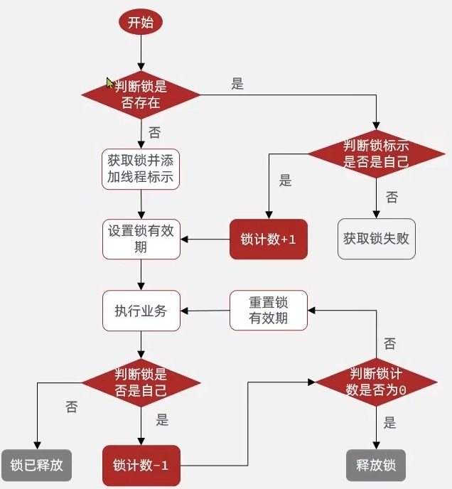
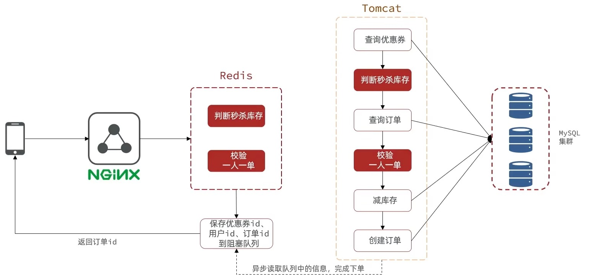
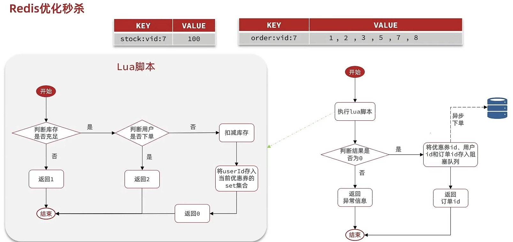
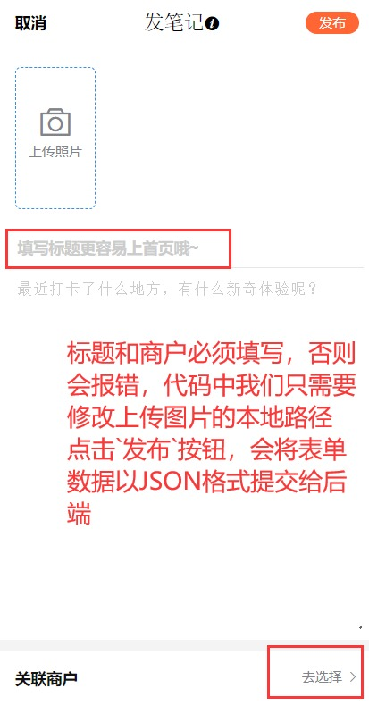
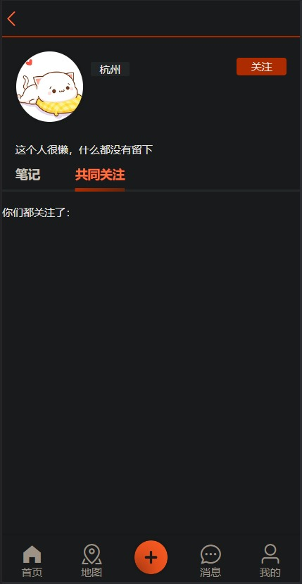
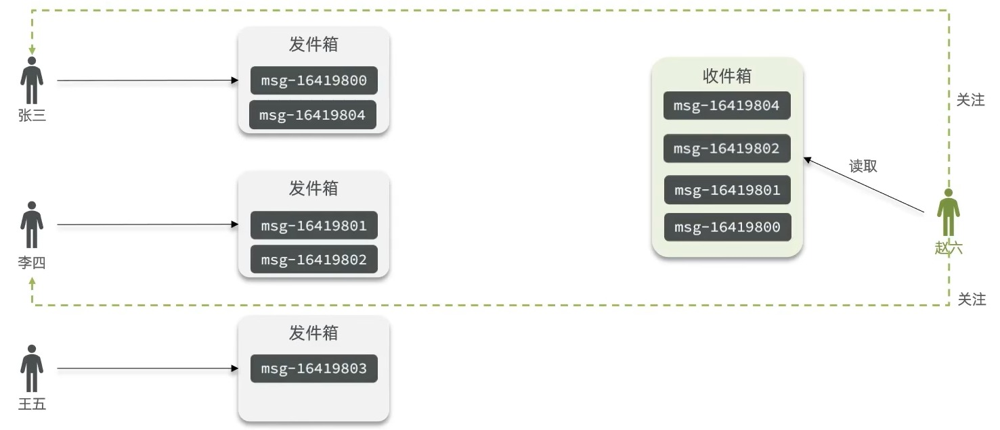
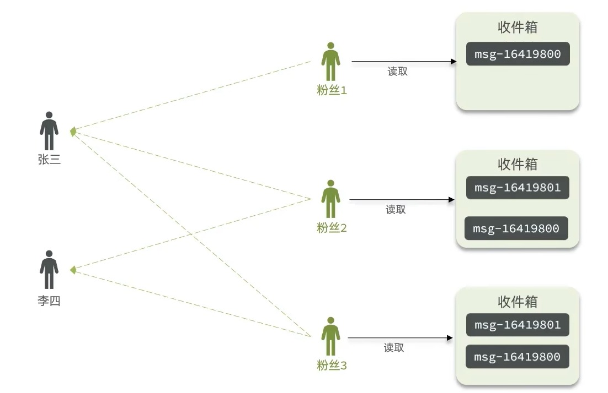
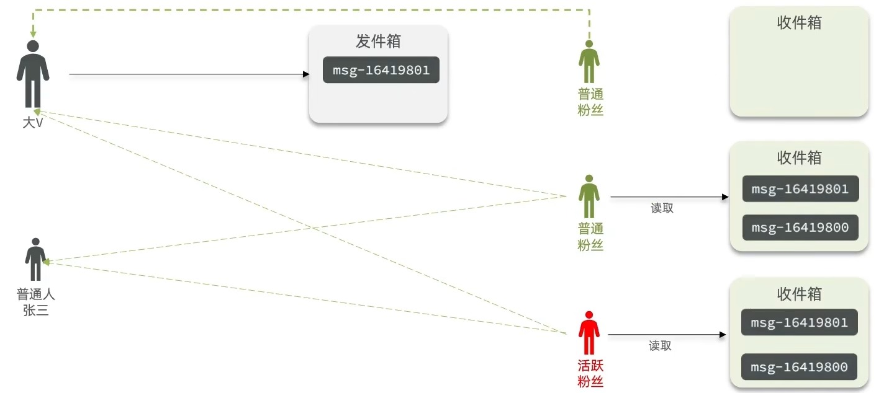
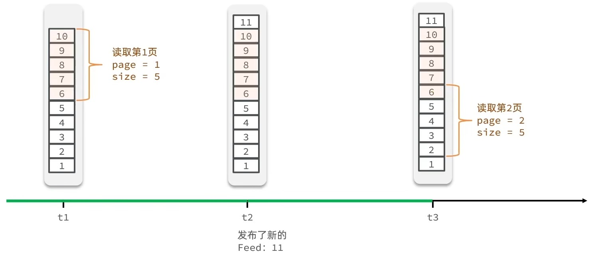
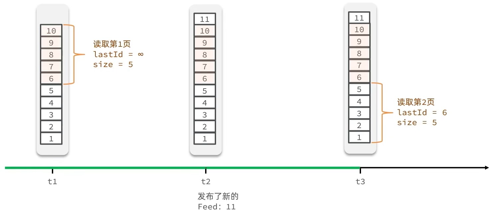

# 一、关于项目的redis学习

在Service类中创建对应方法之后，在Impl类中实现，我们查看用户探店笔记的时候，需要额外设置用户名和其头像，由于设置用户信息这个操作比较通用，所以这里封装成了一个方法

```
@Override
public Result queryById(Integer id) {
    Blog blog = getById(id);
    if (blog == null) {
        return Result.fail("评价不存在或已被删除");
    }
    queryBlogUser(blog);
    return Result.ok(blog);
}

private void queryBlogUser(Blog blog) {
    Long userId = blog.getUserId();
    User user = userService.getById(userId);
    blog.setName(user.getNickName());
    blog.setIcon(user.getIcon());
}
```

typora-root-url: ..\..\image、

# ThreadLocal多线程

ThreadLocal叫做线程变量，意思是ThreadLocal中填充的变量属于当前线程，该变量对其他线程而言是隔离的，也就是说该变量是当前线程独有的变量。ThreadLocal为变量在每个线程中都创建了一个副本，那么每个线程可以访问自己内部的副本变量。

ThreadLoal 变量，线程局部变量，同一个 ThreadLocal 所包含的对象，在不同的 Thread 中有不同的副本。这里有几点需要注意：

因为每个 Thread 内有自己的实例副本，且该副本只能由当前 Thread 使用。这是也是 ThreadLocal 命名的由来。
既然每个 Thread 有自己的实例副本，且其它 Thread 不可访问，那就不存在多线程间共享的问题。
1.ThreadLocal 提供了线程本地的实例。它与普通变量的区别在于，每个使用该变量的线程都会初始化一个完全独立的实例副本。2.ThreadLocal 变量通常被private static修饰。当一个线程结束时，它所使用的所有 ThreadLocal 相对的实例副本都可被回收。

总的来说，ThreadLocal 适用于每个线程需要自己独立的实例且该实例需要在多个方法中被使用，也即变量在线程间隔离而在方法或类间共享的场景


## ThreadLocal与Synchronized的区别

`ThreadLocal<T>`其实是与线程绑定的一个变量。ThreadLocal和Synchonized都用于解决多线程并发访问。

但是ThreadLocal与synchronized有本质的区别：

1、Synchronized用于线程间的数据共享，而ThreadLocal则用于线程间的数据隔离。

2、Synchronized是利用锁的机制，使变量或代码块在某一时该只能被一个线程访问。而ThreadLocal为每一个线程都提供了变量的副本

，使得每个线程在某一时间访问到的并不是同一个对象，这样就隔离了多个线程对数据的数据共享。

而Synchronized却正好相反，它用于在多个线程间通信时能够获得数据共享。

一句话理解ThreadLocal，threadlocl是作为当前线程中属性ThreadLocalMap集合中的某一个Entry的key值Entry（threadlocl,value），虽然不同的线程之间threadlocal这个key值是一样，但是不同的线程所拥有的ThreadLocalMap是独一无二的，也就是不同的线程间同一个ThreadLocal（key）对应存储的值(value)不一样，从而到达了线程间变量隔离的目的，但是在同一个线程中这个value变量地址是一样的。


```java
public class UserHolder {
    private static final ThreadLocal<UserDTO> tl = new ThreadLocal<>();
    //每个请求线程 都可以独立存储和获取用户信息，互不干扰

    public static void saveUser(UserDTO user){
        tl.set(user);
    }
//保存用户信息 ：

//把当前登录用户的信息存到当前线程的 "储物柜" 中
//任何地方都可以通过 UserHolder.getUser() 获
    public static UserDTO getUser(){
        return tl.get();
    }
//获取用户信息
    public static void removeUser(){
        tl.remove();
    }
    //清理用户信息 
}

```

# BeanUtil方法

## Hutool 的 BeanUtil 常用方法

### 1. 对象复制相关

#### copyProperties(source, targetClass)

```
UserDTO dto = BeanUtil.
copyProperties(user, UserDTO.class);
```

- 复制源对象属性到目标类
- 自动创建目标类实例
- 忽略不存在的属性

#### copyProperties(source, target)

```
UserDTO dto = new UserDTO();
BeanUtil.copyProperties(user, dto);
```

- 复制到已有的目标对象
- 更灵活，可以复用对象

#### copyToList(sourceList, targetClass)

```

List<UserDTO> dtoList = BeanUtil.
copyToList(userList, UserDTO.class);
```

- 批量复制列表
- 常用于分页查询结果转换

### 2. Map 与 Bean 互转

#### beanToMap(object)

```

Map<String, Object> map = BeanUtil.
beanToMap(user);
```

- 将对象转换为 Map
- 常用于动态构建参数

#### fillBeanWithMap(map, bean, isIgnoreError)

```

UserDTO dto = BeanUtil.
fillBeanWithMap(map, new UserDTO(), 
false);
```

- 用 Map 填充 Bean
- isIgnoreError：是否忽略错误
- 常用于从 Redis 等存储中恢复对象

### 3. 属性操作

#### getProperty(bean, propertyName)

```

String name = BeanUtil.getProperty
(user, "name");
```

- 获取对象属性值
- 支持嵌套属性："address.city"

#### setProperty(bean, propertyName, value)

```

BeanUtil.setProperty(user, "name", "
张三");
```

- 设置对象属性值
- 自动类型转换

### 4. 其他实用方法

#### getBeanDesc(Class)

```

BeanDesc desc = BeanUtil.getBeanDesc
(User.class);
```

- 获取类的属性描述
- 可以遍历所有属性

#### hasProperty(object, propertyName)

```

boolean hasName = BeanUtil.
hasProperty(user, "name");
```

- 检查对象是否有某个属性

#### isEmpty(object)

```

boolean isEmpty = BeanUtil.isEmpty
(user);
```

- 检查对象是否为空（所有属性都为 null）

## 在项目中的实际应用

### 1. 登录信息转换--隐藏用户敏感信息

```

// UserController 中的用法
UserDTO userDTO = BeanUtil.
copyProperties(user, UserDTO.class);
```

**作用：** 去除敏感信息，只返回安全字段

### 2. Redis 数据恢复

```

// RefreshTokenInterceptor 中的用法
UserDTO userDTO = BeanUtil.
fillBeanWithMap(userMap, new UserDTO
(), false);
```

**作用：** 从 Redis 中取出的 Map 数据转换为对象

# Session共享问题

- 每个tomcat中都有一份属于自己的session,假设用户第一次访问第一台tomcat，并且把自己的信息存放到第一台服务器的session中，但是第二次这个用户访问到了第二台tomcat，那么在第二台服务器上，肯定没有第一台服务器存放的session，所以此时 整个登录拦截功能就会出现问题，我们能如何解决这个问题呢？早期的方案是session拷贝，就是说虽然每个tomcat上都有不同的session，但是每当任意一台服务器的session修改时，都会同步给其他的Tomcat服务器的session，这样的话，就可以实现session的共享了
- 但是这种方案具有两个大问题
  1. 每台服务器中都有完整的一份session数据，服务器压力过大。
  2. session拷贝数据时，可能会出现延迟
- 所以我们后面都是基于Redis来完成，我们把session换成Redis，Redis数据本身就是共享的，就可以避免session共享的问题了

### Redis替代session的业务流程

#### 设计key结构

- 首先我们来思考一下该用什么数据结构来存储数据
- 由于存入的数据比较简单，我们可以使用String或者Hash
  - 如果使用String，以JSON字符串来保存数据，会额外占用部分空间
  - 如果使用Hash，则它的value中只会存储数据本身
- 如果不是特别在意内存，直接使用String就好了

#### 设计key的具体细节

- 我们这里就采用的是简单的K-V键值对方式
- 但是对于key的处理，不能像session一样用phone或code来当做key
- 因为Redis的key是共享的，code可能会重复，phone这种敏感字段也不适合存储到Redis中
- 在设计key的时候，我们需要满足两点
  1. key要有唯一性
  2. key要方便携带
- 所以我们在后台随机生成一个token，然后让前端带着这个token就能完成我们的业务逻辑了

#### 整体访问流程

- 当注册完成后，用户去登录，然后校验用户提交的手机号/邮箱和验证码是否一致
  - 如果一致，则根据手机号查询用户信息，不存在则新建，最后将用户数据保存到Redis，并生成一个token作为Redis的key
- 当我们校验用户是否登录时，回去携带着token进行访问，从Redis中获取token对应的value，判断是否存在这个数据
  - 如果不存在，则拦截
  - 如果存在，则将其用户信息(userDto)保存到threadLocal中，并放行

### 基于Redis实现短信登录

- 由于前面已经分析过业务逻辑了，所以这里我们直接开始写代码，在此之前我们要在UserController中注入`StringRedisTemplate`

```java
@Autowired
private StringRedisTemplate stringRedisTemplate;
```

修改sendCode方法

这里的key使用`login:code:email`的形式，并设置有效期2分钟，我们也可以定义一个常量类来替换这里的`login:code:`和`2`，让代码显得更专业一点

```java
@PostMapping("/code")
public Result sendCode(@RequestParam("phone") String phone, HttpSession session) throws MessagingException {
    // TODO 发送短信验证码并保存验证码
    if (RegexUtils.isEmailInvalid(phone)) {
        return Result.fail("邮箱格式不正确");
    }
    String code = MailUtils.achieveCode();
-   session.setAttribute(phone, code);
- stringRedisTemplate.opsForValue().set("login:code:"  phone, code, 2, TimeUnit.MINUTES);
+stringRedisTemplate.opsForValue().set(LOGIN_CODE_KEY phone, code, LOGIN_CODE_TTL, TimeUnit.MINUTES);
    log.info("发送登录验证码：{}", code);
//        MailUtils.sendTestMail(phone, code);
    return Result.ok();
}
```

#### stringRedisTemplate

- Redis 操作模板 ：Spring 提供的 Redis 操作工具
- 专门用于操作 字符串类型 的数据
- 自动处理序列化、连接管理等底层细节

opsForValue()

- 获取 Value 操作对象 ：用于操作字符串类型的数据
- 相当于 Redis 的 SET 、 GET 等命令
- 返回 ValueOperations 对象，提供各种操作方法

set(key, value, timeout, timeUnit)

- 设置键值对 ，并指定过期时间
- 四个参数详解：

- 四个参数详解： 参数1： LOGIN_CODE_KEY + phone

```
// 假设：
LOGIN_CODE_KEY = "login:code:"
phone = "13812345678"
// 最终 key = 
"login:code:13812345678"
```

- Redis 的 key ：唯一标识这个验证码
- 用手机号作为后缀，确保每个手机号的验证码独立存储 参数2： code

```
// 假设：
code = "123456"
```

- 要存储的值 ：就是生成的验证码
- 会被序列化成字符串存储到 Redis 参数3： LOGIN_CODE_TTL

```
// 假设：
LOGIN_CODE_TTL = 2L  // 2分钟
```

- 过期时间数值 ：多长时间后自动删除 参数4： TimeUnit.MINUTES
- 时间单位 ：分钟、秒、小时等
- 这里是 MINUTES ，表示前面的是 分钟


这行代码执行后：

```
Redis 中存储：
key: "login:code:13812345678"
value: "123456"
过期时间: 2分钟后自动删除
```

生活类比

就像你去超市存包：

1. 扫码获取储物柜 （生成 key）
2. 把包放进去 （存储验证码）
3. 设置定时器 （2小时后自动打开）
4. 超时自动清理 （Redis 自动删除）

```java
package com.hmdp.controller;


import cn.hutool.core.bean.BeanUtil;
import cn.hutool.core.util.RandomUtil;
import cn.hutool.extra.mail.MailUtil;
import com.baomidou.mybatisplus.core.conditions.query.LambdaQueryWrapper;
import com.hmdp.dto.LoginFormDTO;
import com.hmdp.dto.Result;
import com.hmdp.dto.UserDTO;
import com.hmdp.entity.User;
import com.hmdp.entity.UserInfo;
import com.hmdp.service.IUserInfoService;
import com.hmdp.service.IUserService;
import com.hmdp.utils.MailUtils;
import com.hmdp.utils.RegexUtils;
import com.hmdp.utils.UserHolder;
import lombok.extern.slf4j.Slf4j;
import org.springframework.beans.factory.annotation.Autowired;
import org.springframework.data.redis.core.StringRedisTemplate;
import org.springframework.web.bind.annotation.*;
import org.springframework.web.servlet.HandlerInterceptor;

import javax.annotation.Resource;
import javax.mail.MessagingException;
import javax.servlet.http.HttpServletRequest;
import javax.servlet.http.HttpServletResponse;
import javax.servlet.http.HttpSession;

import java.util.HashMap;
import java.util.UUID;
import java.util.concurrent.TimeUnit;

import static com.hmdp.utils.RedisConstants.LOGIN_CODE_KEY;
import static com.hmdp.utils.RedisConstants.LOGIN_CODE_TTL;

/**
 * <p>
 * 前端控制器
 * </p>
 *
 * @author 虎哥
 * @since 2021-12-22
 */
@Slf4j
@RestController
@RequestMapping("/user")
public class UserController {

    @Resource
    private IUserService userService;

    @Resource
    private IUserInfoService userInfoService;
    @Autowired
    private StringRedisTemplate stringRedisTemplate;

    /**
     * 发送手机验证码
     */
    @PostMapping("code")
    public Result sendCode(@RequestParam("phone") String phone, HttpSession session) throws MessagingException {

        //TODO 实现发送短信验证码功能
        if (RegexUtils.isEmailInvalid(phone)) {
            return Result.fail("邮箱格式不正确");
        }
        String code = MailUtils.achieveCode();
        //"把验证码存到 Redis 里，并设置过期时间"
        stringRedisTemplate.opsForValue().set(LOGIN_CODE_KEY + phone, code, LOGIN_CODE_TTL, TimeUnit.MINUTES);
        log.info("发送登录验证码：{}", code);
        //MailUtils.sentTestMail(phone, code);
        return Result.ok();
    }
    /**
     * 登录功能
     * @param loginForm 登录参数，包含手机号、验证码；或者手机号、密码
     */
    @PostMapping("/login")
    public Result login(@RequestBody LoginFormDTO loginForm, HttpSession session){
        //获取登录账号
        String phone = loginForm.getPhone();
        //获取登录验证码
        String code = loginForm.getCode();
        //获取session中的验证码
        Object cacheCode = session.getAttribute(phone);
        //校验邮箱
        if(RegexUtils.isEmailInvalid(phone)){
            return Result.fail("邮箱格式不正确");
        }
        //校验验证码
        //因为通常 cacheCode 是从session获取的，需要 toString() 转换
        log.info("code:{},cache{}",code,cacheCode);
        if(code ==null ||!code.equals(cacheCode.toString())){
            return Result.fail("验证码错误");
        }
        //根据账号查询用户是否存在
        LambdaQueryWrapper <User> queryWrapper = new LambdaQueryWrapper<>();
        queryWrapper.eq(User::getPhone,phone);
        User user = userService.getOne(queryWrapper);
        //判断用户是否存在
        if(user == null){ //如果用户不存在，则新建用户并保存
            user = createUserWithPhone(phone);
        }
        //登录成功，将用户信息保存在session中
        //保存用户的信息在Redis
        //随机生成token，作为登录令牌
        String token = UUID.randomUUID().toString();
        //将UserDto对象转化为HashMap存储
        UserDTO userDTO = BeanUtil.copyProperties(user, UserDTO.class);
        HashMap<String,String> userMap = new HashMap<>();
        userMap.put("icon",userDTO.getIcon());
        userMap.put("id",userDTO.getId().toString());
        userMap.put("nickName",userDTO.getNickName());
        //高端写法，现在我还学不来，工具类还不太了解，只能自己手动转换类型然后put了
//        Map<String, Object> userMap = BeanUtil.beanToMap(userDTO, new HashMap<>(),
//                CopyOptions.create()
//                        .setIgnoreNullValue(true)
//                        .setFieldValueEditor((fieldName, fieldValue) -> fieldValue.toString()));
        //将用户信息存入Redis
        String tokenKey = "LOGIN_USER_KEY" + token;
        session.setAttribute("user",userDTO);
        return Result.ok();
    }

    private User createUserWithPhone(String phone) {
        //创建用户
        User user = new User();
        user.setPhone(phone);
        //设置昵称(默认名)，一个固定前缀+随机字符串
        user.setNickName("user_"+ RandomUtil.randomString(8));
        //保存在数据库中
        userService.save(user);
        return user;
    }
    /**
     * 登出功能
     * @return 无
     */
    @PostMapping("/logout")
    public Result logout(){
        // TODO 实现登出功能
        return Result.fail("功能未完成");
    }

    //查看我的个人信息
    @GetMapping("/me")
    public Result me(){
        // 获取当前登录的用户并返回
        UserDTO user = UserHolder.getUser();
        return Result.ok(user);
    }

    @GetMapping("/info/{id}")
    public Result info(@PathVariable("id") Long userId){
        // 查询详情
        UserInfo info = userInfoService.getById(userId);
        if (info == null) {
            // 没有详情，应该是第一次查看详情
            return Result.ok();
        }
        info.setCreateTime(null);
        info.setUpdateTime(null);
        // 返回
        return Result.ok(info);
    }
}

```

### 解决状态登录刷新问题

#### 初始方案

- 我们可以通过拦截器拦截到的请求，来证明用户是否在操作，如果用户没有任何操作30分钟，则token会消失，用户需要重新登录

- 通过查看请求，我们发现我们存的token在请求头里，那么我们就在拦截器里来刷新token的存活时间

  > authorization: 6867061d-a8d0-4e60-b92f-97f7d698a1ca

- 修改我们的登陆拦截器`LoginInterceptor`类

  ```
  @Override
  public boolean preHandle(HttpServletRequest request, HttpServletResponse response, Object handler) throws Exception {
      //1. 获取请求头中的token
      String token = request.getHeader("authorization");
      //2. 如果token是空，则未登录，拦截
      if (StrUtil.isBlank(token)) {
          response.setStatus(401);
          return false;
      }
      String key = RedisConstants.LOGIN_USER_KEY + token;
      //3. 基于token获取Redis中的用户数据
      Map<Object, Object> userMap = stringRedisTemplate.opsForHash().entries(key);
      //4. 判断用户是否存在，不存在，则拦截
      if (userMap.isEmpty()) {
          response.setStatus(401);
          return false;
      }
      //5. 将查询到的Hash数据转化为UserDto对象
      UserDTO userDTO = BeanUtil.fillBeanWithMap(userMap, new UserDTO(), false);
      //6. 将用户信息保存到ThreadLocal
      UserHolder.saveUser(userDTO);
      //7. 刷新tokenTTL，这里的存活时间根据需要自己设置，这里的常量值我改为了30分钟
      stringRedisTemplate.expire(key, RedisConstants.LOGIN_USER_TTL, TimeUnit.MINUTES);
      return true;
  }
  ```

- 在这个方案中，他确实可以使用对应路径的拦截，同时刷新登录token令牌的存活时间，但是现在这个拦截器他只是拦截需要被拦截的路径，假设当前用户访问了一些不需要拦截的路径，那么这个拦截器就不会生效，所以此时令牌刷新的动作实际上就不会执行，所以这个方案他是存在问题的

#### 优化方案

- 既然之前的拦截器无法对不需要拦截的路径生效，那么我们可以添加一个拦截器，在第一个拦截器中拦截所有的路径，把第二个拦截器做的事情放入到第一个拦截器中，同时刷新令牌，因为第一个拦截器有了threadLocal的数据，所以此时第二个拦截器只需要判断拦截器中的user对象是否存在即可，完成整体刷新功能。

- 新建一个

  ```
  RefreshTokenInterceptor
  ```

  类，其业务逻辑与之前的

  ```
  LoginInterceptor
  ```

  类似，就算遇到用户未登录，也继续放行，交给

  ```
  LoginInterceptor
  ```

  处理

  由于这个对象是我们手动在WebConfig里创建的，所以这里不能用@AutoWired自动装配，只能声明一个私有的，到了WebConfig里再自动装配

  ```
  public class RefreshTokenInterceptor implements HandlerInterceptor {
      //这里并不是自动装配，因为RefreshTokenInterceptor是我们手动在WebConfig里new出来的
      private StringRedisTemplate stringRedisTemplate;
  
     public RefreshTokenInterceptor(StringRedisTemplate stringRedisTemplate) {
          this.stringRedisTemplate = stringRedisTemplate;
      }
  
      @Override
      public boolean preHandle(HttpServletRequest request, HttpServletResponse response, Object handler) throws Exception {
          //1. 获取请求头中的token
          String token = request.getHeader("authorization");
          //2. 如果token是空，直接放行，交给LoginInterceptor处理
          if (StrUtil.isBlank(token)) {
              return true;
          }
          String key = RedisConstants.LOGIN_USER_KEY + token;
          //3. 基于token获取Redis中的用户数据
          Map<Object, Object> userMap = stringRedisTemplate.opsForHash().entries(key);
          //4. 判断用户是否存在，不存在，也放行，交给LoginInterceptor
          if (userMap.isEmpty()) {
              return true;
          }
          //5. 将查询到的Hash数据转化为UserDto对象
          UserDTO userDTO = BeanUtil.fillBeanWithMap(userMap, new UserDTO(), false);
          //6. 将用户信息保存到ThreadLocal
          UserHolder.saveUser(userDTO);
          //7. 刷新tokenTTL，这里的存活时间根据需要自己设置，这里的常量值我改为了30分钟
          stringRedisTemplate.expire(key, RedisConstants.LOGIN_USER_TTL, TimeUnit.MINUTES);
          return true;
      }
  
      @Override
      public void afterCompletion(HttpServletRequest request, HttpServletResponse response, Object handler, Exception ex) throws Exception {
          UserHolder.removeUser();
      }
  }
  ```

- 修改我们之前的

  ```
  LoginInterceptor
  ```

  类，只需要判断用户是否存在，不存在，则拦截，存在则放行

  ```
  public class LoginInterceptor implements HandlerInterceptor {
  
      @Override
      public boolean preHandle(HttpServletRequest request, HttpServletResponse response, Object handler) throws Exception {
          //判断用户是否存在
          if (UserHolder.getUser()==null){
              //不存在则拦截
              response.setStatus(401);
              return false;
          }
          //存在则放行
          return true;
      }
  
      @Override
      public void afterCompletion(HttpServletRequest request, HttpServletResponse response, Object handler, Exception ex) throws Exception {
          UserHolder.removeUser();
      }
  }
  ```

- 修改

  ```
  WebConfig
  ```

  配置类，拦截器的执行顺序可以由order来指定，如果未设置拦截路径，则默认是拦截所有路径

  ```
  @Configuration
  public class MvcConfig implements WebMvcConfigurer {
      //到了这里才能自动装配
      @Autowired
      private StringRedisTemplate stringRedisTemplate;
  
      @Override
      public void addInterceptors(InterceptorRegistry registry) {
          registry.addInterceptor(new LoginInterceptor())
                  .excludePathPatterns(
                          "/user/code",
                          "/user/login",
                          "/blog/hot",
                          "/shop/**",
                          "/shop-type/**",
                          "/upload/**",
                          "/voucher/**"
                  ).order(1);
          //RefreshTokenInterceptor是我们手动new出来的
          registry.addInterceptor(new RefreshTokenInterceptor(stringRedisTemplate)).order(0);
      }
  }
  ```

- 那么至此，大功告成，我们重启服务器，登录，然后去Redis的图形化界面查看token的ttl，如果每次切换界面之后，ttl都会重置，那么说明我们的代码没有问题

##### 进行手动装配StringRedisTemplate的原因

**源代码**

```java
    //这里并不是自动装配，因为RefreshTokenInterceptor是我们手动在WebConfig里new出来的
    private StringRedisTemplate stringRedisTemplate;

    public RefreshTokenInterceptor(StringRedisTemplate stringRedisTemplate) {
        this.stringRedisTemplate = stringRedisTemplate;
    }

```

## 为什么要手动注入 StringRedisTemplate？

### 根本原因：拦截器不是 Spring 管理的 Bean

```
public RefreshTokenInterceptor
(StringRedisTemplate 
stringRedisTemplate) {
    this.stringRedisTemplate = 
    stringRedisTemplate;
}
```

##### 详细解释

###### 1. 拦截器的创建方式不同

**普通 Spring Bean（如 Controller、Service）：**

```
@RestController
public class UserController {
    @Autowired  // Spring 自动注入
    private StringRedisTemplate 
    stringRedisTemplate;
}
```

- Spring **自动创建**对象
- Spring **自动注入**依赖
- 生命周期由 Spring 管理

**拦截器的创建方式：**

```
@Configuration
public class WebConfig implements 
WebMvcConfigurer {
    @Override
    public void addInterceptors
    (InterceptorRegistry registry) {
        // 手动 new 出来的，不是 
        Spring 创建的
        registry.addInterceptor(new 
        RefreshTokenInterceptor
        (null));
    }
}
```

###### 2. 手动 new 的问题

```
// 错误方式：直接 new
registry.addInterceptor(new 
RefreshTokenInterceptor());
```

- **new 出来的对象** Spring 感知不到
- **无法使用 @Autowired** 进行自动注入
- **依赖为 null**，会报空指针异常

###### 3. 正确的解决方式

**步骤 1：在配置类中先注入 StringRedisTemplate**

```
@Configuration
public class WebConfig implements 
WebMvcConfigurer {
    
    @Autowired  // Spring 注入
    private StringRedisTemplate 
    stringRedisTemplate;
    
    @Override
    public void addInterceptors
    (InterceptorRegistry registry) {
        // 手动注入到拦截器
        registry.addInterceptor(new 
        RefreshTokenInterceptor
        (stringRedisTemplate));
    }
}
```

# 商户查询缓存

## 什么是缓存

- 什么是缓存？

  - 缓存就像自行车、越野车的避震器

- 举个例子

  - 越野车、山地自行车都有`避震器`，防止车体加速之后因惯性，在`U`型地形上飞跃硬着陆导致`损坏`，像个弹簧意义

- 同样，在实际开发中，系统也需要`避震器`，防止过高的数据量猛冲系统，导致其操作线程无法及时处理信息而瘫痪

- 在实际开发中，对企业来讲，产品口碑、用户评价都是致命的，所以企业非常重视缓存技术

  缓存(Cache)就是数据交换的缓冲区，俗称的缓存就是缓冲区内的数据，一般从数据库中获取，存储于本地，例如

  - 本地用高并发

  - ```
    Static final ConcurrentHashMap<K,V> map = new ConcurrentHashMap<>();
    ```

  - 用于Redis等缓存

  - ```
    static final Cache<K,V> USER_CACHE = CacheBuilder.newBuilder().build();
    ```

  - 本地缓存

  - ```
    Static final Map<K,V> map =  new HashMap();
    ```

- 由于其被`static`修饰，所以随着类的加载而加载到内存之中，作为本地缓存，由于其又被`final`修饰，所以其引用之间的关系是固定的，不能改变，因此不用担心复制导致缓存失败

#### 为什么要使用缓存

- 言简意赅：速度快，好用

- 缓存数据存储于代码中，而代码运行在内存中，内存的读写性能远高于磁盘，缓存可以大大降低用户访问并发量带来的服务器读写压力

- 实际开发中，企业的数据量，少则几十万，多则几千万，这么大的数据量，如果没有缓存来作为`避震器`系统是几乎撑不住的，所以企业会大量运用缓存技术

- 但是缓存也会增加代码复杂度和运营成本

- ```
  缓存的作用
  ```

  1. 降低后端负载
  2. 提高读写效率，降低响应时间

- ```
  缓存的成本
  ```

  1. 数据一致性成本
  2. 代码维护成本
  3. 运维成本（一般采用服务器集群，需要多加机器，机器就是钱）

#### 如何使用缓存

- 实际开发中，会构筑多级缓存来时系统运行速度进一步提升，例如：本地缓存与Redis中的缓存并发使用
- `浏览器缓存：`主要是存在于浏览器端的缓存
- `应用层缓存：`可以分为toncat本地缓存，例如之前提到的map或者是使用Redis作为缓存
- `数据库缓存：`在数据库中有一片空间是buffer pool，增改查数据都会先加载到mysql的缓存中
- `CPU缓存：`当代计算机最大的问题就是CPU性能提升了，但是内存读写速度没有跟上，所以为了适应当下的情况，增加了CPU的L1，L2，L3级的缓存

### 添加商户缓存

在我们查询商户信息时，我们是直接操作从数据库中去进行查询的，大致逻辑是这样，直接查询数据库肯定慢

```
/**
    * 根据id查询商铺信息
    * @param id 商铺id
    * @return 商铺详情数据
    */
@GetMapping("/{id}")
public Result queryShopById(@PathVariable("id") Long id) {
    return Result.ok(shopService.getById(id));
}
```

- 所以我们可以在客户端与数据库之间加上一个Redis缓存，先从Redis中查询，如果没有查到，再去MySQL中查询，同时查询完毕之后，将查询到的数据也存入Redis，这样当下一个用户来进行查询的时候，就可以直接从Redis中获取到数据


#### 缓存模型和思路

- 标准的操作方式就是查询数据库之前先查询缓存，如果缓存数据存在，则直接从缓存中返回，如果缓存数据不存在，再查询数据库，然后将数据存入Redis。


#### 代码实现

- 代码思路：如果Redis缓存里有数据，那么直接返回，如果缓存中没有，则去查询数据库，然后存入Redis

Controller层

业务逻辑我们写到Service中，需要在Service层创建这个`queryById`方法，然后去ServiceImpl中实现

```
@GetMapping("/{id}")
public Result queryShopById(@PathVariable("id") Long id) {
    return shopService.queryById(id);
}
```

Service层

```
public interface IShopService extends IService<Shop> {
    Result queryById(Long id);
}
```

SerivceImpl层

```
@Override
public Result queryById(Long id) {
    //先从Redis中查，这里的常量值是固定的前缀 + 店铺id
    String shopJson = stringRedisTemplate.opsForValue().get(CACHE_SHOP_KEY + id);
    //如果不为空（查询到了），则转为Shop类型直接返回
    if (StrUtil.isNotBlank(shopJson)) {
        Shop shop = JSONUtil.toBean(shopJson, Shop.class);
        return Result.ok(shop);
    }
    //否则去数据库中查
    Shop shop = getById(id);
    //查不到返回一个错误信息或者返回空都可以，根据自己的需求来
    if (shop == null){
        return Result.fail("店铺不存在！！");
    }
    //查到了则转为json字符串
    String jsonStr = JSONUtil.toJsonStr(shop);
    //并存入redis
    stringRedisTemplate.opsForValue().set(CACHE_SHOP_KEY + id, jsonStr);
    //最终把查询到的商户信息返回给前端
    return Result.ok(shop);
}
```

##### JSONUtil

JSONUtil.toBean() 是 Hutool 工具库 提供的 JSON 字符串转 Java 对象的方法，

```
Shop shop = JSONUtil.toBean(shopJson, Shop.class);
```

缓存数据转换（ShopServiceImpl）

```java
// 从 Redis 获取店铺信息的 JSON 字符串
String shopJson = stringRedisTemplate.opsForValue().get(CACHE_SHOP_KEY + id);

// 将 JSON 字符串转换为 Shop 对象
if(StrUtil.isNotBlank(shopJson)){
    Shop shop = JSONUtil.toBean(shopJson, Shop.class);
    return Result.ok(shop);
}
```

完整流程：

```
Redis 中的 JSON 字符串 → JSONUtil.toBean() → Java Shop 对象
{"id":1,"name":"星巴克","area":"朝阳区"} → toBean() → Shop 实例
```

- 重启服务器，访问商户信息，观察控制台日志输出，后续刷新页面，不会出现SQL语句查询商户信息，去Redis图形化界面中查看，可以看到缓存的商户信息数据

#### 趁热打铁

- 完成了商户数据缓存之后，我们尝试做一下商户类型数据缓存

Controller层

业务逻辑依旧是写在Service中

```java
@GetMapping("list")
public Result queryTypeList() {
    return typeService.queryList();
}
```

ServiceImpl层

- 整体代码都是类似的，前面只需要将单个店铺信息从JSON和Bean之间相互转换
- 这里只不过是将查询到的多个店铺类型信息从JSON和Bean之间相互转换，只是多了一个foreach循环

```java
    @Resource
    private StringRedisTemplate stringRedisTemplate;
    @Override
    public Result queryList() {
        //先从Redis中查，这里的常量值是固定前缀 + 店铺id
        List<String> shopTypes = stringRedisTemplate.opsForList().range(CACHE_SHOP_TYPE_KEY,0, -1);
        //如果不为空（查询到了），则转为ShopType类型直接返回
        if(!shopTypes.isEmpty()){
            List<ShopType> tmp = new ArrayList<>();
            for(String type : shopTypes){
                ShopType shopType = JSONUtil.toBean(type, ShopType.class);
                tmp.add(shopType);
            }
           return Result.ok(tmp);
        }
        //否则去数据库中查
        List<ShopType> tmp = query().orderByAsc("sort").list();
        if(tmp==null){
            //数据库中也没有，返回失败
            return Result.fail("店铺类型不存在");
        }
        //查到了转为json字符串，存入redis
        for(ShopType shopType : tmp){
            String jsonstr = JSONUtil.toJsonStr(shopType);
            shopTypes.add(jsonstr);
        }
       //.leftPushAll(key, values...) 是 Redis List 的批量左压入操作
        //左压入会把参数按给定顺序依次“往左”插入，最终列表顺序与传入顺序相反；如果要保持原有顺序追加到尾部，用 rightPushAll.
        stringRedisTemplate.opsForList().leftPushAll(CACHE_SHOP_TYPE_KEY,shopTypes);
        //最终把查询到的商户分类信息返回给前端
        return Result.ok(tmp);
    }
```

可以用stream流来简化代码

```java
@Override
public Result queryList() {
    // 先从Redis中查，这里的常量值是固定前缀 + 店铺id
    List<String> shopTypes =
            stringRedisTemplate.opsForList().range(CACHE_SHOP_TYPE_KEY, 0, -1);
    // 如果不为空（查询到了），则转为ShopType类型直接返回
    if (!shopTypes.isEmpty()) {
        List<ShopType> tmp = shopTypes.stream().map(type -> JSONUtil.toBean(type, ShopType.class))
                                          .collect(Collectors.toList());
        return Result.ok(tmp);
    }
    // 否则去数据库中查
    List<ShopType> tmp = query().orderByAsc("sort").list();
    if (tmp == null){
        return Result.fail("店铺类型不存在！！");
    }
    // 查到了转为json字符串，存入redis
    shopTypes = tmp.stream().map(type -> JSONUtil.toJsonStr(type))
                                    .collect(Collectors.toList());
    stringRedisTemplate.opsForList().leftPushAll(CACHE_SHOP_TYPE_KEY,shopTypes);
    // 最终把查询到的商户分类信息返回给前端
    return Result.ok(tmp);
}

```

### 缓存更新策略

- 缓存更新是Redis为了节约内存而设计出来的一个东西，主要是因为内存数据宝贵，当我们想Redis插入太多数据，此时就可能会导致缓存中数据过多，所以Redis会对部分数据进行更新，或者把它成为淘汰更合适
- `内存淘汰`：Redis自动进行，当Redis内存大道我们设定的`max-memery`时，会自动触发淘汰机制，淘汰掉一些不重要的数据（可以自己设置策略方式）
- `超时剔除`：当我们给Redis设置了过期时间TTL之后，Redis会将超时的数据进行删除，方便我们继续使用缓存
- `主动更新`：我们可以手动调用方法把缓存删除掉，通常用于解决缓存和数据库不一致问题

|          |                           内存淘汰                           |                           超时剔除                           | 主动更新                                       |
| :------: | :----------------------------------------------------------: | :----------------------------------------------------------: | :--------------------------------------------- |
|   说明   | 不用自己维护， 利用Redis的内存淘汰机制， 当内存不足时自动淘汰部分数据。 下次查询时更新缓存。 | 给缓存数据添加TTL时间， 到期后自动删除缓存。 下次查询时更新缓存。 | 编写业务逻辑， 在修改数据库的同时， 更新缓存。 |
|  一致性  |                              差                              |                             一般                             | 好                                             |
| 维护成本 |                              无                              |                              低                              | 高                                             |

- 业务场景
  - 低一致性需求：使用内存淘汰机制，例如店铺类型的查询缓存（因为这个很长一段时间都不需要更新）
  - 高一致性需求：主动更新，并以超时剔除作为兜底方案，例如店铺详情查询的缓存

#### 数据库和缓存不一致解决方案

- 由于我们的缓存数据源来自数据库，而数据库的数据是会发生变化的，因此，如果当数据库中数据发生变化，而缓存却没有同步，此时就会有一致性问题存在，其后果是
  - 用户使用缓存中的过时数据，就会产生类似多线程数据安全问题，从而影响业务，产品口碑等
- 那么如何解决这个问题呢？有如下三种方式
  1. Cache Aside Pattern 人工编码方式：缓存调用者在更新完数据库之后再去更新缓存，也称之为双写方案
  2. Read/Write Through Pattern：缓存与数据库整合为一个服务，由服务来维护一致性。调用者调用该服务，无需关心缓存一致性问题。但是维护这样一个服务很复杂，市面上也不容易找到这样的一个现成的服务，开发成本高
  3. Write Behind Caching Pattern：调用者只操作缓存，其他线程去异步处理数据库，最终实现一致性。但是维护这样的一个异步的任务很复杂，需要实时监控缓存中的数据更新，其他线程去异步更新数据库也可能不太及时，而且缓存服务器如果宕机，那么缓存的数据也就丢失了

#### 数据库和缓存不一致采用什么方案

- 综上所述，在企业的实际应用中，还是方案一最可靠，但是方案一的调用者该如何处理呢？
- 如果采用方案一，假设我们每次操作完数据库之后，都去更新一下缓存，但是如果中间并没有人查询数据，那么这个更新动作只有最后一次是有效的，中间的更新动作意义不大，所以我们可以把缓存直接删除，等到有人再次查询时，再将缓存中的数据加载出来
- 对比删除缓存与更新缓存
  - `更新缓存`：每次更新数据库都需要更新缓存，无效写操作较多
  - `删除缓存`：更新数据库时让缓存失效，再次查询时更新缓存
- 如何保证缓存与数据库的操作同时成功/同时失败
  - `单体系统：`将缓存与数据库操作放在同一个事务
  - `分布式系统：`利用TCC等分布式事务方案
- 先操作缓存还是先操作数据库？我们来仔细分析一下这两种方式的线程安全问题
- **1。先删除缓存，再操作数据库**
  删除缓存的操作很快，但是更新数据库的操作相对较慢，如果此时有一个线程2刚好进来查询缓存，由于我们刚刚才删除缓存，所以线程2需要查询数据库，并写入缓存，但是我们更新数据库的操作还未完成，所以线程2查询到的数据是脏数据，出现线程安全问题


**2.先操作数据库，再删除缓存**
线程1在查询缓存的时候，缓存TTL刚好失效，需要查询数据库并写入缓存，这个操作耗时相对较短（相比较于上图来说），但是就在这么短的时间内，线程2进来了，更新数据库，删除缓存，但是线程1虽然查询完了数据（更新前的旧数据），但是还没来得及写入缓存，所以线程2的更新数据库与删除缓存，并没有影响到线程1的查询旧数据，写入缓存，造成线程安全问题


- 虽然这二者都存在线程安全问题，但是相对来说，后者出现线程安全问题的概率相对较低，所以我们最终采用后者`先操作数据库，再删除缓存`的方案

### 实现商铺缓存与数据库双写一致

- 核心思路如下

  - 修改ShopController中的业务逻辑，满足以下要求

  1. 根据id查询店铺时，如果缓存未命中，则查询数据库，并将数据库结果写入缓存，并设置TTL
  2. 根据id修改店铺时，先修改数据库，再删除缓存

- 修改ShopService的queryById方法，写入缓存时设置一下TTL

```java
@Override
public Result queryById(Long id) {
    //先从Redis中查，这里的常量值是固定的前缀 + 店铺id
    String shopJson = stringRedisTemplate.opsForValue().get(CACHE_SHOP_KEY + id);
    //如果不为空（查询到了），则转为Shop类型直接返回
    if (StrUtil.isNotBlank(shopJson)) {
        Shop shop = JSONUtil.toBean(shopJson, Shop.class);
        return Result.ok(shop);
    }
    //否则去数据库中查
    Shop shop = getById(id);
    //查不到返回一个错误信息或者返回空都可以，根据自己的需求来
    if (shop == null){
        return Result.fail("店铺不存在！！");
    }
    //查到了则转为json字符串
    String jsonStr = JSONUtil.toJsonStr(shop);
    //并存入redis，设置TTL
    stringRedisTemplate.opsForValue().set(CACHE_SHOP_KEY + id, jsonStr,CACHE_SHOP_TTL, TimeUnit.MINUTES);
    //最终把查询到的商户信息返回给前端
    return Result.ok(shop);
}
```

之前的update方法

```java
/**
    * 更新商铺信息
    *
    * @param shop 商铺数据
    * @return 无
    */
@PutMapping
public Result updateShop(@RequestBody Shop shop) {
    // 写入数据库
    shopService.updateById(shop);
    return Result.ok();
}
```

修改后的updata方法

```java
/**
    * 更新商铺信息
    *
    * @param shop 商铺数据
    * @return 无
    */
@PutMapping
public Result updateShop(@RequestBody Shop shop) {
    return shopService.update(shop);
}
```

Service层

```java
Result update(Shop shop);
```

ServiceImpl层

```java
@Override
public Result update(Shop shop) {
    //首先先判一下空
    if (shop.getId() == null){
        return Result.fail("店铺id不能为空！！");
    }
    //先修改数据库
    updateById(shop);
    //再删除缓存
    stringRedisTemplate.delete(CACHE_SHOP_KEY + shop.getId());
    return Result.ok();
}
```

修改完毕之后我们重启服务器进行测试，首先随便挑一个顺眼的数据，我这里就是拿餐厅数据做测试，，我们先访问该餐厅，将该餐厅的数据缓存到Redis中，之后使用POSTMAN发送PUT请求，请求路径 `http://localhost:8080/api/shop/` ，携带JSON数据如下

```
{
  "area": "大关",
  "openHours": "10:00-22:00",
  "sold": 4215,
  "address": "金华路锦昌文华苑29号",
  "comments": 3035,
  "avgPrice": 80,
  "score": 37,
  "name": "476茶餐厅",
  "typeId": 1,
  "id": 1
}
```

- 之后再Redis图形化页面刷新数据，发现该餐厅的数据确实不在Redis中了，之后我们刷新网页，餐厅名会被改为`476茶餐厅`，然后我们再去Redis中刷新，发现新数据已经被缓存了
- 那么现在功能就实现完毕了，只有当我们刷新页面的时候，才会重新查询数据库，并将数据缓存到Redis，中途无论修改多少次，只要不刷新页面访问，Redis中都不会更新数据

### 缓存穿透问题的解决思路

- `缓存穿透`：缓存穿透是指客户端请求的数据在缓存中和数据库中都不存在，这样缓存永远都不会生效（只有数据库查到了，才会让redis缓存，但现在的问题是查不到），会频繁的去访问数据库。
- 常见的结局方案有两种
  1. 缓存空对象
     - 优点：实现简单，维护方便
     - 缺点：额外的内存消耗，可能造成短期的不一致
  2. 布隆过滤
     - 优点：内存占用啥哦，没有多余的key
     - 缺点：实现复杂，可能存在误判
- `缓存空对象`思路分析：当我们客户端访问不存在的数据时，会先请求redis，但是此时redis中也没有数据，就会直接访问数据库，但是数据库里也没有数据，那么这个数据就穿透了缓存，直击数据库。但是数据库能承载的并发不如redis这么高，所以如果大量的请求同时都来访问这个不存在的数据，那么这些请求就会访问到数据库，简单的解决方案就是哪怕这个数据在数据库里不存在，我们也把这个这个数据存在redis中去（这就是为啥说会有`额外的内存消耗`），这样下次用户过来访问这个不存在的数据时，redis缓存中也能找到这个数据，不用去查数据库。可能造成的`短期不一致`是指在空对象的存活期间，我们更新了数据库，把这个空对象变成了正常的可以访问的数据，但由于空对象的TTL还没过，所以当用户来查询的时候，查询到的还是空对象，等TTL过了之后，才能访问到正确的数据，不过这种情况很少见罢了
- `布隆过滤`思路分析：布隆过滤器其实采用的是哈希思想来解决这个问题，通过一个庞大的二进制数组，根据哈希思想去判断当前这个要查询的数据是否存在，如果布隆过滤器判断存在，则放行，这个请求会去访问redis，哪怕此时redis中的数据过期了，但是数据库里一定会存在这个数据，从数据库中查询到数据之后，再将其放到redis中。如果布隆过滤器判断这个数据不存在，则直接返回。这种思想的优点在于节约内存空间，但存在误判，误判的原因在于：布隆过滤器使用的是哈希思想，只要是哈希思想，都可能存在哈希冲突

### 编码解决商品查询的缓存穿透问题

- 核心思路如下
- 在原来的逻辑中，我们如果发现这个数据在MySQL中不存在，就直接返回一个错误信息了，但是这样存在缓存穿透问题

```java
@Override
public Result queryById(Long id) {
    //先从Redis中查，这里的常量值是固定的前缀 + 店铺id
    String shopJson = stringRedisTemplate.opsForValue().get(CACHE_SHOP_KEY + id);
    //如果不为空（查询到了），则转为Shop类型直接返回
    if (StrUtil.isNotBlank(shopJson)) {
        Shop shop = JSONUtil.toBean(shopJson, Shop.class);
        return Result.ok(shop);
    }
    //否则去数据库中查
    Shop shop = getById(id);
    //查不到返回一个错误信息或者返回空都可以，根据自己的需求来
    if (shop == null){
        return Result.fail("店铺不存在！！");
    }
    //查到了则转为json字符串
    String jsonStr = JSONUtil.toJsonStr(shop);
    //并存入redis，设置TTL
    stringRedisTemplate.opsForValue().set(CACHE_SHOP_KEY + id, jsonStr,CACHE_SHOP_TTL, TimeUnit.MINUTES);
    //最终把查询到的商户信息返回给前端
    return Result.ok(shop);
}
```

现在的逻辑是：如果这个数据不存在，将这个数据写入到Redis中，并且将value设置为空字符串，然后设置一个较短的TTL，返回错误信息。当再次发起查询时，先去Redis中判断value是否为空字符串，如果是空字符串，则说明是刚刚我们存的不存在的数据，直接返回错误信息

```java
@Override
public Result queryById(Long id) {
    //先从Redis中查，这里的常量值是固定的前缀 + 店铺id
    String shopJson = stringRedisTemplate.opsForValue().get(CACHE_SHOP_KEY + id);
    //如果不为空（查询到了），则转为Shop类型直接返回
    if (StrUtil.isNotBlank(shopJson)) {
        Shop shop = JSONUtil.toBean(shopJson, Shop.class);
        return Result.ok(shop);
    }
    //如果查询到的是空字符串，则说明是我们缓存的空数据
    if (shopjson != null) {
        return Result.fail("店铺不存在！！");
    }
    //否则去数据库中查
    Shop shop = getById(id);
    //查不到，则将空字符串写入Redis
    if (shop == null) {
        //这里的常量值是2分钟
        stringRedisTemplate.opsForValue().set(CACHE_SHOP_KEY + id, "", CACHE_NULL_TTL, TimeUnit.MINUTES);
        return Result.fail("店铺不存在！！");
    }
    //查到了则转为json字符串
    String jsonStr = JSONUtil.toJsonStr(shop);
    //并存入redis，设置TTL
    stringRedisTemplate.opsForValue().set(CACHE_SHOP_KEY + id, jsonStr, CACHE_SHOP_TTL, TimeUnit.MINUTES);
    //最终把查询到的商户信息返回给前端
    return Result.ok(shop);
}
```

小结：

- 缓存穿透产生的原因是什么？
  - 用户请求的数据在缓存中和在数据库中都不存在，不断发起这样的请求，会给数据库带来巨大压力
- 缓存产投的解决方案有哪些？
  - 缓存null值
  - 布隆过滤
  - 增强id复杂度，避免被猜测id规律（可以采用雪花算法）
  - 做好数据的基础格式校验
  - 加强用户权限校验
  - 做好热点参数的限流

### 缓存雪崩问题及解决思路

- 缓存雪崩是指在同一时间段，大量缓存的key同时失效，或者Redis服务宕机，导致大量请求到达数据库，带来巨大压力
- 解决方案
  - 给不同的Key的TTL添加随机值，让其在不同时间段分批失效
  - 利用Redis集群提高服务的可用性（使用一个或者多个哨兵(`Sentinel`)实例组成的系统，对redis节点进行监控，在主节点出现故障的情况下，能将从节点中的一个升级为主节点，进行故障转义，保证系统的可用性。 ）
  - 给缓存业务添加降级限流策略
  - 给业务添加多级缓存（浏览器访问静态资源时，优先读取浏览器本地缓存；访问非静态资源（ajax查询数据）时，访问服务端；请求到达Nginx后，优先读取Nginx本地缓存；如果Nginx本地缓存未命中，则去直接查询Redis（不经过Tomcat）；如果Redis查询未命中，则查询Tomcat；请求进入Tomcat后，优先查询JVM进程缓存；如果JVM进程缓存未命中，则查询数据库）

### 缓存击穿问题及解决思路

- 缓存击穿也叫热点Key问题，就是一个被`高并发访问`并且`缓存重建业务较复杂`的key突然失效了，那么无数请求访问就会在瞬间给数据库带来巨大的冲击
- 举个不太恰当的例子：一件秒杀中的商品的key突然失效了，大家都在疯狂抢购，那么这个瞬间就会有无数的请求访问去直接抵达数据库，从而造成缓存击穿
- 常见的解决方案有两种
  1. 互斥锁
  2. 逻辑过期
- `逻辑分析`：假设线程1在查询缓存之后未命中，本来应该去查询数据库，重建缓存数据，完成这些之后，其他线程也就能从缓存中加载这些数据了。但是在线程1还未执行完毕时，又进来了线程2、3、4同时来访问当前方法，那么这些线程都不能从缓存中查询到数据，那么他们就会在同一时刻访问数据库，执行SQL语句查询，对数据库访问压力过大


- `解决方案一`：互斥锁
- 利用锁的互斥性，假设线程过来，只能一个人一个人的访问数据库，从而避免对数据库频繁访问产生过大压力，但这也会影响查询的性能，将查询的性能从并行变成了串行，我们可以采用tryLock方法+double check来解决这个问题
- 线程1在操作的时候，拿着锁把房门锁上了，那么线程2、3、4就不能都进来操作数据库，只有1操作完了，把房门打开了，此时缓存数据也重建好了，线程2、3、4直接从redis中就可以查询到数据。


- `解决方案二`：逻辑过期方案
- 方案分析：我们之所以会出现缓存击穿问题，主要原因是在于我们对key设置了TTL，如果我们不设置TTL，那么就不会有缓存击穿问题，但是不设置TTL，数据又会一直占用我们的内存，所以我们可以采用逻辑过期方案
- 我们之前是TTL设置在redis的value中，注意：这个过期时间并不会直接作用于Redis，而是我们后续通过逻辑去处理。假设线程1去查询缓存，然后从value中判断当前数据已经过期了，此时线程1去获得互斥锁，那么其他线程会进行阻塞，获得了锁的进程他会开启一个新线程去进行之前的重建缓存数据的逻辑，直到新开的线程完成者逻辑之后，才会释放锁，而线程1直接进行返回，假设现在线程3过来访问，由于线程2拿着锁，所以线程3无法获得锁，线程3也直接返回数据（但只能返回旧数据，牺牲了数据一致性，换取性能上的提高），只有等待线程2重建缓存数据之后，其他线程才能返回正确的数据
- 这种方案巧妙在于，异步构建缓存数据，缺点是在重建完缓存数据之前，返回的都是脏数据


可以这么想象：

- 你家冰箱（Redis）里永远有一盒牛奶（缓存数据），盒子上贴了“到期时间”标签（逻辑过期字段），但冰箱本身不会把它扔掉。
- 半夜口渴（高并发请求），你打开一看，标签过期了，但牛奶还在。你先尝一口（用旧数据顶上），同时给室友发消息（抢锁），让他去便利店买新的。
- 发到的人（抢到锁的线程）开门去买（查库重建缓存），回来换上一盒新牛奶（写新数据并更新过期时间）。
- 其他室友这会儿来喝，看你已经发消息了（锁占用），就先喝旧牛奶凑合，等新牛奶回来下次再喝就是新的。

这样大家不会因为牛奶突然“消失”而饿肚子（避免缓存击穿），代价是短时间内可能喝到不够新鲜的牛奶（牺牲一点一致性换可用性）。

### 对比互斥锁与逻辑删除

- `互斥锁方案`：由于保证了互斥性，所以数据一致，且实现简单，只是加了一把锁而已，也没有其他的事情需要操心，所以没有额外的内存消耗，缺点在于有锁的情况，就可能死锁，所以只能串行执行，性能会受到影响
- `逻辑过期方案`：线程读取过程中不需要等待，性能好，有一个额外的线程持有锁去进行重构缓存数据，但是在重构数据完成之前，其他线程只能返回脏数据，且实现起来比较麻烦

| 解决方案 |                  优点                  |                  缺点                   |
| :------: | :------------------------------------: | :-------------------------------------: |
|  互斥锁  | 没有额外的内存消耗 保证一致性 实现简单 | 线程需要等待，性能受影响 可能有死锁风险 |
| 逻辑过期 |         线程无需等待，性能较好         |  不保证一致性 有额外内存消耗 实现复杂   |

### 利用互斥锁解决缓存击穿问题

- `核心思路`：相较于原来从缓存中查询不到数据后直接查询数据库而言，现在的方案是，进行查询之后，如果没有从缓存中查询到数据，则进行互斥锁的获取，获取互斥锁之后，判断是否获取到了锁，如果没获取到，则休眠一段时间，过一会儿再去尝试，知道获取到锁为止，才能进行查询
- 如果获取到了锁的线程，则进行查询，将查询到的数据写入Redis，再释放锁，返回数据，利用互斥锁就能保证只有一个线程去执行数据库的逻辑，防止缓存击穿


- `操作锁的代码`
- 核心思路就是利用redis的setnx方法来表示获取锁，如果redis没有这个key，则插入成功，返回1，如果已经存在这个key，则插入失败，返回0。在StringRedisTemplate中返回true/false，我们可以根据返回值来判断是否有线程成功获取到了锁

**tryLock**层

```java
private boolean tryLock(String key) {
    Boolean flag = stringRedisTemplate.opsForValue().setIfAbsent(key, "1", 10, TimeUnit.SECONDS);
    //避免返回值为null，我们这里使用了BooleanUtil工具类
    return BooleanUtil.isTrue(flag);
    //# Redis 命令等价于：
       //SET lock:shop:1001 1 NX EX 10
}
```

| 参数  | 含义         | 作用                 |
| ----- | ------------ | -------------------- |
| key   | 锁名称       | lock:shop:1001       |
| value | 锁标识       | "1" （可以是任意值） |
| Nx    | 不存在才设置 | 保证互斥性           |
| EX 10 | 10秒过期     | 防止死锁             |

**unlock层**

释放 Redis 分布式锁 ，防止死锁发生

```java
private void unlock(String key) {
    stringRedisTemplate.delete(key);
}
```

然后这里先把我们之前写的缓存穿透代码修改一下，提取成一个独立的方法

```java
@Override
public Shop queryWithPassThrough(Long id) {
    //先从Redis中查，这里的常量值是固定的前缀 + 店铺id
    String shopJson = stringRedisTemplate.opsForValue().get(CACHE_SHOP_KEY + id);
    //如果不为空（查询到了），则转为Shop类型直接返回
    if (StrUtil.isNotBlank(shopJson)) {
        Shop shop = JSONUtil.toBean(shopJson, Shop.class);
        return shop;
    }
    if (shopjson != null) {
        return null;
    }
    //否则去数据库中查
    Shop shop = getById(id);
    //查不到，则将空值写入Redis
    if (shop == null) {
        stringRedisTemplate.opsForValue().set(CACHE_SHOP_KEY + id, "", CACHE_NULL_TTL, TimeUnit.MINUTES);
        return null;
    }
    //查到了则转为json字符串
    String jsonStr = JSONUtil.toJsonStr(shop);
    //并存入redis，设置TTL
    stringRedisTemplate.opsForValue().set(CACHE_SHOP_KEY + id, jsonStr, CACHE_SHOP_TTL, TimeUnit.MINUTES);
    //最终把查询到的商户信息返回给前端
    return shop;
}
```

之后编写我们的互斥锁代码，其实与缓存穿透代码类似，只需要在上面稍加修改即可

- DIFF

```java
    @Override
-   public Shop queryWithPassThrough(Long id) {
+   public Shop queryWithMutex(Long id) {
        //先从Redis中查，这里的常量值是固定的前缀 + 店铺id
        String shopJson = stringRedisTemplate.opsForValue().get(CACHE_SHOP_KEY + id);
        //如果不为空（查询到了），则转为Shop类型直接返回
        if (StrUtil.isNotBlank(shopJson)) {
            Shop shop = JSONUtil.toBean(shopJson, Shop.class);
            return shop;
        }
        if (shopjson != null) {
            return null;
        }
        //否则去数据库中查
+       //从这里，用try/catch/finally包裹
+       //获取互斥锁
+       boolean flag = tryLock(LOCK_SHOP_KEY + id);
+       //判断是否获取成功
+       if (!flag) {
+           //失败，则休眠并重试
+           Thread.sleep(50);
+           return queryWithMutex(id);
+       }
        Shop shop = getById(id);
        //查不到，则将空值写入Redis
        if (shop == null) {
            stringRedisTemplate.opsForValue().set(CACHE_SHOP_KEY + id, "", CACHE_NULL_TTL, TimeUnit.MINUTES);
            return null;
        }
        //查到了则转为json字符串
        String jsonStr = JSONUtil.toJsonStr(shop);
        //并存入redis，设置TTL
        stringRedisTemplate.opsForValue().set(CACHE_SHOP_KEY + id, jsonStr, CACHE_SHOP_TTL, TimeUnit.MINUTES);
+       //try/catch/finally包裹到这里，然后把释放锁的操作放到finally里
+       //释放互斥锁
+       unlock(LOCK_SHOP_KEY + id);
        //最终把查询到的商户信息返回给前端
        return shop;
    }
```

修改后的代码

```java
    @Override
    public Shop queryWithMutex(Long id){
        //先从Redis中查，这里的常量值是固定的前缀 + 店铺id
        String shopJson = stringRedisTemplate.opsForValue().get(CACHE_SHOP_KEY + id);
        //如果不为空（查询到了），则转为Shop类型直接返回
        //缓存命中检查
        if(StrUtil.isNotBlank(shopJson)){
            Shop shop = JSONUtil.toBean(shopJson, Shop.class);
            return shop;
        }
        //这句在区分“缓存了空值”与“缓存里啥都没有”：
        //
        //若 shopJson 是空字符串（不等于 null），说明之前查库未命中时已经把空串写入 Redis 用来标记“店铺不存在”，此时直接返回失败，避免再去打数据库。
        //若 shopJson 是 null，表示缓存未命中且没有空值标记，才会继续往下查数据库。
        //如果查询到的是空字符串，则说明是我们缓存的空数据
        if(shopJson != null){
            return null;
        }
        Shop shop = null;
        //分布式锁保护
        try{
            //否则去数据库中查看
            boolean flag = cacheClient.tryLock(LOCK_SHOP_KEY+id);
            if(!flag){
                //获取锁失败，休眠并重试
                Thread.sleep(50);
                return queryWithMutex(id);
            }
            //否则去数据库中查看
            shop =getById(id);
            //查不到，则将空字符串写入Redis
            if(shop ==null){
                //这里的常量值是两分钟
                stringRedisTemplate.opsForValue().set(CACHE_SHOP_KEY + id,"",CACHE_SHOP_TTL, TimeUnit.MINUTES);
                return null;
            }
            //查到了则转为json字符串
            String jsonStr = JSONUtil.toJsonStr(shop);
            //并存入redis，设置TTL
            stringRedisTemplate.opsForValue().set(CACHE_SHOP_KEY + id, jsonStr,CACHE_SHOP_TTL, TimeUnit.MINUTES);
            //最终把查询到的商户信息返回给前端
        } catch (InterruptedException e) {
            throw new RuntimeException(e);
        }finally {
            //释放锁
            cacheClient.unlock(LOCK_SHOP_KEY+id);
        }

        return shop;
    }
```

最终修改`queryById`方法

```java
@Override
public Result queryById(Long id) {
    // // 1. 调用互斥锁方法查询店铺
    Shop shop = queryWithMutex(id);
    if (shop == null) {
        return Result.fail("店铺不存在！！");
    }
    return Result.ok(shop);
}
```

使用Jmeter进行测试

- 我们先来模拟一下缓存击穿的情景，缓存击穿是指在某时刻，一个热点数据的TTL到期了，此时用户不能从Redis中获取热点商品数据，然后就都得去数据库里查询，造成数据库压力过大。
- 那么我们首先将Redis中的热点商品数据删除，模拟TTL到期，然后用Jmeter进行压力测试，开100个线程来访问这个没有缓存的热点数据

### 利用逻辑过期解决缓存击穿问题

- 需求：根据id查询商铺的业务，基于逻辑过期方式来解决缓存击穿问题
- 思路分析：当用户开始查询redis时，判断是否命中
  - 如果没有命中则直接返回空数据，不查询数据库
  - 如果命中，则将value取出，判断value中的过期时间是否满足
    - 如果没有过期，则直接返回redis中的数据
    - 如果过期，则在开启独立线程后，直接返回之前的数据，独立线程去重构数据，重构完成后再释放互斥锁

- 封装数据：因为现在redis中存储的数据的value需要带上过期时间，此时要么你去修改原来的实体类，要么新建一个类包含原有的数据和过期时间

- `步骤一`

- 这里我们选择新建一个实体类，包含原有数据(用万能的Object)和过期时间，这样对原有的代码没有侵入性

  ```
  //这个 RedisData<T> 是一个 泛型封装类 ，用于在 Redis 中存储带过期时间的缓存数据
  @Data
  public class RedisData<T> {
      private LocalDateTime expireTime;
      //灵活性 ： T 可以是 Shop 、 User 、 List<Shop> 等任何类型
      private T data;
  }
  ```

- `步骤二`

- 在ShopServiceImpl中新增方法，进行单元测试，看看能否写入数据

  ```
  public void saveShop2Redis(Long id, Long expirSeconds) {
      Shop shop = getById(id);
      RedisData redisData = new RedisData();
      redisData.setData(shop);
      redisData.setExpireTime(LocalDateTime.now().plusSeconds(expirSeconds));
      stringRedisTemplate.opsForValue().set(CACHE_SHOP_KEY + id, JSONUtil.toJsonStr(redisData));
  }
  ```

`步骤三`：正式代码
正式代码我们就直接照着流程图写就好了

```java
//这里需要声明一个线程池，因为下面我们需要新建一个现成来完成重构缓存
private static final ExecutorService CACHE_REBUILD_EXECUTOR = Executors.newFixedThreadPool(10);

@Override
public Shop queryWithLogicalExpire(Long id) {
    //1. 从redis中查询商铺缓存
    String json = stringRedisTemplate.opsForValue().get(CACHE_SHOP_KEY + id);
    //2. 如果未命中，则返回空
    if (StrUtil.isBlank(json)) {
        return null;
    }
    //3. 命中，将json反序列化为对象
    RedisData redisData = JSONUtil.toBean(json, RedisData.class);
    //3.1 将data转为Shop对象
    JSONObject shopJson = (JSONObject) redisData.getData();
    Shop shop = JSONUtil.toBean(shopJson, Shop.class);
    //3.2 获取过期时间
    LocalDateTime expireTime = redisData.getExpireTime();
    //4. 判断是否过期
    if (LocalDateTime.now().isBefore(time)) {
        //5. 未过期，直接返回商铺信息
        return shop;
    }
    //6. 过期，尝试获取互斥锁
    boolean flag = tryLock(LOCK_SHOP_KEY + id);
    //7. 获取到了锁
    if (flag) {
        //8. 开启独立线程
        CACHE_REBUILD_EXECUTOR.submit(() -> {
            try {
                this.saveShop2Redis(id, LOCK_SHOP_TTL);
            } catch (Exception e) {
                throw new RuntimeException(e);
            } finally {
                unlock(LOCK_SHOP_KEY + id);
            }
        });
        //9. 直接返回商铺信息
        return shop;
    }
    //10. 未获取到锁，直接返回商铺信息
    return shop;
}
```

### 封装Redis工具类

- 基于StringRedisTemplate封装一个缓存工具类，需满足下列要求

  - 方法1：将任意Java对象序列化为JSON，并存储到String类型的Key中，并可以设置TTL过期时间

    ```java
    public void set(String key, Object value, Long time, TimeUnit timeUnit) {
        stringRedisTemplate.opsForValue().set(key, JSONUtil.toJsonStr(value), time, timeUnit);
    }
    ```

  - 方法2：将任意Java对象序列化为JSON，并存储在String类型的Key中，并可以设置逻辑过期时间，用于处理缓存击穿问题

  - //把任意对象按“逻辑过期”方式写入 Redis

    ```java
    public void setWithLogicExpire(String key, Object value, Long time, TimeUnit timeUnit) {
        //由于需要设置逻辑过期时间，所以我们需要用到RedisData
        RedisData<Object> redisData = new RedisData<>();
        //redisData的data就是传进来的value对象
        redisData.setData(value);
        //逻辑过期时间就是当前时间加上传进来的参数时间，用TimeUnit可以将时间转为秒，随后与当前时间相加
        redisData.setExpireTime(LocalDateTime.now().plusSeconds(timeUnit.toSeconds(time)));
        //由于是逻辑过期，所以这里不需要设置过期时间，只存一下key和value就好了，同时注意value是ridisData类型
        stringRedisTemplate.opsForValue().set(key, JSONUtil.toJsonStr(redisData));
    }
    ```

方法3：根据指定的Key查询缓存，并反序列化为指定类型，利用缓存空值的方式解决缓存穿透问题

**原方法**

```java
@Override
public Shop queryWithPassThrough(Long id) {
    //先从Redis中查，这里的常量值是固定的前缀 + 店铺id
    String shopJson = stringRedisTemplate.opsForValue().get(CACHE_SHOP_KEY + id);
    //如果不为空（查询到了），则转为Shop类型直接返回
    if (StrUtil.isNotBlank(shopJson)) {
        return JSONUtil.toBean(shopJson, Shop.class);
    }
    if (shopjson != null) {
        return null;
    }
    //否则去数据库中查
    Shop shop = getById(id);
    //查不到，则将空值写入Redis
    if (shop == null) {
        stringRedisTemplate.opsForValue().set(CACHE_SHOP_KEY + id, "", CACHE_NULL_TTL, TimeUnit.MINUTES);
        return null;
    }
    //查到了则转为json字符串
    String jsonStr = JSONUtil.toJsonStr(shop);
    //并存入redis，设置TTL
    stringRedisTemplate.opsForValue().set(CACHE_SHOP_KEY + id, jsonStr, CACHE_SHOP_TTL, TimeUnit.MINUTES);
    //最终把查询到的商户信息返回给前端
    return shop;
}
```

**改为通用方法**

- 改为通用方法，那么返回值就需要进行修改，不能返回`Shop`了，那我们直接设置一个泛型，同时ID的类型，也不一定都是`Long`类型，所以我们也采用泛型。

- Key的前缀也会随着业务需求的不同而修改，所以参数列表里还需要加入Key的前缀

- 通过id去数据库查询的具体业务需求我们也不清楚，所以我们也要在参数列表中加入一个查询数据库逻辑的函数

- 最后再加上设置TTL需要的两个参数

- 那么综上所述，我们的参数列表需要

  1. key前缀

  2. id（类型泛型）

  3. 返回值类型（泛型）

  4. 查询的函数

  5. TTL需要的两个参数

     ```java
     public <R, ID> R queryWithPassThrough(String keyPrefix, ID id, Class<R> type, Function<ID, R> dbFallback, Long time, TimeUnit timeUnit) {
         //先从Redis中查，这里的常量值是固定的前缀 + 店铺id
         String key = keyPrefix + id;
         String json = stringRedisTemplate.opsForValue().get(key);
         //如果不为空（查询到了），则转为R类型直接返回
         if (StrUtil.isNotBlank(json)) {
             return JSONUtil.toBean(json, type);
         }
         if (json != null) {
             return null;
         }
         //否则去数据库中查，查询逻辑用我们参数中注入的函数
         R r = dbFallback.apply(id);
         //查不到，则将空值写入Redis
         if (r == null) {
             stringRedisTemplate.opsForValue().set(key, "", CACHE_NULL_TTL, TimeUnit.MINUTES);
             return null;
         }
         //查到了则转为json字符串
         String jsonStr = JSONUtil.toJsonStr(r);
         //并存入redis，设置TTL
         this.set(key, jsonStr, time, timeUnit);
         //最终把查询到的商户信息返回给前端
         return r;
     }
     ```

**使用方法**

```java
public Result queryById(Long id) {
    Shop shop = cacheClient.
            queryWithPassThrough(CACHE_SHOP_KEY, id, Shop.class, this::getById, CACHE_SHOP_TTL, TimeUnit.MINUTES);
    if (shop == null) {
        return Result.fail("店铺不存在！！");
    }
    return Result.ok(shop);
}
```

**方法4：根据指定的Key查询缓存，并反序列化为指定类型，需要利用逻辑过期解决缓存击穿问题**

```java
public <R, ID> R queryWithLogicalExpire(String keyPrefix, ID id, Class<R> type, Function<ID, R> dbFallback, Long time, TimeUnit timeUnit) {
    //1. 从redis中查询商铺缓存
    String key = keyPrefix + id;
    String json = stringRedisTemplate.opsForValue().get(key);
    //2. 如果未命中，则返回空
    if (StrUtil.isBlank(json)) {
        return null;
    }
    //3. 命中，将json反序列化为对象
    RedisData redisData = JSONUtil.toBean(json, RedisData.class);
    R r = JSONUtil.toBean((JSONObject) redisData.getData(), type);
    LocalDateTime expireTime = redisData.getExpireTime();
    //4. 判断是否过期
    if (expireTime.isAfter(LocalDateTime.now())) {
        //5. 未过期，直接返回商铺信息
        return r;
    }
    //6. 过期，尝试获取互斥锁
    String lockKey = LOCK_SHOP_KEY + id;
    boolean flag = tryLock(lockKey);
    //7. 获取到了锁
    if (flag) {
        //8. 开启独立线程
        CACHE_REBUILD_EXECUTOR.submit(() -> {
            try {
                R tmp = dbFallback.apply(id);
                this.setWithLogicExpire(key, tmp, time, timeUnit);
            } catch (Exception e) {
                throw new RuntimeException(e);
            } finally {
                unlock(lockKey);
            }
        });
        //9. 直接返回商铺信息
        return r;
    }
    //10. 未获取到锁，直接返回商铺信息
    return r;
}
```

```java
//3. 命中，将json反序列化为对象
RedisData redisData = JSONUtil.toBean(json, RedisData.class);
R r = JSONUtil.toBean((JSONObject) redisData.getData(), type);
LocalDateTime expireTime = redisData.getExpireTime();数据结构转换：
```
第三部分的数据结构转换

```java
// Redis中的JSON字符串：
{
    "expireTime": "2024-01-20 15:30:00",
    "data": {
        "id": 1001,
        "name": "奶茶店"
    }
}

// 转换过程：
json String → RedisData对象 → 提取data → 转为R类型 → 获取expireTime
```

##### submit() 非阻塞调用详解

类比场景 咖啡店点单 

 阻塞（Blocking）站着等咖啡做好才能走 

非阻塞（Non-blocking）拿小票坐下，咖啡好了叫你

**缓存重建场景：**

```java
// 主线程发现缓存过期
if (expireTime.isBefore(LocalDateTime.now())) {
    // 获取分布式锁成功
    if (tryLock(lockKey)) {
        // ✅ 非阻塞提交：主线程立即返回，不等待重建完成
        CACHE_REBUILD_EXECUTOR.submit(() -> {
            try {
                // 这个操作需要50-200ms
                R newData = dbFallback.apply(id);
                setWithLogicExpire(key, newData, time, unit);
            } finally {
                unlock(lockKey);
            }
        });
        
        // ✅ 立即执行：不等待上面的重建完成
        return oldData;  // 立即返回旧数据
    }
}
```

**方法5：根据指定的Key查询缓存，并反序列化为指定类型，需要利用互斥锁解决缓存击穿问题**

```java
public <R, ID> R queryWithMutex(String keyPrefix, ID id, Class<R> type, Function<ID, R> dbFallback, Long time, TimeUnit timeUnit) {
    //先从Redis中查，这里的常量值是固定的前缀 + 店铺id
    String key = keyPrefix + id;
    String json = stringRedisTemplate.opsForValue().get(key);
    //如果不为空（查询到了），则转为Shop类型直接返回
    if (StrUtil.isNotBlank(json)) {
        return JSONUtil.toBean(json, type);
    }
    if (json != null) {
        return null;
    }
    R r = null;
    String lockKey = LOCK_SHOP_KEY + id;
    try {
        //否则去数据库中查
        boolean flag = tryLock(lockKey);
        if (!flag) {
            Thread.sleep(50);
            return queryWithMutex(keyPrefix, id, type, dbFallback, time, timeUnit);
        }
        r = dbFallback.apply(id);
        //查不到，则将空值写入Redis
        if (r == null) {
            stringRedisTemplate.opsForValue().set(key, "", CACHE_NULL_TTL, TimeUnit.MINUTES);
            return null;
        }
        //并存入redis，设置TTL
        this.set(key, r, time, timeUnit);
    } catch (InterruptedException e) {
        throw new RuntimeException(e);
    } finally {
        unlock(lockKey);
    }
    return r;
}
```

**完整代码如下**

```java
package com.hmdp.utils;

import cn.hutool.core.util.BooleanUtil;
import cn.hutool.core.util.StrUtil;
import cn.hutool.json.JSONObject;
import cn.hutool.json.JSONUtil;
import lombok.extern.slf4j.Slf4j;
import org.springframework.data.redis.core.StringRedisTemplate;
import org.springframework.stereotype.Component;

import java.time.LocalDateTime;
import java.util.concurrent.ExecutorService;
import java.util.concurrent.Executors;
import java.util.concurrent.TimeUnit;
import java.util.function.Function;

import static com.hmdp.utils.RedisConstants.CACHE_NULL_TTL;
import static com.hmdp.utils.RedisConstants.LOCK_SHOP_KEY;

@Slf4j
@Component
public class CacheClient {

    private final StringRedisTemplate stringRedisTemplate;

    // 缓存重建线程池（专用）
    private static final ExecutorService CACHE_REBUILD_EXECUTOR = Executors.newFixedThreadPool(10);

    public CacheClient(StringRedisTemplate stringRedisTemplate) {
        this.stringRedisTemplate = stringRedisTemplate;
    }

    public void set(String key, Object value, Long time, TimeUnit unit) {
        stringRedisTemplate.opsForValue().set(key, JSONUtil.toJsonStr(value), time, unit);
    }

    public void setWithLogicExpire(String key, Object value, Long time, TimeUnit timeUnit) {
        //由于需要设置逻辑过期时间，所以我们需要用到RedisData
        RedisData redisData = new RedisData();
        //redisData的data就是传进来的value对象
        redisData.setData(value);
        //逻辑过期时间就是当前时间加上传进来的参数时间，用TimeUnit可以将时间转为秒，随后与当前时间相加
        redisData.setExpireTime(LocalDateTime.now().plusSeconds(timeUnit.toSeconds(time)));
        //由于是逻辑过期，所以这里不需要设置过期时间，只存一下key和value就好了，同时注意value是ridisData类型
        stringRedisTemplate.opsForValue().set(key, JSONUtil.toJsonStr(redisData));
    }

    public <R,ID> R queryWithPassThrough(
            String keyPrefix, ID id, Class<R> type, Function<ID, R> dbFallback, Long time, TimeUnit unit){
        String key = keyPrefix + id;
        // 1.从redis查询商铺缓存
        String json = stringRedisTemplate.opsForValue().get(key);
        // 2.判断是否存在
        if (StrUtil.isNotBlank(json)) {
            // 3.存在，直接返回
            return JSONUtil.toBean(json, type);
        }
        // 判断命中的是否是空值
        if (json != null) {
            // 返回一个错误信息
            return null;
        }

        // 4.不存在，根据id查询数据库
        R r = dbFallback.apply(id);
        // 5.不存在，返回错误
        if (r == null) {
            // 将空值写入redis
            stringRedisTemplate.opsForValue().set(key, "", CACHE_NULL_TTL, TimeUnit.MINUTES);
            // 返回错误信息
            return null;
        }
        // 6.存在，写入redis
        this.set(key, r, time, unit);
        return r;
    }

    public <R, ID> R queryWithLogicalExpire(
            String keyPrefix, ID id, Class<R> type, Function<ID, R> dbFallback, Long time, TimeUnit unit) {
        String key = keyPrefix + id;
        // 1.从redis查询商铺缓存
        String json = stringRedisTemplate.opsForValue().get(key);
        // 2.判断是否存在
        if (StrUtil.isBlank(json)) {
            // 3.存在，直接返回
            return null;
        }
        // 4.命中，需要先把json反序列化为对象
        // 4.1 先转为RedisData对象
        RedisData redisData = JSONUtil.toBean(json, RedisData.class);
        // 4.2 提取data字段并转为目标类型
        R r = JSONUtil.toBean((JSONObject) redisData.getData(), type);
        // 4.3 获取过期时间
        LocalDateTime expireTime = redisData.getExpireTime();
        // 5.判断是否过期
        if(expireTime.isAfter(LocalDateTime.now())) {
            // 5.1.未过期，直接返回店铺信息
            return r;
        }
        // 5.2.已过期，需要缓存重建
        // 6.缓存重建
        // 6.1.获取互斥锁
        String lockKey = LOCK_SHOP_KEY + id;
        boolean isLock = tryLock(lockKey);
        // 6.2.判断是否获取锁成功
        if (isLock){
            // 6.3.成功，开启独立线程，实现缓存重建
            CACHE_REBUILD_EXECUTOR.submit(() -> {
                try {
                    // 查询数据库
                    R newR = dbFallback.apply(id);
                    // 重建缓存
                    this.setWithLogicExpire(key, newR, time, unit);
                } catch (Exception e) {
                    throw new RuntimeException(e);
                }finally {
                    // 释放锁
                    unlock(lockKey);
                }
            });
            //9. 直接返回商铺信息
            return r;
        }
        // 6.4.返回过期的商铺信息,未获取到锁，直接返回商铺信息
        return r;
    }
//    String keyPrefix,      // Redis key 前缀
//    ID id,                 // 业务 ID（泛型）
//    Class<R> type,         // 返回类型（泛型）
//    Function<ID, R> dbFallback,  // 数据库查询函数
//    Long time,             // 缓存时间
//    TimeUnit unit          // 时间单位

    //R 由调用方决定，是你传入的业务类型。调用时会传 Class<R> type 和查询回调 Function<ID,R> dbFallback
    // 例如查店铺时 R 就是 Shop。命中缓存/重建成功返回该类型实例，未命中且为空值时返回 null。
    //ID 也是调用方决定的类型，定义在方法签名 <R, ID> 里。调用时传什么 id 类型，它就是什么；比如查店铺传 Long id，那 ID 就是 Long。
    public <R, ID> R queryWithMutex(
            String keyPrefix, ID id, Class<R> type, Function<ID, R> dbFallback, Long time, TimeUnit unit) {
        String key = keyPrefix + id;
        // 1.从redis查询商铺缓存
        String shopJson = stringRedisTemplate.opsForValue().get(key);
        // 2.判断是否存在
        if (StrUtil.isNotBlank(shopJson)) {
            // 3.存在，直接返回
            return JSONUtil.toBean(shopJson, type);
        }
        // 判断命中的是否是空值
        if (shopJson != null) {
            // 返回一个错误信息
            return null;
        }

        // 4.实现缓存重建
        // 4.1.获取互斥锁
        String lockKey = LOCK_SHOP_KEY + id;
        R r = null;
        try {
            boolean isLock = tryLock(lockKey);
            // 4.2.判断是否获取成功
            if (!isLock) {
                // 4.3.获取锁失败，休眠并重试
                Thread.sleep(50);
                return queryWithMutex(keyPrefix, id, type, dbFallback, time, unit);
            }
            // 4.4.获取锁成功，根据id查询数据库
            r = dbFallback.apply(id);
            // 5.不存在，返回错误
            if (r == null) {
                // 将空值写入redis
                stringRedisTemplate.opsForValue().set(key, "", CACHE_NULL_TTL, TimeUnit.MINUTES);
                // 返回错误信息
                return null;
            }
            // 6.存在，写入redis
            this.set(key, r, time, unit);
        } catch (InterruptedException e) {
            throw new RuntimeException(e);
        }finally {
            // 7.释放锁
            unlock(lockKey);
        }
        // 8.返回
        return r;
    }

    public boolean tryLock(String key) {
        Boolean flag = stringRedisTemplate.opsForValue().setIfAbsent(key, "1", 10, TimeUnit.SECONDS);
        //避免返回值为null，我们这里使用了BooleanUtil工具类
        return BooleanUtil.isTrue(flag);
    }

    //释放 Redis 分布式锁 ，防止死锁发生
    public void unlock(String key) {
        stringRedisTemplate.delete(key);
    }
}
```

## 优惠券秒杀

### Redis实现全局唯一ID

- 在各类购物App中，都会遇到商家发放的优惠券

- 当用户抢购商品时，生成的订单会保存到

  ```
  tb_voucher_order
  ```

  表中，而订单表如果使用数据库自增ID就会存在一些问题

  1. id规律性太明显
  2. 受单表数据量的限制

- 如果我们的订单id有太明显的规律，那么对于用户或者竞争对手，就很容易猜测出我们的一些敏感信息，例如商城一天之内能卖出多少单，这明显不合适

- 随着我们商城的规模越来越大，MySQL的单表容量不宜超过500W，数据量过大之后，我们就要进行拆库拆表，拆分表了之后，他们从逻辑上讲，是同一张表，所以他们的id不能重复，于是乎我们就要保证id的唯一性

- 那么这就引出我们的

  ```
  全局ID生成器
  ```

  了

  - 全局ID生成器是一种在分布式系统下用来生成全局唯一ID的工具，一般要满足一下特性
    - 唯一性
    - 高可用
    - 高性能
    - 递增性
    - 安全性

- 为了增加ID的安全性，我们可以不直接使用Redis自增的数值，而是拼接一些其他信息

- ID组成部分

  - 符号位：1bit，永远为0
  - 时间戳：31bit，以秒为单位，可以使用69年（2^31秒约等于69年）
  - 序列号：32bit，秒内的计数器，支持每秒传输2^32个不同ID

- 那我们就根据我们分析的ID生成策略，来编写代码

  ```java
  public static void main(String[] args) {
      //设置一下起始时间，时间戳就是起始时间与当前时间的秒数差
      LocalDateTime tmp = LocalDateTime.of(2022, 1, 1, 0, 0, 0);
      System.out.println(tmp.toEpochSecond(ZoneOffset.UTC));
      //结果为1640995200L
  }
  ```

**完整代码如下**

分布式ID生成器详解

时间戳(32位) + 序列号(32位) = 64位Long型ID

```java
@Component
public class RedisIdWorker {
    @Autowired
    private StringRedisTemplate stringRedisTemplate;
    //设置起始时间，我这里设定的是2022.01.01 00:00:00
    public static final Long BEGIN_TIMESTAMP = 1640995200L;
    //序列号长度
    public static final Long COUNT_BIT = 32L;

    public long nextId(String keyPrefix){
        //1. 生成时间戳
        //LocalDateTime.now()拿到当前时间
        LocalDateTime now = LocalDateTime.now();
        //toEpochSecond(ZoneOffset.UTC) 将其转换为 UTC 时区的秒级时间戳；减去基准得到一个较小的相对时间戳，便于位运算。
        long currentSecond = now.toEpochSecond(ZoneOffset.UTC);
        long timeStamp = currentSecond - BEGIN_TIMESTAMP;
        //2. 生成序列号
        //DateTimeFormatter.ofPattern("yyyy:MM:dd") 创建一个日期格式化器，这里格式如 2025 (line 12, column 21)。now.format(...) 得到当前日期字符串。
        String date = now.format(DateTimeFormatter.ofPattern("yyyy:MM:dd"));
        long count = stringRedisTemplate.opsForValue().increment("inc:"+keyPrefix+":"+date);
        //stringRedisTemplate.opsForValue().increment(...) 对 Redis 中名为 inc:<业务前缀>:<日期> 的 key 做自增，返回自增后的 long 值。这个计数器按日期隔离，避免长期累加过大，也避免并发冲突。
        //3. 拼接并返回，简单位运算
        //timeStamp << COUNT_BIT：将相对时间戳左移 32 位，空出来的低 32 位给序列号；| count 用位或把序列号填入低位，最终形成一个 64 位的唯一 ID。高 32 位随时间递增，低 32 位在当天内自增，整体满足有序且全局唯一。如果你需要用，传入不同业务前缀（如 "order"、"user"），生成的 key 会隔离计数器。
        return timeStamp << COUNT_BIT | count;
    }
}
```

#### **stringRedisTemplate.opsForValue()**

opsForValue() 是操作字符串/简单值的接口，常用的不止 increment，举几种：

- set(key, value, timeout, unit) 设置值并带 TTL。
- get(key) 读取值。
- setIfAbsent(key, value, timeout, unit) 相当于 SETNX，可用于简单锁。
- getAndSet(key, newValue) 先取旧值再写新值。
- append(key, text) 在末尾追加字符串。
- decrement(key)/decrement(key, delta) 减 1 或减指定步长。
- increment(key, delta) 支持 long/double。 是 Redis 的自增操作，给字符串值按数值加上指定增量
- `multiSet(Map<String,String>)` / `multiGet(Collection<String>)` 批量写/读。
- setBit(key, offset, true/false) / getBit(key, offset) 位图操作。

### 添加优惠券

- 每个店铺度可以发布优惠券，分为平价券和特价券，平价券可以任意购买，而特价券需要秒杀抢购
- tb_voucher：优惠券的基本信息，优惠金额、使用规则等

- tb_seckill_voucher：优惠券的库存、开始抢购时间，结束抢购时间。特价优惠券才需要填写这些信息


平价券由于优惠力度并不是很大，所以是可以任意领取

而代金券由于优惠力度大，所以像第二种券，就得限制数量，从表结构上也能看出，特价券除了具有优惠券的基本信息以外，还具有库存，抢购时间，结束时间等等字段

添加优惠券的代码已经提供好了

**新增普通券**

新增普通券，也就只是将普通券的信息保存到表中

```java
/**
 * 新增普通券
 * @param voucher 优惠券信息
 * @return 优惠券id
 */
@PostMapping
public Result addVoucher(@RequestBody Voucher voucher) {
    voucherService.save(voucher);
    return Result.ok(voucher.getId());
}
```

**新增秒杀券**

新增秒杀券主要看`addSeckillVoucher`中的业务逻辑

```
/**
 * 新增秒杀券
 * @param voucher 优惠券信息，包含秒杀信息
 * @return 优惠券id
 */
@PostMapping("seckill")
public Result addSeckillVoucher(@RequestBody Voucher voucher) {
    voucherService.addSeckillVoucher(voucher);
    return Result.ok(voucher.getId());
}
```

新增秒杀券业务逻辑

```java
@Override
@Transactional
public void addSeckillVoucher(Voucher voucher) {
    // 保存优惠券
    save(voucher);
    // 保存秒杀信息
    SeckillVoucher seckillVoucher = new SeckillVoucher();
    // 关联普通券id
    seckillVoucher.setVoucherId(voucher.getId());
    // 设置库存
    seckillVoucher.setStock(voucher.getStock());
    // 设置开始时间
    seckillVoucher.setBeginTime(voucher.getBeginTime());
    // 设置结束时间
    seckillVoucher.setEndTime(voucher.getEndTime());
    // 保存信息到秒杀券表中
    seckillVoucherService.save(seckillVoucher);
}
```

**但是秒杀券显然是优惠力度更大，那现在是一券两表，那岂不是普通券也是秒杀券的优惠力度了？**


“一券两表”只是数据拆分，不会自动让普通发券渠道拿到秒杀的优惠力度：

- 普通券表存的是券的通用属性（名称、面额/折扣、规则）。秒杀券表只是给这张券加上“秒杀方式发放/核销”的限制（库存、开始/结束时间），并不代表另一张券。
- 用户只有通过秒杀流程抢到后，才会获得这张券；普通列表/发放接口如果不暴露它，就拿不到。业务代码里也会按入口区分：秒杀接口检查时间窗口和库存，普通发券接口不包含这张券。
- 如果你想普通发放一张力度较小的券，再搞一张力度更大的秒杀券，应当创建两张券（两个 voucherId），而不是混用同一张。

### 实现秒杀下单

- 我们点击限时抢购然后查看发送的请求

  ```
  复制成功请求网址: `http://localhost:8080/api/voucher-order/seckill/13`
  请求方法: POST
  ```

- 看样子是VoucherOrderController里的方法

  ```java
  @RestController
  @RequestMapping("/voucher-order")
  public class VoucherOrderController {
      @PostMapping("seckill/{id}")
      public Result seckillVoucher(@PathVariable("id") Long voucherId) {
          return Result.fail("功能未完成");
      }
  }
  ```

- 那我们现在来分析一下怎么抢优惠券
  - 首先提交优惠券id，然后查询优惠券信息
  - 之后判断秒杀时间是否开始
    - 开始了，则判断是否有剩余库存
      - 有库存，那么删减一个库存
        - 然后创建订单
      - 无库存，则返回一个错误信息
    - 没开始，则返回一个错误信息

那现在我们就根据我们刚刚的分析，来编写对应的代码

**VoucherOrderController**

具体的业务逻辑我们还是放到Service层里写，在Service层创建seckillVoucher方法

```java
@RestController
@RequestMapping("/voucher-order")
public class VoucherOrderController {
    @Autowired
    private IVoucherOrderService voucherOrderService;
    @PostMapping("/seckill/{id}")
    public Result seckillVoucher(@PathVariable("id") Long voucherId) {
        return voucherOrderService.seckillVoucher(voucherId);
    }
}
```

**IVoucherOrderService层**

```java
public interface IVoucherOrderService extends IService<VoucherOrder> {
    Result seckillVoucher(Long voucherId);
}
```

**VoucherOrderServiceImpl层**

```java
@Autowired
private ISeckillVoucherService seckillVoucherService;

@Autowired
private RedisIdWorker redisIdWorker;
@Override
public Result seckillVoucher(Long voucherId) {
    LambdaQueryWrapper<SeckillVoucher> queryWrapper = new LambdaQueryWrapper<>();
    //1. 查询优惠券
    queryWrapper.eq(SeckillVoucher::getVoucherId, voucherId);
    SeckillVoucher seckillVoucher = seckillVoucherService.getOne(queryWrapper);
    //2. 判断秒杀时间是否开始
    if (LocalDateTime.now().isBefore(seckillVoucher.getBeginTime())) {
        return Result.fail("秒杀还未开始，请耐心等待");
    }
    //3. 判断秒杀时间是否结束
    if (LocalDateTime.now().isAfter(seckillVoucher.getEndTime())) {
        return Result.fail("秒杀已经结束！");
    }
    //4. 判断库存是否充足
    if (seckillVoucher.getStock() < 1) {
        return Result.fail("优惠券已被抢光了哦，下次记得手速快点");
    }
    //5. 扣减库存
    boolean success = seckillVoucherService.update()
        .setSql("stock = stock - 1")
        .eq("voucher_id",voucherId)
        .update();
    if (!success) {
        return Result.fail("库存不足");
    }
    //6. 创建订单
    VoucherOrder voucherOrder = new VoucherOrder();
    //6.1 设置订单id
    long orderId = redisIdWorker.nextId("order");
    //6.2 设置用户id
    Long id = UserHolder.getUser().getId();
    //6.3 设置代金券id
    voucherOrder.setVoucherId(voucherId);
    voucherOrder.setId(orderId);
    voucherOrder.setUserId(id);
    //7. 将订单数据保存到表中
    save(voucherOrder);
    //8. 返回订单id
    return Result.ok(orderId);
}
```

### 超卖问题

- 我们之前的代码其实是有问题的，当遇到高并发场景时，会出现超卖现象，我们可以用Jmeter开200个线程来模拟抢优惠券的场景，URL为 localhost:8081/voucher-order/seckill/13，请求方式为POST

注意使用Jmeter进行压测时，需要携带我们登录的token


测试完毕之后，查看数据库中的订单表，我们明明只设置了100张优惠券，却有166条数据，去优惠券表查看，库存为-66，超卖了66张


那么如何解决这个问题呢？先来看看我们的代码中是怎么写的

```java
//4. 判断库存是否充足
if (seckillVoucher.getStock() < 1) {
    return Result.fail("优惠券已被抢光了哦，下次记得手速快点");
}
//5. 扣减库存
boolean success = seckillVoucherService.update().setSql("stock = stock - 1").eq("voucher_id", voucherId).update();
if (!success) {
    return Result.fail("库存不足");
}
```

- 假设现在只剩下一张优惠券，线程1过来查询库存，判断库存数大于1，但还没来得及去扣减库存，此时库线程2也过来查询库存，发现库存数也大于1，那么这两个线程都会进行扣减库存操作，最终相当于是多个线程都进行了扣减库存，那么此时就会出现超卖问题
- 超卖问题是典型的多线程安全问题，针对这一问题的常见解决方案就是加锁：而对于加锁，我们通常有两种解决方案
  1. 悲观锁
     - 悲观锁认为线程安全问题一定会发生，因此在操作数据之前先获取锁，确保线程串行执行
     - 例如Synchronized、Lock等，都是悲观锁
  2. 乐观锁
     - 乐观锁认为线程安全问题不一定会发生，因此不加锁，只是在更新数据的时候再去判断有没有其他线程对数据进行了修改
       - 如果没有修改，则认为自己是安全的，自己才可以更新数据
       - 如果已经被其他线程修改，则说明发生了安全问题，此时可以重试或者异常
- 悲观锁：悲观锁可以实现对于数据的串行化执行，比如syn，和lock都是悲观锁的代表，同时，悲观锁中又可以再细分为公平锁，非公平锁，可重入锁，等等
- 乐观锁：乐观锁会有一个版本号，每次操作数据会对版本号+1，再提交回数据时，会去校验是否比之前的版本大1 ，如果大1 ，则进行操作成功，这套机制的核心逻辑在于，如果在操作过程中，版本号只比原来大1 ，那么就意味着操作过程中没有人对他进行过修改，他的操作就是安全的，如果不大1，则数据被修改过，当然乐观锁还有一些变种的处理方式比如CAS
- 乐观锁的典型代表：就是CAS(Compare-And-Swap)，利用CAS进行无锁化机制加锁，var5 是操作前读取的内存值，while中的var1+var2 是预估值，如果预估值 == 内存值，则代表中间没有被人修改过，此时就将新值去替换 内存值

```java
int var5;
do {
    var5 = this.getIntVolatile(var1, var2);
} while(!this.compareAndSwapInt(var1, var2, var5, var5 + var4));
return var5;
```

- 其中do while是为了操作失败时，再次进行自旋操作，即把之前的逻辑再操作一次

------

- 该项目中的具体解决方式

- 这里并不需要真的来指定一下版本号，完全可以使用stock

  来充当版本号，在扣减库存时，比较查询到的优惠券库存和实际数据库中优惠券库存是否相同

  

```java
@Override
public Result seckillVoucher(Long voucherId) {
    LambdaQueryWrapper<SeckillVoucher> queryWrapper = new LambdaQueryWrapper<>();
    //1. 查询优惠券
    queryWrapper.eq(SeckillVoucher::getVoucherId, voucherId);
    SeckillVoucher seckillVoucher = seckillVoucherService.getOne(queryWrapper);
    //2. 判断秒杀时间是否开始
    if (LocalDateTime.now().isBefore(seckillVoucher.getBeginTime())) {
        return Result.fail("秒杀还未开始，请耐心等待");
    }
    //3. 判断秒杀时间是否结束
    if (LocalDateTime.now().isAfter(seckillVoucher.getEndTime())) {
        return Result.fail("秒杀已经结束！");
    }
    //4. 判断库存是否充足
    if (seckillVoucher.getStock() < 1) {
        return Result.fail("优惠券已被抢光了哦，下次记得手速快点");
    }
    //5. 扣减库存
    boolean success = seckillVoucherService.update()
            .setSql("stock = stock - 1")
            .eq("voucher_id", voucherId)
+           .eq("stock",seckillVoucher.getStock())
            .update();
    if (!success) {
        return Result.fail("库存不足");
    }
    //6. 创建订单
    VoucherOrder voucherOrder = new VoucherOrder();
    //6.1 设置订单id
    long orderId = redisIdWorker.nextId("order");
    //6.2 设置用户id
    Long id = UserHolder.getUser().getId();
    //6.3 设置代金券id
    voucherOrder.setVoucherId(voucherId);
    voucherOrder.setId(orderId);
    voucherOrder.setUserId(id);
    //7. 将订单数据保存到表中
    save(voucherOrder);
    //8. 返回订单id
    return Result.ok(orderId);
}
```

以上逻辑的核心含义是：只要我扣减库存时的库存和之前我查询到的库存是一样的，就意味着没有人在中间修改过库存，那么此时就是安全的，但是以上这种方式通过测试发现会有很多失败的情况，失败的原因在于：在使用乐观锁过程中假设100个线程同时都拿到了100的库存，然后大家一起去进行扣减，但是100个人中只有1个人能扣减成功，其他的人在处理时，他们在扣减时，库存已经被修改过了，所以此时其他线程都会失败

那么我们继续完善代码，修改我们的逻辑，在这种场景，我们可以只判断是否有剩余优惠券，即只要数据库中的库存大于0，都能顺利完成扣减库存操作

```java
@Override
public Result seckillVoucher(Long voucherId) {
    LambdaQueryWrapper<SeckillVoucher> queryWrapper = new LambdaQueryWrapper<>();
    //1. 查询优惠券
    queryWrapper.eq(SeckillVoucher::getVoucherId, voucherId);
    SeckillVoucher seckillVoucher = seckillVoucherService.getOne(queryWrapper);
    //2. 判断秒杀时间是否开始
    if (LocalDateTime.now().isBefore(seckillVoucher.getBeginTime())) {
        return Result.fail("秒杀还未开始，请耐心等待");
    }
    //3. 判断秒杀时间是否结束
    if (LocalDateTime.now().isAfter(seckillVoucher.getEndTime())) {
        return Result.fail("秒杀已经结束！");
    }
    //4. 判断库存是否充足
    if (seckillVoucher.getStock() < 1) {
        return Result.fail("优惠券已被抢光了哦，下次记得手速快点");
    }
    //5. 扣减库存
    boolean success = seckillVoucherService.update()
            .setSql("stock = stock - 1")
            .eq("voucher_id", voucherId)
-           .eq("stock",seckillVoucher.getStock())
+           .gt("stock", 0)
            .update();
    if (!success) {
        return Result.fail("库存不足");
    }
    //6. 创建订单
    VoucherOrder voucherOrder = new VoucherOrder();
    //6.1 设置订单id
    long orderId = redisIdWorker.nextId("order");
    //6.2 设置用户id
    Long id = UserHolder.getUser().getId();
    //6.3 设置代金券id
    voucherOrder.setVoucherId(voucherId);
    voucherOrder.setId(orderId);
    voucherOrder.setUserId(id);
    //7. 将订单数据保存到表中
    save(voucherOrder);
    //8. 返回订单id
    return Result.ok(orderId);
}
```

- 重启服务器，继续使用Jmeter进行测试，这次就能顺利将优惠券刚好抢空了

- ### 一人一单

- - 需求：修改秒杀业务，要求同一个优惠券，一个用户只能抢一张
  - 具体操作逻辑如下：我们在判断库存是否充足之后，根据我们保存的订单数据，判断用户订单是否已存在
    - 如果已存在，则不能下单，返回错误信息
    - 如果不存在，则继续下单，获取优惠券

```java
    @Override
    public Result seckillVoucher(Long voucherId) {
        LambdaQueryWrapper<SeckillVoucher> queryWrapper = new LambdaQueryWrapper<>();
        //1. 查询优惠券
        queryWrapper.eq(SeckillVoucher::getVoucherId, voucherId);
        SeckillVoucher seckillVoucher = seckillVoucherService.getOne(queryWrapper);
        //2. 判断秒杀时间是否开始
        if (LocalDateTime.now().isBefore(seckillVoucher.getBeginTime())) {
            return Result.fail("秒杀还未开始，请耐心等待");
        }
        //3. 判断秒杀时间是否结束
        if (LocalDateTime.now().isAfter(seckillVoucher.getEndTime())) {
            return Result.fail("秒杀已经结束！");
        }
        //4. 判断库存是否充足
        if (seckillVoucher.getStock() < 1) {
            return Result.fail("优惠券已被抢光了哦，下次记得手速快点");
        }
+       // 一人一单逻辑
+       Long userId = UserHolder.getUser().getId();
+       int count = query().eq("voucher_id", voucherId).eq("user_id", userId).count();
+       if (count > 0){
+           return Result.fail("你已经抢过优惠券了哦");
+       }
        //5. 扣减库存
        boolean success = seckillVoucherService.update()
                .setSql("stock = stock - 1")
                .eq("voucher_id", voucherId)
                .gt("stock", 0)
                .update();
        if (!success) {
            return Result.fail("库存不足");
        }
        //6. 创建订单
        VoucherOrder voucherOrder = new VoucherOrder();
        //6.1 设置订单id
        long orderId = redisIdWorker.nextId("order");
        //6.2 设置用户id
        Long id = UserHolder.getUser().getId();
        //6.3 设置代金券id
        voucherOrder.setVoucherId(voucherId);
        voucherOrder.setId(orderId);
        voucherOrder.setUserId(id);
        //7. 将订单数据保存到表中
        save(voucherOrder);
        //8. 返回订单id
        return Result.ok(orderId);
    }
```

- `存在问题`：还是和之前一样，如果这个用户故意开多线程抢优惠券，那么在判断库存充足之后，执行一人一单逻辑之前，在这个区间如果进来了多个线程，还是可以抢多张优惠券的，那我们这里使用悲观锁来解决这个问题
- 初步代码，我们把一人一单逻辑之后的代码都提取到一个`createVoucherOrder`方法中，然后给这个方法加锁
- 不管哪一个线程（例如线程A），运行到这个方法时，都要检查有没有其它线程B（或者C、 D等）正在用这个方法(或者该类的其他同步方法)，有的话要等正在使用synchronized方法的线程B（或者C 、D）运行完这个方法后再运行此线程A，没有的话，锁定调用者，然后直接运行。

但是这样加锁，锁的细粒度太粗了，在使用锁的过程中，控制锁粒度是一个非常重要的事情，因为如果锁的粒度太大，会导致每个线程进来都会被锁住，现在的情况就是所有用户都公用这一把锁，串行执行，效率很低，我们现在要完成的业务是`一人一单`，所以这个锁，应该只加在单个用户上，用户标识可以用`userId`

```java
@Transactional
public Result createVoucherOrder(Long voucherId) {
    // 一人一单逻辑
    Long userId = UserHolder.getUser().getId();
    synchronized (userId.toString().intern()) {
        int count = query().eq("voucher_id", voucherId).eq("user_id", userId).count();
        if (count > 0) {
            return Result.fail("你已经抢过优惠券了哦");
        }
        //5. 扣减库存
        boolean success = seckillVoucherService.update()
                .setSql("stock = stock - 1")
                .eq("voucher_id", voucherId)
                .gt("stock", 0)
                .update();
        if (!success) {
            return Result.fail("库存不足");
        }
        //6. 创建订单
        VoucherOrder voucherOrder = new VoucherOrder();
        //6.1 设置订单id
        long orderId = redisIdWorker.nextId("order");
        //6.2 设置用户id
        Long id = UserHolder.getUser().getId();
        //6.3 设置代金券id
        voucherOrder.setVoucherId(voucherId);
        voucherOrder.setId(orderId);
        voucherOrder.setUserId(id);
        //7. 将订单数据保存到表中
        save(voucherOrder);
        //8. 返回订单id
        return Result.ok(orderId);
    }
    //执行到这里，锁已经被释放了，但是可能当前事务还未提交，如果此时有线程进来，不能确保事务不出问题
}
```

- userId.toString().intern()：把当前用户的 id 转成字符串并放进字符串常量池，保证同一个用户拿到的是同一个锁对象；不同用户拿到的是不同的锁对象。

- synchronized (...) { ... }：进入同步块时，对该用户的锁对象加锁，同一用户的并发请求会串行执行下面的逻辑，避免两个线程同时通过校验。
- 块内逻辑：query().eq("voucher_id", voucherId).eq("user_id", userId).count(); 查询当前用户是否已经买过这张券；若数量>0，则返回“已购买过一次”。

toString() 会 new 出一个新的字符串对象，同一个用户每次拿到的不是同一把锁。intern() 会去字符串常量池找有没有内容相同的字符串，有就直接返回池里的那份，没有就把当前这份放进池里并返回。这样相同内容（同一用户的 id）总能拿到同一个字符串对象，用作锁时才能把同一用户的并发串行化。

```java
public static String toString(long i) {
    if (i == Long.MIN_VALUE)
        return "-9223372036854775808";
    int size = (i < 0) ? stringSize(-i) + 1 : stringSize(i);
    char[] buf = new char[size];
    getChars(i, size, buf);
    return new String(buf, true);
}
```

但是以上代码还是存在问题，问题的原因在于当前方法被Spring的事务控制，如果你在内部加锁，可能会导致当前方法事务还没有提交，但是锁已经释放了，这样也会导致问题，所以我们选择将当前方法整体包裹起来，确保事务不会出现问题

```java
@Override
public Result seckillVoucher(Long voucherId) {
    LambdaQueryWrapper<SeckillVoucher> queryWrapper = new LambdaQueryWrapper<>();
    //1. 查询优惠券
    queryWrapper.eq(SeckillVoucher::getVoucherId, voucherId);
    SeckillVoucher seckillVoucher = seckillVoucherService.getOne(queryWrapper);
    //2. 判断秒杀时间是否开始
    if (LocalDateTime.now().isBefore(seckillVoucher.getBeginTime())) {
        return Result.fail("秒杀还未开始，请耐心等待");
    }
    //3. 判断秒杀时间是否结束
    if (LocalDateTime.now().isAfter(seckillVoucher.getEndTime())) {
        return Result.fail("秒杀已经结束！");
    }
    //4. 判断库存是否充足
    if (seckillVoucher.getStock() < 1) {
        return Result.fail("优惠券已被抢光了哦，下次记得手速快点");
    }
    Long userId = UserHolder.getUser().getId();
    synchronized (userId.toString().intern()) {
        return createVoucherOrder(voucherId);
    }
```

- 但是以上做法依然有问题，因为你调用的方法，其实是this.的方式调用的，事务想要生效，还得利用代理来生效，所以这个地方，我们需要获得原始的事务对象， 来操作事务，这里可以使用AopContext.currentProxy()来获取当前对象的代理对象，然后再用代理对象调用方法，记得要去IVoucherOrderService中创建createVoucherOrder方法

  ```java
  Long userId = UserHolder.getUser().getId();
  synchronized (userId.toString().intern()) {
      IVoucherOrderService proxy = (IVoucherOrderService) AopContext.currentProxy();
      return proxy.createVoucherOrder(voucherId);
  }
  ```

  1. UserHolder.getUser().getId()
     - 从线程上下文里取出当前登录用户，拿到用户 id。很多项目用 ThreadLocal 存当前用户，这里就是这么取。
  2. synchronized (userId.toString().intern()) { ... }
     - 对“当前用户”加一把锁，目的是让同一用户的并发请求串行执行，避免一人下多单。
     - toString() 会生成新字符串，intern() 会把相同内容的字符串指向同一对象，这样相同用户拿到的锁对象相同，不同用户锁对象不同。
     - 这个锁只在单机内生效，多实例部署要用分布式锁（如 Redis 锁）才能跨实例互斥。
  3. AopContext.currentProxy() + 调用 proxy.createVoucherOrder(...)
     - Spring 的事务、日志等 AOP 是通过代理实现的。如果你在同一个类里直接调用 createVoucherOrder，事务切面会失效（“自调用”问题）。
     - 先拿到当前类的代理对象，再通过代理调用，就能让 @Transactional 等切面正常生效。
     - 前提：在配置里开启了 expose-proxy=true，否则 AopContext.currentProxy() 会拿不到。

- 但是该方法会用到一个依赖，我们需要导入一下

  ```java
  <dependency>
      <groupId>org.aspectj</groupId>
      <artifactId>aspectjweaver</artifactId>
  </dependency>
  ```

- 同时在启动类上加上

  ```java
  @EnableAspectJAutoProxy(exposeProxy = true)
  ```

  注解

  ```java
  @MapperScan("com.hmdp.mapper")
  @SpringBootApplication
  @EnableAspectJAutoProxy(exposeProxy = true)
  public class HmDianPingApplication {
      public static void main(String[] args) {
          SpringApplication.run(HmDianPingApplication.class, args);
      }
  
  }
  ```

- 重启服务器，再次使用Jmeter测试，200个线程并发，但是只能抢到一张优惠券，目的达成

### AopContext.currentProxy() AOP代理问题

1. Long userId = UserHolder.getUser().getId();
   - 从线程上下文里取出当前登录用户（UserHolder 里保存的），拿到他的 id。
2. synchronized (userId.toString().intern()) { ... }
   - 给“当前用户”上锁。userId.toString() 会生成一个字符串，intern() 确保相同用户的字符串是同一个对象。
   - 这样同一用户的并发请求会顺序执行，避免同一个人同时下多单（一人一单）。
3. IVoucherOrderService proxy = (IVoucherOrderService) AopContext.currentProxy();
   - 获取当前 Service 的代理对象（Spring AOP 生成的）。这样后面调用方法时，像事务之类的 AOP 功能才能生效。
4. return proxy.createVoucherOrder(voucherId);
   - 通过代理调用真正的下单逻辑（假设 createVoucherOrder 有事务等注解）。在锁内执行，确保同一个用户的下单过程不并发。


#### 代理（Proxy）

不是直接调用目标对象，而是套一层“代理壳”来代为接收调用、再转发给目标。在转发前后，代理可以插入额外逻辑（如打印日志、权限校验、开启事务等），而业务代码本身不用改。

#### 事务切面（Transaction Aspect）

AOP 的一种切面，用来在方法调用前后自动处理事务。进入方法前由代理开启事务，方法正常结束时提交，出现异常时回滚。它作为切面织入到被标注 @Transactional 的方法调用过程里，实现统一的事务管理。

整体意图：针对同一用户加锁，避免重复下单；并通过 AOP 代理调用下单方法，让事务等切面有效。

### 集群环境下的并发问题

- 通过加锁可以解决在单机情况下的一人一单安全问题，但是在集群模式下就不行了
  1. 我们将服务启动两份，端口分别为8081和8082
  2. 然后修改nginx的config目录下的nginx.conf文件，配置反向代理和负载均衡（默认轮询就行）
- 具体操作，我们使用`POSTMAN`发送两次请求，header携带同一用户的token，尝试用同一账号抢两张优惠券，发现是可行的。
- 失败原因分析：由于我们部署了多个Tomcat，每个Tomcat都有一个属于自己的jvm，那么假设在服务器A的Tomcat内部，有两个线程，即线程1和线程2，这两个线程使用的是同一份代码，那么他们的锁对象是同一个，是可以实现互斥的。但是如果在Tomcat的内部，又有两个线程，但是他们的锁对象虽然写的和服务器A一样，但是锁对象却不是同一个，所以线程3和线程4可以实现互斥，但是却无法和线程1和线程2互斥

（在一台机器上，加 synchronized 这种 JVM 内部锁时，同一进程里的所有线程共用一份锁对象，所以能互斥。

但你把服务跑成多实例（多台机器/多进程），每个实例都有自己的 JVM、自己的一份锁对象。实例 A 的线程拿到的是 A 的锁，实例 B 的线程拿到的是 B 的锁，锁对象根本不是同一个，互斥范围只限于各自实例内部，跨实例就失效了，所以同一用户可以在不同实例上同时下两单。）

- 这就是集群环境下，syn锁失效的原因，在这种情况下，我们需要使用分布式锁来解决这个问题，让锁不存在于每个jvm的内部，而是让所有jvm公用外部的一把锁（Redis）

- ## 分布式锁

- ### 基本原理和实现方式对比

- - 分布式锁：满足分布式系统或集群模式下多线程课件并且可以互斥的锁
  - 分布式锁的核心思想就是让大家共用同一把锁，那么我们就能锁住线程，不让线程进行，让程序串行执行，这就是分布式锁的核心思路

- 那么分布式锁应该满足一些什么条件呢？

  1. 可见性：多个线程都能看到相同的结果。

     注意：这里说的可见性并不是并发编程中指的内存可见性，只是说多个进程之间都能感知到变化的意思

  2. 互斥：互斥是分布式锁的最基本条件，使得程序串行执行

  3. 高可用：程序不易崩溃，时时刻刻都保证较高的可用性

  4. 高性能：由于加锁本身就让性能降低，所以对于分布式锁需要他较高的加锁性能和释放锁性能

  5. 安全性：安全也是程序中必不可少的一环

- 常见的分布式锁有三种

  1. MySQL：MySQL本身就带有锁机制，但是由于MySQL的性能一般，所以采用分布式锁的情况下，使用MySQL作为分布式锁比较少见
  2. Redis：Redis作为分布式锁是非常常见的一种使用方式，现在企业级开发中基本都是用Redis或者Zookeeper作为分布式锁，利用`SETNX`这个方法，如果插入Key成功，则表示获得到了锁，如果有人插入成功，那么其他人就回插入失败，无法获取到锁，利用这套逻辑完成`互斥`，从而实现分布式锁
  3. Zookeeper：Zookeeper也是企业级开发中较好的一种实现分布式锁的方案，但本文是学Redis的，所以这里就不过多阐述了

|        |           MySQL           |          Redis           |            Zookeeper             |
| :----: | :-----------------------: | :----------------------: | :------------------------------: |
|  互斥  | 利用mysql本身的互斥锁机制 | 利用setnx这样的互斥命令  | 利用节点的唯一性和有序性实现互斥 |
| 高可用 |            好             |            好            |                好                |
| 高性能 |           一般            |            好            |               一般               |
| 安全性 |   断开连接，自动释放锁    | 利用锁超时时间，到期释放 |    临时节点，断开连接自动释放    |

### Redis分布式锁的实现核心思路

- 实现分布式锁时需要实现两个基本方法

  1. 获取锁

     - 互斥：确保只能有一个线程获取锁

     - 非阻塞：尝试一次，成功返回true，失败返回false

       ```java
       SET lock thread01 NX EX 10
       ```

- 1. 释放锁

     - 手动释放

     - 超时释放：获取锁的时候添加一个超时时间

       ```
       DEL lock
       ```

- 核心思路

  - 我们利用redis的`SETNX`方法，当有多个线程进入时，我们就利用该方法来获取锁。第一个线程进入时，redis 中就有这个key了，返回了1，如果结果是1，则表示他抢到了锁，那么他去执行业务，然后再删除锁，退出锁逻辑，没有抢到锁（返回了0）的线程，等待一定时间之后重试

### 实现分布式锁

- 锁的基本接口

```java
public interface ILock {
    /**
     * 尝试获取锁
     *
     * @param timeoutSec 锁持有的超时时间，过期自动释放
     * @return true表示获取锁成功，false表示获取锁失败
     */
    boolean tryLock(long timeoutSec);

    /**
     * 释放锁
     */
    void unlock();
}
```

- 然后创建一个SimpleRedisLock类实现接口

  ```java
  public class SimpleRedisLock implements ILock {
      //锁的前缀
      private static final String KEY_PREFIX = "lock:";
      //具体业务名称，将前缀和业务名拼接之后当做Key
      private String name;
      //这里不是@Autowired注入，采用的是构造器注入，在创建SimpleRedisLock时，将RedisTemplate作为参数传入
      private StringRedisTemplate stringRedisTemplate;
  
      public SimpleRedisLock(String name, StringRedisTemplate stringRedisTemplate) {
          this.name = name;
          this.stringRedisTemplate = stringRedisTemplate;
      }
  
      @Override
      public boolean tryLock(long timeoutSec) {
          //获取线程标识
          long threadId = Thread.currentThread().getId();
          //获取锁，使用SETNX方法进行加锁，同时设置过期时间，防止死锁
          Boolean success = stringRedisTemplate.opsForValue().setIfAbsent(KEY_PREFIX + name, threadId + "", timeoutSec, TimeUnit.SECONDS);
          //自动拆箱可能会出现null，这样写更稳妥
          //调用常量 Boolean.TRUE 的 equals 方法，只有当 success 不为 null 且为 true 时返回 true，否则返回 false。
          return Boolean.TRUE.equals(success);
      }
  
      @Override
      public void unlock() {
          //通过DEL来删除锁
          stringRedisTemplate.delete(KEY_PREFIX + name);
      }
  }
  ```

  - success 是 Boolean 包装类型，可能是 true/false 或 null。直接用 success == true 有拆箱空指针风险。

  - 调用Boolean.TRUE.equals(success)

    相当于问：“success这个对象是不是表示 true？”

    - 如果 success 是 Boolean.TRUE，返回 true；
    - 如果 success 是 Boolean.FALSE 或 null，返回 false；
    - 不会因为 success 为 null 而抛异常，因为是用常量去调 equals。

  - 这比写 success != null && success 更简洁，也避免了拆箱的 NPE。

    ### 拆箱的 NPE

  “拆箱的 NPE”指的是把一个可能为 null 的包装类型（如 Boolean/Integer）自动转换成原始类型时触发的空指针：如果变量是 null，JVM 在拆箱时找不到实际值，就会抛 NullPointerException。

  # Java中Boolean.TRUE和true之间的区别

  ## `Boolean.TRUE`的理解

  `Boolean.TRUE`是Java标准库`Boolean`类中定义的一个常量。它是一个`Boolean`包装类的对象，代表`true`值。

  **作为对象，我们可以在期望对象引用的场景中使用`Boolean.TRUE`，例如需要对象参数的集合或方法。**

  看这个例子：

  ```java
  List<Boolean> booleanList = new ArrayList<>();
  booleanList.add(Boolean.TRUE);
  boolean isTrue = booleanList.get(0);
  assert isTrue;
  复制
  ```

  在这个示例中，我们创建了一个`ArrayList`的`Boolean`对象列表，并将`Boolean.TRUE`添加到其中。稍后，我们使用`get()`方法获取布尔值，这会自动将`Boolean.TRUE`对象解包为基本布尔值。

  ## 3. `true`的理解

  另一方面，`true`是一个基本的[布尔](https://www.baeldung-cn.com/java-toggle-boolean)值，代表`true`。它是Java中的两种布尔常量之一。

  **作为基本值，`true`在内存使用和性能上比`Boolean.TRUE`更高效。**

  ```java
  boolean isTrue = true;
  if (isTrue) { 
      // Perform some logic
  } 
  复制
  ```

  在上面的例子中，我们将`true`值直接赋给一个布尔变量，并在if语句中使用它，当条件为真时执行某些逻辑。

  ## 4. `Boolean.TRUE` vs. `true`

  以下是`Boolean.TRUE`和`true`之间的关键区别总结：

  |      因素      |                        `Boolean.TRUE`                        |                            `true`                            |
  | :------------: | :----------------------------------------------------------: | :----------------------------------------------------------: |
  |      类型      |              `Boolean.TRUE`是`Boolean`类的对象               |                    `true`是一个基本布尔值                    |
  |   内存和性能   |    作为对象，`Boolean.TRUE`由于对象表示需要额外的内存开销    |               基本的`true`更节省内存，性能更好               |
  |  对象特定操作  | 由于`Boolean.TRUE`是对象，可用于需要对象引用的场景，如集合或方法参数 | 原始的`true`不能用于此类场景，如有需要，需进行装箱转换为`Boolean.TRUE` |
  | 自动装箱和拆箱 |  可以利用拆箱将`Boolean.TRUE`对象转换为其对应的原始值`true`  |     自动装箱允许`true`自动转换为`Boolean.TRUE`，反之亦然     |

  ### 构造器注入（DI）vs. 方法参数传入的区别：

  - 构造器注入：由 Spring 创建 Bean 时把依赖塞进构造器。依赖是 Bean 的一部分，生命周期跟随对象，天然是不可变的，方便做单元测试和空指针检查。
  - 参数传入（调用时传参）：不是 DI，而是业务调用时手动把依赖对象当作参数传进去。对象本身不持有依赖，调用者每次都要准备好参数，易漏传或传错，生命周期由调用者控制。

- 修改业务代码

  ```java
  @Override
  public Result seckillVoucher(Long voucherId) {
      LambdaQueryWrapper<SeckillVoucher> queryWrapper = new LambdaQueryWrapper<>();
      //1. 查询优惠券
      queryWrapper.eq(SeckillVoucher::getVoucherId, voucherId);
      SeckillVoucher seckillVoucher = seckillVoucherService.getOne(queryWrapper);
      //2. 判断秒杀时间是否开始
      if (LocalDateTime.now().isBefore(seckillVoucher.getBeginTime())) {
          return Result.fail("秒杀还未开始，请耐心等待");
      }
      //3. 判断秒杀时间是否结束
      if (LocalDateTime.now().isAfter(seckillVoucher.getEndTime())) {
          return Result.fail("秒杀已经结束！");
      }
      //4. 判断库存是否充足
      if (seckillVoucher.getStock() < 1) {
          return Result.fail("优惠券已被抢光了哦，下次记得手速快点");
      }
      Long userId = UserHolder.getUser().getId();
      // 创建锁对象
      SimpleRedisLock redisLock = new SimpleRedisLock("order:" + userId, stringRedisTemplate);
      // 获取锁对象
      boolean isLock = redisLock.tryLock(120);
      // 加锁失败，说明当前用户开了多个线程抢优惠券，但是由于key是SETNX的，所以不能创建key，得等key的TTL到期或释放锁（删除key）
      if (!isLock) {
          return Result.fail("不允许抢多张优惠券");
      }
      try {
          // 获取代理对象
          IVoucherOrderService proxy = (IVoucherOrderService) AopContext.currentProxy();
          return proxy.createVoucherOrder(voucherId);
      } finally {
          // 释放锁
          redisLock.unlock();
      }
  }
  ```

- 使用Jmeter进行压力测试，请求头中携带登录用户的token，最终只能抢到一张优惠券

```java
    synchronized (userId.toString().intern()) {
        IVoucherOrderService proxy = (IVoucherOrderService) AopContext.currentProxy();
        return proxy.createVoucherOrder(voucherId);
}
```

这一段代码去掉了synchronized 。因为已经用 redisLock 做了一人一单的互斥，不需要再用本地的 synchronized (userId.toString().intern()) 了：

- synchronized 只在单机内有效，多实例下每台 JVM 各自加锁，无法防止跨实例的重复下单。
- redisLock 是分布式锁，所有实例共享同一把锁，同一用户在多实例间也会互斥。
- 代码里先 tryLock，失败直接返回“不允许重复下单”，成功则在 try/finally 中执行下单并最终释放锁，逻辑覆盖了原本本地锁的作用。

### Redis分布式锁误删情况说明

逻辑说明：

持有锁的线程1在锁的内部出现了阻塞，导致他的锁TTL到期，自动释放

此时线程2也来尝试获取锁，由于线程1已经释放了锁，所以线程2可以拿到

但是现在线程1阻塞完了，继续往下执行，要开始释放锁了

那么此时就会将属于线程2的锁释放，这就是误删别人锁的情况

解决方案：

解决方案就是在每个线程释放锁的时候，都判断一下这个锁是不是自己的，如果不属于自己，则不进行删除操作。

假设还是上面的情况，线程1阻塞，锁自动释放，线程2进入到锁的内部执行逻辑，此时线程1阻塞完了，继续往下执行，开始删除锁，但是线程1发现这把锁不是自己的，所以不进行删除锁的逻辑，当线程2执行到删除锁的逻辑时，如果TTL还未到期，则判断当前这把锁是自己的，于是删除这把锁。


### 解决Redis分布式锁误删问题

- 需求：修改之前的分布式锁实现

- 满足：在获取锁的时候存入线程标识（用UUID标识，在一个JVM中，ThreadId一般不会重复，但是我们现在是集群模式，有多个JVM，多个JVM之间可能会出现ThreadId重复的情况），在释放锁的时候先获取锁的线程标识，判断是否与当前线程标识一致

  - 如果一致则释放锁
  - 如果不一致则不释放锁

- 核心逻辑：在存入锁的时候，放入自己的线程标识，在删除锁的时候，判断当前这把锁是不是自己存入的

  - 如果是，则进行删除
  - 如果不是，则不进行删除

- 具体实现代码如下

  ```java
  private static final String ID_PREFIX = UUID.randomUUID().toString(true) + "-";
  @Override
  public boolean tryLock(long timeoutSec) {
      // 获取线程标识
      String threadId = ID_PREFIX + Thread.currentThread().getId();
      // 获取锁
      Boolean success = stringRedisTemplate.opsForValue().setIfAbsent(KEY_PREFIX + name, threadId, timeoutSec, TimeUnit.SECONDS);
      return Boolean.TRUE.equals(success);
  }
  
  @Override
  public void unlock() {
      // 获取当前线程的标识
      String threadId = ID_PREFIX + Thread.currentThread().getId();
      // 获取锁中的标识
      String id = stringRedisTemplate.opsForValue().get(KEY_PREFIX + name);
      // 判断标识是否一致
      if (threadId.equals(id)) {
          // 释放锁
          stringRedisTemplate.delete(KEY_PREFIX + name);
      }
  }
  ```

### 分布式锁的原子性问题

- 更为极端的误删逻辑说明
- 假设线程1已经获取了锁，在判断标识一致之后，准备释放锁的时候，又出现了阻塞（例如JVM垃圾回收机制）
- 于是锁的TTL到期了，自动释放了
- 那么现在线程2趁虚而入，拿到了一把锁
- 但是线程1的逻辑还没执行完，那么线程1就会执行删除锁的逻辑
- 但是在阻塞前线程1已经判断了标识一致，所以现在线程1把线程2的锁给删了
- 那么就相当于判断标识那行代码没有起到作用
- 这就是删锁时的原子性问题
- 因为线程1的拿锁，判断标识，删锁，不是原子操作，所以我们要防止刚刚的情况

### Lua脚本解决多条命令原子性问题

- Redis提供了Lua脚本功能，在一个脚本中编写多条Redis命令，确保多条命令执行时的原子性。

- Lua是一种编程语言，它的基本语法可以上菜鸟教程看看，链接：https://www.runoob.com/lua/lua-tutorial.html

- 这里重点介绍Redis提供的调用函数，我们可以使用Lua去操作Redis，而且还能保证它的原子性，这样就可以实现`拿锁`，`判断标识`，`删锁`是一个原子性动作了

- Redis提供的调用函数语法如下

  ```
  redis.call('命令名称','key','其他参数', ...)
  ```

- 例如我们要执行set name Kyle，则脚本是这样

  ```
  redis.call('set', 'name', 'Kyle')
  ```

- 例如我我们要执行set name David，在执行get name，则脚本如下

  ```java
  ## 先执行set name David
  redis.call('set', 'name', 'David')
  ## 再执行get name
  local name = redis.call('get', 'name')
  ## 返回
  return name
  ```

- 写好脚本以后，需要用Redis命令来调用脚本，调用脚本的常见命令如下

  ```
  EVAL script numkeys key [key ...] arg [arg ...]
  ```

- 例如，我们要调用

  ```java
  redis.call('set', 'name', 'Kyle') 0
  ```

  这个脚本，语法如下

  ```java
  EVAL "return redis.call('set', 'name', 'Kyle')" 0
  ```

- 如果脚本中的key和value不想写死，可以作为参数传递，key类型参数会放入KEYS数组，其他参数会放入ARGV数组，在脚本中可以从KEYS和ARGV数组中获取这些参数

  注意：在Lua中，数组下标从1开始

  ```java
  EVAL "return redis.call('set', KEYS[1], ARGV[1])" 1 name Lucy
  ```

- 那现在我们来使用Lua脚本来代替我们释放锁的逻辑

**原逻辑**

```java
@Override
public void unlock() {
    // 获取当前线程的标识
    String threadId = ID_PREFIX + Thread.currentThread().getId();
    // 获取锁中的标识
    String id = stringRedisTemplate.opsForValue().get(KEY_PREFIX + name);
    // 判断标识是否一致
    if (threadId.equals(id)) {
        // 释放锁
        stringRedisTemplate.delete(KEY_PREFIX + name);
    }
}
```

**改写为Lua脚本01**

但是现在是写死了的，我们可以通过传参的方式来变成动态的Lua脚本

```java
-- 线程标识
local threadId = "UUID-31"
-- 锁的key
local key = "lock:order:userId"
-- 获取锁中线程标识
local id = redis.call('get', key)
-- 比较线程标识与锁的标识是否一致
if (threadId == id) then
    -- 一致则释放锁 del key
    return redis.call('del', key)
end
return 0
```

**改写为Lua脚本02**

但是现在是写死了的，我们可以通过传参的方式来变成动态的Lua脚本

```lua
-- 这里的KEYS[1]就是传入锁的key
-- 这里的ARGV[1]就是线程标识
-- 比较锁中的线程标识与线程标识是否一致
if (redis.call('get', KEYS[1]) == ARGV[1]) then
    -- 一致则释放锁
    return redis.call('del', KEYS[1])
end
return 0
```

### 利用Java代码调用Lua脚本改造分布式锁

- 在RedisTemplate中，可以利用execute方法去执行lua脚本

  ```java
  public <T> T execute(RedisScript<T> script, List<K> keys, Object... args) {
      return this.scriptExecutor.execute(script, keys, args);
  }
  ```

- 对应的Java代码如下

  ```java
  private static final DefaultRedisScript<Long> UNLOCK_SCRIPT;
  
  static {
      UNLOCK_SCRIPT = new DefaultRedisScript();
      UNLOCK_SCRIPT.setLocation(new ClassPathResource("unlock.lua"));
      UNLOCK_SCRIPT.setResultType(Long.class);
  }
  
  @Override
  public void unlock() {
      //执行Redis脚本
      stringRedisTemplate.execute(UNLOCK_SCRIPT,
              Collections.singletonList(KEY_PREFIX + name),
              ID_PREFIX + Thread.currentThread().getId());
  }
  ```

  ```java
  static {
      // 创建DefaultRedisScript实例
      // DefaultRedisScript是Spring提供的Redis脚本执行器
      UNLOCK_SCRIPT = new DefaultRedisScript<>();
      //指定脚本文件位置，加载类路径下的 unlock.lua（不写脚本内容在这里）。运行时 Redis 会执行这个 Lua。
      UNLOCK_SCRIPT.setLocation(new ClassPathResource("unlock.lua"));
      //setResultType(Long.class); 声明脚本返回类型，方便 Spring 做类型转换。
      UNLOCK_SCRIPT.setResultType(Long.class);
  }
  ```

  这里用静态代码块的目的主要是：把脚本描述对象只初始化一次并补上配置（脚本路径、返回类型），后面每次解锁直接复用，避免重复创建/解析。你也可以在字段声明时链式写完，但因为要同时 setLocation 和 setResultType，多行配置写进静态块更清晰。

  不想用静态块的替代写法示例：

  ```java
  private static final DefaultRedisScript UNLOCK_SCRIPT =    new DefaultRedisScript() {{        setLocation(new ClassPathResource("unlock.lua"));        setResultType(Long.class);    }}; 
  ```

  效果等价，只要保证它是静态并且只初始化一次即可。


- 但是现在的分布式锁还存在一个问题：锁不住
  - 那什么是锁不住呢？
    - 如果锁的TTL快到期的时候，我们可以给它续期一下，比如续个30s，就好像是网吧上网，快没网费了的时候，让网管再给你续50块钱的，然后该玩玩，程序也继续往下执行
    - 那么续期问题怎么解决呢，可以依赖于我们接下来要学习redission了

- 小结：基于Redis分布式锁的实现思路
  - 利用SET NX EX获取锁，并设置过期时间，保存线程标识
  - 释放锁时先判断线程标识是否与自己一致，一致则删除锁
    - 特性
      - 利用SET NX满足互斥性
      - 利用SET EX保证故障时依然能释放锁，避免死锁，提高安全性
      - 利用Redis集群保证高可用和高并发特性

## 分布式锁-Redisson

- 基于SETNX实现的分布式锁存在以下问题
  1. 重入问题
     - 重入问题是指获取锁的线程，可以再次进入到相同的锁的代码块中，可重入锁的意义在于防止死锁，例如在HashTable这样的代码中，它的方法都是使用synchronized修饰的，加入它在一个方法内调用另一个方法，如果此时是不可重入的，那就死锁了。所以可重入锁的主要意义是防止死锁，我们的synchronized和Lock锁都是可重入的
  2. 不可重试
     - 我们编写的分布式锁只能尝试一次，失败了就返回false，没有重试机制。但合理的情况应该是：当线程获取锁失败后，他应该能再次尝试获取锁
  3. 超时释放
     - 我们在加锁的时候增加了TTL，这样我们可以防止死锁，但是如果卡顿(阻塞)时间太长，也会导致锁的释放。虽然我们采用Lua脚本来防止删锁的时候，误删别人的锁，但现在的新问题是没锁住，也有安全隐患
  4. 主从一致性
     - 如果Redis提供了主从集群，那么当我们向集群写数据时，主机需要异步的将数据同步给从机，万一在同步之前，主机宕机了(主从同步存在延迟，虽然时间很短，但还是发生了)，那么又会出现死锁问题
- 那么什么是Redisson呢
  - Redisson是一个在Redis的基础上实现的Java驻内存数据网格(In-Memory Data Grid)。它不仅提供了一系列的分布式Java常用对象，还提供了许多分布式服务，其中就包含了各种分布式锁的实现
- Redis提供了分布式锁的多种多样功能
  1. 可重入锁(Reentrant Lock)
  2. 公平锁(Fair Lock)
  3. 联锁(MultiLock)
  4. 红锁(RedLock)
  5. 读写锁(ReadWriteLock)
  6. 信号量(Semaphore)
  7. 可过期性信号量(PermitExpirableSemaphore)
  8. 闭锁(CountDownLatch)

### Redisson入门

1. 导入依赖

   ```java
   <dependency>
       <groupId>org.redisson</groupId>
       <artifactId>redisson</artifactId>
       <version>3.13.6</version>
   </dependency>
   ```

2. 配置Redisson客户端，在config包下新建`RedissonConfig`类

   ```java
   import org.redisson.Redisson;
   import org.redisson.api.RedissonClient;
   import org.redisson.config.Config;
   import org.springframework.context.annotation.Bean;
   import org.springframework.context.annotation.Configuration;
   
   @Configuration
   public class RedissonConfig {
       @Bean
       public RedissonClient redissonClient() {
           Config config = new Config();
           config.useSingleServer()
               .setAddress("redis://101.XXX.XXX.160:6379")
               .setPassword("root");
           return Redisson.create(config);
       }
   }
   ```

3. 使用Redisson的分布式锁

   ```java
   @Resource
   private RedissonClient redissonClient;
   
   @Test
   void testRedisson() throws InterruptedException {
       //获取可重入锁
       RLock lock = redissonClient.getLock("anyLock");
       //尝试获取锁，三个参数分别是：获取锁的最大等待时间(期间会重试)，锁的自动释放时间，时间单位
       boolean success = lock.tryLock(1,10, TimeUnit.SECONDS);
       //判断获取锁成功
       if (success) {
           try {
               System.out.println("执行业务");
           } finally {
               //释放锁
               lock.unlock();
           }
       }
   }
   ```

4. 替换我们之前自己写的分布式锁

   这里要注入一下RedissonClient

   **diff**

   ```java
   +   @Resource
   +   private RedissonClient redissonClient;
   
       @Override
       public Result seckillVoucher(Long voucherId) {
           LambdaQueryWrapper<SeckillVoucher> queryWrapper = new LambdaQueryWrapper<>();
           //1. 查询优惠券
           queryWrapper.eq(SeckillVoucher::getVoucherId, voucherId);
           SeckillVoucher seckillVoucher = seckillVoucherService.getOne(queryWrapper);
           //2. 判断秒杀时间是否开始
           if (LocalDateTime.now().isBefore(seckillVoucher.getBeginTime())) {
               return Result.fail("秒杀还未开始，请耐心等待");
           }
           //3. 判断秒杀时间是否结束
           if (LocalDateTime.now().isAfter(seckillVoucher.getEndTime())) {
               return Result.fail("秒杀已经结束！");
           }
           //4. 判断库存是否充足
           if (seckillVoucher.getStock() < 1) {
               return Result.fail("优惠券已被抢光了哦，下次记得手速快点");
           }
           Long userId = UserHolder.getUser().getId();
   -       SimpleRedisLock redisLock = new SimpleRedisLock("order:" + userId, stringRedisTemplate);
   +       RLock redisLock = redissonClient.getLock("order:" + userId);
   -       boolean isLock = redisLock.tryLock(120);
   +       boolean isLock = redisLock.tryLock();
           if (!isLock) {
               return Result.fail("不允许抢多张优惠券");
           }
           try {
               IVoucherOrderService proxy = (IVoucherOrderService) AopContext.currentProxy();
               return proxy.createVoucherOrder(voucherId);
           } finally {
               redisLock.unlock();
           }
       }
   ```

   修改后的代码

   ```java
   @Resource
   private RedissonClient redissonClient;
   @Override
   public Result seckillVoucher(Long voucherId) {
       LambdaQueryWrapper<SeckillVoucher> queryWrapper = new LambdaQueryWrapper<>();
       //1. 查询优惠券
       queryWrapper.eq(SeckillVoucher::getVoucherId, voucherId);
       SeckillVoucher seckillVoucher = seckillVoucherService.getOne(queryWrapper);
       //2. 判断秒杀时间是否开始
       if (LocalDateTime.now().isBefore(seckillVoucher.getBeginTime())) {
           return Result.fail("秒杀还未开始，请耐心等待");
       }
       //3. 判断秒杀时间是否结束
       if (LocalDateTime.now().isAfter(seckillVoucher.getEndTime())) {
           return Result.fail("秒杀已经结束！");
       }
       //4. 判断库存是否充足
       if (seckillVoucher.getStock() < 1) {
           return Result.fail("优惠券已被抢光了哦，下次记得手速快点");
       }
       Long userId = UserHolder.getUser().getId();
       RLock redisLock = redissonClient.getLock("order:" + userId);
       boolean isLock = redisLock.tryLock();
       if (!isLock) {
           return Result.fail("不允许抢多张优惠券");
       }
       try {
           IVoucherOrderService proxy = (IVoucherOrderService) AopContext.currentProxy();
           return proxy.createVoucherOrder(voucherId);
       } finally {
           redisLock.unlock();
       }
   }
   ```

   

   ```java
       RLock redisLock = redissonClient.getLock("lock:order:" + userId);
       //获取锁对象
       boolean isLock = redisLock.tryLock(); 
       
       
       //创建锁对象
       SimpleRedisLock redisLock = new SimpleRedisLock("order:" + userId, stringRedisTemplate);
   
       //获取锁对象
       boolean isLock = redisLock.tryLock(120);
   ```

这两个写法之间存在什么不同

- 实现主体：RLock 是 Redisson 提供的锁，内部用 Lua + watchdog 封装好了；SimpleRedisLock 是你自己用 SETNX+TTL 写的简易版。
- 租约/续期：redisLock.tryLock() 默认拿到锁后有看门狗自动续期（默认 30s，并不断续期），不用担心业务超时把锁过期掉；SimpleRedisLock.tryLock(120) 只是设置 120 秒 TTL，不会自动续期，业务超过这个时间锁会失效。
- 可重入/高级特性：Redisson 的 RLock 是可重入的，还有公平锁/读写锁等实现；自定义的简单锁不可重入、无公平性等高级功能。
- 失败重试：这两行用的 tryLock() 都是立即返回不等待。Redisson 还支持 tryLock(waitTime, leaseTime, TimeUnit) 设定等待时间和租约时间；简单锁只能按你传的 TTL 工作。
- 依赖差异：Redisson 需要先配置 RedissonClient 连接信息；自定义锁直接用现成的 StringRedisTemplate，代码简单但功能有限。

使用Jmeter进行压力测试，依旧是只能抢到一张优惠券，满足我们的需求

### Redisson可重入锁原理

- 在Lock锁中，他是借助于等曾的一个voaltile的一个state变量来记录重入的状态的
  - 如果当前`没有`人持有这把锁，那么`state = 0`
  - 如果有人持有这把锁，那么state = 1
    - 如果持有者把锁的人再次持有这把锁，那么state会`+1`
  - 如果对于`synchronize`而言，他在c语言代码中会有一个count
  - 原理与`state`类似，也是重入一次就`+1`，释放一次就`-1`，直至减到0，表示这把锁没有被人持有
- 在redisson中，我们也支持可重入锁
  - 在分布式锁中，它采用hash结构来存储锁，其中外层key表示这把锁是否存在，内层key则记录当前这把锁被哪个线程持有
- method1在方法内部调用method2，method1和method2出于同一个线程，那么method1已经拿到一把锁了，想进入method2中拿另外一把锁，必然是拿不到的，于是就出现了死锁

```java
@Resource
private RedissonClient redissonClient;

private RLock lock;

@BeforeEach
void setUp() {
    lock = redissonClient.getLock("lock");
}

@Test
void method1() {
    boolean success = lock.tryLock();
    if (!success) {
        log.error("获取锁失败，1");
        return;
    }
    try {
        log.info("获取锁成功");
        method2();
    } finally {
        log.info("释放锁，1");
        lock.unlock();
    }
}

void method2() {
    RLock lock = redissonClient.getLock("lock");
    boolean success = lock.tryLock();
    if (!success) {
        log.error("获取锁失败，2");
        return;
    }
    try {
        log.info("获取锁成功，2");
    } finally {
        log.info("释放锁，2");
        lock.unlock();
    }
}
```

- 所以我们需要额外判断，method1和method2是否处于同一线程，如果是同一个线程，则可以拿到锁，但是state会`+1`，之后执行method2中的方法，释放锁，释放锁的时候也只是将state进行`-1`，只有减至0，才会真正释放锁
- 由于我们需要额外存储一个state，所以用字符串型`SET NX EX`是不行的，需要用到`Hash`结构，但是`Hash`结构又没有`NX`这种方法，所以我们需要将原有的逻辑拆开，进行手动判断



- 为了保证原子性，所以流程图中的业务逻辑也是需要我们用Lua来实现的

  - 获取锁的逻辑

    ```java
    local key = KEYS[1]; -- 锁的key
    local threadId = ARGV[1]; -- 线程唯一标识
    local releaseTime = ARGV[2]; -- 锁的自动释放时间
    -- 锁不存在
    if (redis.call('exists', key) == 0) then
        -- 获取锁并添加线程标识，state设为1
        redis.call('hset', key, threadId, '1');
        -- 设置锁有效期
        redis.call('expire', key, releaseTime);
        return 1; -- 返回结果
    end;
    -- 锁存在，判断threadId是否为自己
    if (redis.call('hexists', key, threadId) == 1) then
        -- 锁存在，重入次数 +1，这里用的是hash结构的incrby增长
        redis.call('hincrby', key, thread, 1);
        -- 设置锁的有效期
        redis.call('expire', key, releaseTime);
        return 1; -- 返回结果
    end;
    return 0; -- 代码走到这里，说明获取锁的不是自己，获取锁失败
    ```

  - 释放锁的逻辑

    ```java
    local key = KEYS[1];
    local threadId = ARGV[1];
    local releaseTime = ARGV[2];
    -- 如果锁不是自己的
    if (redis.call('HEXISTS', key, threadId) == 0) then
        return nil; -- 直接返回
    end;
    -- 锁是自己的，锁计数-1，还是用hincrby，不过自增长的值为-1
    local count = redis.call('hincrby', key, threadId, -1);
    -- 判断重入次数为多少
    if (count > 0) then
        -- 大于0，重置有效期
        redis.call('expire', key, releaseTime);
        return nil;
    else
        -- 否则直接释放锁
        redis.call('del', key);
        return nil;
    end;
    ```

- 获取锁源码

  查看源码，跟我们的实现方式几乎一致

  ```java
  <T> RFuture<T> tryLockInnerAsync(long waitTime, long leaseTime, TimeUnit unit, long threadId, RedisStrictCommand<T> command) {
      this.internalLockLeaseTime = unit.toMillis(leaseTime);
      return this.evalWriteAsync(this.getName(), LongCodec.INSTANCE, command, "if (redis.call('exists', KEYS[1]) == 0) then redis.call('hincrby', KEYS[1], ARGV[2], 1); redis.call('pexpire', KEYS[1], ARGV[1]); return nil; end; if (redis.call('hexists', KEYS[1], ARGV[2]) == 1) then redis.call('hincrby', KEYS[1], ARGV[2], 1); redis.call('pexpire', KEYS[1], ARGV[1]); return nil; end; return redis.call('pttl', KEYS[1]);", Collections.singletonList(this.getName()), this.internalLockLeaseTime, this.getLockName(threadId));
  }
  ```

- 释放锁源码

  ```java
  protected RFuture<Boolean> unlockInnerAsync(long threadId) {
      return this.evalWriteAsync(this.getName(), LongCodec.INSTANCE, RedisCommands.EVAL_BOOLEAN, "if (redis.call('hexists', KEYS[1], ARGV[3]) == 0) then return nil;end; local counter = redis.call('hincrby', KEYS[1], ARGV[3], -1); if (counter > 0) then redis.call('pexpire', KEYS[1], ARGV[2]); return 0; else redis.call('del', KEYS[1]); redis.call('publish', KEYS[2], ARGV[1]); return 1; end; return nil;", Arrays.asList(this.getName(), this.getChannelName()), LockPubSub.UNLOCK_MESSAGE, this.internalLockLeaseTime, this.getLockName(threadId));
  }
  ```

### Redisson锁重试和WatchDog机制

- 前面我们分析的是空参的tryLock方法，现在我们来分析一下这个带参数的

  ```java
  <T> RFuture<T> tryLockInnerAsync(long waitTime, long leaseTime, TimeUnit unit, long threadId, RedisStrictCommand<T> command) {
      this.internalLockLeaseTime = unit.toMillis(leaseTime);
      return this.evalWriteAsync(this.getName(), LongCodec.INSTANCE, command, "if (redis.call('exists', KEYS[1]) == 0) then redis.call('hincrby', KEYS[1], ARGV[2], 1); redis.call('pexpire', KEYS[1], ARGV[1]); return nil; end; if (redis.call('hexists', KEYS[1], ARGV[2]) == 1) then redis.call('hincrby', KEYS[1], ARGV[2], 1); redis.call('pexpire', KEYS[1], ARGV[1]); return nil; end; return redis.call('pttl', KEYS[1]);", Collections.singletonList(this.getName()), this.internalLockLeaseTime, this.getLockName(threadId));
  }
  ```

- 源码分析

- tryAcquireAsync

  ```java
  private <T> RFuture<Long> tryAcquireAsync(long waitTime, long leaseTime, TimeUnit unit, long threadId) {
      
      if (leaseTime != -1L) {
          return this.tryLockInnerAsync(waitTime, leaseTime, unit, threadId, RedisCommands.EVAL_LONG);
      } else {
          // 如果没有指定释放时间时间，则指定默认释放时间为getLockWatchdogTimeout，底层源码显示是30*1000ms，也就是30秒
          RFuture<Long> ttlRemainingFuture = this.tryLockInnerAsync(waitTime, this.commandExecutor.getConnectionManager().getCfg().getLockWatchdogTimeout(), TimeUnit.MILLISECONDS, threadId, RedisCommands.EVAL_LONG);
          ttlRemainingFuture.onComplete((ttlRemaining, e) -> {
              if (e == null) {
                  if (ttlRemaining == null) {
                      this.scheduleExpirationRenewal(threadId);
                  }
  
              }
          });
          return ttlRemainingFuture;
      }
  }
  ```

- tryLock

  ```java
  public boolean tryLock(long waitTime, long leaseTime, TimeUnit unit) throws InterruptedException {
          long time = unit.toMillis(waitTime);
          long current = System.currentTimeMillis();
          long threadId = Thread.currentThread().getId();
          Long ttl = this.tryAcquire(waitTime, leaseTime, unit, threadId);
          //判断ttl是否为null
          if (ttl == null) {
              return true;
          } else {
              //计算当前时间与获取锁时间的差值，让等待时间减去这个值
              time -= System.currentTimeMillis() - current;
              //如果消耗时间太长了，直接返回false，获取锁失败
              if (time <= 0L) {
                  this.acquireFailed(waitTime, unit, threadId);
                  return false;
              } else {
                  //等待时间还有剩余，再次获取当前时间
                  current = System.currentTimeMillis();
                  //订阅别人释放锁的信号
                  RFuture<RedissonLockEntry> subscribeFuture = this.subscribe(threadId);
                  //在剩余时间内，等待这个信号
                  if (!subscribeFuture.await(time, TimeUnit.MILLISECONDS)) {
                      if (!subscribeFuture.cancel(false)) {
                          subscribeFuture.onComplete((res, e) -> {
                              if (e == null) {
                                  //取消订阅
                                  this.unsubscribe(subscribeFuture, threadId);
                              }
  
                          });
                      }
                      //剩余时间内没等到，返回false
                      this.acquireFailed(waitTime, unit, threadId);
                      return false;
                  } else {
                      try {
                          //如果剩余时间内等到了别人释放锁的信号，再次计算当前剩余最大等待时间
                          time -= System.currentTimeMillis() - current;
                          if (time <= 0L) {
                              //如果剩余时间为负数，则直接返回false
                              this.acquireFailed(waitTime, unit, threadId);
                              boolean var20 = false;
                              return var20;
                          } else {
                              boolean var16;
                              do {
                                  //如果剩余时间等到了，dowhile循环重试获取锁
                                  long currentTime = System.currentTimeMillis();
                                  ttl = this.tryAcquire(waitTime, leaseTime, unit, threadId);
                                  if (ttl == null) {
                                      var16 = true;
                                      return var16;
                                  }
  
                                  time -= System.currentTimeMillis() - currentTime;
                                  if (time <= 0L) {
                                      this.acquireFailed(waitTime, unit, threadId);
                                      var16 = false;
                                      return var16;
                                  }
  
                                  currentTime = System.currentTimeMillis();
                                  if (ttl >= 0L && ttl < time) {
                                      ((RedissonLockEntry)subscribeFuture.getNow()).getLatch().tryAcquire(ttl, TimeUnit.MILLISECONDS);
                                  } else {
                                      ((RedissonLockEntry)subscribeFuture.getNow()).getLatch().tryAcquire(time, TimeUnit.MILLISECONDS);
                                  }
  
                                  time -= System.currentTimeMillis() - currentTime;
                              } while(time > 0L);
  
                              this.acquireFailed(waitTime, unit, threadId);
                              var16 = false;
                              return var16;
                          }
                      } finally {
                          this.unsubscribe(subscribeFuture, threadId);
                      }
                  }
              }
          }
      }
  ```

- scheduleExpirationRenewal

  ```java
  private void scheduleExpirationRenewal(long threadId) {
      ExpirationEntry entry = new ExpirationEntry();  
      //不存在，才put，表明是第一次进入，不是重入
      ExpirationEntry oldEntry = (ExpirationEntry)EXPIRATION_RENEWAL_MAP.putIfAbsent(this.getEntryName(), entry);
      if (oldEntry != null) {
          oldEntry.addThreadId(threadId);
      } else {
          //如果是第一次进入，则跟新有效期
          entry.addThreadId(threadId);
          this.renewExpiration();
      }
  }
  ```

- renewExpiration

  ```java
  private void renewExpiration() {
      ExpirationEntry ee = (ExpirationEntry)EXPIRATION_RENEWAL_MAP.get(this.getEntryName());
      if (ee != null) {
          //Timeout是一个定时任务
          Timeout task = this.commandExecutor.getConnectionManager().newTimeout(new TimerTask() {
              public void run(Timeout timeout) throws Exception {
                  ExpirationEntry ent = (ExpirationEntry)RedissonLock.EXPIRATION_RENEWAL_MAP.get(RedissonLock.this.getEntryName());
                  if (ent != null) {
                      Long threadId = ent.getFirstThreadId();
                      if (threadId != null) {
                          //重置有效期
                          RFuture<Boolean> future = RedissonLock.this.renewExpirationAsync(threadId);
                          future.onComplete((res, e) -> {
                              if (e != null) {
                                  RedissonLock.log.error("Can't update lock " + RedissonLock.this.getName() + " expiration", e);
                              } else {
                                  if (res) {
                                      //然后调用自己，递归重置有效期
                                      RedissonLock.this.renewExpiration();
                                  }
  
                              }
                          });
                      }
                  }
              }
              //internalLockLeaseTime是之前WatchDog默认有效期30秒，那这里就是 30 / 3 = 10秒之后，才会执行
          }, this.internalLockLeaseTime / 3L, TimeUnit.MILLISECONDS);
          ee.setTimeout(task);
      }
  }
  ```

- enewExpirationAsync
  重点看lua脚本，先判断锁是不是自己的，然后更新有效时间

  ```java
  protected RFuture<Boolean> renewExpirationAsync(long threadId) {
      return this.evalWriteAsync(this.getName(), LongCodec.INSTANCE, RedisCommands.EVAL_BOOLEAN, "if (redis.call('hexists', KEYS[1], ARGV[2]) == 1) then redis.call('pexpire', KEYS[1], ARGV[1]); return 1; end; return 0;", Collections.singletonList(this.getName()), this.internalLockLeaseTime, this.getLockName(threadId));
  }
  ```

- 那么之前的重置有效期的行为该怎么终止呢？当然是释放锁的时候会终止

- cancelExpirationRenewal

  ```java
  void cancelExpirationRenewal(Long threadId) {
      //将之前的线程终止掉
      ExpirationEntry task = (ExpirationEntry)EXPIRATION_RENEWAL_MAP.get(this.getEntryName());
      if (task != null) {
          if (threadId != null) {
              task.removeThreadId(threadId);
          }
  
          if (threadId == null || task.hasNoThreads()) {
              //获取之前的定时任务
              Timeout timeout = task.getTimeout();
              if (timeout != null) {
                  //取消
                  timeout.cancel();
              }
  
              EXPIRATION_RENEWAL_MAP.remove(this.getEntryName());
          }
  
      }
  }
  ```

### Redisson锁的MutiLock原理

- 为了提高Redis的可用性，我们会搭建集群或者主从，现在以主从为例

- 此时我们去写命令，写在主机上，主机会将数据同步给从机，但是假设主机还没来得及把数据写入到从机去的时候，主机宕机了

- 哨兵会发现主机宕机了，于是选举一个slave(从机)变成master(主机)，而此时新的master(主机)上并没有锁的信息，那么其他线程就可以获取锁，又会引发安全问题

- 为了解决这个问题。Redisson提出来了MutiLock锁，使用这把锁的话，那我们就不用主从了，每个节点的地位都是一样的，都可以当做是主机，那我们就需要将加锁的逻辑写入到每一个主从节点上，只有所有的服务器都写入成功，此时才是加锁成功，假设现在某个节点挂了，那么他去获取锁的时候，只要有一个节点拿不到，都不能算是加锁成功，就保证了加锁的可靠性

- 我们先使用虚拟机额外搭建两个Redis节点

  ```java
  @Configuration
  public class RedissonConfig {
      @Bean
      public RedissonClient redissonClient() {
          Config config = new Config();
          config.useSingleServer().setAddress("redis://192.168.137.130:6379")
                  .setPassword("root");
          return Redisson.create(config);
      }
  
      @Bean
      public RedissonClient redissonClient2() {
          Config config = new Config();
          config.useSingleServer().setAddress("redis://92.168.137.131:6379")
                  .setPassword("root");
          return Redisson.create(config);
      }
  
      @Bean
      public RedissonClient redissonClient3() {
          Config config = new Config();
          config.useSingleServer().setAddress("redis://92.168.137.132:6379")
                  .setPassword("root");
          return Redisson.create(config);
      }
  }
  ```

- 使用联锁，我们首先要注入三个RedissonClient对象

  ```java
  @Resource
  private RedissonClient redissonClient;
  @Resource
  private RedissonClient redissonClient2;
  @Resource
  private RedissonClient redissonClient3;
  
  private RLock lock;
  
  @BeforeEach
  void setUp() {
      RLock lock1 = redissonClient.getLock("lock");
      RLock lock2 = redissonClient2.getLock("lock");
      RLock lock3 = redissonClient3.getLock("lock");
      lock = redissonClient.getMultiLock(lock1, lock2, lock3);
  }
  
  @Test
  void method1() {
      boolean success = lock.tryLock();
      redissonClient.getMultiLock();
      if (!success) {
          log.error("获取锁失败，1");
          return;
      }
      try {
          log.info("获取锁成功");
          method2();
      } finally {
          log.info("释放锁，1");
          lock.unlock();
      }
  }
  
  void method2() {
      RLock lock = redissonClient.getLock("lock");
      boolean success = lock.tryLock();
      if (!success) {
          log.error("获取锁失败，2");
          return;
      }
      try {
          log.info("获取锁成功，2");
      } finally {
          log.info("释放锁，2");
          lock.unlock();
      }
  }
  ```

- 源码分析

- 当我们没有传入锁对象来创建联锁的时候，则会抛出一个异常，反之则将我们传入的可变参数锁对象封装成一个集合

  ```java
  public RedissonMultiLock(RLock... locks) {
      if (locks.length == 0) {
          throw new IllegalArgumentException("Lock objects are not defined");
      } else {
          this.locks.addAll(Arrays.asList(locks));
      }
  }
  ```

- 联锁的tryLock

  ```java
  public boolean tryLock(long waitTime, long leaseTime, TimeUnit unit) throws InterruptedException {
      long newLeaseTime = -1L;
      //如果传入了释放时间
      if (leaseTime != -1L) {
          //再判断一下是否有等待时间
          if (waitTime == -1L) {
              //如果没传等待时间，不重试，则只获得一次
              newLeaseTime = unit.toMillis(leaseTime);
          } else {
              //想要重试，耗时较久，万一释放时间小于等待时间，则会有问题，所以这里将等待时间乘以二
              newLeaseTime = unit.toMillis(waitTime) * 2L;
          }
      }
      //获取当前时间
      long time = System.currentTimeMillis();
      //剩余等待时间
      long remainTime = -1L;
      if (waitTime != -1L) {
          remainTime = unit.toMillis(waitTime);
      }
      //锁等待时间，与剩余等待时间一样    
      long lockWaitTime = this.calcLockWaitTime(remainTime);
      //锁失败的限制，源码返回是的0
      int failedLocksLimit = this.failedLocksLimit();
      //已经获取成功的锁
      List<RLock> acquiredLocks = new ArrayList(this.locks.size());
      //迭代器，用于遍历
      ListIterator<RLock> iterator = this.locks.listIterator();
  
      while(iterator.hasNext()) {
          RLock lock = (RLock)iterator.next();
  
          boolean lockAcquired;
          try {
              //没有等待时间和释放时间，调用空参的tryLock
              if (waitTime == -1L && leaseTime == -1L) {
                  lockAcquired = lock.tryLock();
              } else {
                  //否则调用带参的tryLock
                  long awaitTime = Math.min(lockWaitTime, remainTime);
                  lockAcquired = lock.tryLock(awaitTime, newLeaseTime, TimeUnit.MILLISECONDS);
              }
          } catch (RedisResponseTimeoutException var21) {
              this.unlockInner(Arrays.asList(lock));
              lockAcquired = false;
          } catch (Exception var22) {
              lockAcquired = false;
          }
          //判断获取锁是否成功
          if (lockAcquired) {
              //成功则将锁放入成功锁的集合
              acquiredLocks.add(lock);
          } else {
              //如果获取锁失败
              //判断当前锁的数量，减去成功获取锁的数量，如果为0，则所有锁都成功获取，跳出循环
              if (this.locks.size() - acquiredLocks.size() == this.failedLocksLimit()) {
                  break;
              }
              //否则将拿到的锁都释放掉
              if (failedLocksLimit == 0) {
                  this.unlockInner(acquiredLocks);
                  //如果等待时间为-1，则不想重试，直接返回false
                  if (waitTime == -1L) {
                      return false;
                  }
  
                  failedLocksLimit = this.failedLocksLimit();
                  //将已经拿到的锁都清空
                  acquiredLocks.clear();
                  //将迭代器往前迭代，相当于重置指针，放到第一个然后重试获取锁
                  while(iterator.hasPrevious()) {
                      iterator.previous();
                  }
              } else {
                  --failedLocksLimit;
              }
          }
          //如果剩余时间不为-1，很充足
          if (remainTime != -1L) {
              //计算现在剩余时间
              remainTime -= System.currentTimeMillis() - time;
              time = System.currentTimeMillis();
              //如果剩余时间为负数，则获取锁超时了
              if (remainTime <= 0L) {
                  //将之前已经获取到的锁释放掉，并返回false
                  this.unlockInner(acquiredLocks);
                  //联锁成功的条件是：每一把锁都必须成功获取，一把锁失败，则都失败
                  return false;
              }
          }
      }
      //如果设置了锁的有效期
      if (leaseTime != -1L) {
          List<RFuture<Boolean>> futures = new ArrayList(acquiredLocks.size());
          //迭代器用于遍历已经获取成功的锁
          Iterator var24 = acquiredLocks.iterator();
  
          while(var24.hasNext()) {
              RLock rLock = (RLock)var24.next();
              //设置每一把锁的有效期
              RFuture<Boolean> future = ((RedissonLock)rLock).expireAsync(unit.toMillis(leaseTime), TimeUnit.MILLISECONDS);
              futures.add(future);
          }
  
          var24 = futures.iterator();
  
          while(var24.hasNext()) {
              RFuture<Boolean> rFuture = (RFuture)var24.next();
              rFuture.syncUninterruptibly();
          }
      }
      //但如果没设置有效期，则会触发WatchDog机制，自动帮我们设置有效期，所以大多数情况下，我们不需要自己设置有效期
      return true;
  }
  ```

### 小结

1. 不可重入Redis分布式锁
   - 原理：利用SETNX的互斥性；利用EX避免死锁；释放锁时判断线程标识
   - 缺陷：不可重入、无法重试、锁超时失效
2. 可重入Redis分布式锁
   - 原理：利用Hash结构，记录线程标识与重入次数；利用WatchDog延续锁时间；利用信号量控制锁重试等待
   - 缺陷：Redis宕机引起锁失效问题
3. Redisson的multiLock
   - 原理：多个独立的Redis节点，必须在所有节点都获取重入锁，才算获取锁成功

## 秒杀优化

### 异步秒杀思路

- 我们先来回顾一下下单流程
- 当用户发起请求，此时会先请求Nginx，Nginx反向代理到Tomcat，而Tomcat中的程序，会进行串行操作，分为如下几个步骤
  1. 查询优惠券
  2. 判断秒杀库存是否足够
  3. 查询订单
  4. 校验是否一人一单
  5. 扣减库存
  6. 创建订单
- 在这六个步骤中，有很多操作都是要去操作数据库的，而且还是一个线程串行执行，这样就会导致我们的程序执行很慢，所以我们需要异步程序执行，那么如何加速呢？
- `优化方案：`我们将耗时较短的逻辑判断放到Redis中，例如：库存是否充足，是否一人一单这样的操作，只要满足这两条操作，那我们是一定可以下单成功的，不用等数据真的写进数据库，我们直接告诉用户下单成功就好了。然后后台再开一个线程，后台线程再去慢慢执行队列里的消息，这样我们就能很快的完成下单业务。
  

- 但是这里还存在两个难点
  1. 我们怎么在Redis中快速校验是否一人一单，还有库存判断
  2. 我们校验一人一单和将下单数据写入数据库，这是两个线程，我们怎么知道下单是否完成。
     - 我们需要将一些信息返回给前端，同时也将这些信息丢到异步queue中去，后续操作中，可以通过这个id来查询下单逻辑是否完成
- 我们现在来看整体思路：当用户下单之后，判断库存是否充足，只需要取Redis中根据key找对应的value是否大于0即可，如果不充足，则直接结束。如果充足，则在Redis中判断用户是否可以下单，如果set集合中没有该用户的下单数据，则可以下单，并将userId和优惠券存入到Redis中，并且返回0，整个过程需要保证是原子性的，所以我们要用Lua来操作，同时由于我们需要在Redis中查询优惠券信息，所以在我们新增秒杀优惠券的同时，需要将优惠券信息保存到Redis中
- 完成以上逻辑判断时，我们只需要判断当前Redis中的返回值是否为0，如果是0，则表示可以下单，将信息保存到queue中去，然后返回，开一个线程来异步下单，其阿奴单可以通过返回订单的id来判断是否下单成功



### Redis完成秒杀资格判断

- 需求：

  1. 新增秒杀优惠券的同时，将优惠券信息保存到Redis中
  2. 基于Lua脚本，判断秒杀库存、一人一单，决定用户是否秒杀成功

- ```
  步骤一：
  ```

  修改保存优惠券相关代码

  ```java
  @Override
  @Transactional
  public void addSeckillVoucher(Voucher voucher) {
      // 保存优惠券
      save(voucher);
      // 保存秒杀信息
      SeckillVoucher seckillVoucher = new SeckillVoucher();
      seckillVoucher.setVoucherId(voucher.getId());
      seckillVoucher.setStock(voucher.getStock());
      seckillVoucher.setBeginTime(voucher.getBeginTime());
      seckillVoucher.setEndTime(voucher.getEndTime());
      seckillVoucherService.save(seckillVoucher);
      // 保存秒杀优惠券信息到Reids，Key名中包含优惠券ID，Value为优惠券的剩余数量
      stringRedisTemplate.opsForValue().set(SECKILL_STOCK_KEY + voucher.getId(), voucher.getStock().toString()); 
  }
  ```

- 使用PostMan发送请求，添加优惠券

  请求路径：

  `http://localhost:8080/api/voucher/seckill`

  请求方式：POST

  ```java
  {
      "shopId":1,
      "title":"9999元代金券",
      "subTitle":"365*24小时可用",
      "rules":"全场通用\\nApex猎杀无需预约",
      "payValue":1000,
      "actualValue":999900,
      "type":1,
      "stock":100,
      "beginTime":"2022-01-01T00:00:00",
      "endTime":"2022-12-31T23:59:59"
  }
  ```

- 添加成功后，数据库中和Redis中都能看到优惠券信息

- 添加成功后，数据库中和Redis中都能看到优惠券信息

- 步骤二：编写Lua脚本lua的字符串拼接使用..字符串转数字是

  tonumber()

  ```java
  -- 订单id
  local voucherId = ARGV[1]
  -- 用户id
  local userId = ARGV[2]
  -- 优惠券key
  local stockKey = 'seckill:stock:' .. voucherId
  -- 订单key
  local orderKey = 'seckill:order:' .. voucherId
  -- 判断库存是否充足
  if (tonumber(redis.call('get', stockKey)) <= 0) then
      return 1
  end
  -- 判断用户是否下单
  if (redis.call('sismember', orderKey, userId) == 1) then
      return 2
  end
  -- 扣减库存
  redis.call('incrby', stockKey, -1)
  -- 将userId存入当前优惠券的set集合
  redis.call('sadd', orderKey, userId)
  return 0
  ```

  sismember 是 Redis 的集合命令 **SISMEMBER key member**，用于判断某个元素是否在指定的 set 中：

  - 返回 1：member 已存在于该 set。
  - 返回 0：member 不在该 set。

  在这段 Lua 里，它检查 orderKey（当前优惠券的下单用户集合）里是否已经有这个 userId，有则返回 2 表示重复下单。

- 修改业务逻辑

  ```java
  @Override
  public Result seckillVoucher(Long voucherId) {
      //1. 执行lua脚本
      Long result = stringRedisTemplate.execute(SECKILL_SCRIPT,
              Collections.emptyList(), voucherId.toString(),
              UserHolder.getUser().getId().toString());
      //2. 判断返回值，并返回错误信息
      if (result.intValue() != 0) {
          return Result.fail(result.intValue() == 1 ? "库存不足" : "不能重复下单");
      }
      long orderId = redisIdWorker.nextId("order");
      //TODO 保存阻塞队列
  
      //3. 返回订单id
      return Result.ok(orderId);
  }
  ```

  **原代码**

  ```java
  public Result seckillVoucher(Long voucherId) {
      LambdaQueryWrapper<SeckillVoucher> queryWrapper = new LambdaQueryWrapper<>();
      //查询优惠券
      queryWrapper.eq(SeckillVoucher::getVoucherId,voucherId);
      SeckillVoucher seckillVoucher = seckillVoucherService.getOne(queryWrapper);
      //判断秒杀时间是否开始
      if(LocalDateTime.now().isBefore(seckillVoucher.getBeginTime())){
          return Result.fail("秒杀尚未开始");
      }
      //判断秒杀时间是否结束
      if(LocalDateTime.now().isAfter(seckillVoucher.getEndTime())) {
          return Result.fail("秒杀已经结束");
      }
      //判断库存是否充足
      if(seckillVoucher.getStock() < 1){
          return Result.fail("库存不足");
      }
  
      Long userId = UserHolder.getUser().getId();
      //创建锁对象
      RLock redisLock = redissonClient.getLock("lock:order:" + userId);
  
      //获取锁对象
      boolean isLock = redisLock.tryLock();
      // 加锁失败，说明当前用户开了多个线程抢优惠券，但是由于key是SETNX的，所以不能创建key，得等key的TTL到期或释放锁（删除key）
      if(!isLock){
          return Result.fail("不允许重复下单");
      }
      try {
              IVoucherOrderService proxy = (IVoucherOrderService) AopContext.currentProxy();
              return proxy.createVoucherOrder(voucherId);
      }finally {
          //释放锁
          redisLock.unlock();
      }
  }
  ```

- 现在我们使用PostMan发送请求，redis中的数据会变动，而且不能重复下单，但是数据库中的数据并没有变化

- ### 基于阻塞队列实现秒杀优化

- - 修改下单的操作，我们在下单时，是通过Lua表达式去原子执行判断逻辑，如果判断结果不为0，返回错误信息，如果判断结果为0，则将下单的逻辑保存到队列中去，然后异步执行

  - 需求

    1. 如果秒杀成功，则将优惠券id和用户id封装后存入阻塞队列
    2. 开启线程任务，不断从阻塞队列中获取信息，实现异步下单功能

  - 步骤一：创建阻塞队列

    阻塞队列有一个特点：当一个线程尝试从阻塞队列里获取元素的时候，如果没有元素，那么该线程就会被阻塞，直到队列中有元素，才会被唤醒，并去获取元素

    阻塞队列的创建需要指定一个大小

    ```java
    private final BlockingQueue<VoucherOrder> orderTasks = new ArrayBlockingQueue<>(1024 * 1024);
    ```

  - 那么把优惠券id和用户id封装后存入阻塞队列

    ```java
    @Override
    public Result seckillVoucher(Long voucherId) {
        Long result = stringRedisTemplate.execute(SECKILL_SCRIPT,
                Collections.emptyList(), voucherId.toString(),
                UserHolder.getUser().getId().toString());
        if (result.intValue() != 0) {
            return Result.fail(result.intValue() == 1 ? "库存不足" : "不能重复下单");
        }
        long orderId = redisIdWorker.nextId("order");
        //封装到voucherOrder中
        VoucherOrder voucherOrder = new VoucherOrder();
        voucherOrder.setVoucherId(voucherId);
        voucherOrder.setUserId(UserHolder.getUser().getId());
        voucherOrder.setId(orderId);
        //加入到阻塞队列
        orderTasks.add(voucherOrder);
        return Result.ok(orderId);
    }
    ```

##### 在这一段代码中，堵塞队列的作用是

把这个阻塞队列想成“待处理订单盒子”：

- 用户请求通过 Lua 校验后，不立刻去写数据库，而是先生成订单号，把订单信息丢进这个盒子。
- 盒子里排着队，后台有线程一个个取出来再去扣库存、落库。
- 好处：接口响应快、能把瞬时高并发削平；用户先拿到订单号，后续处理在后台完成。

`步骤二：`实现异步下单功能

1. 先创建一个线程池

   ```java
   private static final ExecutorService SECKILL_ORDER_EXECUTOR = Executors.newSingleThreadExecutor();
   ```

2. 创建线程任务，秒杀业务需要在类初始化之后，就立即执行，所以这里需要用到@PostConstruct注解

   ```java
       //Runnable 是一个函数式接口，代表“可以被线程或线程池执行的一段无返回值任务”。
       // 实现它需要写一个 run() 方法，在线程启动后执行这个方法的代码。
       private class VoucherOrderHandler implements Runnable{
        @Override
           public void run() {
            //while(true) 让线程常驻。
            while(true){
                try{
                    //1. 获取队列中的订单信息
                    //orderTasks.take() 从阻塞队列取出一个 VoucherOrder，队列空则阻塞等待。
                    VoucherOrder voucherOrder = orderTasks.take();
                    //2. 创建订单
                    handleVoucherOrder(voucherOrder);
                } catch (InterruptedException e) {
                    log.error("订单处理异常", e);
                }
            }
        }
       }
   ```

3. 编写创建订单的业务逻辑

   ```java
   private IVoucherOrderService proxy;
   private void handleVoucherOrder(VoucherOrder voucherOrder) {
       //1. 获取用户
       Long userId = voucherOrder.getUserId();
       //2. 创建锁对象，作为兜底方案
       RLock redisLock = redissonClient.getLock("order:" + userId);
       //3. 获取锁
       boolean isLock = redisLock.tryLock();
       //4. 判断是否获取锁成功         
       if (!isLock) {
           log.error("不允许重复下单!");
           return;
       }
       try {
           //5. 使用代理对象，由于这里是另外一个线程，
           proxy.createVoucherOrder(voucherOrder);
       } finally {
           redisLock.unlock();
       }
   }
   ```

- 查看AopContext源码，它的获取代理对象也是通过ThreadLocal进行获取的，由于我们这里是异步下单，和主线程不是一个线程，所以不能获取成功

  ```java
  private static final ThreadLocal<Object> currentProxy = new NamedThreadLocal("Current AOP proxy");
  ```

- - 但是我们可以将proxy放在成员变量的位置，然后在主线程中获取代理对象

    ```java
    复制成功
    @Override
    public Result seckillVoucher(Long voucherId) {
        Long result = stringRedisTemplate.execute(SECKILL_SCRIPT,
                Collections.emptyList(), voucherId.toString(),
                UserHolder.getUser().getId().toString());
        if (result.intValue() != 0) {
            return Result.fail(result.intValue() == 1 ? "库存不足" : "不能重复下单");
        }
        long orderId = redisIdWorker.nextId("order");
        //封装到voucherOrder中
        VoucherOrder voucherOrder = new VoucherOrder();
        voucherOrder.setVoucherId(voucherId);
        voucherOrder.setUserId(UserHolder.getUser().getId());
        voucherOrder.setId(orderId);
        //加入到阻塞队列
        orderTasks.add(voucherOrder);
        //主线程获取代理对象
        proxy = (IVoucherOrderService) AopContext.currentProxy();
        return Result.ok(orderId);
    }
    ```

- 完整代码如下

  ```Java
  复制成功
  package com.hmdp.service.impl;
  
  import com.hmdp.dto.Result;
  import com.hmdp.entity.VoucherOrder;
  import com.hmdp.mapper.VoucherOrderMapper;
  import com.hmdp.service.ISeckillVoucherService;
  import com.hmdp.service.IVoucherOrderService;
  import com.baomidou.mybatisplus.extension.service.impl.ServiceImpl;
  import com.hmdp.utils.RedisIdWorker;
  import com.hmdp.utils.UserHolder;
  import lombok.extern.slf4j.Slf4j;
  import org.redisson.api.RLock;
  import org.redisson.api.RedissonClient;
  import org.springframework.aop.framework.AopContext;
  import org.springframework.beans.factory.annotation.Autowired;
  import org.springframework.core.io.ClassPathResource;
  import org.springframework.data.redis.core.StringRedisTemplate;
  import org.springframework.data.redis.core.script.DefaultRedisScript;
  import org.springframework.stereotype.Service;
  import org.springframework.transaction.annotation.Transactional;
  
  import javax.annotation.PostConstruct;
  import javax.annotation.Resource;
  import java.util.Collections;
  import java.util.concurrent.ArrayBlockingQueue;
  import java.util.concurrent.BlockingQueue;
  import java.util.concurrent.ExecutorService;
  import java.util.concurrent.Executors;
  
  /**
   * <p>
   * 服务实现类
   * </p>
   *
   * @author Kyle
   * @since 2022-10-22
   */
  @Service
  @Slf4j
  public class VoucherOrderServiceImpl extends ServiceImpl<VoucherOrderMapper, VoucherOrder> implements IVoucherOrderService {
  
      @Autowired
      private ISeckillVoucherService seckillVoucherService;
  
      @Autowired
      private RedisIdWorker redisIdWorker;
  
      @Resource
      private StringRedisTemplate stringRedisTemplate;
  
      @Resource
      private RedissonClient redissonClient;
  
      private IVoucherOrderService proxy;
  
  
      private static final DefaultRedisScript<Long> SECKILL_SCRIPT;
  
      static {
          SECKILL_SCRIPT = new DefaultRedisScript();
          SECKILL_SCRIPT.setLocation(new ClassPathResource("seckill.lua"));
          SECKILL_SCRIPT.setResultType(Long.class);
      }
  
      private static final ExecutorService SECKILL_ORDER_EXECUTOR = Executors.newSingleThreadExecutor();
  
      @PostConstruct
      private void init() {
          SECKILL_ORDER_EXECUTOR.submit(new VoucherOrderHandler());
      }
  
      private final BlockingQueue<VoucherOrder> orderTasks = new ArrayBlockingQueue<>(1024 * 1024);
  
      private void handleVoucherOrder(VoucherOrder voucherOrder) {
          //1. 获取用户
          Long userId = voucherOrder.getUserId();
          //2. 创建锁对象，作为兜底方案
          RLock redisLock = redissonClient.getLock("order:" + userId);
          //3. 获取锁
          boolean isLock = redisLock.tryLock();
          //4. 判断是否获取锁成功 
          if (!isLock) {
              log.error("不允许重复下单!");
              return;
          }
          try {
              //5. 使用代理对象，由于这里是另外一个线程，
              proxy.createVoucherOrder(voucherOrder);
          } finally {
              redisLock.unlock();
          }
      }
  
      private class VoucherOrderHandler implements Runnable {
          @Override
          public void run() {
              while (true) {
                  try {
                      //1. 获取队列中的订单信息
                      VoucherOrder voucherOrder = orderTasks.take();
                      //2. 创建订单
                      handleVoucherOrder(voucherOrder);
                  } catch (Exception e) {
                      log.error("订单处理异常", e);
                  }
              }
          }
      }
  
      @Override
      public Result seckillVoucher(Long voucherId) {
          Long result = stringRedisTemplate.execute(SECKILL_SCRIPT,
                  Collections.emptyList(), voucherId.toString(),
                  UserHolder.getUser().getId().toString());
          if (result.intValue() != 0) {
              return Result.fail(result.intValue() == 1 ? "库存不足" : "不能重复下单");
          }
          long orderId = redisIdWorker.nextId("order");
          //封装到voucherOrder中
          VoucherOrder voucherOrder = new VoucherOrder();
          voucherOrder.setVoucherId(voucherId);
          voucherOrder.setUserId(UserHolder.getUser().getId());
          voucherOrder.setId(orderId);
          //加入到阻塞队列
          orderTasks.add(voucherOrder);
          //主线程获取代理对象
          proxy = (IVoucherOrderService) AopContext.currentProxy();
          return Result.ok(orderId);
      }
  
  
      @Transactional
      public void createVoucherOrder(VoucherOrder voucherOrder) {
          // 一人一单逻辑
          Long userId = voucherOrder.getUserId();
          Long voucherId = voucherOrder.getVoucherId();
          synchronized (userId.toString().intern()) {
              int count = query().eq("voucher_id", voucherId).eq("user_id", userId).count();
              if (count > 0) {
                  log.error("你已经抢过优惠券了哦");
                  return;
              }
              //5. 扣减库存
              boolean success = seckillVoucherService.update()
                      .setSql("stock = stock - 1")
                      .eq("voucher_id", voucherId)
                      .gt("stock", 0)
                      .update();
              if (!success) {
                  log.error("库存不足");
              }
              //7. 将订单数据保存到表中
              save(voucherOrder);
          }
      }
  }
  ```

- 在 handleVoucherOrder 里（后台线程消费订单时），用这个窗口 proxy.createVoucherOrder(...) 去下单。这样 Spring 才会帮你自动开启/提交事务、做其他切面工作。如果直接用 this.createVoucherOrder(...)，就像绕开窗口私下操作，事务这些功能不会触发。
- seckillVoucher里，就是先把“走正规窗口办事的号码牌”拿好存起来。后面后台线程要去创建订单时，用这个号码牌（proxy）走窗口办理，Spring 才会按流程帮你开/提交事务、加上切面等功能；不这么做相当于绕过窗口，事务这些就不会生效。
- 同时拿到当前 Bean 的 AOP 代理保存到 proxy，方便后台线程调用时让事务等切面生效。

那我应该做什么的时候，什么场景下能用得上这个呢


可以这样理解：只有通过 Spring 的“代办窗口”去执行方法，事务等功能才会自动打开。AopContext.currentProxy() 就是拿到这个窗口的入口，存到 proxy，以后用 proxy.xxx() 才能触发事务。

#### 什么时候用得上这种代办窗口aop

- 你在同一个类里调用自己带 @Transactional、@Cacheable 等切面的方法，尤其是换了线程（线程池、异步队列）之后，直接 this.xxx() 会绕过切面，事务/缓存不生效。这时先拿到代理（窗口）再调用。
- 异步消费场景（比如秒杀下单、消息队列消费）：请求线程抢到资格后把任务丢到队列，后台线程处理时需要事务，就用存好的 proxy.createVoucherOrder(...)。
- 定时任务/监听器里调用本类带切面的方法，也要走代理，否则切面失效。

如果平常只是一个 Controller 调 Service、Service 再调自身其他方法，而且都在同一个线程里，也可以通过在配置里开启 exposeProxy 然后用 AopContext.currentProxy()，但最常见的需求就是“自调用”或“跨线程调用”时让事务等切面生效。

### 小结

- 秒杀业务的优化思路是什么？
  1. 先利用Redis完成库存容量、一人一单的判断，完成抢单业务
  2. 再将下单业务放入阻塞队列，利用独立线程异步下单
- 基于阻塞队列的异步秒杀存在哪些问题？
  1. 内存限制问题：
     - 我们现在使用的是JDK里的阻塞队列，它使用的是JVM的内存，如果在高并发的条件下，无数的订单都会放在阻塞队列里，可能就会造成内存溢出，所以我们在创建阻塞队列时，设置了一个长度，但是如果真的存满了，再有新的订单来往里塞，那就塞不进去了，存在内存限制问题
  2. 数据安全问题：
     - 经典服务器宕机了，用户明明下单了，但是数据库里没看到

## Redis消息队列

### 认识消息队列

- 什么是消息队列？字面意思就是存放消息的队列，最简单的消息队列模型包括3个角色
  1. 消息队列：存储和管理消息，也被称为消息代理（Message Broker）
  2. 生产者：发送消息到消息队列
  3. 消费者：从消息队列获取消息并处理消息
- 使用队列的好处在于`解耦`：举个例子，快递员(生产者)把快递放到驿站/快递柜里去(Message Queue)去，我们(消费者)从快递柜/驿站去拿快递，这就是一个异步，如果耦合，那么快递员必须亲自上楼把快递递到你手里，服务当然好，但是万一我不在家，快递员就得一直等我，浪费了快递员的时间。所以解耦还是非常有必要的
- 那么在这种场景下我们的秒杀就变成了：在我们下单之后，利用Redis去进行校验下单的结果，然后在通过队列把消息发送出去，然后在启动一个线程去拿到这个消息，完成解耦，同时也加快我们的响应速度
- 这里我们可以直接使用一些现成的(MQ)消息队列，如kafka，rabbitmq等，但是如果没有安装MQ，我们也可以使用Redis提供的MQ方案(学完Redis我就去学微服务)

### 基于List实现消息队列

- 基于List结构模拟消息队列
- 消息队列(Message Queue)，字面意思就是存放消息的队列，而Redis的list数据结构是一个双向链表，很容易模拟出队列的效果
- 队列的入口和出口不在同一边，所以我们可以利用：LPUSH结合RPOP或者RPUSH结合LPOP来实现消息队列。
- 不过需要注意的是，当队列中没有消息时，RPOP和LPOP操作会返回NULL，而不像JVM阻塞队列那样会阻塞，并等待消息，所以我们这里应该使用BRPOP或者BLPOP来实现阻塞效果
- 基于List的消息队列有哪些优缺点？
  - 优点
    1. 利用Redis存储，不受限于JVM内存上限
    2. 基于Redis的持久化机制，数据安全性有保障
    3. 可以满足消息有序性
  - 缺点
    1. 无法避免消息丢失(经典服务器宕机)
    2. 只支持单消费者(一个消费者把消息拿走了，其他消费者就看不到这条消息了)

### 基于PubSub的消息队列

- PubSub(发布订阅)是Redis2.0版本引入的消息传递模型。顾名思义，消费和可以订阅一个或多个channel，生产者向对应channel发送消息后，所有订阅者都能收到相关消息

- `SUBSCRIBE channel [channel]`：订阅一个或多个频道
- `PUBLISH channel msg`：向一个频道发送消息
- `PSUBSCRIBE pattern [pattern]`：订阅与pattern格式匹配的所有频道

Subscribes the client to the given patterns.
Supported glob-style patterns:

- h?flo subscribes to hello, hallo and hxllo
- h*llo subscribes to hllo and heeeello
- h[ae]llo subscribes to hello and hallo, but not hillo

Use \ to escape special characters if you want to match them verbatim.

- ### 基于PubSub的消息队列

- - PubSub(发布订阅)是Redis2.0版本引入的消息传递模型。顾名思义，消费和可以订阅一个或多个channel，生产者向对应channel发送消息后，所有订阅者都能收到相关消息

  - `SUBSCRIBE channel [channel]`：订阅一个或多个频道

  - `PUBLISH channel msg`：向一个频道发送消息

  - `PSUBSCRIBE pattern [pattern]`：订阅与pattern格式匹配的所有频道

    Subscribes the client to the given patterns.
    Supported glob-style patterns:

    - h?flo subscribes to hello, hallo and hxllo
    - h*llo subscribes to hllo and heeeello
    - h[ae]llo subscribes to hello and hallo, but not hillo

    Use \ to escape special characters if you want to match them verbatim.

  - 基于PubSub的消息队列有哪些优缺点

    - 优点：
      1. 采用发布订阅模型，支持多生产，多消费
    - 缺点：
      1. 不支持数据持久化
      2. 无法避免消息丢失（如果向频道发送了消息，却没有人订阅该频道，那发送的这条消息就丢失了）
      3. 消息堆积有上限，超出时数据丢失（消费者拿到数据的时候处理的太慢，而发送消息发的太快）

- ### 基于Stream的消息队列

- - Stream是Redis 5.0引入的一种新数据类型，可以时间一个功能非常完善的消息队列

发送消息的命令

```java
XADD key [NOMKSTREAM] [MAXLEN|MINID [=!~] threshold [LIMIT count]] *|ID field value [field value ...]
```

```java
NOMKSTREAM
如果队列不存在，是否自动创建队列，默认是自动创建
[MAXLEN|MINID [=!~] threshold [LIMIT count]]
设置消息队列的最大消息数量，不设置则无上限
*|ID
消息的唯一id，*代表由Redis自动生成。格式是”时间戳-递增数字”，例如”114514114514-0”
field value [field value …]
发送到队列中的消息，称为Entry。格式就是多个key-value键值对
```

- 例

  ```java
  ## 创建名为users的队列，并向其中发送一个消息，内容是{name=jack, age=21}，并且使用Redis自动生成ID
  XADD users * name jack age 21
  ```

- 读取消息的方式之一：XREAD

  ```java
  XREAD [COUNT count] [BLOCK milliseconds] STREAMS key [key ...] ID [ID ...]
  ```

  - [COUNT count]
    - 每次读取消息的最大数量
  - [BLOCK milliseconds]
    - 当没有消息时，是否阻塞，阻塞时长
  - STREAMS key [key …]
    - 要从哪个队列读取消息，key就是队列名
  - ID [ID …]
    - 起始ID，只返回大于该ID的消息
      - 0：表示从第一个消息开始
      - $：表示从最新的消息开始

- 例如：使用XREAD读取第一个消息

  ```java
  云服务器:0>XREAD COUNT 1 STREAMS users 0
  1) 1) "users"
     2) 1) 1) "1667119621804-0"
           2) 1) "name"
              2) "jack"
              3) "age"
              4) "21"
  ```

- 例如：XREAD阻塞方式，读取最新消息

  ```java
  XREAD COUNT 2 BLOCK 10000 STREAMS users $
  ```

- 在业务开发中，我们可以使用循环调用的XREAD阻塞方式来查询最新消息，从而实现持续监听队列的效果，伪代码如下

  ```java
  while (true){
      //尝试读取队列中的消息，最多阻塞2秒
      Object msg = redis.execute("XREAD COUNT 1 BLOCK 2000 STREAMS users $");
      //没读取到，跳过下面的逻辑
      if(msg == null){
          continue;
      }
      //处理消息
      handleMessage(msg);
  }
  ```

**注意：**当我们指定其实ID为$时，代表只能读取到最新消息，如果当我们在处理一条消息的过程中，又有超过1条以上的消息到达队列，那么下次获取的时候，也只能获取到最新的一条，会出现`漏读消息`的问题

- STREAM类型消息队列的XREAD命令特点
  1. 消息可回溯
  2. 一个消息可以被多个消费者读取
  3. 可以阻塞读取
  4. 有漏读消息的风险

### 基于Stream的消息队列—消费者组

- 消费者组(Consumer Group)：将多个消费者划分到一个组中，监听同一个队列，具备以下特点
  1. 消息分流
     - 队列中的消息会分留给组内的不同消费者，而不是重复消费者，从而加快消息处理的速度
  2. 消息标识
     - 消费者会维护一个标识，记录最后一个被处理的消息，哪怕消费者宕机重启，还会从标识之后读取消息，确保每一个消息都会被消费
  3. 消息确认
     - 消费者获取消息后，消息处于pending状态，并存入一个pending-list，当处理完成后，需要通过XACK来确认消息，标记消息为已处理，才会从pending-list中移除

创建消费者组

```java
XGROUP CREATE key groupName ID [MKSTREAM]
```

- - key
    - 队列名称
  - groupName
    - 消费者组名称
  - ID
    - 起始ID标识，$代表队列中的最后一个消息，0代表队列中的第一个消息
  - MKSTREAM
    - 队列不存在时自动创建队列

- 

- 他常见命令

  - 删除指定的消费者组

    ```java
    XGROUP DESTORY key groupName
    ```

  - 给指定的消费者组添加消费者

    ```java
    XGROUP CREATECONSUMER key groupName consumerName
    ```

  - 删除消费者组中指定的消费者

    ```redis
    XGROUP DELCONSUMER key groupName consumerName
    ```

- 从消费者组中读取消息

  ```java
  XREADGROUP GROUP group consumer [COUNT count] [BLOCK milliseconds] [NOACK] STREAMS key [keys ...] ID [ID ...]
  ```


- group
  - 消费者组名称
- consumer
  - 消费者名，如果消费者不存在，会自动创建一个消费者
- count
  - 本次查询的最大数量
- BLOCK milliseconds
  - 当前没有消息时的最大等待时间
- NOACK
  - 无需手动ACK，获取到消息后自动确认（一般不用，我们都是手动确认）
- STREAMS key
  - 指定队列名称
- ID
  - 获取消息的起始ID
    - `>`：从下一个未消费的消息开始(pending-list中)
    - 其他：根据指定id从pending-list中获取已消费但未确认的消息，例如0，是从pending-list中的第一个消息开始

费者监听消息的基本思路

```java
while(true){
    // 尝试监听队列，使用阻塞模式，最大等待时长为2000ms
    Object msg = redis.call("XREADGROUP GROUP g1 c1 COUNT 1 BLOCK 2000 STREAMS s1 >")
    if(msg == null){
        // 没监听到消息，重试
        continue;
    }
    try{
        //处理消息，完成后要手动确认ACK，ACK代码在handleMessage中编写
        handleMessage(msg);
    } catch(Exception e){
        while(true){
            //0表示从pending-list中的第一个消息开始，如果前面都ACK了，那么这里就不会监听到消息
            Object msg = redis.call("XREADGROUP GROUP g1 c1 COUNT 1 STREAMS s1 0");
            if(msg == null){
                //null表示没有异常消息，所有消息均已确认，结束循环
                break;
            }
            try{
                //说明有异常消息，再次处理
                handleMessage(msg);
            } catch(Exception e){
                //再次出现异常，记录日志，继续循环
                log.error("..");
                continue;
            }
        }
    }
}
```

- STREAM类型消息队列的XREADGROUP命令的特点
  1. 消息可回溯
  2. 可以多消费者争抢消息，加快消费速度
  3. 可以阻塞读取
  4. 没有消息漏读风险
  5. 有消息确认机制，保证消息至少被消费一次

|              |                   List                    |       PubSub       |                         Stream                          |
| :----------: | :---------------------------------------: | :----------------: | :-----------------------------------------------------: |
|  消息持久化  |                   支持                    |       不支持       |                          支持                           |
|   阻塞读取   |                   支持                    |        支持        |                          支持                           |
| 消息堆积处理 | 受限于内存空间， 可以利用多消费者加快处理 | 受限于消费者缓冲区 | 受限于队列长度， 可以利用消费者组提高消费速度，减少堆积 |
| 消息确认机制 |                  不支持                   |       不支持       |                          支持                           |
|   消息回溯   |                  不支持                   |       不支持       |                          支持                           |

### Stream消息队列实现异步秒杀下单

- 需求：

  1. 创建一个Stream类型的消息队列，名为stream.orders
  2. 修改之前的秒杀下单Lua脚本，在认定有抢购资格后，直接向stream.orders中添加消息，内容包含voucherId、userId、orderId
  3. 项目启动时，开启一个线程任务，尝试获取stream.orders中的消息，完成下单

  步骤一：创建一个Stream类型的消息队列，名为stream.orders

  ```java
  XGROUP CREATE stream.orders g1 0 MKSTREAM
  ```

  步骤二：修改Lua脚本，新增orderId参数，并将订单信息加入到消息队列中

  ```java
  -- 订单id
  local voucherId = ARGV[1]
  -- 用户id
  local userId = ARGV[2]
  -- 新增orderId，但是变量名用id就好，因为VoucherOrder实体类中的orderId就是用id表示的
  local id = ARGV[3]
  -- 优惠券key
  local stockKey = 'seckill:stock:' .. voucherId
  -- 订单key
  local orderKey = 'seckill:order:' .. voucherId
  -- 判断库存是否充足
  if (tonumber(redis.call('get', stockKey)) <= 0) then
      return 1
  end
  -- 判断用户是否下单
  if (redis.call('sismember', orderKey, userId) == 1) then
      return 2
  end
  -- 扣减库存
  redis.call('incrby', stockKey, -1)
  -- 将userId存入当前优惠券的set集合
  redis.call('sadd', orderKey, userId)
  -- 将下单数据保存到消息队列中
  redis.call("sadd", 'stream.orders', '*', 'userId', userId, 'voucherId', voucherId, 'id', id)
  return 0
  ```

- redis.call(...)：在 Lua 脚本里调用 Redis 命令的接口。
- "sadd"：要执行的命令名，这里是 SADD，向集合(Set)添加成员。
- 'stream.orders'：目标键名，这里当作集合 key。如果用在 Stream 应该是 XADD，但这行写的是集合。
- ' * '：作为第一个要添加的成员（字符串 *）。在 Stream 里 * 表示自动生成 ID，但在 SADD 中只是普通成员。
- 'userId'：第二个成员，字面字符串 userId。
- userId：第三个成员，变量，表示用户 ID 值。
- 'voucherId'：第四个成员，字面字符串 voucherId。
- voucherId：第五个成员，变量，表示券 ID 值。
- 'id'：第六个成员，字面字符串 id。
- id：第七个成员，变量，表示订单 ID 值。

执行结果：把这些成员一次性加入名为 stream.orders 的集合中。若想往 Redis Stream 写消息，命令应该是 XADD stream.orders * userId {值} voucherId {值} id {值}，而不是 SADD。

步骤三：`修改秒杀逻辑

- DIFF

由于将下单数据加入到消息队列的功能，我们在Lua脚本中实现了，所以这里就不需要将下单数据加入到JVM的阻塞队列中去了，同时Lua脚本中我们新增了一个参数，

```java
    @Override
    public Result seckillVoucher(Long voucherId) {
+       long orderId = redisIdWorker.nextId("order");
        Long result = stringRedisTemplate.execute(SECKILL_SCRIPT,
                Collections.emptyList(), voucherId.toString(),
+               UserHolder.getUser().getId().toString(), String.valueOf(orderId));
        if (result.intValue() != 0) {
            return Result.fail(result.intValue() == 1 ? "库存不足" : "不能重复下 单");
        }
-       long orderId = redisIdWorker.nextId("order");
-       //封装到voucherOrder中
-       VoucherOrder voucherOrder = new VoucherOrder();
-       voucherOrder.setVoucherId(voucherId);
-       voucherOrder.setUserId(UserHolder.getUser().getId());
-       voucherOrder.setId(orderId);
-       //加入到阻塞队列
-       orderTasks.add(voucherOrder);
        //主线程获取代理对象
        proxy = (IVoucherOrderService) AopContext.currentProxy();
        return Result.ok(orderId);
    }
```

修改后的代码

```java
@Override
public Result seckillVoucher(Long voucherId) {
    long orderId = redisIdWorker.nextId("order");
    Long result = stringRedisTemplate.execute(SECKILL_SCRIPT,
            Collections.emptyList(), voucherId.toString(),
            UserHolder.getUser().getId().toString(), String.valueOf(orderId));
    if (result.intValue() != 0) {
        return Result.fail(result.intValue() == 1 ? "库存不足" : "不能重复下单");
    }
    //主线程获取代理对象
    proxy = (IVoucherOrderService) AopContext.currentProxy();
    return Result.ok(orderId);
}
```

### 将JVM的堵塞队列替换为redis中的stream消息队列


最初的阻塞队列是“本地排队缓冲”的角色：请求线程把合格的订单塞进 JVM 内存里的队列，后面由单独的消费线程按顺序取出处理下单，从而把前端高并发与数据库写入隔离开，避免请求线程长时间占用和直接打爆数据库。现在改用 Redis Stream 这个外部消息队列，实现的是同样的异步削峰解耦，只是把队列搬到 Redis，支持多实例消费、持久化和跨进程传递。

### 消息队列比堵塞队列更加的通用，那需要用到堵塞队列的场景都可以用消息队列进行替换吗？

不完全可以替换，各有场景：

- 本地阻塞队列适合：单实例、同进程内的生产/消费解耦，极低延迟、实现简单、不依赖外部组件，处理内存对象（无需序列化）。
- 消息队列适合：多实例水平扩展、跨进程/跨语言传递、需要持久化和削峰、希望宕机后消息不丢。
- 使用 MQ 的代价：引入外部组件和运维成本，序列化/网络开销增加，处理好消费幂等、重试、顺序等问题。
- 反之，如果只是本机内线程间传递、对超低延迟/极简依赖敏感，用阻塞队列更轻便；需要跨实例可靠传递和扩展时用 MQ

根据伪代码来修改我们的`VoucherOrderHandler`

```java
while(true){
    // 尝试监听队列，使用阻塞模式，最大等待时长为2000ms
    Object msg = redis.call("XREADGROUP GROUP g1 c1 COUNT 1 BLOCK 2000 STREAMS s1 >")
    if(msg == null){
        // 没监听到消息，重试
        continue;
    }
    try{
        //处理消息，完成后要手动确认ACK
        handleMessage(msg);
    } catch(Exception e){
        while(true){
            //0表示从pending-list中的第一个消息开始，如果前面都ACK了，那么这里就不会监听到消息
            Object msg = redis.call("XREADGROUP GROUP g1 c1 COUNT 1 STREAMS s1 0");
            if(msg == null){
                //null表示没有异常消息，所有消息均已确认，结束循环
                break;
            }
            try{
                //说明有异常消息，再次处理
                handleMessage(msg);
            } catch(Exception e){
                //再次出现异常，记录日志，继续循环
                log.error("..");
                continue;
            }
        }
    }
}
```

修改后的业务逻辑

```java
String queueName = "stream.orders";

    private class VoucherOrderHandler implements Runnable {

        @Override
        public void run() {
            while (true) {
                try {
                    //1. 获取队列中的订单信息 XREADGROUP GROUP g1 c1 COUNT 1 BLOCK 2000 STREAMS stream.orders >
                    //Consumer.from("g1", "c1")：指定消费者组 g1，消费者名 c1
                    List<MapRecord<String, Object, Object>> records = stringRedisTemplate.opsForStream().read(Consumer.from("g1", "c1"),
                            StreamReadOptions.empty().count(1).block(Duration.ofDays(2)),
                            StreamOffset.create(queueName, ReadOffset.lastConsumed()));
                    //- empty() ：创建空的读取选项
                    //- count(1) ：每次最多读取1条消息
                    //- block(Duration.ofSeconds(2)) ：最多阻塞2秒
                    //- queueName ：Stream 名称（如："stream.orders"）
                    //- ReadOffset.lastConsumed() ：从上次消费的位置继续
                    //- 底层实现 ：就是 Redis 命令中的 > 符号

                    //3. 消息获取成功之后，我们需要将其转为对象
                    //MapRecord ：消息记录封装
                    //- String ：Stream 名称
                    //- Object, Object ：消息字段的键值对
                    MapRecord<String, Object, Object> record = records.get(0);
                    Map<Object, Object> values = record.getValue();
                    //fillBeanWithMap ：Map转Java对象
                    //- values ：源数据Map
                    //- new VoucherOrder() ：目标对象
                    //- true ：忽略大小写匹配字段名
                    VoucherOrder voucherOrder = BeanUtil.fillBeanWithMap(values, new VoucherOrder(), true);
                    //4. 获取成功，执行下单逻辑，将数据保存到数据库中
                    handleVoucherOrder(voucherOrder);
                    //5. 手动ACK，SACK stream.orders g1 id
                    //ACK作用 ：告知Redis这条消息已处理完成
                    stringRedisTemplate.opsForStream().acknowledge(queueName, "g1", record.getId());
                } catch (Exception e) {
                    log.error("订单处理异常", e);
                    //订单异常的处理方式我们封装成一个函数，避免代码太臃肿
                    handlePendingList();
                }
            }
        }
    }

private void handlePendingList() {
    while (true) {
        try {
            //1. 获取pending-list中的订单信息 XREADGROUP GROUP g1 c1 COUNT 1 BLOCK 2000 STREAMS stream.orders 0
            List<MapRecord<String, Object, Object>> records = stringRedisTemplate.opsForStream().read(
                    Consumer.from("g1", "c1"),
                    StreamReadOptions.empty().count(1),
                    StreamOffset.create(queueName, ReadOffset.from("0")));
            //2. 判断pending-list中是否有未处理消息
            if (records == null || records.isEmpty()) {
                //如果没有就说明没有异常消息，直接结束循环
                break;
            }
            //3. 消息获取成功之后，我们需要将其转为对象
            MapRecord<String, Object, Object> record = records.get(0);
            Map<Object, Object> values = record.getValue();
            VoucherOrder voucherOrder = BeanUtil.fillBeanWithMap(values, new VoucherOrder(), true);
            //4. 获取成功，执行下单逻辑，将数据保存到数据库中
            handleVoucherOrder(voucherOrder);
            //5. 手动ACK，SACK stream.orders g1 id
            stringRedisTemplate.opsForStream().acknowledge(queueName, "g1", record.getId());
        } catch (Exception e) {
            log.info("处理pending-list异常");
            //如果怕异常多次出现，可以在这里休眠一会儿
            try {
                Thread.sleep(50);
            } catch (InterruptedException ex) {
                throw new RuntimeException(ex);
            }
        }
    }
}
```

## 达人探店

### 发布探店笔记

这部分代码已经提供好了，我们来看看对应的数据表

**tb_blog**

探店店笔记表，包含笔记中的标题、文字、图片等

|    Field    |      Type       |     Collation      | Null | Key  |      Default      |                     Extra                     |              Comment               |
| :---------: | :-------------: | :----------------: | :--: | :--: | :---------------: | :-------------------------------------------: | :--------------------------------: |
|     id      | bigint unsigned |       (NULL)       |  NO  | PRI  |      (NULL)       |                auto_increment                 |                主键                |
|   shop_id   |     bigint      |       (NULL)       |  NO  |      |      (NULL)       |                                               |               商户id               |
|   user_id   | bigint unsigned |       (NULL)       |  NO  |      |      (NULL)       |                                               |               用户id               |
|    title    |  varchar(255)   | utf8mb4_unicode_ci |  NO  |      |      (NULL)       |                                               |                标题                |
|   images    |  varchar(2048)  | utf8mb4_general_ci |  NO  |      |      (NULL)       |                                               | 探店的照片，最多9张，多张以”,”隔开 |
|   content   |  varchar(2048)  | utf8mb4_unicode_ci |  NO  |      |      (NULL)       |                                               |           探店的文字描述           |
|    liked    |  int unsigned   |       (NULL)       | YES  |      |         0         |                                               |              点赞数量              |
|  comments   |  int unsigned   |       (NULL)       | YES  |      |      (NULL)       |                                               |              评论数量              |
| create_time |    timestamp    |       (NULL)       |  NO  |      | CURRENT_TIMESTAMP |               DEFAULT_GENERATED               |              创建时间              |
| update_time |    timestamp    |       (NULL)       |  NO  |      | CURRENT_TIMESTAMP | DEFAULT_GENERATED on update CURRENT_TIMESTAMP |              更新时间              |

**tb_blog_comments**

- 其他用户对探店笔记的评价

|    Field    |       Type       |     Collation      | Null | Key  |      Default      |                     Extra                     |                 Comment                  |
| :---------: | :--------------: | :----------------: | :--: | :--: | :---------------: | :-------------------------------------------: | :--------------------------------------: |
|     id      | bigint unsigned  |       (NULL)       |  NO  | PRI  |      (NULL)       |                auto_increment                 |                   主键                   |
|   user_id   | bigint unsigned  |       (NULL)       |  NO  |      |      (NULL)       |                                               |                  用户id                  |
|   blog_id   | bigint unsigned  |       (NULL)       |  NO  |      |      (NULL)       |                                               |                  探店id                  |
|  parent_id  | bigint unsigned  |       (NULL)       |  NO  |      |      (NULL)       |                                               | 关联的1级评论id，如果是一级评论，则值为0 |
|  answer_id  | bigint unsigned  |       (NULL)       |  NO  |      |      (NULL)       |                                               |               回复的评论id               |
|   content   |   varchar(255)   | utf8mb4_general_ci |  NO  |      |      (NULL)       |                                               |                回复的内容                |
|    liked    |   int unsigned   |       (NULL)       | YES  |      |      (NULL)       |                                               |                  点赞数                  |
|   status    | tinyint unsigned |       (NULL)       | YES  |      |      (NULL)       |                                               |  状态，0：正常，1：被举报，2：禁止查看   |
| create_time |    timestamp     |       (NULL)       |  NO  |      | CURRENT_TIMESTAMP |               DEFAULT_GENERATED               |                 创建时间                 |
| update_time |    timestamp     |       (NULL)       |  NO  |      | CURRENT_TIMESTAMP | DEFAULT_GENERATED on update CURRENT_TIMESTAMP |                                          |

- 对应的实体类

  ```java
  @Data
  @EqualsAndHashCode(callSuper = false)
  @Accessors(chain = true)
  @TableName("tb_blog")
  public class Blog implements Serializable {
  
      private static final long serialVersionUID = 1L;
  
      /**
       * 主键
       */
      @TableId(value = "id", type = IdType.AUTO)
      private Long id;
      /**
       * 商户id
       */
      private Long shopId;
      /**
       * 用户id
       */
      private Long userId;
      /**
       * 用户图标
       */
      @TableField(exist = false)
      private String icon;
      /**
       * 用户姓名
       */
      @TableField(exist = false)
      private String name;
      /**
       * 是否点赞过了
       */
      @TableField(exist = false)
      private Boolean isLike;
  
      /**
       * 标题
       */
      private String title;
  
      /**
       * 探店的照片，最多9张，多张以","隔开
       */
      private String images;
  
      /**
       * 探店的文字描述
       */
      private String content;
  
      /**
       * 点赞数量
       */
      private Integer liked;
  
      /**
       * 评论数量
       */
      private Integer comments;
  
      /**
       * 创建时间
       */
      private LocalDateTime createTime;
  
      /**
       * 更新时间
       */
      private LocalDateTime updateTime;
  }
  ```

效果图如下



```java
@PostMapping
public Result saveBlog(@RequestBody Blog blog) {
    // 获取登录用户
    UserDTO user = UserHolder.getUser();
    blog.setUserId(user.getId());
    // 保存探店博文
    blogService.save(blog);
    // 返回id
    return Result.ok(blog.getId());
}
```

上传图片的代码

```java
@PostMapping("blog")
public Result uploadImage(@RequestParam("file") MultipartFile image) {
    try {
        // 获取原始文件名称
        String originalFilename = image.getOriginalFilename();
        // 生成新文件名
        String fileName = createNewFileName(originalFilename);
        // 保存文件
        image.transferTo(new File(SystemConstants.IMAGE_UPLOAD_DIR, fileName));
        // 返回结果
        log.debug("文件上传成功，{}", fileName);
        return Result.ok(fileName);
    } catch (IOException e) {
        throw new RuntimeException("文件上传失败", e);
    }
}
```

注意：这里我们需要修改`SystemConstants.IMAGE_UPLOAD_DIR` 为自己图片所在的地址，在实际开发中图片一般会放在nginx上或者是云存储上。

### 查看探店笔记

- 需求：点击首页的探店笔记，会进入详情页面，我们现在需要实现页面的查询接口

  - 随便点击一张图片，查看发送的请求

    > 请求网址: `http://localhost:8080/api/blog/6`
    > 请求方法: GET

  - 看样子是`BlogController`下的方法，请求方式为GET，那我们直接来编写对应的方法

    - Controller层

    业务逻辑我们要写在Service层，Controller层只调用

    ```java
    @GetMapping("/{id}")
    public Result queryById(@PathVariable Integer id){
        return blogService.queryById(id);
    }
    ```

    在Service类中创建对应方法之后，在Impl类中实现，我们查看用户探店笔记的时候，需要额外设置用户名和其头像，由于设置用户信息这个操作比较通用，所以这里封装成了一个方法

    ```java
    @Override
    public Result queryById(Integer id) {
        Blog blog = getById(id);
        if (blog == null) {
            return Result.fail("评价不存在或已被删除");
        }
        queryBlogUser(blog);
        return Result.ok(blog);
    }
    //根据 blog.getUserId() 再查用户，把作者昵称和头像写回 blog（setName/setIcon），最后返回成功和 blog 数据。
    private void queryBlogUser(Blog blog) {
        Long userId = blog.getUserId();
        User user = userService.getById(userId);
        blog.setName(user.getNickName());
        blog.setIcon(user.getIcon());
    }
    ```

    我们顺手将`queryHotBlog`也修改一下，原始代码将业务逻辑写到了Controller中，修改后的完整代码如下

```java
@RestController
@RequestMapping("/blog")
public class BlogController {

    @Resource
    private IBlogService blogService;

    @PostMapping
    public Result saveBlog(@RequestBody Blog blog) {
        // 获取登录用户
        UserDTO user = UserHolder.getUser();
        blog.setUserId(user.getId());
        // 保存探店博文
        blogService.save(blog);
        // 返回id
        return Result.ok(blog.getId());
    }

    @PutMapping("/like/{id}")
    public Result likeBlog(@PathVariable("id") Long id) {
        // 修改点赞数量
        blogService.update()
                .setSql("liked = liked + 1").eq("id", id).update();
        return Result.ok();
    }

    @GetMapping("/of/me")
    public Result queryMyBlog(@RequestParam(value = "current", defaultValue = "1") Integer current) {
        // 获取登录用户
        UserDTO user = UserHolder.getUser();
        // 根据用户查询
        Page<Blog> page = blogService.query()
                .eq("user_id", user.getId()).page(new Page<>(current, SystemConstants.MAX_PAGE_SIZE));
        // 获取当前页数据
        List<Blog> records = page.getRecords();
        return Result.ok(records);
    }

    @GetMapping("/hot")
    public Result queryHotBlog(@RequestParam(value = "current", defaultValue = "1") Integer current) {
        return blogService.queryHotBlog(current);
    }

    @GetMapping("/{id}")
    public Result queryById(@PathVariable Integer id){
        return blogService.queryById(id);
    }
}
```

**BlogServiceImpl**

```java
@Service
public class BlogServiceImpl extends ServiceImpl<BlogMapper, Blog> implements IBlogService {
    @Resource
    private IUserService userService;

    @Override
    public Result queryHotBlog(Integer current) {
        // 根据用户查询
        Page<Blog> page = query()
                .orderByDesc("liked")
            //这里的 "liked" 是数据库表的字段名，表示点赞数，.orderByDesc("liked") 是让查询结果按点赞数从大到小排序，拿到最热的博客。它不是 SQL 的 LIKE 关键字。
                .page(new Page<>(current, SystemConstants.MAX_PAGE_SIZE));
        // 获取当前页数据
        List<Blog> records = page.getRecords();
        // 查询用户
        records.forEach(this::queryBlogUser);
        return Result.ok(records);
    }


    @Override
    public Result queryById(Integer id) {
        Blog blog = getById(id);
        if (blog == null) {
            return Result.fail("评价不存在或已被删除");
        }
        queryBlogUser(blog);
        return Result.ok(blog);
    }

    private void queryBlogUser(Blog blog) {
        Long userId = blog.getUserId();
        User user = userService.getById(userId);
        blog.setName(user.getNickName());
        blog.setIcon(user.getIcon());
    }
}
```

### 点赞功能

- 点击点赞按钮，查看发送的请求

  > 请求网址: `http://localhost:8080/api/blog/like/4`
  > 请求方法: PUT

- 看样子是BlogController中的like方法，源码如下

  ```java
  @PutMapping("/like/{id}")
  public Result likeBlog(@PathVariable("id") Long id) {
      // 修改点赞数量
      blogService.update().setSql("liked = liked + 1").eq("id", id).update();
      return Result.ok();
  }
  ```

  

- 问题分析：这种方式会导致一个用户无限点赞，明显是不合理的

- 造成这个问题的原因是，我们现在的逻辑，发起请求只是给数据库+1，所以才会出现这个问题

- 需求

  1. 同一个用户只能对同一篇笔记点赞一次，再次点击则取消点赞
  2. 如果当前用户已经点赞，则点赞按钮高亮显示（前端已实现，判断字段Blog类的isLike属性）

- 实现步骤

  1. 修改点赞功能，利用Redis中的set集合来判断是否点赞过，未点赞则点赞数`+1`，已点赞则点赞数`-1`
  2. 修改根据id查询的业务，判断当前登录用户是否点赞过，赋值给isLike字段
  3. 修改分页查询Blog业务，判断当前登录用户是否点赞过，赋值给isLike字段

- 具体实现

  - Controller层

  业务逻辑卸载Service层

  ```java
  @PutMapping("/like/{id}")
  public Result likeBlog(@PathVariable("id") Long id) {
      return blogService.likeBlog(id);
  }
  ```

```java
@Override
public Result likeBlog(Long id) {
    //1. 获取当前用户信息
    Long userId = UserHolder.getUser().getId();
    //2. 如果当前用户未点赞，则点赞数 +1，同时将用户加入set集合
    String key = BLOG_LIKED_KEY + id;
    Boolean isLiked = stringRedisTemplate.opsForSet().isMember(key, userId.toString());
    if (BooleanUtil.isFalse(isLiked)) {
        //点赞数 +1
        boolean success = update().setSql("liked = liked + 1").eq("id", id).update();
        //将用户加入set集合
        if (success) {
            stringRedisTemplate.opsForSet().add(key, userId.toString());
        }
    //3. 如果当前用户已点赞，则取消点赞，将用户从set集合中移除
    }else {
        //点赞数 -1
        boolean success = update().setSql("liked = liked - 1").eq("id", id).update();
        if (success){
            //从set集合移除
            stringRedisTemplate.opsForSet().remove(key, userId.toString());
        }
    }
    return Result.ok();
}
```

修改完毕之后，页面上还不能立即显示点赞完毕的后果，我们还需要修改查询Blog业务，判断Blog是否被当前用户点赞过

```java
@Override
public Result queryHotBlog(Integer current) {
    // 根据用户查询
    Page<Blog> page = query()
            .orderByDesc("liked")
            .page(new Page<>(current, SystemConstants.MAX_PAGE_SIZE));
    // 获取当前页数据
    List<Blog> records = page.getRecords();
    // 查询用户
    records.forEach(blog -> {
        queryBlogUser(blog);
        //追加判断blog是否被当前用户点赞，逻辑封装到isBlogLiked方法中
        isBlogLiked(blog);
    });
    return Result.ok(records);
}

@Override
public Result queryById(Integer id) {
    Blog blog = getById(id);
    if (blog == null) {
        return Result.fail("评价不存在或已被删除");
    }
    queryBlogUser(blog);
    //追加判断blog是否被当前用户点赞，逻辑封装到isBlogLiked方法中
    isBlogLiked(blog);
    return Result.ok(blog);
}

private void isBlogLiked(Blog blog) {
    //1. 获取当前用户信息
    Long userId = UserHolder.getUser().getId();
    //2. 判断当前用户是否点赞
    String key = BLOG_LIKED_KEY + blog.getId();
    Boolean isMember = stringRedisTemplate.opsForSet().isMember(key, userId.toString());
    //3. 如果点赞了，则将isLike设置为true
    blog.setIsLike(BooleanUtil.isTrue(isMember));
}
```

### 点赞排行榜

- 当我们点击探店笔记详情页面时，应该按点赞顺序展示点赞用户，比如显示最早点赞的TOP5，形成点赞排行榜，就跟QQ空间发的说说一样，可以看到有哪些人点了赞
- **之前的点赞是放到Set集合中，但是Set集合又不能排序，所以这个时候，我们就可以改用SortedSet(Zset)**
- 那我们这里顺便就来对比一下这些集合的区别

|          |         List         |     Set      |    SortedSet    |
| :------: | :------------------: | :----------: | :-------------: |
| 排序方式 |    按添加顺序排序    |   无法排序   | 根据score值排序 |
|  唯一性  |        不唯一        |     唯一     |      唯一       |
| 查找方式 | 按索引查找或首尾查找 | 根据元素查找 |  根据元素查找   |

- 修改BlogServiceImpl
  由于ZSet没有isMember方法，所以这里只能通过查询score来判断集合中是否有该元素，如果有该元素，则返回值是对应的score，如果没有该元素，则返回值为null

```java
@Override
public Result likeBlog(Long id) {
    //1. 获取当前用户信息
    Long userId = UserHolder.getUser().getId();
    //2. 如果当前用户未点赞，则点赞数 +1，同时将用户加入set集合
    String key = BLOG_LIKED_KEY + id;
    //尝试获取score
    Double score = stringRedisTemplate.opsForZSet().score(key, userId.toString());
    //为null，则表示集合中没有该用户
    if (score == null) {
        //点赞数 +1
        boolean success = update().setSql("liked = liked + 1").eq("id", id).update();
        //将用户加入set集合
        if (success) {
            stringRedisTemplate.opsForZSet().add(key, userId.toString(), System.currentTimeMillis());
        }
        //3. 如果当前用户已点赞，则取消点赞，将用户从set集合中移除
    } else {
        //点赞数 -1
        boolean success = update().setSql("liked = liked - 1").eq("id", id).update();
        if (success) {
            //从set集合移除
            stringRedisTemplate.opsForZSet().remove(key, userId.toString());
        }
    }
    return Result.ok();
}
```

同时修改isBlogLiked方法，在原有逻辑上，判断用户是否已登录，登录状态下才会继续判断用户是否点赞

```java
private void isBlogLiked(Blog blog) {
    //1. 获取当前用户信息
    UserDTO userDTO = UserHolder.getUser();
    //当用户未登录时，就不判断了，直接return结束逻辑
    if (userDTO == null) {
        return;
    }
    //2. 判断当前用户是否点赞
    String key = BLOG_LIKED_KEY + blog.getId();
    Double score = stringRedisTemplate.opsForZSet().score(key, userDTO.getId().toString());
    blog.setIsLike(score != null);
}
```

- 那我们继续来完善显示点赞列表功能，查看浏览器请求，这个请求目前应该是404的，因为我们还没有写，他需要一个list返回值，显示top5点赞的用户

  > 请求网址: `http://localhost:8080/api/blog/likes/4`
  > 请求方法: GET

- 在Controller层中编写对应的方法，点赞查询列表，具体逻辑写到BlogServiceImpl中

  ```java
  @GetMapping("/likes/{id}")
  public Result queryBlogLikes(@PathVariable Integer id){
      return blogService.queryBlogLikes(id);
  }
  ```

- 具体逻辑如下

  ```java
  @Override
  public Result queryBlogLikes(Integer id) {
      String key = BLOG_LIKED_KEY + id;
      //zrange key 0 4  查询zset中前5个元素
      Set<String> top5 = stringRedisTemplate.opsForZSet().range(key, 0, 4);
      //如果是空的(可能没人点赞)，直接返回一个空集合
      if (top5 == null || top5.isEmpty()) {
          return Result.ok(Collections.emptyList());
      }
      List<Long> ids = top5.stream().map(Long::valueOf).collect(Collectors.toList());
      //将ids使用`,`拼接，SQL语句查询出来的结果并不是按照我们期望的方式进行排
      //所以我们需要用order by field来指定排序方式，期望的排序方式就是按照查询出来的id进行排序
      String idsStr = StrUtil.join(",", ids);
      //select * from tb_user where id in (ids[0], ids[1] ...) order by field(id, ids[0], ids[1] ...)
      List<UserDTO> userDTOS = userService.query().in("id", ids)
              .last("order by field(id," + idsStr + ")")
              .list().stream()
              .map(user -> BeanUtil.copyProperties(user, UserDTO.class))
              .collect(Collectors.toList());
      return Result.ok(userDTOS);
  }
  ```

## 好友关注

### 关注和取消关注

- 当我们进入到笔记详情页面时，会发送一个请求，判断当前登录用户是否关注了笔记博主

  > 请求网址: `http://localhost:8080/api/follow/or/not/2`
  > 请求方法: GET

- 当我们点击关注按钮时，会发送一个请求，实现关注/取关

  > 请求网址: `http://localhost:8080/api/follow/2/true`
  > 请求方法: PUT

- 关注是User之间的关系，是博主与粉丝的关系，数据库中有一张tb_follow表来标示

|     Field      |      Type       | Collation | Null | Key  |      Default      |       Extra       |   Comment    |
| :------------: | :-------------: | :-------: | :--: | :--: | :---------------: | :---------------: | :----------: |
|       id       |     bigint      |  (NULL)   |  NO  | PRI  |      (NULL)       |  auto_increment   |     主键     |
|    user_id     | bigint unsigned |  (NULL)   |  NO  |      |      (NULL)       |                   |    用户id    |
| follow_user_id | bigint unsigned |  (NULL)   |  NO  |      |      (NULL)       |                   | 关联的用户id |
|  create_time   |    timestamp    |  (NULL)   |  NO  |      | CURRENT_TIMESTAMP | DEFAULT_GENERATED |   创建时间   |

- 对应的实体类如下

  ```java
  @Data
  @EqualsAndHashCode(callSuper = false)
  @Accessors(chain = true)
  @TableName("tb_follow")
  public class Follow implements Serializable {
  
      private static final long serialVersionUID = 1L;
  
      /**
       * 主键
       */
      @TableId(value = "id", type = IdType.AUTO)
      private Long id;
  
      /**
       * 用户id
       */
      private Long userId;
  
      /**
       * 关联的用户id
       */
      private Long followUserId;
  
      /**
       * 创建时间
       */
      private LocalDateTime createTime;
  }
  ```

- 那我们现在来Controller层中编写对应的两个方法

  ```java
  @RestController
  @RequestMapping("/follow")
  public class FollowController {
      @Resource
      private IFollowService followService;
      //判断当前用户是否关注了该博主
      @GetMapping("/or/not/{id}")
      public Result isFollow(@PathVariable("id") Long followUserId) {
          return followService.isFollow(followUserId);
      }
      //实现取关/关注
      @PutMapping("/{id}/{isFollow}")
      public Result follow(@PathVariable("id") Long followUserId, @PathVariable("isFollow") Boolean isFellow) {
          return followService.follow(followUserId,isFellow);
      }
  }
  ```

- 具体的业务逻辑我们还是放在FellowServiceImpl中来编写

  ```java
  @Service
  public class FollowServiceImpl extends ServiceImpl<FollowMapper, Follow> implements IFollowService {
  
      @Override
      public Result isFollow(Long followUserId) {
          //获取当前登录的userId
          Long userId = UserHolder.getUser().getId();
          LambdaQueryWrapper<Follow> queryWrapper = new LambdaQueryWrapper<>();
          //查询当前用户是否关注了该笔记的博主
          queryWrapper.eq(Follow::getUserId, userId).eq(Follow::getFollowUserId, followUserId);
          //只查询一个count就行了
          int count = this.count(queryWrapper);
          return Result.ok(count > 0);
      }
  
      @Override
      public Result follow(Long followUserId, Boolean isFellow) {
          //获取当前用户id
          Long userId = UserHolder.getUser().getId();
          //判断是否关注
          if (isFellow) {
              //关注，则将信息保存到数据库
              Follow follow = new Follow();
              follow.setUserId(userId);
              follow.setFollowUserId(followUserId);
              save(follow);
          } else {
              //取关，则将数据从数据库中移除
              LambdaQueryWrapper<Follow> queryWrapper = new LambdaQueryWrapper<>();
              queryWrapper.eq(Follow::getUserId, userId).eq(Follow::getFollowUserId, followUserId);
              remove(queryWrapper);
          }
          return Result.ok();
      }
  }
  ```

测试效果如下


### 共同关注

- 点击用户头像，进入到用户详情页，可以查看用户发布的笔记，和共同关注列表、

  

- 但现在我们还没写具体的业务逻辑，所以现在暂时看不到数据

- 检测NetWork选项卡，查看发送的请求

  - 查询用户信息

    > 请求网址: `http://localhost:8080/api/user/2`
    > 请求方法: GET

  - 查看共同关注

    > 请求网址: `http://localhost:8080/api/follow/common/undefined`
    > 请求方法: GET

- 编写`查询用户信息`方法

  ```java
  @GetMapping("/{id}")
  public Result queryById(@PathVariable("id") Long userId) {
      // 查询详情
      User user = userService.getById(userId);
      if (user == null) {
          // 没有详情，应该是第一次查看详情
          return Result.ok();
      }
      UserDTO userDTO = BeanUtil.copyProperties(user, UserDTO.class);
      // 返回
      return Result.ok(userDTO);
  }
  ```

- 重启服务器，现在可以看到用户信息，但是不能看到用户发布的笔记信息，查看NetWork检测的请求，我们还需要完成这个需求

  > 请求网址: `http://localhost:8080/api/blog/of/user?&id=2&current=1`
  > 请求方法: GET

- 编写`查询用户笔记`方法

  ```java
      @GetMapping("/of/user")
      public Result queryBlogByUserId(@RequestParam(value = "current", defaultValue = "1") Integer current, @RequestParam("id") Long id) {
          LambdaQueryWrapper<Blog> queryWrapper = new LambdaQueryWrapper<>();
          queryWrapper.eq(Blog::getUserId, id);
          Page<Blog> pageInfo = new Page<>(current, SystemConstants.MAX_PAGE_SIZE);
          blogService.page(pageInfo, queryWrapper);
          List<Blog> records = pageInfo.getRecords();
          return Result.ok(records);
      }
  
  
  //下面这是老师的代码，个人感觉我的可读性更高[doge]
  // BlogController  根据id查询博主的探店笔记
  @GetMapping("/of/user")
  public Result queryBlogByUserId(
  		@RequestParam(value = "current", defaultValue = "1") Integer current,
  		@RequestParam("id") Long id) {
  	// 根据用户查询
  	Page<Blog> page = blogService.query()
  			.eq("user_id", id).page(new Page<>(current, SystemConstants.MAX_PAGE_SIZE));
  	// 获取当前页数据
  	List<Blog> records = page.getRecords();
  	return Result.ok(records);
  }
  ```

接下来我们来看看怎么实现共同关注

- 需求：利用Redis中恰当的数据结构，实现共同关注功能，在博主个人页面展示出当前用户与博主的共同关注

- 实现方式当然是我们之前学过的set集合，在set集合中，有交集并集补集的api，可以把二者关注的人放入到set集合中，然后通过api查询两个set集合的交集

- 那我们就得先修改我们之前的关注逻辑，在关注博主的同时，需要将数据放到set集合中，方便后期我们实现共同关注，当取消关注时，也需要将数据从set集合中删除

  ```java
  @Resource
  private StringRedisTemplate stringRedisTemplate;
  
  @Override
  public Result follow(Long followUserId, Boolean isFellow) {
      //获取当前用户id
      Long userId = UserHolder.getUser().getId();
      String key = "follows:" + userId;
      //判断是否关注
      if (isFellow) {
          //关注，则将信息保存到数据库
          Follow follow = new Follow();
          follow.setUserId(userId);
          follow.setFollowUserId(followUserId);
          //如果保存成功
          boolean success = save(follow);
          //则将数据也写入Redis
          if (success) {
              stringRedisTemplate.opsForSet().add(key, followUserId.toString());
          }
      } else {
          //取关，则将数据从数据库中移除
          LambdaQueryWrapper<Follow> queryWrapper = new LambdaQueryWrapper<>();
          queryWrapper.eq(Follow::getUserId, userId).eq(Follow::getFollowUserId, followUserId);
          //如果取关成功
          boolean success = remove(queryWrapper);
          //则将数据也从Redis中移除
          if (success){
              stringRedisTemplate.opsForSet().remove(key,followUserId.toString());
          }
      }
      return Result.ok();
  }
  ```

- 那么接下来，我们实现共同关注代码

- Controller层

业务逻辑写在Impl中

```JAVA
@GetMapping("/common/{id}")
public Result followCommons(@PathVariable Long id){
    return followService.followCommons(id);
}
```

```JAVA
@Override
public Result followCommons(Long id) {
    //获取当前用户id
    Long userId = UserHolder.getUser().getId();
    String key1 = "follows:" + id;
    String key2 = "follows:" + userId;
    //对当前用户和博主用户的关注列表取交集
    Set<String> intersect = stringRedisTemplate.opsForSet().intersect(key1, key2);
    if (intersect == null || intersect.isEmpty()) {
        //无交集就返回个空集合
        return Result.ok(Collections.emptyList());
    }
    //将结果转为list
    List<Long> ids = intersect.stream().map(Long::valueOf).collect(Collectors.toList());
    //之后根据ids去查询共同关注的用户，封装成UserDto再返回
    List<UserDTO> userDTOS = userService.listByIds(ids).stream().map(user ->
            BeanUtil.copyProperties(user, UserDTO.class)).collect(Collectors.toList());
    return Result.ok(userDTOS);
}
```

### Feed流实现方案

- 当我们关注了用户之后，这个用户发布了动态，那我们应该把这些数据推送给用户，这个需求，我们又称其为Feed流，关注推送也叫作Feed流，直译为投喂，为用户提供沉浸式体验，通过无限下拉刷新获取新的信息，

- 对于传统的模式内容检索：用户需要主动通过搜索引擎或者是其他方式去查找想看的内容

- 对于新型Feed流的效果：系统分析用户到底想看什么，然后直接把内容推送给用户，从而使用户能更加节约时间，不用去主动搜素

- Feed流的实现有两种模式

  1. Timeline：不做内容筛选，简单的按照内容发布时间排序，常用于好友或关注(B站关注的up，朋友圈等)
     - 优点：信息全面，不会有缺失，并且实现也相对简单
     - 缺点：信息噪音较多，用户不一定感兴趣，内容获取效率低
  2. 智能排序：利用智能算法屏蔽掉违规的、用户不感兴趣的内容，推送用户感兴趣的信息来吸引用户
     - 优点：投喂用户感兴趣的信息，用户粘度很高，容易沉迷
     - 缺点：如果算法不精准，可能会起到反作用（给你推的你都不爱看）

- 那我们这里针对好友的操作，采用的是Timeline方式，只需要拿到我们关注用户的信息，然后按照时间排序即可

- 采用Timeline模式，有三种具体的实现方案

  1. 拉模式
  2. 推模式
  3. 推拉结合

  拉模式也叫读扩散

  - 该模式的核心含义是：当张三和李四、王五发了消息之后，都会保存到自己的发件箱中，如果赵六要读取消息，那么他会读取他自己的收件箱，此时系统会从他关注的人群中，将他关注人的信息全都进行拉取，然后进行排序
  - 优点：比较节约空间，因为赵六在读取信息时，并没有重复读取，并且读取完之后，可以将他的收件箱清除
  - 缺点：有延迟，当用户读取数据时，才会去关注的人的时发件箱中拉取信息，假设该用户关注了海量用户，那么此时就会拉取很多信息，对服务器压力巨大



`推模式`：也叫写扩散

- 推模式是没有写邮箱的，当张三写了一个内容，此时会主动把张三写的内容发送到它粉丝的收件箱中，假设此时李四再来读取，就不用再去临时拉取了

- 优点：时效快，不用临时拉取

- 缺点：内存压力大，假设一个大V发了一个动态，很多人关注他，那么就会写很多份数据到粉丝那边去

  

`推拉结合`：页脚读写混合，兼具推和拉两种模式的优点

- 推拉模式是一个折中的方案，站在发件人这一边，如果是普通人，那么我们采用写扩散的方式，直接把数据写入到他的粉丝收件箱中，因为普通人的粉丝数量较少，所以这样不会产生太大压力。但如果是大V，那么他是直接将数据写入一份到发件箱中去，在直接写一份到活跃粉丝的收件箱中，站在收件人这边来看，如果是活跃粉丝，那么大V和普通人发的都会写到自己的收件箱里，但如果是普通粉丝，由于上线不是很频繁，所以等他们上线的时候，再从发件箱中去拉取信息

  

### 推送到粉丝收件箱

- 需求：

  1. 修改新增探店笔记的业务，在保存blog到数据库的同时，推送到粉丝的收件箱
  2. 收件箱满足可以根据时间戳排序，必须使用Redis的数据结构实现
  3. 查询收件箱数据时，课实现分页查询

- Feed流中的数据会不断更新，所以数据的角标也会不断变化，所以我们不能使用传统的分页模式

- 假设在t1时刻，我们取读取第一页，此时page = 1，size = 5，那么我们拿到的就是`10~6`这几条记录，假设t2时刻有发布了一条新纪录，那么在t3时刻，我们来读取第二页，此时page = 2，size = 5，那么此时读取的数据是从6开始的，读到的是`6~2`，那么我们就读到了重复的数据，所以我们要使用Feed流的分页，不能使用传统的分页

  

Feed流的滚动分页

- 我们需要记录每次操作的最后一条，然后从这个位置去开始读数据
- 举个例子：我们从t1时刻开始，拿到第一页数据，拿到了`10~6`，然后记录下当前最后一次读取的记录，就是6，t2时刻发布了新纪录，此时这个11在最上面，但不会影响我们之前拿到的6，此时t3时刻来读取第二页，第二页读数据的时候，从`6-1=5`开始读，这样就拿到了`5~1`的记录。我们在这个地方可以使用SortedSet来做，使用时间戳来充当表中的`1~10`



核心思路：我们保存完探店笔记后，获取当前用户的粉丝列表，然后将数据推送给粉丝那现在我们就需要修改保存笔记的方法

```java
@Override
public Result saveBlog(Blog blog) {
    // 获取登录用户
    UserDTO user = UserHolder.getUser();
    blog.setUserId(user.getId());
    // 保存探店博文
    save(blog);
    // 条件构造器
    LambdaQueryWrapper<Follow> queryWrapper = new LambdaQueryWrapper<>();
    // 从follow表最中，查找当前用户的粉丝  select * from follow where follow_user_id = user_id
    queryWrapper.eq(Follow::getFollowUserId, user.getId());
    //获取当前用户的粉丝
    List<Follow> follows = followService.list(queryWrapper);
    for (Follow follow : follows) {
        Long userId = follow.getUserId();
        String key = FEED_KEY + userId;
        //推送数据
        stringRedisTemplate.opsForZSet().add(key, blog.getId().toString(), System.currentTimeMillis());
    }
    // 返回id
    return Result.ok(blog.getId());
}
```

### 实现分页查询收件箱

- 需求：在个人主页的`关注栏`中，查询并展示推送的Blog信息
- 具体步骤如下
  1. 每次查询完成之后，我们要分析出查询出的最小时间戳，这个值会作为下一次的查询条件
  2. 我们需要找到与上一次查询相同的查询个数，并作为偏移量，下次查询的时候，跳过这些查询过的数据，拿到我们需要的数据（例如时间戳8 6 6 5 5 4，我们每次查询3个，第一次是8 6 6，此时最小时间戳是6，如果不设置偏移量，会从第一个6之后开始查询，那么查询到的就是6 5 5，而不是5 5 4，如果这里说的不清楚，那就看后续的代码）
- 综上：我们的请求参数中需要携带lastId和offset，即上一次查询时的最小时间戳和偏移量，这两个参数

- 编写一个通用的实体类，不一定只对blog进行分页查询，这里用泛型做一个通用的分页查询，list是封装返回的结果，minTime是记录的最小时间戳，offset是记录偏移量

  ```java
  @Data
  public class ScrollResult {
      private List<?> list;
      private Long minTime;
      private Integer offset;
  }
  ```

- 点击个人主页中的`关注`栏，查看发送的请求

  > 请求网址: `http://localhost:8080/api/blog/of/follow?&lastId=1667472294526`
  > 请求方法: GET

- 在BlogController中创建对应的方法，具体实现去ServiceImpl中完成

  - tabName

```java
@GetMapping("/of/follow")
public Result queryBlogOfFollow(@RequestParam("lastId") Long max, @RequestParam(value = "offset",defaultValue = "0") Integer offset) {
    return blogService.queryBlogOfFollow(max,offset);
}
```

Impl具体实现

```java
@Override
public Result queryBlogOfFollow(Long max, Integer offset) {
    //1. 获取当前用户
    Long userId = UserHolder.getUser().getId();
    //2. 查询该用户收件箱（之前我们存的key是固定前缀 + 粉丝id），所以根据当前用户id就可以查询是否有关注的人发了笔记
    String key = FEED_KEY + userId;
    Set<ZSetOperations.TypedTuple<String>> typeTuples = stringRedisTemplate.opsForZSet()
            .reverseRangeByScoreWithScores(key, 0, max, offset, 2);
    //3. 非空判断
    if (typeTuples == null || typeTuples.isEmpty()){
        return Result.ok(Collections.emptyList());
    }
    //4. 解析数据，blogId、minTime（时间戳）、offset，这里指定创建的list大小，可以略微提高效率，因为我们知道这个list就得是这么大
    ArrayList<Long> ids = new ArrayList<>(typeTuples.size());
    long minTime = 0;
    int os = 1;
    //ZSetOperations.TypedTuple<String> 是 Spring Data Redis 表示有序集合元素的包装类型
    for (ZSetOperations.TypedTuple<String> typeTuple : typeTuples) {
        //4.1 获取id
        String id = typeTuple.getValue();
        ids.add(Long.valueOf(id));
        //4.2 获取score（时间戳）
        long time = typeTuple.getScore().longValue();
        if (time == minTime){
            os++;
        }else {
            minTime = time;
            os = 1;
        }
        
        //如果当前时间戳等于现有的 minTime，说明有多个元素同分，需要把 os（offset）自增。
//否则更新 minTime 为当前时间戳，并把 os 置为 1。
//这样后续分页时可以从上次的 minTime 和偏移 os 继续读取，避免丢或重读同分值的元素。
    }
    //解决SQL的in不能排序问题，手动指定排序为传入的ids
    String idsStr = StrUtil.join(",");
    //5. 根据id查询blog
    List<Blog> blogs = query().in("id", ids).last("ORDER BY FIELD(id," + idsStr + ")").list()
    for (Blog blog : blogs) {
        //5.1 查询发布该blog的用户信息
        queryBlogUser(blog);
        //5.2 查询当前用户是否给该blog点过赞
        isBlogLiked(blog);
    }
    //6. 封装结果并返回
    ScrollResult scrollResult = new ScrollResult();
    scrollResult.setList(blogs);
    scrollResult.setOffset(os);
    scrollResult.setMinTime(minTime);
    return Result.ok(scrollResult);
}
```

ZSetOperations 是 Spring Data Redis 针对有序集合（Sorted Set/ZSet）的操作接口，常用方法包括：

- 增删改：add(key, value, score), remove(key, values...), incrementScore, addIfAbsent 等。
- 查询成员：range(key, start, end) / reverseRange；带分值 rangeWithScores / reverseRangeWithScores；按分值范围 rangeByScore / reverseRangeByScore；取成员的 rank、score、count。
- 交并差：intersect, union 及对应的 …AndStore。


## 附近商户

### GEO数据结构的基本用法

- GEO就是Geolocation的简写形式，代表地理坐标。Redis在3.2版本中加入了对GEO的支持，允许存储地理坐标信息，帮助我们根据经纬度来检索数据，常见的命令有

  - GEOADD：添加一个地理空间信息，包含：经度（longitude）、纬度（latitude）、值（member）

    - 命令格式

      ```java
      GEOADD key longitude latitude member [longitude latitude member …]
      ```

    - 返回值：添加到sorted set元素的数目，但不包括已更新score的元素

    - 复杂度：每⼀个元素添加是O(log(N)) ，N是sorted set的元素数量

    - 举例

      ```java
      GEOADD china 13.361389 38.115556 "shanghai" 15.087269 37.502669 "beijing"
      ```

  - GEODIST：计算指定的两个点之间的距离并返回

    - 命令格式

      ```java
      GEODIST key member1 member2 [m|km|ft|mi]
      ```

    - 如果两个位置之间的其中⼀个不存在， 那么命令返回空值。

    - 指定单位的参数 unit 必须是以下单位的其中⼀个：

      - m 表示单位为米。
      - km 表示单位为千米。
      - mi 表示单位为英⾥。
      - ft 表示单位为英尺。

    - 如果用户没有显式地指定单位参数， 那么 GEODIST 默认使用米作为单位。

    - GEODIST 命令在计算距离时会假设地球为完美的球形， 在极限情况下， 这⼀假设最⼤会造成 0.5% 的误差

    - 返回值：计算出的距离会以双精度浮点数的形式被返回。 如果给定的位置元素不存在， 那么命令返回空值

    - 举例

      ```java
      GEODIST china beijing shanghai km
      ```

  - GEOHASH：将指定member的坐标转化为hash字符串形式并返回

    - 命令格式

      ```
      GEOHASH key member [member …]
      ```

    - 通常使用表示位置的元素使用不同的技术，使用Geohash位置52点整数编码。由于编码和解码过程中所使用的初始最小和最大坐标不同，编码的编码也不同于标准。此命令返回一个标准的Geohash，在维基百科和geohash.org网站都有相关描述

    - 返回值：一个数组， 数组的每个项都是一个 geohash 。 命令返回的 geohash 的位置与用户给定的位置元素的位置一一对应

    - 复杂度：O(log(N)) for each member requested, where N is the number of elements in the sorted set

    - 举例

      ```java
      云服务器:0>GEOHASH china beijing shanghai
      1) "sqdtr74hyu0"
      2) "sqc8b49rny0"
      ```

  - GEOPOS：返回指定member的坐标

    - 格式：GEOPOS key member [member …]

    - 给定一个sorted set表示的空间索引，密集使用 geoadd 命令，它以获得指定成员的坐标往往是有益的。当空间索引填充通过 geoadd 的坐标转换成一个52位Geohash，所以返回的坐标可能不完全以添加元素的，但小的错误可能会出台。

    - 因为 GEOPOS 命令接受可变数量的位置元素作为输入， 所以即使用户只给定了一个位置元素， 命令也会返回数组回复

    - 返回值：GEOPOS 命令返回一个数组， 数组中的每个项都由两个元素组成： 第一个元素为给定位置元素的经度， 而第二个元素则为给定位置元素的纬度。当给定的位置元素不存在时， 对应的数组项为空值

    - 复杂度：O(log(N)) for each member requested, where N is the number of elements in the sorted set

      ```java
      云服务器:0>geopos china beijing shanghai
      1)  1) "15.08726745843887329"
          2) "37.50266842333162032"
      
      2)  1) "13.36138933897018433"
          2) "38.11555639549629859"
      ```

  - GEOGADIUS：指定圆心、半径，找到该园内包含的所有member，并按照与圆心之间的距离排序后返回，

    ```
    6.2之后已废弃
    ```

    - 命令格式

      ```java
      GEORADIUS key longitude latitude radius m|km|ft|mi [WITHCOORD] [WITHDIST] [WITHHASH] 
      [COUNT count [ANY]] [ASC|DESC] [STORE key] [STOREDIST key]
      ```

    - 范围可以使用以下其中一个单位：

      - m 表示单位为米。
      - km 表示单位为千米。
      - mi 表示单位为英里。
      - ft 表示单位为英尺。

    - 在给定以下可选项时， 命令会返回额外的信息：

      - WITHDIST: 在返回位置元素的同时， 将位置元素与中心之间的距离也一并返回。 距离的单位和用户给定的范围单位保持一致。
      - WITHCOORD: 将位置元素的经度和维度也一并返回。
      - WITHHASH: 以 52 位有符号整数的形式， 返回位置元素经过原始 geohash 编码的有序集合分值。 这个选项主要用于底层应用或者调试， 实际中的作用并不大。

    - 命令默认返回未排序的位置元素。 通过以下两个参数， 用户可以指定被返回位置元素的排序方式：

      - ASC: 根据中心的位置， 按照从近到远的方式返回位置元素。
      - DESC: 根据中心的位置， 按照从远到近的方式返回位置元素。

    - 在默认情况下， GEORADIUS 命令会返回所有匹配的位置元素。 虽然用户可以使用 COUNT 选项去获取前 N 个匹配元素， 但是因为命令在内部可能会需要对所有被匹配的元素进行处理， 所以在对一个非常大的区域进行搜索时， 即使只使用 COUNT 选项去获取少量元素， 命令的执行速度也可能会非常慢。 但是从另一方面来说， 使用 COUNT 选项去减少需要返回的元素数量， 对于减少带宽来说仍然是非常有用的

    - 返回值：

      - 在没有给定任何 WITH 选项的情况下， 命令只会返回一个像 [“New York”,”Milan”,”Paris”] 这样的线性（linear）列表。
      - 在指定了 WITHCOORD 、 WITHDIST 、 WITHHASH 等选项的情况下， 命令返回一个二层嵌套数组， 内层的每个子数组就表示一个元素。
      - 在返回嵌套数组时， 子数组的第一个元素总是位置元素的名字。 至于额外的信息， 则会作为子数组的后续元素， 按照以下顺序被返回：
        - 以浮点数格式返回的中心与位置元素之间的距离， 单位与用户指定范围时的单位一致。
        - geohash 整数。
        - 由两个元素组成的坐标，分别为经度和纬度

    - 举例

      ```java
      云服务器:0>GEORADIUS china 15 37 200 km WITHDIST WITHCOORD
      1)  1) "shanghai"
          2) "190.4424"
          3)  1) "13.36138933897018433"
              2) "38.11555639549629859"
      
      2)  1) "beijing"
          2) "56.4413"
          3)  1) "15.08726745843887329"
              2) "37.50266842333162032"
      
      云服务器:0>GEORADIUS china 15 37 200 km WITHDIST
      1)  1) "shanghai"
          2) "190.4424"
      
      2)  1) "beijing"
          2) "56.4413"
      ```

  - GEOSEARCH：在指定范围内搜索member，并按照与制定点之间的距离排序后返回，范围可以使圆形或矩形，6.2的新功能

    命令格式

    ```java
    GEOSEARCH key [FROMMEMBER member] [FROMLONLAT longitude latitude] [BYRADIUS radius m|km|ft|mi] 
    [BYBOX width height m|km|ft|mi] [ASC|DESC] [COUNT count [ANY]] [WITHCOORD] [WITHDIST] [WITHHASH]
    ```

    

    - 举例

      ```java
      云服务器:0>geosearch china FROMLONLAT 15 37 BYRADIUS 200 km ASC WITHCOORD WITHDIST
      1)  1) "beijing"
          2) "56.4413"
          3)  1) "15.08726745843887329"
              2) "37.50266842333162032"
      
      
      2)  1) "shanghai"
          2) "190.4424"
          3)  1) "13.36138933897018433"
              2) "38.11555639549629859"
      
      
      
      云服务器:0>geosearch china FROMLONLAT 15 37 BYBOX 400 400 km DESC WITHCOORD WITHDIST
      1)  1) "shanghai"
          2) "190.4424"
          3)  1) "13.36138933897018433"
              2) "38.11555639549629859"
      
      
      2)  1) "beijing"
          2) "56.4413"
          3)  S1) "15.08726745843887329"
              2) "37.50266842333162032"
      ```

  - GEOSEARCHSTORE：与GEOSEARCH功能一致，不过可以把结果存储到一个指定的key，也是6.2的新功能

    - 命令格式

      ```java
      GEOSEARCHSTORE destination source [FROMMEMBER member] [FROMLONLAT longitude latitude] 
      [BYRADIUS radius m|km|ft|mi] [BYBOX width height m|km|ft|mi] 
      [ASC|DESC] [COUNT count [ANY]] [STOREDIST]
      ```

    - 这个命令和 GEORADIUS 命令一样， 都可以找出位于指定范围内的元素， 但是 GEORADIUSBYMEMBER 的中心点是由给定的位置元素决定的， 而不是像 GEORADIUS 那样， 使用输入的经度和纬度来决定中心点

    - 指定成员的位置被用作查询的中心。

    - 关于 GEORADIUSBYMEMBER 命令的更多信息， 请参考 GEORADIUS 命令的文档

    - 复杂度：O(N+log(M)) where N is the number of elements inside the bounding box of the circular area delimited by center and radius and M is the number of items inside the index

      ```java
      云服务器:0>GEORADIUSBYMEMBER china beijing 200 km
      1) "shanghai"
      2) "beijing"
      ```

### 导入店铺数据到GEO

- 具体场景说明，例如美团/饿了么这种外卖App，你是可以看到商家离你有多远的，那我们现在也要实现这个功能。
- 我们可以使用GEO来实现该功能，以当前坐标为圆心，同时绑定相同的店家类型type，以及分页信息，把这几个条件插入后台，后台查询出对应的数据再返回
- 那现在我们要做的就是：将数据库中的数据导入到Redis中去，GEO在Redis中就是一个member和一个经纬度，经纬度对应的就是tb_shop中的x和y，而member，我们用shop_id来存，因为Redis只是一个内存级数据库，如果存海量的数据，还是力不从心，所以我们只存一个id，用的时候再拿id去SQL数据库中查询shop信息
- 但是此时还有一个问题，我们在redis中没有存储shop_type，无法根据店铺类型来对数据进行筛选，解决办法就是将type_id作为key，存入同一个GEO集合即可


### 导入店铺数据到GEO

- 具体场景说明，例如美团/饿了么这种外卖App，你是可以看到商家离你有多远的，那我们现在也要实现这个功能。
- 我们可以使用GEO来实现该功能，以当前坐标为圆心，同时绑定相同的店家类型type，以及分页信息，把这几个条件插入后台，后台查询出对应的数据再返回
- 那现在我们要做的就是：将数据库中的数据导入到Redis中去，GEO在Redis中就是一个member和一个经纬度，经纬度对应的就是tb_shop中的x和y，而member，我们用shop_id来存，因为Redis只是一个内存级数据库，如果存海量的数据，还是力不从心，所以我们只存一个id，用的时候再拿id去SQL数据库中查询shop信息
- 但是此时还有一个问题，我们在redis中没有存储shop_type，无法根据店铺类型来对数据进行筛选，解决办法就是将type_id作为key，存入同一个GEO集合即可

| Key           | Value  | Score             |
| ------------- | ------ | ----------------- |
| shop:geo:美食 | 海底捞 | 40691512240174598 |
|               | 吉野家 | 40691519846517915 |
| shop:geo:KTV  | KTV 01 | 40691165486458787 |
|               | KTV 02 | 40691514154651657 |

- 代码如下

  ```java
  @Test
  public void loadShopData(){
      //1. 查询所有店铺信息
      List<Shop> shopList = shopService.list();
      //2. 按照typeId，将店铺进行分组
      Map<Long, List<Shop>> map = shopList.stream().collect(Collectors.groupingBy(Shop::getTypeId));
      //3. 逐个写入Redis
      for (Map.Entry<Long, List<Shop>> entry : map.entrySet()) {
          //3.1 获取类型id
          Long typeId = entry.getKey();
          //3.2 获取同类型店铺的集合
          List<Shop> shops = entry.getValue();
          String key = SHOP_GEO_KEY + typeId;
          for (Shop shop : shops) {
              //3.3 写入redis GEOADD key 经度 纬度 member
              stringRedisTemplate.opsForGeo().add(key,new Point(shop.getX(),shop.getY()),shop.getId().toString());
          }
      }
  }
  ```

- 但是上面的代码不够优雅，是一条一条写入的，效率较低，那我们现在来改进一下，这样只需要写入等同于type_id数量的次数

  ```java
  @Test
  public void loadShopData() {
      List<Shop> shopList = shopService.list();
      Map<Long, List<Shop>> map = shopList.stream().collect(Collectors.groupingBy(Shop::getTypeId));
      for (Map.Entry<Long, List<Shop>> entry : map.entrySet()) {
          Long typeId = entry.getKey();
          List<Shop> shops = entry.getValue();
          String key = SHOP_GEO_KEY + typeId;
          List<RedisGeoCommands.GeoLocation<String>> locations = new ArrayList<>(shops.size());
          for (Shop shop : shops) {
              //将当前type的商铺都添加到locations集合中
              locations.add(new RedisGeoCommands.GeoLocation<>(shop.getId().toString(), new Point(shop.getX(), shop.getY())));
          }
          //批量写入
          stringRedisTemplate.opsForGeo().add(key, locations);
      }
  }
  ```

- 代码编写完毕，我们启动测试方法，然后去Redis图形化界面中查看是否有对应的数据

### 实现附近商户功能

- SpringDataRedis的2.3.9版本并不支持Redis 6.2提供的GEOSEARCH命令，因此我们需要提示其版本，修改自己的pom.xml文件

  ```java
  <dependency>
      <groupId>org.springframework.boot</groupId>
      <artifactId>spring-boot-starter-data-redis</artifactId>
      <exclusions>
          <exclusion>
              <artifactId>spring-data-redis</artifactId>
              <groupId>org.springframework.data</groupId>
          </exclusion>
          <exclusion>
              <artifactId>lettuce-core</artifactId>
              <groupId>io.lettuce</groupId>
          </exclusion>
      </exclusions>
  </dependency>
  <dependency>
      <groupId>org.springframework.data</groupId>
      <artifactId>spring-data-redis</artifactId>
      <version>2.6.2</version>
  </dependency>
  <dependency>
      <groupId>io.lettuce</groupId>
      <artifactId>lettuce-core</artifactId>
      <version>6.1.6.RELEASE</version>
  </dependency>
  ```

- 点击距离分类，查看发送的请求

  > 请求网址: `http://localhost:8080/api/shop/of/type?&typeId=1&current=1&x=120.149993&y=30.334229`
  > 请求方法: GET

- 看样子是ShopController中的方法，那我们现在来修改其代码，除了typeId，分页码，我们还需要其坐标

  ```java
  @GetMapping("/of/type")
  public Result queryShopByType(
          @RequestParam("typeId") Integer typeId,
          @RequestParam(value = "current", defaultValue = "1") Integer current,
      //defaultValue="1" 表示如果请求里没有传这个参数，或传了空值，就用字符串 "1" 作为该参数的默认值（这里会转成整型 1）。
          @RequestParam(value = "x", required = false) Double x,
          @RequestParam(value = "y", required = false) Double y
  ) {
     return shopService.queryShopByType(typeId,current,x,y);
  }
  ```

具体业务逻辑依旧是写在ShopServiceImpl中

```java
@Override
public Result queryShopByType(Integer typeId, Integer current, Double x, Double y) {
    //1. 判断是否需要根据距离查询
    if (x == null || y == null) {
        // 根据类型分页查询
        Page<Shop> page = query()
                .eq("type_id", typeId)
                .page(new Page<>(current, SystemConstants.DEFAULT_PAGE_SIZE));
        // 返回数据
        return Result.ok(page.getRecords());
    }
    //2. 计算分页查询参数
    //from：当前页的起始下标（从 0 开始），等于 (页码-1)*每页大小。
    //end：当前页的结束下标，等于 页码*每页大小
    //算当页的数据
    int from = (current - 1) * SystemConstants.MAX_PAGE_SIZE;
    int end = current * SystemConstants.MAX_PAGE_SIZE;
    String key = SHOP_GEO_KEY + typeId;
    //3. 查询redis、按照距离排序、分页; 结果：shopId、distance
    //GEOSEARCH key FROMLONLAT x y BYRADIUS 5000 m WITHDIST
    GeoResults<RedisGeoCommands.GeoLocation<String>> results = stringRedisTemplate.opsForGeo().search(key,
             //GeoReference 地理参考类
           //fromCoordinate(x, y)通过坐标创建 GeoReference 对象                                          //以传入经纬度 (x,y) 为圆心。
            GeoReference.fromCoordinate(x, y),
                                                                                                      //new Distance(5000)：半径 5000 米内。
            new Distance(5000),
  //回结果时附带距离，并限制最多取 end 条（通常是当前页的最后一条下标，用于分页）。
                                                                                                      RedisGeoCommands.GeoSearchCommandArgs.newGeoSearchArgs().includeDistance().limit(end));
    //结果边界检查
    if (results == null) {
        return Result.ok(Collections.emptyList());
    }
    //结果边界检查
    //4. 解析出id
    //Redis只存储了ID和坐标,现在需要通过id将其他的信息取出
    List<GeoResult<RedisGeoCommands.GeoLocation<String>>> list = results.getContent();
    if (list.size() < from) {
        //起始查询位置大于数据总量，则说明没数据了，返回空集合
        return Result.ok(Collections.emptyList());
    }
    //数据提取与距离保存
    ArrayList<Long> ids = new ArrayList<>(list.size());
    HashMap<String, Distance> distanceMap = new HashMap<>(list.size());
    list.stream().skip(from).forEach(result -> {
        String shopIdStr = result.getContent().getName();
        ids.add(Long.valueOf(shopIdStr));
        Distance distance = result.getDistance();
        distanceMap.put(shopIdStr, distance);
    });
    //数据库查询与距离设置
    //5. 根据id查询shop
    String idsStr = StrUtil.join(",", ids);
    List<Shop> shops = query().in("id", ids).last("ORDER BY FIELD( id," + idsStr + ")").list();
    for (Shop shop : shops) {
        //设置shop的举例属性，从distanceMap中根据shopId查询
        shop.setDistance(distanceMap.get(shop.getId().toString()).getValue());
    }
    //6. 返回
    return Result.ok(shops);
}
```

graph TD

  A[开始查询] --> B{坐标是否为空?}

  B -->|是| C[普通分页查询]

  B -->|否| D[地理搜索]

  C --> E[返回分页结果]

  D --> F[计算分页参数]

  F --> G[Redis GEOSEARCH]

  G --> H[解析结果]

  H --> I[跳过前面数据]

  I --> J[提取ID和距离]

  J --> K[数据库查询]

  K --> L[设置距离]

  L --> M[返回结果]

## 用户签到

### BitMap功能演示

- 我们针对签到功能完全可以通过MySQL来完成，例如下面这张表

|   Field   |       Type       | Collation | Null | Key  | Default |     Extra      |  Comment   |
| :-------: | :--------------: | :-------: | :--: | :--: | :-----: | :------------: | :--------: |
|    id     | bigint unsigned  |  (NULL)   |  NO  | PRI  | (NULL)  | auto_increment |    主键    |
|  user_id  | bigint unsigned  |  (NULL)   |  NO  |      | (NULL)  |                |   用户id   |
|   year    |       year       |  (NULL)   |  NO  |      | (NULL)  |                |  签到的年  |
|   month   |     tinyint      |  (NULL)   |  NO  |      | (NULL)  |                |  签到的月  |
|   date    |       date       |  (NULL)   |  NO  |      | (NULL)  |                | 签到的日期 |
| is_backup | tinyint unsigned |  (NULL)   | YES  |      | (NULL)  |                |  是否补签  |

- 用户签到一次，就是一条记录，假如有1000W用户，平均没人每年签到10次，那这张表一年的数据量就有1亿条
- 那有没有方法能简化一点呢？我们可以使用二进制位来记录每个月的签到情况，签到记录为1，未签到记录为0
- 把每一个bit位对应当月的每一天，形成映射关系，用0和1标识业务状态，这种思路就成为位图（BitMap）。这样我们就能用极小的空间，来实现大量数据的表示
- Redis中是利用String类型数据结构实现BitMap，因此最大上限是512M，转换为bit则是2^32个bit位
- BitMap的操作命令有
  - SETBIT：向指定位置（offset）存入一个0或1
  - GETBIT：获取指定位置（offset）的bit值
  - BITCOUNT：统计BitMap中值为1的bit位的数量
  - BITFIELD：操作（查询、修改、自增）BitMap中bit数组中的指定位置（offset）的值
  - BITFIELD_RO：获取BitMap中bit数组，并以十进制形式返回
  - BITOP：将多个BitMap的结果做位运算（与、或、异或）
  - BITPOS：查找bit数组中指定范围内第一个0或1出现的位置

### 实现签到功能

- 需求：实现签到接口，将当前用户当天签到信息保存到Redis中

|          |    说明    |
| :------: | :--------: |
| 请求方式 |    Post    |
| 请求路径 | /user/sign |
| 请求参数 |     无     |
|  返回值  |     无     |

- 思路：我们可以把年和月作为BitMap的key，然后保存到一个BitMap中，每次签到就把对应位上的0变成1，只要是1就说明这一天已经签到了，反之则没有签到

- 由于BitMap底层是基于String数据结构，因此其操作也都封装在字符串相关操作中了

- 在UserController中编写对应的方法

  ```java
  @PostMapping("/sign")
  public Result sign(){
      return userService.sign();
  }
  ```

  

- 具体实现

  ```java
  @Override
  public Result sign() {
      //1. 获取当前用户
      Long userId = UserHolder.getUser().getId();
      //2. 获取日期
      LocalDateTime now = LocalDateTime.now();
      //3. 拼接key
      String keySuffix = now.format(DateTimeFormatter.ofPattern(":yyyyMM"));
      String key = USER_SIGN_KEY + userId + keySuffix;
      //4. 获取今天是当月第几天(1~31)
      int dayOfMonth = now.getDayOfMonth();
      //5. 写入Redis  BITSET key offset 1
      //Redis 位图的下标从 0 开始；getDayOfMonth() 得到的是 1~31。要把“1 号”放在位图第 0 位，“2 号”放在第 1 位，所以要减 1 做零基偏移：offset = dayOfMonth - 1。
      stringRedisTemplate.opsForValue().setBit(key, dayOfMonth - 1, true);
      return Result.ok();
  }
  ```

- 使用PostMan发送请求测试，注意请求头中需携带登录用户的token，否则无效

- 发送成功之后，在Redis图形化界面中是可以看到的

### 签到统计

- 如何获取本月到今天为止的所有签到数据？

  - BITFIELD key GET u[dayOfMonth] 0

- 如何从后往前遍历每个bit位，获取连续签到天数

  - 连续签到天数，就是从末尾往前数，看有多少个1

  - 简单的位运算算法

    ```
    int count = 0;
    while(true) {
        if((num & 1) == 0)
            break;
        else
            count++;
        num >>>= 1;
    }
    return count;
    ```

- 需求：实现下面接口，统计当前用户截止当前时间在本月的连续签到天数

|          |       说明       |
| :------: | :--------------: |
| 请求方式 |       GET        |
| 请求路径 | /user/sign/count |
| 请求参数 |        无        |
|  返回值  |   连续签到天数   |

- 在UserController中创建对应的方法

  ```
  @GetMapping("/sign/count")
  public Result signCount(){
      return userService.signCount();
  }
  ```

- 在UserServiceImpl中实现方法

  ```java
  @Override
  public Result signCount() {
      //1. 获取当前用户
      Long userId = UserHolder.getUser().getId();
      //2. 获取日期
      LocalDateTime now = LocalDateTime.now();
      //3. 拼接key
      String keySuffix = now.format(DateTimeFormatter.ofPattern(":yyyyMM"));
      String key = USER_SIGN_KEY + userId + keySuffix;
      //4. 获取今天是当月第几天(1~31)
      int dayOfMonth = now.getDayOfMonth();
      //5. 获取截止至今日的签到记录  BITFIELD key GET uDay 0
      List<Long> result = stringRedisTemplate.opsForValue().bitField(key, BitFieldSubCommands.create()
              .get(BitFieldSubCommands.BitFieldType.unsigned(dayOfMonth)).valueAt(0));
      if (result == null || result.isEmpty()) {
          return Result.ok(0);
      }
      //6. 循环遍历
      int count = 0;
      Long num = result.get(0);
      while (true) {
          if ((num & 1) == 0) {
              break;
          } else
              count++;
          //数字右移，抛弃最后一位
          num >>>= 1;
      }
      return Result.ok(count);
  }
  ```

  ## UV统计

  ### HyperLogLog

  - UV：全称Unique Visitor，也叫独立访客量，是指通过互联网访问、浏览这个网页的自然人。1天内同一个用户多次访问该网站，只记录1次。
  
  - PV：全称Page View，也叫页面访问量或点击量，用户每访问网站的一个页面，记录1次PV，用户多次打开页面，则记录多次PV。往往用来衡量网站的流量。
  
  - 本博客的首页侧边栏就有本站访客量和本站总访问量，对应的就是UV和PV
  
  - 通常来说PV会比UV大很多，所以衡量同一个网站的访问量，我们需要综合考虑很多因素。
  
  - UV统计在服务端做会很麻烦，因为要判断该用户是否已经统计过了，需要将统计过的信息保存，但是如果每个访问的用户都保存到Redis中，那么数据库会非常恐怖，那么该如何处理呢？
  
  - HyperLogLog(HLL)是从Loglog算法派生的概率算法，用户确定非常大的集合基数，而不需要存储其所有值，算法相关原理可以参考下面这篇文章：https://juejin.cn/post/6844903785744056333#heading-0
  
  - Redis中的HLL是基于string结构实现的，单个HLL的内存`永远小于16kb`，`内存占用低`的令人发指！作为代价，其测量结果是概率性的，`有小于0.81％的误差`。不过对于UV统计来说，这完全可以忽略。
  
    常用的三个方法
  
    ```java
    PFADD key element [element...]
    summary: Adds the specified elements to the specified HyperLogLog
    
    PFCOUNT key [key ...]
    Return the approximated cardinality of the set(s) observed by the HyperLogLog at key(s).
    
    PFMERGE destkey sourcekey [sourcekey ...]
    lnternal commands for debugging HyperLogLog values
    ```

### 测试百万数据的统计

- 使用单元测试，向HyperLogLog中添加100万条数据，看看内存占用是否真的那么低，以及统计误差如何

  ```java
  @Test
  public void testHyperLogLog() {
      String[] users = new String[1000];
      int j = 0;
      for (int i = 0; i < 1000000; i++) {
          j = i % 1000;
          users[j] = "user_" + i;
          if (j == 999) {
              stringRedisTemplate.opsForHyperLogLog().add("HLL", users);
          }
      }
      Long count = stringRedisTemplate.opsForHyperLogLog().size("HLL");
      System.out.println("count = " + count);
  }
  ```

- 插入100W条数据，得到的count为997593，误差率为0.002407%

- 去Redis图形化界面中查看占用情况为：12.3K字节

## 二、深入解析String[Redis](https://cloud.baidu.com/product/scs.html)Template API核心功能与应用

### 1.redis各种数据类型应用场景

StringRedisTemplate是Spring Data Redis提供的一个高级抽象类，专用于操作Redis中的字符串数据。它封装了RedisTemplate的大部分功能，并针对字符串类型进行了优化。对于[开发者](https://cloud.baidu.com/product/xly.html)而言，掌握StringRedisTemplate的核心API是高效操作Redis数据的关键。

在使用StringRedisTemplate之前，首先需要对其进行初始化。通常，我们可以通过Spring的依赖注入机制来完成初始化。以下是一个简单的初始化示例：

```java
@Configurationpublic class RedisConfig {    @Bean    public StringRedisTemplate stringRedisTemplate(RedisConnectionFactory redisConnectionFactory) {        StringRedisTemplate template = new StringRedisTemplate();        template.setConnectionFactory(redisConnectionFactory);        return template;    }}
```

在这个示例中，我们通过`RedisConnectionFactory`来配置`StringRedisTemplate`，确保其能够与Redis服务器建立连接。

- String：最简单键值，适合缓存单个对象序列化、分布式锁占位、计数器（INCR）、验证码、会话/令牌。
- Hash：结构化字段，适合存用户/商品等属性、缓存对象（字段可局部更新）、购物车（key=cart:uid，field=sku，value=qty）。
- List：有序队列/栈，适合时间线、简单消息队列、任务列表；支持按区间取片段（LRANGE）。
- Set：不重复集合，适合点赞用户集合、关注列表、标签集合，支持交/并/差（共同好友、共同关注）。
- Sorted Set (ZSet)：带分值排序，适合排行榜、热度榜、延时任务（时间戳作 score）、按时间排序的记录。
- Stream：持久化消息队列，支持消费组，适合多实例的异步任务、日志收集、订单异步处理。
- HyperLogLog：基数统计，适合 UV 统计、去重计数（误差可接受），极省内存。
- Geo：地理位置，适合附近店铺/骑手/用户查询、距离计算。
- Bitmap：位图，适合签到、布尔标记、活跃用户打点，节省空间。


### 2. opsForValue()核心API解析

#### 2.1 基本操作

StringRedisTemplate提供了一系列用于操作字符串数据的方法，以下是一些常用的API：

- `opsForValue().set(String key, String value)`：将指定的键值对[存储](https://cloud.baidu.com/product/bos.html)到Redis中。
- `opsForValue().get(String key)`：根据键从Redis中获取对应的值。
- `opsForValue().append(String key, String value)`：将指定的值追加到键对应的值后面。
- `opsForValue().size(String key)`：获取键对应的值的长度。

#### 2.2 批量操作

StringRedisTemplate还支持批量操作，以提高数据处理的效率。以下是一些常用的批量操作API：

- `opsForValue().multiSet(Map map)`：一次性存储多个键值对。
- `opsForValue().multiGet(Collection keys)`：一次性获取多个键对应的值。
- `opsForValue().increment(String key, long delta)`：将键对应的值增加指定的增量。

#### 2.3 高级操作

除了基本操作和批量操作，StringRedisTemplate还提供了一些高级功能，如分布式锁、原子操作等。以下是一些常用的高级操作API：

- `opsForValue().setIfAbsent(String key, String value)`：如果键不存在，则将键值对存储到Redis中，返回`true`；否则返回`false`。
- `opsForValue().setIfPresent(String key, String value)`：如果键存在，则更新键对应的值，返回`true`；否则返回`false`。
- `opsForValue().getAndSet(String key, String value)`：获取键对应的旧值，并将其更新为新值。

###  实际应用场景

#### 2.4 缓存管理

StringRedisTemplate广泛应用于缓存管理中。例如，我们可以将频繁访问的数据存储在Redis中，以减少[数据库](https://cloud.baidu.com/solution/database.html)的访问压力。以下是一个简单的缓存管理示例：

```java
@Autowiredprivate StringRedisTemplate stringRedisTemplate;public String getCachedData(String key) {    String value = stringRedisTemplate.opsForValue().get(key);    if (value == null) {        value = fetchDataFromDatabase(key);        stringRedisTemplate.opsForValue().set(key, value);    }    return value;}
```

在这个示例中，我们首先尝试从Redis中获取数据，如果数据不存在，则从数据库中获取数据并将其存储到Redis中。

####  2.5 分布式锁

StringRedisTemplate还可以用于实现分布式锁。以下是一个简单的分布式锁示例：

```java
public boolean acquireLock(String lockKey, String requestId, int expireTime) {    Boolean result = stringRedisTemplate.opsForValue().setIfAbsent(lockKey, requestId);    if (result != null && result) {        stringRedisTemplate.expire(lockKey, expireTime, TimeUnit.SECONDS);        return true;    }    return false;}public void releaseLock(String lockKey, String requestId) {    String value = stringRedisTemplate.opsForValue().get(lockKey);    if (requestId.equals(value)) {        stringRedisTemplate.delete(lockKey);    }}
```

在这个示例中，我们使用`setIfAbsent`方法来实现分布式锁的获取，并使用`expire`方法设置锁的过期时间。释放锁时，我们首先验证请求ID，确保只有锁的持有者才能释放锁。

### 3.RedisTemplate.opsForSet()用法

`RedisTemplate.opsForSet()`是[RedisTemplate](https://so.csdn.net/so/search?q=RedisTemplate&spm=1001.2101.3001.7020)类提供的用于操作Set类型的方法。它可以用于对Redis中的Set数据结构进行各种操作，如添加元素、获取元素、删除元素等

下面是一些常用的`RedisTemplate.opsForSet()`方法及其用法示例：

1. `add`：向集合中添加一个或多个元素

```java
redisTemplate.opsForSet().add("myset", "value1", "value2", "value3");
```

1. `members`：获取集合中的所有成员

```java
Set<Object> members = redisTemplate.opsForSet().members("myset");
```

1. `size`：获取集合的大小

```java
Long size = redisTemplate.opsForSet().size("myset");
```

1. `isMember`：判断元素是否是集合的成员

```java
Boolean isMember = redisTemplate.opsForSet().isMember("myset", "value1");
```

1. `randomMember`：获取集合中的随机元素

```java
Object randomMember = redisTemplate.opsForSet().randomMember("myset");
```

1. `pop`：弹出并返回集合中的一个随机元素

```java
Object poppedMember = redisTemplate.opsForSet().pop("myset");
```

1. `remove`：从集合中移除一个或多个元素

```java
redisTemplate.opsForSet().remove("myset", "value1", "value2");
```

1. `intersect`：计算多个集合的交集，并返回结果集合

```java
Set<Object> intersection = redisTemplate.opsForSet().intersect("set1", "set2");
```

1. `union`：计算多个集合的并集，并返回结果集合

```java
Set<Object> union = redisTemplate.opsForSet().union("set1", "set2");
```

1. `difference`：计算两个集合的差集，并返回结果集合

```java
Set<Object> difference = redisTemplate.opsForSet().difference("set1", "set2");
```

### 4.RedisTemple.opsForGeo

`RedisTemplate.opsForGeo()`是[RedisTemplate](https://so.csdn.net/so/search?q=RedisTemplate&spm=1001.2101.3001.7020)类提供的用于操作Geo类型（地理位置）的方法。它可以用于对Redis中的Geo数据结构进行各种操作，如添加地理位置、获取距离、获取位置信息等。

下面是一些常用的`RedisTemplate.opsForGeo()`方法及其用法示例：

`add`：添加一个或多个地理位置到指定的Geo键中

```
redisTemplate.opsForGeo().add("mygeo", new Point(116.397128, 39.916527), "Beijing");
redisTemplate.opsForGeo().add("mygeo", new Point(121.472641, 31.231707), "Shanghai");
redisTemplate.opsForGeo().add("mygeo", new Point(113.264435, 23.129163), "Guangzhou");
```

`position`：获取指定成员的地理位置

```
Point position = redisTemplate.opsForGeo().position("mygeo", "Beijing");
```

`distance`：计算两个成员之间的距离（默认以米为单位）

```
Distance distance = redisTemplate.opsForGeo().distance("mygeo", "Beijing", "Shanghai");
double distanceInKm = distance.getValue() / 1000;
```

`hash`：获取指定成员的Geohash值

```
String geohash = redisTemplate.opsForGeo().hash("mygeo", "Beijing");
```

`radius`：根据给定的中心点，返回与中心点距离在指定范围内的成员（按距离由近到远排序）

```
Circle circle = new Circle(new Point(116.397128, 39.916527), new Distance(200, Metrics.KILOMETERS));
GeoResults<GeoLocation<Object>> geoResults = redisTemplate.opsForGeo().radius("mygeo", circle);
```

`radiusByMember`：根据给定的成员，返回与该成员距离在指定范围内的其他成员（按距离由近到远排序）

```
GeoResults<GeoLocation<Object>> geoResults = redisTemplate.opsForGeo().radiusByMember("mygeo", "Beijing", new Distance(200, Metrics.KILOMETERS));
```

`remove`：从指定的Geo键中移除一个或多个成员

```
Long removedMembers = redisTemplate.opsForGeo().remove("mygeo", "Beijing", "Shanghai");
```

 'Search'：命令用于根据指定的查询参数，在指定的键中搜索符合条件的位置

请注意，示例中的"mygeo"是[Geo](https://so.csdn.net/so/search?q=Geo&spm=1001.2101.3001.7020)键的名称，“Beijing”、"Shanghai"等是地理位置对应的成员名


RedisGeoCommands.GeoLocation是 Spring Data Redis 提供的 地理位置信息封装类 ，用于表示 Redis Geo 命令中的位置数据。

GeoSearchCommandArgs 是 Spring Data Redis 提供的 Redis GEOSEARCH 命令参数构建器 ，用于配置地理位置搜索的各种选项，是 Redis 6.2+ 引入的增强版地理搜索命令。

```java
RedisGeoCommands.GeoSearchCommandArgs.newGeoSearchArgs().includeDistance().limit(end));
```

这段是构造 Redis GEO 查询参数的链式调用：

- RedisGeoCommands.GeoSearchCommandArgs.newGeoSearchArgs()
  创建一个空的 GEO 查询参数对象，等价于 new GeoSearchCommandArgs()，用于配置搜索选项。
- .includeDistance()
  要求返回结果时携带距离信息（WITHDIST），这样每个命中项会附带它与查询点的距离。
- .limit(end)
  限制最多返回 end 条结果（COUNT end），常用于分页时只取到当前页的末尾位置。end 通常是 (current * pageSize)。

组合效果：构造的参数等价于命令里的 WITHDIST COUNT end。可选的其他配置还包括 .includeCoordinates()（WITHCOORD 返回经纬度）、.sortAscending() / .sortDescending()（控制按距离排序方向，默认升序）、.limit(n, true)（部分实现支持 ANY）。

## 三、Java中stream流的用法

**Stream** 是 Java 8 引入的全新 API，用于以声明式方式对集合、数组等数据源进行流水线处理。它支持**中间操作**（返回新流，可链式调用）和**终端操作**（触发计算，返回结果或副作用）。

**常用中间操作**

**filter(Predicate)**：过滤满足条件的元素

**distinct()**：去重（依赖 *equals* 方法）

**sorted() / sorted(Comparator)**：排序**l**

**imit(n)**：截取前 n 个元素

**skip(n)**：跳过前 n 个元素

**map(Function)**：元素映射转换

**flatMap(Function)**：将元素映射为流并合并

**mapToInt / mapToLong / mapToDouble**：转换为数值流，避免装箱开销

**常用终端操作**

**forEach(Consumer)**：遍历元素

**collect(Collector)**：收集结果（如 *toList()*、*joining()*）**reduce(BinaryOperator)**：聚合计算（求和、乘积等）

**count()**：统计元素个数

**anyMatch / allMatch / noneMatch**：匹配判断**findFirst / findAny**：查找元素（返回 *Optional*）

详细对于流的操作可以看[讲透JAVA Stream的collect用法与原理，远比你想象的更强大-腾讯云开发者社区-腾讯云](https://cloud.tencent.com/developer/article/2066869)

