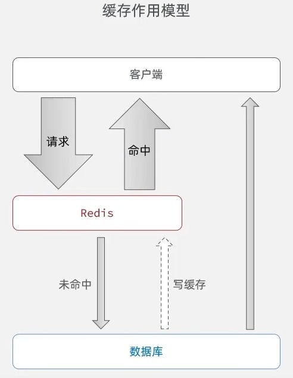
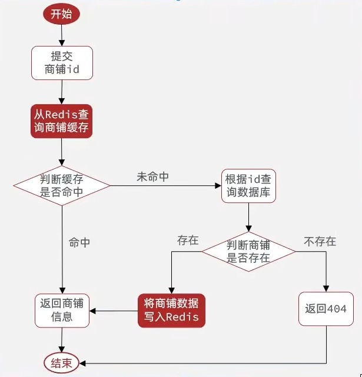
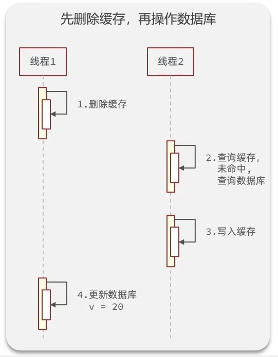
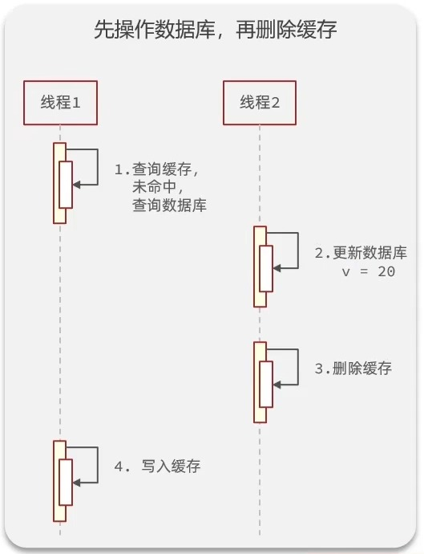
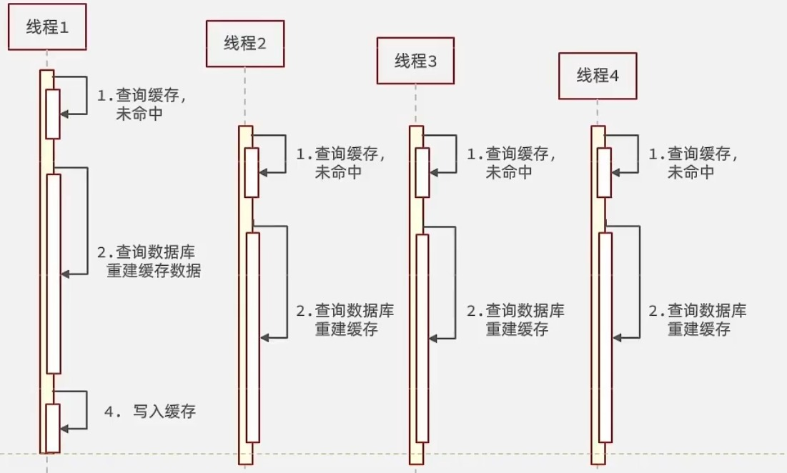
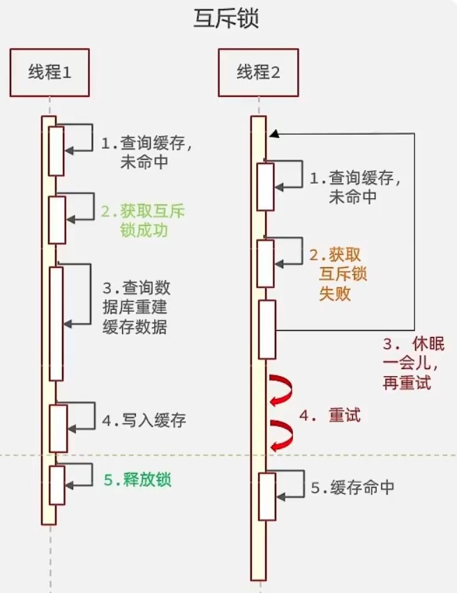
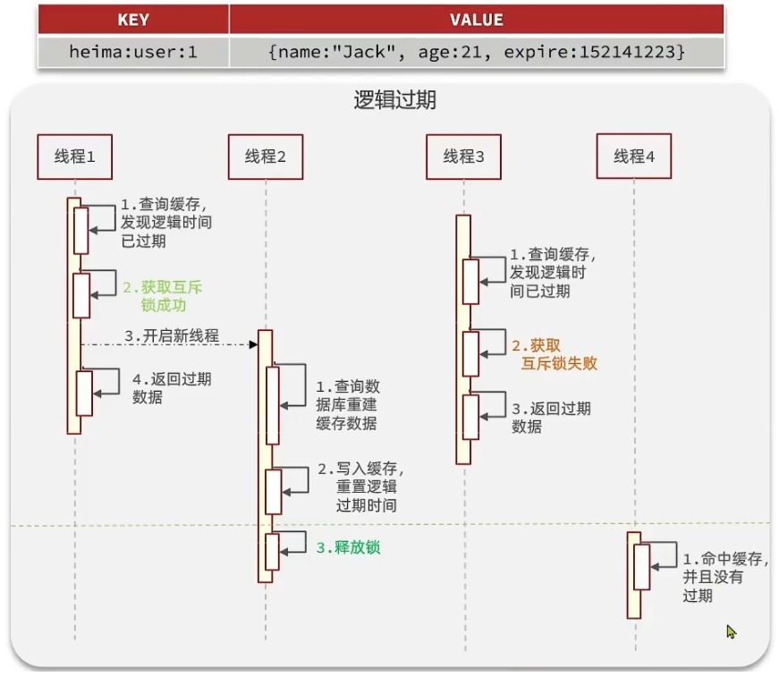
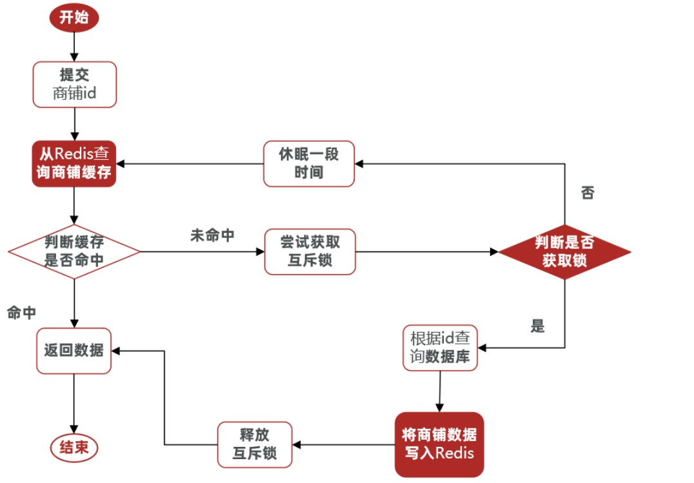
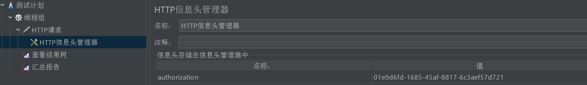
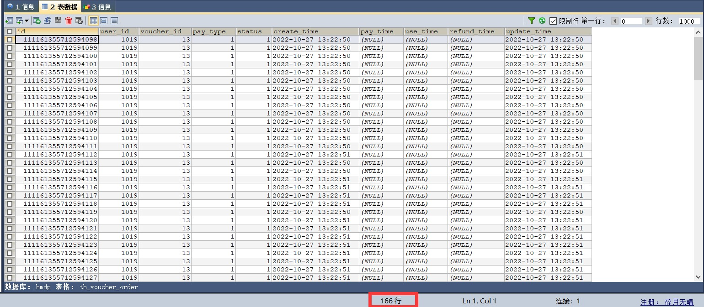

typora-root-url: ..\..\image、

# ThreadLocal多线程

ThreadLocal叫做线程变量，意思是ThreadLocal中填充的变量属于当前线程，该变量对其他线程而言是隔离的，也就是说该变量是当前线程独有的变量。ThreadLocal为变量在每个线程中都创建了一个副本，那么每个线程可以访问自己内部的副本变量。

ThreadLoal 变量，线程局部变量，同一个 ThreadLocal 所包含的对象，在不同的 Thread 中有不同的副本。这里有几点需要注意：

因为每个 Thread 内有自己的实例副本，且该副本只能由当前 Thread 使用。这是也是 ThreadLocal 命名的由来。
既然每个 Thread 有自己的实例副本，且其它 Thread 不可访问，那就不存在多线程间共享的问题。
1.ThreadLocal 提供了线程本地的实例。它与普通变量的区别在于，每个使用该变量的线程都会初始化一个完全独立的实例副本。2.ThreadLocal 变量通常被private static修饰。当一个线程结束时，它所使用的所有 ThreadLocal 相对的实例副本都可被回收。

总的来说，ThreadLocal 适用于每个线程需要自己独立的实例且该实例需要在多个方法中被使用，也即变量在线程间隔离而在方法或类间共享的场景


## ThreadLocal与Synchronized的区别

`ThreadLocal<T>`其实是与线程绑定的一个变量。ThreadLocal和Synchonized都用于解决多线程并发访问。

但是ThreadLocal与synchronized有本质的区别：

1、Synchronized用于线程间的数据共享，而ThreadLocal则用于线程间的数据隔离。

2、Synchronized是利用锁的机制，使变量或代码块在某一时该只能被一个线程访问。而ThreadLocal为每一个线程都提供了变量的副本

，使得每个线程在某一时间访问到的并不是同一个对象，这样就隔离了多个线程对数据的数据共享。

而Synchronized却正好相反，它用于在多个线程间通信时能够获得数据共享。

一句话理解ThreadLocal，threadlocl是作为当前线程中属性ThreadLocalMap集合中的某一个Entry的key值Entry（threadlocl,value），虽然不同的线程之间threadlocal这个key值是一样，但是不同的线程所拥有的ThreadLocalMap是独一无二的，也就是不同的线程间同一个ThreadLocal（key）对应存储的值(value)不一样，从而到达了线程间变量隔离的目的，但是在同一个线程中这个value变量地址是一样的。


```java
public class UserHolder {
    private static final ThreadLocal<UserDTO> tl = new ThreadLocal<>();
    //每个请求线程 都可以独立存储和获取用户信息，互不干扰

    public static void saveUser(UserDTO user){
        tl.set(user);
    }
//保存用户信息 ：

//把当前登录用户的信息存到当前线程的 "储物柜" 中
//任何地方都可以通过 UserHolder.getUser() 获
    public static UserDTO getUser(){
        return tl.get();
    }
//获取用户信息
    public static void removeUser(){
        tl.remove();
    }
    //清理用户信息 
}

```

# BeanUtil方法

## Hutool 的 BeanUtil 常用方法

### 1. 对象复制相关

#### copyProperties(source, targetClass)

```
UserDTO dto = BeanUtil.
copyProperties(user, UserDTO.class);
```

- 复制源对象属性到目标类
- 自动创建目标类实例
- 忽略不存在的属性

#### copyProperties(source, target)

```
UserDTO dto = new UserDTO();
BeanUtil.copyProperties(user, dto);
```

- 复制到已有的目标对象
- 更灵活，可以复用对象

#### copyToList(sourceList, targetClass)

```

List<UserDTO> dtoList = BeanUtil.
copyToList(userList, UserDTO.class);
```

- 批量复制列表
- 常用于分页查询结果转换

### 2. Map 与 Bean 互转

#### beanToMap(object)

```

Map<String, Object> map = BeanUtil.
beanToMap(user);
```

- 将对象转换为 Map
- 常用于动态构建参数

#### fillBeanWithMap(map, bean, isIgnoreError)

```

UserDTO dto = BeanUtil.
fillBeanWithMap(map, new UserDTO(), 
false);
```

- 用 Map 填充 Bean
- isIgnoreError：是否忽略错误
- 常用于从 Redis 等存储中恢复对象

### 3. 属性操作

#### getProperty(bean, propertyName)

```

String name = BeanUtil.getProperty
(user, "name");
```

- 获取对象属性值
- 支持嵌套属性："address.city"

#### setProperty(bean, propertyName, value)

```

BeanUtil.setProperty(user, "name", "
张三");
```

- 设置对象属性值
- 自动类型转换

### 4. 其他实用方法

#### getBeanDesc(Class)

```

BeanDesc desc = BeanUtil.getBeanDesc
(User.class);
```

- 获取类的属性描述
- 可以遍历所有属性

#### hasProperty(object, propertyName)

```

boolean hasName = BeanUtil.
hasProperty(user, "name");
```

- 检查对象是否有某个属性

#### isEmpty(object)

```

boolean isEmpty = BeanUtil.isEmpty
(user);
```

- 检查对象是否为空（所有属性都为 null）

## 在项目中的实际应用

### 1. 登录信息转换--隐藏用户敏感信息

```

// UserController 中的用法
UserDTO userDTO = BeanUtil.
copyProperties(user, UserDTO.class);
```

**作用：** 去除敏感信息，只返回安全字段

### 2. Redis 数据恢复

```

// RefreshTokenInterceptor 中的用法
UserDTO userDTO = BeanUtil.
fillBeanWithMap(userMap, new UserDTO
(), false);
```

**作用：** 从 Redis 中取出的 Map 数据转换为对象

# Session共享问题

- 每个tomcat中都有一份属于自己的session,假设用户第一次访问第一台tomcat，并且把自己的信息存放到第一台服务器的session中，但是第二次这个用户访问到了第二台tomcat，那么在第二台服务器上，肯定没有第一台服务器存放的session，所以此时 整个登录拦截功能就会出现问题，我们能如何解决这个问题呢？早期的方案是session拷贝，就是说虽然每个tomcat上都有不同的session，但是每当任意一台服务器的session修改时，都会同步给其他的Tomcat服务器的session，这样的话，就可以实现session的共享了
- 但是这种方案具有两个大问题
  1. 每台服务器中都有完整的一份session数据，服务器压力过大。
  2. session拷贝数据时，可能会出现延迟
- 所以我们后面都是基于Redis来完成，我们把session换成Redis，Redis数据本身就是共享的，就可以避免session共享的问题了

### Redis替代session的业务流程

#### 设计key结构

- 首先我们来思考一下该用什么数据结构来存储数据
- 由于存入的数据比较简单，我们可以使用String或者Hash
  - 如果使用String，以JSON字符串来保存数据，会额外占用部分空间
  - 如果使用Hash，则它的value中只会存储数据本身
- 如果不是特别在意内存，直接使用String就好了

#### 设计key的具体细节

- 我们这里就采用的是简单的K-V键值对方式
- 但是对于key的处理，不能像session一样用phone或code来当做key
- 因为Redis的key是共享的，code可能会重复，phone这种敏感字段也不适合存储到Redis中
- 在设计key的时候，我们需要满足两点
  1. key要有唯一性
  2. key要方便携带
- 所以我们在后台随机生成一个token，然后让前端带着这个token就能完成我们的业务逻辑了

#### 整体访问流程

- 当注册完成后，用户去登录，然后校验用户提交的手机号/邮箱和验证码是否一致
  - 如果一致，则根据手机号查询用户信息，不存在则新建，最后将用户数据保存到Redis，并生成一个token作为Redis的key
- 当我们校验用户是否登录时，回去携带着token进行访问，从Redis中获取token对应的value，判断是否存在这个数据
  - 如果不存在，则拦截
  - 如果存在，则将其用户信息(userDto)保存到threadLocal中，并放行

### 基于Redis实现短信登录

- 由于前面已经分析过业务逻辑了，所以这里我们直接开始写代码，在此之前我们要在UserController中注入`StringRedisTemplate`

```java
@Autowired
private StringRedisTemplate stringRedisTemplate;
```

修改sendCode方法

这里的key使用`login:code:email`的形式，并设置有效期2分钟，我们也可以定义一个常量类来替换这里的`login:code:`和`2`，让代码显得更专业一点

```java
@PostMapping("/code")
public Result sendCode(@RequestParam("phone") String phone, HttpSession session) throws MessagingException {
    // TODO 发送短信验证码并保存验证码
    if (RegexUtils.isEmailInvalid(phone)) {
        return Result.fail("邮箱格式不正确");
    }
    String code = MailUtils.achieveCode();
-   session.setAttribute(phone, code);
- stringRedisTemplate.opsForValue().set("login:code:"  phone, code, 2, TimeUnit.MINUTES);
+stringRedisTemplate.opsForValue().set(LOGIN_CODE_KEY phone, code, LOGIN_CODE_TTL, TimeUnit.MINUTES);
    log.info("发送登录验证码：{}", code);
//        MailUtils.sendTestMail(phone, code);
    return Result.ok();
}
```

#### stringRedisTemplate

- Redis 操作模板 ：Spring 提供的 Redis 操作工具
- 专门用于操作 字符串类型 的数据
- 自动处理序列化、连接管理等底层细节

opsForValue()

- 获取 Value 操作对象 ：用于操作字符串类型的数据
- 相当于 Redis 的 SET 、 GET 等命令
- 返回 ValueOperations 对象，提供各种操作方法

set(key, value, timeout, timeUnit)

- 设置键值对 ，并指定过期时间
- 四个参数详解：

- 四个参数详解： 参数1： LOGIN_CODE_KEY + phone

```
// 假设：
LOGIN_CODE_KEY = "login:code:"
phone = "13812345678"
// 最终 key = 
"login:code:13812345678"
```

- Redis 的 key ：唯一标识这个验证码
- 用手机号作为后缀，确保每个手机号的验证码独立存储 参数2： code

```
// 假设：
code = "123456"
```

- 要存储的值 ：就是生成的验证码
- 会被序列化成字符串存储到 Redis 参数3： LOGIN_CODE_TTL

```
// 假设：
LOGIN_CODE_TTL = 2L  // 2分钟
```

- 过期时间数值 ：多长时间后自动删除 参数4： TimeUnit.MINUTES
- 时间单位 ：分钟、秒、小时等
- 这里是 MINUTES ，表示前面的是 分钟


这行代码执行后：

```
Redis 中存储：
key: "login:code:13812345678"
value: "123456"
过期时间: 2分钟后自动删除
```

生活类比

就像你去超市存包：

1. 扫码获取储物柜 （生成 key）
2. 把包放进去 （存储验证码）
3. 设置定时器 （2小时后自动打开）
4. 超时自动清理 （Redis 自动删除）

```java
package com.hmdp.controller;


import cn.hutool.core.bean.BeanUtil;
import cn.hutool.core.util.RandomUtil;
import cn.hutool.extra.mail.MailUtil;
import com.baomidou.mybatisplus.core.conditions.query.LambdaQueryWrapper;
import com.hmdp.dto.LoginFormDTO;
import com.hmdp.dto.Result;
import com.hmdp.dto.UserDTO;
import com.hmdp.entity.User;
import com.hmdp.entity.UserInfo;
import com.hmdp.service.IUserInfoService;
import com.hmdp.service.IUserService;
import com.hmdp.utils.MailUtils;
import com.hmdp.utils.RegexUtils;
import com.hmdp.utils.UserHolder;
import lombok.extern.slf4j.Slf4j;
import org.springframework.beans.factory.annotation.Autowired;
import org.springframework.data.redis.core.StringRedisTemplate;
import org.springframework.web.bind.annotation.*;
import org.springframework.web.servlet.HandlerInterceptor;

import javax.annotation.Resource;
import javax.mail.MessagingException;
import javax.servlet.http.HttpServletRequest;
import javax.servlet.http.HttpServletResponse;
import javax.servlet.http.HttpSession;

import java.util.HashMap;
import java.util.UUID;
import java.util.concurrent.TimeUnit;

import static com.hmdp.utils.RedisConstants.LOGIN_CODE_KEY;
import static com.hmdp.utils.RedisConstants.LOGIN_CODE_TTL;

/**
 * <p>
 * 前端控制器
 * </p>
 *
 * @author 虎哥
 * @since 2021-12-22
 */
@Slf4j
@RestController
@RequestMapping("/user")
public class UserController {

    @Resource
    private IUserService userService;

    @Resource
    private IUserInfoService userInfoService;
    @Autowired
    private StringRedisTemplate stringRedisTemplate;

    /**
     * 发送手机验证码
     */
    @PostMapping("code")
    public Result sendCode(@RequestParam("phone") String phone, HttpSession session) throws MessagingException {

        //TODO 实现发送短信验证码功能
        if (RegexUtils.isEmailInvalid(phone)) {
            return Result.fail("邮箱格式不正确");
        }
        String code = MailUtils.achieveCode();
        //"把验证码存到 Redis 里，并设置过期时间"
        stringRedisTemplate.opsForValue().set(LOGIN_CODE_KEY + phone, code, LOGIN_CODE_TTL, TimeUnit.MINUTES);
        log.info("发送登录验证码：{}", code);
        //MailUtils.sentTestMail(phone, code);
        return Result.ok();
    }
    /**
     * 登录功能
     * @param loginForm 登录参数，包含手机号、验证码；或者手机号、密码
     */
    @PostMapping("/login")
    public Result login(@RequestBody LoginFormDTO loginForm, HttpSession session){
        //获取登录账号
        String phone = loginForm.getPhone();
        //获取登录验证码
        String code = loginForm.getCode();
        //获取session中的验证码
        Object cacheCode = session.getAttribute(phone);
        //校验邮箱
        if(RegexUtils.isEmailInvalid(phone)){
            return Result.fail("邮箱格式不正确");
        }
        //校验验证码
        //因为通常 cacheCode 是从session获取的，需要 toString() 转换
        log.info("code:{},cache{}",code,cacheCode);
        if(code ==null ||!code.equals(cacheCode.toString())){
            return Result.fail("验证码错误");
        }
        //根据账号查询用户是否存在
        LambdaQueryWrapper <User> queryWrapper = new LambdaQueryWrapper<>();
        queryWrapper.eq(User::getPhone,phone);
        User user = userService.getOne(queryWrapper);
        //判断用户是否存在
        if(user == null){ //如果用户不存在，则新建用户并保存
            user = createUserWithPhone(phone);
        }
        //登录成功，将用户信息保存在session中
        //保存用户的信息在Redis
        //随机生成token，作为登录令牌
        String token = UUID.randomUUID().toString();
        //将UserDto对象转化为HashMap存储
        UserDTO userDTO = BeanUtil.copyProperties(user, UserDTO.class);
        HashMap<String,String> userMap = new HashMap<>();
        userMap.put("icon",userDTO.getIcon());
        userMap.put("id",userDTO.getId().toString());
        userMap.put("nickName",userDTO.getNickName());
        //高端写法，现在我还学不来，工具类还不太了解，只能自己手动转换类型然后put了
//        Map<String, Object> userMap = BeanUtil.beanToMap(userDTO, new HashMap<>(),
//                CopyOptions.create()
//                        .setIgnoreNullValue(true)
//                        .setFieldValueEditor((fieldName, fieldValue) -> fieldValue.toString()));
        //将用户信息存入Redis
        String tokenKey = "LOGIN_USER_KEY" + token;
        session.setAttribute("user",userDTO);
        return Result.ok();
    }

    private User createUserWithPhone(String phone) {
        //创建用户
        User user = new User();
        user.setPhone(phone);
        //设置昵称(默认名)，一个固定前缀+随机字符串
        user.setNickName("user_"+ RandomUtil.randomString(8));
        //保存在数据库中
        userService.save(user);
        return user;
    }
    /**
     * 登出功能
     * @return 无
     */
    @PostMapping("/logout")
    public Result logout(){
        // TODO 实现登出功能
        return Result.fail("功能未完成");
    }

    //查看我的个人信息
    @GetMapping("/me")
    public Result me(){
        // 获取当前登录的用户并返回
        UserDTO user = UserHolder.getUser();
        return Result.ok(user);
    }

    @GetMapping("/info/{id}")
    public Result info(@PathVariable("id") Long userId){
        // 查询详情
        UserInfo info = userInfoService.getById(userId);
        if (info == null) {
            // 没有详情，应该是第一次查看详情
            return Result.ok();
        }
        info.setCreateTime(null);
        info.setUpdateTime(null);
        // 返回
        return Result.ok(info);
    }
}

```

### 解决状态登录刷新问题

#### 初始方案

- 我们可以通过拦截器拦截到的请求，来证明用户是否在操作，如果用户没有任何操作30分钟，则token会消失，用户需要重新登录

- 通过查看请求，我们发现我们存的token在请求头里，那么我们就在拦截器里来刷新token的存活时间

  > authorization: 6867061d-a8d0-4e60-b92f-97f7d698a1ca

- 修改我们的登陆拦截器`LoginInterceptor`类

  ```
  @Override
  public boolean preHandle(HttpServletRequest request, HttpServletResponse response, Object handler) throws Exception {
      //1. 获取请求头中的token
      String token = request.getHeader("authorization");
      //2. 如果token是空，则未登录，拦截
      if (StrUtil.isBlank(token)) {
          response.setStatus(401);
          return false;
      }
      String key = RedisConstants.LOGIN_USER_KEY + token;
      //3. 基于token获取Redis中的用户数据
      Map<Object, Object> userMap = stringRedisTemplate.opsForHash().entries(key);
      //4. 判断用户是否存在，不存在，则拦截
      if (userMap.isEmpty()) {
          response.setStatus(401);
          return false;
      }
      //5. 将查询到的Hash数据转化为UserDto对象
      UserDTO userDTO = BeanUtil.fillBeanWithMap(userMap, new UserDTO(), false);
      //6. 将用户信息保存到ThreadLocal
      UserHolder.saveUser(userDTO);
      //7. 刷新tokenTTL，这里的存活时间根据需要自己设置，这里的常量值我改为了30分钟
      stringRedisTemplate.expire(key, RedisConstants.LOGIN_USER_TTL, TimeUnit.MINUTES);
      return true;
  }
  ```

- 在这个方案中，他确实可以使用对应路径的拦截，同时刷新登录token令牌的存活时间，但是现在这个拦截器他只是拦截需要被拦截的路径，假设当前用户访问了一些不需要拦截的路径，那么这个拦截器就不会生效，所以此时令牌刷新的动作实际上就不会执行，所以这个方案他是存在问题的

#### 优化方案

- 既然之前的拦截器无法对不需要拦截的路径生效，那么我们可以添加一个拦截器，在第一个拦截器中拦截所有的路径，把第二个拦截器做的事情放入到第一个拦截器中，同时刷新令牌，因为第一个拦截器有了threadLocal的数据，所以此时第二个拦截器只需要判断拦截器中的user对象是否存在即可，完成整体刷新功能。

- 新建一个

  ```
  RefreshTokenInterceptor
  ```

  类，其业务逻辑与之前的

  ```
  LoginInterceptor
  ```

  类似，就算遇到用户未登录，也继续放行，交给

  ```
  LoginInterceptor
  ```

  处理

  由于这个对象是我们手动在WebConfig里创建的，所以这里不能用@AutoWired自动装配，只能声明一个私有的，到了WebConfig里再自动装配

  ```
  public class RefreshTokenInterceptor implements HandlerInterceptor {
      //这里并不是自动装配，因为RefreshTokenInterceptor是我们手动在WebConfig里new出来的
      private StringRedisTemplate stringRedisTemplate;
  
     public RefreshTokenInterceptor(StringRedisTemplate stringRedisTemplate) {
          this.stringRedisTemplate = stringRedisTemplate;
      }
  
      @Override
      public boolean preHandle(HttpServletRequest request, HttpServletResponse response, Object handler) throws Exception {
          //1. 获取请求头中的token
          String token = request.getHeader("authorization");
          //2. 如果token是空，直接放行，交给LoginInterceptor处理
          if (StrUtil.isBlank(token)) {
              return true;
          }
          String key = RedisConstants.LOGIN_USER_KEY + token;
          //3. 基于token获取Redis中的用户数据
          Map<Object, Object> userMap = stringRedisTemplate.opsForHash().entries(key);
          //4. 判断用户是否存在，不存在，也放行，交给LoginInterceptor
          if (userMap.isEmpty()) {
              return true;
          }
          //5. 将查询到的Hash数据转化为UserDto对象
          UserDTO userDTO = BeanUtil.fillBeanWithMap(userMap, new UserDTO(), false);
          //6. 将用户信息保存到ThreadLocal
          UserHolder.saveUser(userDTO);
          //7. 刷新tokenTTL，这里的存活时间根据需要自己设置，这里的常量值我改为了30分钟
          stringRedisTemplate.expire(key, RedisConstants.LOGIN_USER_TTL, TimeUnit.MINUTES);
          return true;
      }
  
      @Override
      public void afterCompletion(HttpServletRequest request, HttpServletResponse response, Object handler, Exception ex) throws Exception {
          UserHolder.removeUser();
      }
  }
  ```

- 修改我们之前的

  ```
  LoginInterceptor
  ```

  类，只需要判断用户是否存在，不存在，则拦截，存在则放行

  ```
  public class LoginInterceptor implements HandlerInterceptor {
  
      @Override
      public boolean preHandle(HttpServletRequest request, HttpServletResponse response, Object handler) throws Exception {
          //判断用户是否存在
          if (UserHolder.getUser()==null){
              //不存在则拦截
              response.setStatus(401);
              return false;
          }
          //存在则放行
          return true;
      }
  
      @Override
      public void afterCompletion(HttpServletRequest request, HttpServletResponse response, Object handler, Exception ex) throws Exception {
          UserHolder.removeUser();
      }
  }
  ```

- 修改

  ```
  WebConfig
  ```

  配置类，拦截器的执行顺序可以由order来指定，如果未设置拦截路径，则默认是拦截所有路径

  ```
  @Configuration
  public class MvcConfig implements WebMvcConfigurer {
      //到了这里才能自动装配
      @Autowired
      private StringRedisTemplate stringRedisTemplate;
  
      @Override
      public void addInterceptors(InterceptorRegistry registry) {
          registry.addInterceptor(new LoginInterceptor())
                  .excludePathPatterns(
                          "/user/code",
                          "/user/login",
                          "/blog/hot",
                          "/shop/**",
                          "/shop-type/**",
                          "/upload/**",
                          "/voucher/**"
                  ).order(1);
          //RefreshTokenInterceptor是我们手动new出来的
          registry.addInterceptor(new RefreshTokenInterceptor(stringRedisTemplate)).order(0);
      }
  }
  ```

- 那么至此，大功告成，我们重启服务器，登录，然后去Redis的图形化界面查看token的ttl，如果每次切换界面之后，ttl都会重置，那么说明我们的代码没有问题

##### 进行手动装配StringRedisTemplate的原因

**源代码**

```java
    //这里并不是自动装配，因为RefreshTokenInterceptor是我们手动在WebConfig里new出来的
    private StringRedisTemplate stringRedisTemplate;

    public RefreshTokenInterceptor(StringRedisTemplate stringRedisTemplate) {
        this.stringRedisTemplate = stringRedisTemplate;
    }

```

## 为什么要手动注入 StringRedisTemplate？

### 根本原因：拦截器不是 Spring 管理的 Bean

```
public RefreshTokenInterceptor
(StringRedisTemplate 
stringRedisTemplate) {
    this.stringRedisTemplate = 
    stringRedisTemplate;
}
```

##### 详细解释

###### 1. 拦截器的创建方式不同

**普通 Spring Bean（如 Controller、Service）：**

```
@RestController
public class UserController {
    @Autowired  // Spring 自动注入
    private StringRedisTemplate 
    stringRedisTemplate;
}
```

- Spring **自动创建**对象
- Spring **自动注入**依赖
- 生命周期由 Spring 管理

**拦截器的创建方式：**

```
@Configuration
public class WebConfig implements 
WebMvcConfigurer {
    @Override
    public void addInterceptors
    (InterceptorRegistry registry) {
        // 手动 new 出来的，不是 
        Spring 创建的
        registry.addInterceptor(new 
        RefreshTokenInterceptor
        (null));
    }
}
```

###### 2. 手动 new 的问题

```
// 错误方式：直接 new
registry.addInterceptor(new 
RefreshTokenInterceptor());
```

- **new 出来的对象** Spring 感知不到
- **无法使用 @Autowired** 进行自动注入
- **依赖为 null**，会报空指针异常

###### 3. 正确的解决方式

**步骤 1：在配置类中先注入 StringRedisTemplate**

```
@Configuration
public class WebConfig implements 
WebMvcConfigurer {
    
    @Autowired  // Spring 注入
    private StringRedisTemplate 
    stringRedisTemplate;
    
    @Override
    public void addInterceptors
    (InterceptorRegistry registry) {
        // 手动注入到拦截器
        registry.addInterceptor(new 
        RefreshTokenInterceptor
        (stringRedisTemplate));
    }
}
```

# 商户查询缓存

## 什么是缓存

- 什么是缓存？

  - 缓存就像自行车、越野车的避震器

- 举个例子

  - 越野车、山地自行车都有`避震器`，防止车体加速之后因惯性，在`U`型地形上飞跃硬着陆导致`损坏`，像个弹簧意义

- 同样，在实际开发中，系统也需要`避震器`，防止过高的数据量猛冲系统，导致其操作线程无法及时处理信息而瘫痪

- 在实际开发中，对企业来讲，产品口碑、用户评价都是致命的，所以企业非常重视缓存技术

  缓存(Cache)就是数据交换的缓冲区，俗称的缓存就是缓冲区内的数据，一般从数据库中获取，存储于本地，例如

  - 本地用高并发

  - ```
    Static final ConcurrentHashMap<K,V> map = new ConcurrentHashMap<>();
    ```

  - 用于Redis等缓存

  - ```
    static final Cache<K,V> USER_CACHE = CacheBuilder.newBuilder().build();
    ```

  - 本地缓存

  - ```
    Static final Map<K,V> map =  new HashMap();
    ```

- 由于其被`static`修饰，所以随着类的加载而加载到内存之中，作为本地缓存，由于其又被`final`修饰，所以其引用之间的关系是固定的，不能改变，因此不用担心复制导致缓存失败

#### 为什么要使用缓存

- 言简意赅：速度快，好用

- 缓存数据存储于代码中，而代码运行在内存中，内存的读写性能远高于磁盘，缓存可以大大降低用户访问并发量带来的服务器读写压力

- 实际开发中，企业的数据量，少则几十万，多则几千万，这么大的数据量，如果没有缓存来作为`避震器`系统是几乎撑不住的，所以企业会大量运用缓存技术

- 但是缓存也会增加代码复杂度和运营成本

- ```
  缓存的作用
  ```

  1. 降低后端负载
  2. 提高读写效率，降低响应时间

- ```
  缓存的成本
  ```

  1. 数据一致性成本
  2. 代码维护成本
  3. 运维成本（一般采用服务器集群，需要多加机器，机器就是钱）

#### 如何使用缓存

- 实际开发中，会构筑多级缓存来时系统运行速度进一步提升，例如：本地缓存与Redis中的缓存并发使用
- `浏览器缓存：`主要是存在于浏览器端的缓存
- `应用层缓存：`可以分为toncat本地缓存，例如之前提到的map或者是使用Redis作为缓存
- `数据库缓存：`在数据库中有一片空间是buffer pool，增改查数据都会先加载到mysql的缓存中
- `CPU缓存：`当代计算机最大的问题就是CPU性能提升了，但是内存读写速度没有跟上，所以为了适应当下的情况，增加了CPU的L1，L2，L3级的缓存

### 添加商户缓存

在我们查询商户信息时，我们是直接操作从数据库中去进行查询的，大致逻辑是这样，直接查询数据库肯定慢

```
/**
    * 根据id查询商铺信息
    * @param id 商铺id
    * @return 商铺详情数据
    */
@GetMapping("/{id}")
public Result queryShopById(@PathVariable("id") Long id) {
    return Result.ok(shopService.getById(id));
}
```

- 所以我们可以在客户端与数据库之间加上一个Redis缓存，先从Redis中查询，如果没有查到，再去MySQL中查询，同时查询完毕之后，将查询到的数据也存入Redis，这样当下一个用户来进行查询的时候，就可以直接从Redis中获取到数据



#### 缓存模型和思路

- 标准的操作方式就是查询数据库之前先查询缓存，如果缓存数据存在，则直接从缓存中返回，如果缓存数据不存在，再查询数据库，然后将数据存入Redis。



#### 代码实现

- 代码思路：如果Redis缓存里有数据，那么直接返回，如果缓存中没有，则去查询数据库，然后存入Redis

Controller层

业务逻辑我们写到Service中，需要在Service层创建这个`queryById`方法，然后去ServiceImpl中实现

```
@GetMapping("/{id}")
public Result queryShopById(@PathVariable("id") Long id) {
    return shopService.queryById(id);
}
```

Service层

```
public interface IShopService extends IService<Shop> {
    Result queryById(Long id);
}
```

SerivceImpl层

```
@Override
public Result queryById(Long id) {
    //先从Redis中查，这里的常量值是固定的前缀 + 店铺id
    String shopJson = stringRedisTemplate.opsForValue().get(CACHE_SHOP_KEY + id);
    //如果不为空（查询到了），则转为Shop类型直接返回
    if (StrUtil.isNotBlank(shopJson)) {
        Shop shop = JSONUtil.toBean(shopJson, Shop.class);
        return Result.ok(shop);
    }
    //否则去数据库中查
    Shop shop = getById(id);
    //查不到返回一个错误信息或者返回空都可以，根据自己的需求来
    if (shop == null){
        return Result.fail("店铺不存在！！");
    }
    //查到了则转为json字符串
    String jsonStr = JSONUtil.toJsonStr(shop);
    //并存入redis
    stringRedisTemplate.opsForValue().set(CACHE_SHOP_KEY + id, jsonStr);
    //最终把查询到的商户信息返回给前端
    return Result.ok(shop);
}
```

##### JSONUtil

JSONUtil.toBean() 是 Hutool 工具库 提供的 JSON 字符串转 Java 对象的方法，

```
Shop shop = JSONUtil.toBean(shopJson, Shop.class);
```

缓存数据转换（ShopServiceImpl）

```java
// 从 Redis 获取店铺信息的 JSON 字符串
String shopJson = stringRedisTemplate.opsForValue().get(CACHE_SHOP_KEY + id);

// 将 JSON 字符串转换为 Shop 对象
if(StrUtil.isNotBlank(shopJson)){
    Shop shop = JSONUtil.toBean(shopJson, Shop.class);
    return Result.ok(shop);
}
```

完整流程：

```
Redis 中的 JSON 字符串 → JSONUtil.toBean() → Java Shop 对象
{"id":1,"name":"星巴克","area":"朝阳区"} → toBean() → Shop 实例
```

- 重启服务器，访问商户信息，观察控制台日志输出，后续刷新页面，不会出现SQL语句查询商户信息，去Redis图形化界面中查看，可以看到缓存的商户信息数据

#### 趁热打铁

- 完成了商户数据缓存之后，我们尝试做一下商户类型数据缓存

Controller层

业务逻辑依旧是写在Service中

```java
@GetMapping("list")
public Result queryTypeList() {
    return typeService.queryList();
}
```

ServiceImpl层

- 整体代码都是类似的，前面只需要将单个店铺信息从JSON和Bean之间相互转换
- 这里只不过是将查询到的多个店铺类型信息从JSON和Bean之间相互转换，只是多了一个foreach循环

```java
    @Resource
    private StringRedisTemplate stringRedisTemplate;
    @Override
    public Result queryList() {
        //先从Redis中查，这里的常量值是固定前缀 + 店铺id
        List<String> shopTypes = stringRedisTemplate.opsForList().range(CACHE_SHOP_TYPE_KEY,0, -1);
        //如果不为空（查询到了），则转为ShopType类型直接返回
        if(!shopTypes.isEmpty()){
            List<ShopType> tmp = new ArrayList<>();
            for(String type : shopTypes){
                ShopType shopType = JSONUtil.toBean(type, ShopType.class);
                tmp.add(shopType);
            }
           return Result.ok(tmp);
        }
        //否则去数据库中查
        List<ShopType> tmp = query().orderByAsc("sort").list();
        if(tmp==null){
            //数据库中也没有，返回失败
            return Result.fail("店铺类型不存在");
        }
        //查到了转为json字符串，存入redis
        for(ShopType shopType : tmp){
            String jsonstr = JSONUtil.toJsonStr(shopType);
            shopTypes.add(jsonstr);
        }
       //.leftPushAll(key, values...) 是 Redis List 的批量左压入操作
        //左压入会把参数按给定顺序依次“往左”插入，最终列表顺序与传入顺序相反；如果要保持原有顺序追加到尾部，用 rightPushAll.
        stringRedisTemplate.opsForList().leftPushAll(CACHE_SHOP_TYPE_KEY,shopTypes);
        //最终把查询到的商户分类信息返回给前端
        return Result.ok(tmp);
    }
```

可以用stream流来简化代码

```java
@Override
public Result queryList() {
    // 先从Redis中查，这里的常量值是固定前缀 + 店铺id
    List<String> shopTypes =
            stringRedisTemplate.opsForList().range(CACHE_SHOP_TYPE_KEY, 0, -1);
    // 如果不为空（查询到了），则转为ShopType类型直接返回
    if (!shopTypes.isEmpty()) {
        List<ShopType> tmp = shopTypes.stream().map(type -> JSONUtil.toBean(type, ShopType.class))
                                          .collect(Collectors.toList());
        return Result.ok(tmp);
    }
    // 否则去数据库中查
    List<ShopType> tmp = query().orderByAsc("sort").list();
    if (tmp == null){
        return Result.fail("店铺类型不存在！！");
    }
    // 查到了转为json字符串，存入redis
    shopTypes = tmp.stream().map(type -> JSONUtil.toJsonStr(type))
                                    .collect(Collectors.toList());
    stringRedisTemplate.opsForList().leftPushAll(CACHE_SHOP_TYPE_KEY,shopTypes);
    // 最终把查询到的商户分类信息返回给前端
    return Result.ok(tmp);
}

```

### 缓存更新策略

- 缓存更新是Redis为了节约内存而设计出来的一个东西，主要是因为内存数据宝贵，当我们想Redis插入太多数据，此时就可能会导致缓存中数据过多，所以Redis会对部分数据进行更新，或者把它成为淘汰更合适
- `内存淘汰`：Redis自动进行，当Redis内存大道我们设定的`max-memery`时，会自动触发淘汰机制，淘汰掉一些不重要的数据（可以自己设置策略方式）
- `超时剔除`：当我们给Redis设置了过期时间TTL之后，Redis会将超时的数据进行删除，方便我们继续使用缓存
- `主动更新`：我们可以手动调用方法把缓存删除掉，通常用于解决缓存和数据库不一致问题

|          |                           内存淘汰                           |                           超时剔除                           | 主动更新                                       |
| :------: | :----------------------------------------------------------: | :----------------------------------------------------------: | :--------------------------------------------- |
|   说明   | 不用自己维护， 利用Redis的内存淘汰机制， 当内存不足时自动淘汰部分数据。 下次查询时更新缓存。 | 给缓存数据添加TTL时间， 到期后自动删除缓存。 下次查询时更新缓存。 | 编写业务逻辑， 在修改数据库的同时， 更新缓存。 |
|  一致性  |                              差                              |                             一般                             | 好                                             |
| 维护成本 |                              无                              |                              低                              | 高                                             |

- 业务场景
  - 低一致性需求：使用内存淘汰机制，例如店铺类型的查询缓存（因为这个很长一段时间都不需要更新）
  - 高一致性需求：主动更新，并以超时剔除作为兜底方案，例如店铺详情查询的缓存

#### 数据库和缓存不一致解决方案

- 由于我们的缓存数据源来自数据库，而数据库的数据是会发生变化的，因此，如果当数据库中数据发生变化，而缓存却没有同步，此时就会有一致性问题存在，其后果是
  - 用户使用缓存中的过时数据，就会产生类似多线程数据安全问题，从而影响业务，产品口碑等
- 那么如何解决这个问题呢？有如下三种方式
  1. Cache Aside Pattern 人工编码方式：缓存调用者在更新完数据库之后再去更新缓存，也称之为双写方案
  2. Read/Write Through Pattern：缓存与数据库整合为一个服务，由服务来维护一致性。调用者调用该服务，无需关心缓存一致性问题。但是维护这样一个服务很复杂，市面上也不容易找到这样的一个现成的服务，开发成本高
  3. Write Behind Caching Pattern：调用者只操作缓存，其他线程去异步处理数据库，最终实现一致性。但是维护这样的一个异步的任务很复杂，需要实时监控缓存中的数据更新，其他线程去异步更新数据库也可能不太及时，而且缓存服务器如果宕机，那么缓存的数据也就丢失了

#### 数据库和缓存不一致采用什么方案

- 综上所述，在企业的实际应用中，还是方案一最可靠，但是方案一的调用者该如何处理呢？
- 如果采用方案一，假设我们每次操作完数据库之后，都去更新一下缓存，但是如果中间并没有人查询数据，那么这个更新动作只有最后一次是有效的，中间的更新动作意义不大，所以我们可以把缓存直接删除，等到有人再次查询时，再将缓存中的数据加载出来
- 对比删除缓存与更新缓存
  - `更新缓存`：每次更新数据库都需要更新缓存，无效写操作较多
  - `删除缓存`：更新数据库时让缓存失效，再次查询时更新缓存
- 如何保证缓存与数据库的操作同时成功/同时失败
  - `单体系统：`将缓存与数据库操作放在同一个事务
  - `分布式系统：`利用TCC等分布式事务方案
- 先操作缓存还是先操作数据库？我们来仔细分析一下这两种方式的线程安全问题
- **1。先删除缓存，再操作数据库**
  删除缓存的操作很快，但是更新数据库的操作相对较慢，如果此时有一个线程2刚好进来查询缓存，由于我们刚刚才删除缓存，所以线程2需要查询数据库，并写入缓存，但是我们更新数据库的操作还未完成，所以线程2查询到的数据是脏数据，出现线程安全问题



**2.先操作数据库，再删除缓存**
线程1在查询缓存的时候，缓存TTL刚好失效，需要查询数据库并写入缓存，这个操作耗时相对较短（相比较于上图来说），但是就在这么短的时间内，线程2进来了，更新数据库，删除缓存，但是线程1虽然查询完了数据（更新前的旧数据），但是还没来得及写入缓存，所以线程2的更新数据库与删除缓存，并没有影响到线程1的查询旧数据，写入缓存，造成线程安全问题



- 虽然这二者都存在线程安全问题，但是相对来说，后者出现线程安全问题的概率相对较低，所以我们最终采用后者`先操作数据库，再删除缓存`的方案

### 实现商铺缓存与数据库双写一致

- 核心思路如下

  - 修改ShopController中的业务逻辑，满足以下要求

  1. 根据id查询店铺时，如果缓存未命中，则查询数据库，并将数据库结果写入缓存，并设置TTL
  2. 根据id修改店铺时，先修改数据库，再删除缓存

- 修改ShopService的queryById方法，写入缓存时设置一下TTL

```java
@Override
public Result queryById(Long id) {
    //先从Redis中查，这里的常量值是固定的前缀 + 店铺id
    String shopJson = stringRedisTemplate.opsForValue().get(CACHE_SHOP_KEY + id);
    //如果不为空（查询到了），则转为Shop类型直接返回
    if (StrUtil.isNotBlank(shopJson)) {
        Shop shop = JSONUtil.toBean(shopJson, Shop.class);
        return Result.ok(shop);
    }
    //否则去数据库中查
    Shop shop = getById(id);
    //查不到返回一个错误信息或者返回空都可以，根据自己的需求来
    if (shop == null){
        return Result.fail("店铺不存在！！");
    }
    //查到了则转为json字符串
    String jsonStr = JSONUtil.toJsonStr(shop);
    //并存入redis，设置TTL
    stringRedisTemplate.opsForValue().set(CACHE_SHOP_KEY + id, jsonStr,CACHE_SHOP_TTL, TimeUnit.MINUTES);
    //最终把查询到的商户信息返回给前端
    return Result.ok(shop);
}
```

之前的update方法

```java
/**
    * 更新商铺信息
    *
    * @param shop 商铺数据
    * @return 无
    */
@PutMapping
public Result updateShop(@RequestBody Shop shop) {
    // 写入数据库
    shopService.updateById(shop);
    return Result.ok();
}
```

修改后的updata方法

```java
/**
    * 更新商铺信息
    *
    * @param shop 商铺数据
    * @return 无
    */
@PutMapping
public Result updateShop(@RequestBody Shop shop) {
    return shopService.update(shop);
}
```

Service层

```java
Result update(Shop shop);
```

ServiceImpl层

```java
@Override
public Result update(Shop shop) {
    //首先先判一下空
    if (shop.getId() == null){
        return Result.fail("店铺id不能为空！！");
    }
    //先修改数据库
    updateById(shop);
    //再删除缓存
    stringRedisTemplate.delete(CACHE_SHOP_KEY + shop.getId());
    return Result.ok();
}
```

修改完毕之后我们重启服务器进行测试，首先随便挑一个顺眼的数据，我这里就是拿餐厅数据做测试，，我们先访问该餐厅，将该餐厅的数据缓存到Redis中，之后使用POSTMAN发送PUT请求，请求路径 `http://localhost:8080/api/shop/` ，携带JSON数据如下

```
{
  "area": "大关",
  "openHours": "10:00-22:00",
  "sold": 4215,
  "address": "金华路锦昌文华苑29号",
  "comments": 3035,
  "avgPrice": 80,
  "score": 37,
  "name": "476茶餐厅",
  "typeId": 1,
  "id": 1
}
```

- 之后再Redis图形化页面刷新数据，发现该餐厅的数据确实不在Redis中了，之后我们刷新网页，餐厅名会被改为`476茶餐厅`，然后我们再去Redis中刷新，发现新数据已经被缓存了
- 那么现在功能就实现完毕了，只有当我们刷新页面的时候，才会重新查询数据库，并将数据缓存到Redis，中途无论修改多少次，只要不刷新页面访问，Redis中都不会更新数据

### 缓存穿透问题的解决思路

- `缓存穿透`：缓存穿透是指客户端请求的数据在缓存中和数据库中都不存在，这样缓存永远都不会生效（只有数据库查到了，才会让redis缓存，但现在的问题是查不到），会频繁的去访问数据库。
- 常见的结局方案有两种
  1. 缓存空对象
     - 优点：实现简单，维护方便
     - 缺点：额外的内存消耗，可能造成短期的不一致
  2. 布隆过滤
     - 优点：内存占用啥哦，没有多余的key
     - 缺点：实现复杂，可能存在误判
- `缓存空对象`思路分析：当我们客户端访问不存在的数据时，会先请求redis，但是此时redis中也没有数据，就会直接访问数据库，但是数据库里也没有数据，那么这个数据就穿透了缓存，直击数据库。但是数据库能承载的并发不如redis这么高，所以如果大量的请求同时都来访问这个不存在的数据，那么这些请求就会访问到数据库，简单的解决方案就是哪怕这个数据在数据库里不存在，我们也把这个这个数据存在redis中去（这就是为啥说会有`额外的内存消耗`），这样下次用户过来访问这个不存在的数据时，redis缓存中也能找到这个数据，不用去查数据库。可能造成的`短期不一致`是指在空对象的存活期间，我们更新了数据库，把这个空对象变成了正常的可以访问的数据，但由于空对象的TTL还没过，所以当用户来查询的时候，查询到的还是空对象，等TTL过了之后，才能访问到正确的数据，不过这种情况很少见罢了
- `布隆过滤`思路分析：布隆过滤器其实采用的是哈希思想来解决这个问题，通过一个庞大的二进制数组，根据哈希思想去判断当前这个要查询的数据是否存在，如果布隆过滤器判断存在，则放行，这个请求会去访问redis，哪怕此时redis中的数据过期了，但是数据库里一定会存在这个数据，从数据库中查询到数据之后，再将其放到redis中。如果布隆过滤器判断这个数据不存在，则直接返回。这种思想的优点在于节约内存空间，但存在误判，误判的原因在于：布隆过滤器使用的是哈希思想，只要是哈希思想，都可能存在哈希冲突

### 编码解决商品查询的缓存穿透问题

- 核心思路如下
- 在原来的逻辑中，我们如果发现这个数据在MySQL中不存在，就直接返回一个错误信息了，但是这样存在缓存穿透问题

```java
@Override
public Result queryById(Long id) {
    //先从Redis中查，这里的常量值是固定的前缀 + 店铺id
    String shopJson = stringRedisTemplate.opsForValue().get(CACHE_SHOP_KEY + id);
    //如果不为空（查询到了），则转为Shop类型直接返回
    if (StrUtil.isNotBlank(shopJson)) {
        Shop shop = JSONUtil.toBean(shopJson, Shop.class);
        return Result.ok(shop);
    }
    //否则去数据库中查
    Shop shop = getById(id);
    //查不到返回一个错误信息或者返回空都可以，根据自己的需求来
    if (shop == null){
        return Result.fail("店铺不存在！！");
    }
    //查到了则转为json字符串
    String jsonStr = JSONUtil.toJsonStr(shop);
    //并存入redis，设置TTL
    stringRedisTemplate.opsForValue().set(CACHE_SHOP_KEY + id, jsonStr,CACHE_SHOP_TTL, TimeUnit.MINUTES);
    //最终把查询到的商户信息返回给前端
    return Result.ok(shop);
}
```

现在的逻辑是：如果这个数据不存在，将这个数据写入到Redis中，并且将value设置为空字符串，然后设置一个较短的TTL，返回错误信息。当再次发起查询时，先去Redis中判断value是否为空字符串，如果是空字符串，则说明是刚刚我们存的不存在的数据，直接返回错误信息

```java
@Override
public Result queryById(Long id) {
    //先从Redis中查，这里的常量值是固定的前缀 + 店铺id
    String shopJson = stringRedisTemplate.opsForValue().get(CACHE_SHOP_KEY + id);
    //如果不为空（查询到了），则转为Shop类型直接返回
    if (StrUtil.isNotBlank(shopJson)) {
        Shop shop = JSONUtil.toBean(shopJson, Shop.class);
        return Result.ok(shop);
    }
    //如果查询到的是空字符串，则说明是我们缓存的空数据
    if (shopjson != null) {
        return Result.fail("店铺不存在！！");
    }
    //否则去数据库中查
    Shop shop = getById(id);
    //查不到，则将空字符串写入Redis
    if (shop == null) {
        //这里的常量值是2分钟
        stringRedisTemplate.opsForValue().set(CACHE_SHOP_KEY + id, "", CACHE_NULL_TTL, TimeUnit.MINUTES);
        return Result.fail("店铺不存在！！");
    }
    //查到了则转为json字符串
    String jsonStr = JSONUtil.toJsonStr(shop);
    //并存入redis，设置TTL
    stringRedisTemplate.opsForValue().set(CACHE_SHOP_KEY + id, jsonStr, CACHE_SHOP_TTL, TimeUnit.MINUTES);
    //最终把查询到的商户信息返回给前端
    return Result.ok(shop);
}
```

小结：

- 缓存穿透产生的原因是什么？
  - 用户请求的数据在缓存中和在数据库中都不存在，不断发起这样的请求，会给数据库带来巨大压力
- 缓存产投的解决方案有哪些？
  - 缓存null值
  - 布隆过滤
  - 增强id复杂度，避免被猜测id规律（可以采用雪花算法）
  - 做好数据的基础格式校验
  - 加强用户权限校验
  - 做好热点参数的限流

### 缓存雪崩问题及解决思路

- 缓存雪崩是指在同一时间段，大量缓存的key同时失效，或者Redis服务宕机，导致大量请求到达数据库，带来巨大压力
- 解决方案
  - 给不同的Key的TTL添加随机值，让其在不同时间段分批失效
  - 利用Redis集群提高服务的可用性（使用一个或者多个哨兵(`Sentinel`)实例组成的系统，对redis节点进行监控，在主节点出现故障的情况下，能将从节点中的一个升级为主节点，进行故障转义，保证系统的可用性。 ）
  - 给缓存业务添加降级限流策略
  - 给业务添加多级缓存（浏览器访问静态资源时，优先读取浏览器本地缓存；访问非静态资源（ajax查询数据）时，访问服务端；请求到达Nginx后，优先读取Nginx本地缓存；如果Nginx本地缓存未命中，则去直接查询Redis（不经过Tomcat）；如果Redis查询未命中，则查询Tomcat；请求进入Tomcat后，优先查询JVM进程缓存；如果JVM进程缓存未命中，则查询数据库）

### 缓存击穿问题及解决思路

- 缓存击穿也叫热点Key问题，就是一个被`高并发访问`并且`缓存重建业务较复杂`的key突然失效了，那么无数请求访问就会在瞬间给数据库带来巨大的冲击
- 举个不太恰当的例子：一件秒杀中的商品的key突然失效了，大家都在疯狂抢购，那么这个瞬间就会有无数的请求访问去直接抵达数据库，从而造成缓存击穿
- 常见的解决方案有两种
  1. 互斥锁
  2. 逻辑过期
- `逻辑分析`：假设线程1在查询缓存之后未命中，本来应该去查询数据库，重建缓存数据，完成这些之后，其他线程也就能从缓存中加载这些数据了。但是在线程1还未执行完毕时，又进来了线程2、3、4同时来访问当前方法，那么这些线程都不能从缓存中查询到数据，那么他们就会在同一时刻访问数据库，执行SQL语句查询，对数据库访问压力过大



- `解决方案一`：互斥锁
- 利用锁的互斥性，假设线程过来，只能一个人一个人的访问数据库，从而避免对数据库频繁访问产生过大压力，但这也会影响查询的性能，将查询的性能从并行变成了串行，我们可以采用tryLock方法+double check来解决这个问题
- 线程1在操作的时候，拿着锁把房门锁上了，那么线程2、3、4就不能都进来操作数据库，只有1操作完了，把房门打开了，此时缓存数据也重建好了，线程2、3、4直接从redis中就可以查询到数据。



- `解决方案二`：逻辑过期方案
- 方案分析：我们之所以会出现缓存击穿问题，主要原因是在于我们对key设置了TTL，如果我们不设置TTL，那么就不会有缓存击穿问题，但是不设置TTL，数据又会一直占用我们的内存，所以我们可以采用逻辑过期方案
- 我们之前是TTL设置在redis的value中，注意：这个过期时间并不会直接作用于Redis，而是我们后续通过逻辑去处理。假设线程1去查询缓存，然后从value中判断当前数据已经过期了，此时线程1去获得互斥锁，那么其他线程会进行阻塞，获得了锁的进程他会开启一个新线程去进行之前的重建缓存数据的逻辑，直到新开的线程完成者逻辑之后，才会释放锁，而线程1直接进行返回，假设现在线程3过来访问，由于线程2拿着锁，所以线程3无法获得锁，线程3也直接返回数据（但只能返回旧数据，牺牲了数据一致性，换取性能上的提高），只有等待线程2重建缓存数据之后，其他线程才能返回正确的数据
- 这种方案巧妙在于，异步构建缓存数据，缺点是在重建完缓存数据之前，返回的都是脏数据



可以这么想象：

- 你家冰箱（Redis）里永远有一盒牛奶（缓存数据），盒子上贴了“到期时间”标签（逻辑过期字段），但冰箱本身不会把它扔掉。
- 半夜口渴（高并发请求），你打开一看，标签过期了，但牛奶还在。你先尝一口（用旧数据顶上），同时给室友发消息（抢锁），让他去便利店买新的。
- 发到的人（抢到锁的线程）开门去买（查库重建缓存），回来换上一盒新牛奶（写新数据并更新过期时间）。
- 其他室友这会儿来喝，看你已经发消息了（锁占用），就先喝旧牛奶凑合，等新牛奶回来下次再喝就是新的。

这样大家不会因为牛奶突然“消失”而饿肚子（避免缓存击穿），代价是短时间内可能喝到不够新鲜的牛奶（牺牲一点一致性换可用性）。

### 对比互斥锁与逻辑删除

- `互斥锁方案`：由于保证了互斥性，所以数据一致，且实现简单，只是加了一把锁而已，也没有其他的事情需要操心，所以没有额外的内存消耗，缺点在于有锁的情况，就可能死锁，所以只能串行执行，性能会受到影响
- `逻辑过期方案`：线程读取过程中不需要等待，性能好，有一个额外的线程持有锁去进行重构缓存数据，但是在重构数据完成之前，其他线程只能返回脏数据，且实现起来比较麻烦

| 解决方案 |                  优点                  |                  缺点                   |
| :------: | :------------------------------------: | :-------------------------------------: |
|  互斥锁  | 没有额外的内存消耗 保证一致性 实现简单 | 线程需要等待，性能受影响 可能有死锁风险 |
| 逻辑过期 |         线程无需等待，性能较好         |  不保证一致性 有额外内存消耗 实现复杂   |

### 利用互斥锁解决缓存击穿问题

- `核心思路`：相较于原来从缓存中查询不到数据后直接查询数据库而言，现在的方案是，进行查询之后，如果没有从缓存中查询到数据，则进行互斥锁的获取，获取互斥锁之后，判断是否获取到了锁，如果没获取到，则休眠一段时间，过一会儿再去尝试，知道获取到锁为止，才能进行查询
- 如果获取到了锁的线程，则进行查询，将查询到的数据写入Redis，再释放锁，返回数据，利用互斥锁就能保证只有一个线程去执行数据库的逻辑，防止缓存击穿



- `操作锁的代码`
- 核心思路就是利用redis的setnx方法来表示获取锁，如果redis没有这个key，则插入成功，返回1，如果已经存在这个key，则插入失败，返回0。在StringRedisTemplate中返回true/false，我们可以根据返回值来判断是否有线程成功获取到了锁

**tryLock**层

```java
private boolean tryLock(String key) {
    Boolean flag = stringRedisTemplate.opsForValue().setIfAbsent(key, "1", 10, TimeUnit.SECONDS);
    //避免返回值为null，我们这里使用了BooleanUtil工具类
    return BooleanUtil.isTrue(flag);
    //# Redis 命令等价于：
       //SET lock:shop:1001 1 NX EX 10
}
```

| 参数  | 含义         | 作用                 |
| ----- | ------------ | -------------------- |
| key   | 锁名称       | lock:shop:1001       |
| value | 锁标识       | "1" （可以是任意值） |
| Nx    | 不存在才设置 | 保证互斥性           |
| EX 10 | 10秒过期     | 防止死锁             |

**unlock层**

释放 Redis 分布式锁 ，防止死锁发生

```java
private void unlock(String key) {
    stringRedisTemplate.delete(key);
}
```

然后这里先把我们之前写的缓存穿透代码修改一下，提取成一个独立的方法

```java
@Override
public Shop queryWithPassThrough(Long id) {
    //先从Redis中查，这里的常量值是固定的前缀 + 店铺id
    String shopJson = stringRedisTemplate.opsForValue().get(CACHE_SHOP_KEY + id);
    //如果不为空（查询到了），则转为Shop类型直接返回
    if (StrUtil.isNotBlank(shopJson)) {
        Shop shop = JSONUtil.toBean(shopJson, Shop.class);
        return shop;
    }
    if (shopjson != null) {
        return null;
    }
    //否则去数据库中查
    Shop shop = getById(id);
    //查不到，则将空值写入Redis
    if (shop == null) {
        stringRedisTemplate.opsForValue().set(CACHE_SHOP_KEY + id, "", CACHE_NULL_TTL, TimeUnit.MINUTES);
        return null;
    }
    //查到了则转为json字符串
    String jsonStr = JSONUtil.toJsonStr(shop);
    //并存入redis，设置TTL
    stringRedisTemplate.opsForValue().set(CACHE_SHOP_KEY + id, jsonStr, CACHE_SHOP_TTL, TimeUnit.MINUTES);
    //最终把查询到的商户信息返回给前端
    return shop;
}
```

之后编写我们的互斥锁代码，其实与缓存穿透代码类似，只需要在上面稍加修改即可

- DIFF

```java
    @Override
-   public Shop queryWithPassThrough(Long id) {
+   public Shop queryWithMutex(Long id) {
        //先从Redis中查，这里的常量值是固定的前缀 + 店铺id
        String shopJson = stringRedisTemplate.opsForValue().get(CACHE_SHOP_KEY + id);
        //如果不为空（查询到了），则转为Shop类型直接返回
        if (StrUtil.isNotBlank(shopJson)) {
            Shop shop = JSONUtil.toBean(shopJson, Shop.class);
            return shop;
        }
        if (shopjson != null) {
            return null;
        }
        //否则去数据库中查
+       //从这里，用try/catch/finally包裹
+       //获取互斥锁
+       boolean flag = tryLock(LOCK_SHOP_KEY + id);
+       //判断是否获取成功
+       if (!flag) {
+           //失败，则休眠并重试
+           Thread.sleep(50);
+           return queryWithMutex(id);
+       }
        Shop shop = getById(id);
        //查不到，则将空值写入Redis
        if (shop == null) {
            stringRedisTemplate.opsForValue().set(CACHE_SHOP_KEY + id, "", CACHE_NULL_TTL, TimeUnit.MINUTES);
            return null;
        }
        //查到了则转为json字符串
        String jsonStr = JSONUtil.toJsonStr(shop);
        //并存入redis，设置TTL
        stringRedisTemplate.opsForValue().set(CACHE_SHOP_KEY + id, jsonStr, CACHE_SHOP_TTL, TimeUnit.MINUTES);
+       //try/catch/finally包裹到这里，然后把释放锁的操作放到finally里
+       //释放互斥锁
+       unlock(LOCK_SHOP_KEY + id);
        //最终把查询到的商户信息返回给前端
        return shop;
    }
```

修改后的代码

```java
    @Override
    public Shop queryWithMutex(Long id){
        //先从Redis中查，这里的常量值是固定的前缀 + 店铺id
        String shopJson = stringRedisTemplate.opsForValue().get(CACHE_SHOP_KEY + id);
        //如果不为空（查询到了），则转为Shop类型直接返回
        //缓存命中检查
        if(StrUtil.isNotBlank(shopJson)){
            Shop shop = JSONUtil.toBean(shopJson, Shop.class);
            return shop;
        }
        //这句在区分“缓存了空值”与“缓存里啥都没有”：
        //
        //若 shopJson 是空字符串（不等于 null），说明之前查库未命中时已经把空串写入 Redis 用来标记“店铺不存在”，此时直接返回失败，避免再去打数据库。
        //若 shopJson 是 null，表示缓存未命中且没有空值标记，才会继续往下查数据库。
        //如果查询到的是空字符串，则说明是我们缓存的空数据
        if(shopJson != null){
            return null;
        }
        Shop shop = null;
        //分布式锁保护
        try{
            //否则去数据库中查看
            boolean flag = cacheClient.tryLock(LOCK_SHOP_KEY+id);
            if(!flag){
                //获取锁失败，休眠并重试
                Thread.sleep(50);
                return queryWithMutex(id);
            }
            //否则去数据库中查看
            shop =getById(id);
            //查不到，则将空字符串写入Redis
            if(shop ==null){
                //这里的常量值是两分钟
                stringRedisTemplate.opsForValue().set(CACHE_SHOP_KEY + id,"",CACHE_SHOP_TTL, TimeUnit.MINUTES);
                return null;
            }
            //查到了则转为json字符串
            String jsonStr = JSONUtil.toJsonStr(shop);
            //并存入redis，设置TTL
            stringRedisTemplate.opsForValue().set(CACHE_SHOP_KEY + id, jsonStr,CACHE_SHOP_TTL, TimeUnit.MINUTES);
            //最终把查询到的商户信息返回给前端
        } catch (InterruptedException e) {
            throw new RuntimeException(e);
        }finally {
            //释放锁
            cacheClient.unlock(LOCK_SHOP_KEY+id);
        }

        return shop;
    }
```

最终修改`queryById`方法

```java
@Override
public Result queryById(Long id) {
    // // 1. 调用互斥锁方法查询店铺
    Shop shop = queryWithMutex(id);
    if (shop == null) {
        return Result.fail("店铺不存在！！");
    }
    return Result.ok(shop);
}
```

使用Jmeter进行测试

- 我们先来模拟一下缓存击穿的情景，缓存击穿是指在某时刻，一个热点数据的TTL到期了，此时用户不能从Redis中获取热点商品数据，然后就都得去数据库里查询，造成数据库压力过大。
- 那么我们首先将Redis中的热点商品数据删除，模拟TTL到期，然后用Jmeter进行压力测试，开100个线程来访问这个没有缓存的热点数据

### 利用逻辑过期解决缓存击穿问题

- 需求：根据id查询商铺的业务，基于逻辑过期方式来解决缓存击穿问题
- 思路分析：当用户开始查询redis时，判断是否命中
  - 如果没有命中则直接返回空数据，不查询数据库
  - 如果命中，则将value取出，判断value中的过期时间是否满足
    - 如果没有过期，则直接返回redis中的数据
    - 如果过期，则在开启独立线程后，直接返回之前的数据，独立线程去重构数据，重构完成后再释放互斥锁

- 封装数据：因为现在redis中存储的数据的value需要带上过期时间，此时要么你去修改原来的实体类，要么新建一个类包含原有的数据和过期时间

- `步骤一`

- 这里我们选择新建一个实体类，包含原有数据(用万能的Object)和过期时间，这样对原有的代码没有侵入性

  ```
  //这个 RedisData<T> 是一个 泛型封装类 ，用于在 Redis 中存储带过期时间的缓存数据
  @Data
  public class RedisData<T> {
      private LocalDateTime expireTime;
      //灵活性 ： T 可以是 Shop 、 User 、 List<Shop> 等任何类型
      private T data;
  }
  ```

- `步骤二`

- 在ShopServiceImpl中新增方法，进行单元测试，看看能否写入数据

  ```
  public void saveShop2Redis(Long id, Long expirSeconds) {
      Shop shop = getById(id);
      RedisData redisData = new RedisData();
      redisData.setData(shop);
      redisData.setExpireTime(LocalDateTime.now().plusSeconds(expirSeconds));
      stringRedisTemplate.opsForValue().set(CACHE_SHOP_KEY + id, JSONUtil.toJsonStr(redisData));
  }
  ```

`步骤三`：正式代码
正式代码我们就直接照着流程图写就好了

```java
//这里需要声明一个线程池，因为下面我们需要新建一个现成来完成重构缓存
private static final ExecutorService CACHE_REBUILD_EXECUTOR = Executors.newFixedThreadPool(10);

@Override
public Shop queryWithLogicalExpire(Long id) {
    //1. 从redis中查询商铺缓存
    String json = stringRedisTemplate.opsForValue().get(CACHE_SHOP_KEY + id);
    //2. 如果未命中，则返回空
    if (StrUtil.isBlank(json)) {
        return null;
    }
    //3. 命中，将json反序列化为对象
    RedisData redisData = JSONUtil.toBean(json, RedisData.class);
    //3.1 将data转为Shop对象
    JSONObject shopJson = (JSONObject) redisData.getData();
    Shop shop = JSONUtil.toBean(shopJson, Shop.class);
    //3.2 获取过期时间
    LocalDateTime expireTime = redisData.getExpireTime();
    //4. 判断是否过期
    if (LocalDateTime.now().isBefore(time)) {
        //5. 未过期，直接返回商铺信息
        return shop;
    }
    //6. 过期，尝试获取互斥锁
    boolean flag = tryLock(LOCK_SHOP_KEY + id);
    //7. 获取到了锁
    if (flag) {
        //8. 开启独立线程
        CACHE_REBUILD_EXECUTOR.submit(() -> {
            try {
                this.saveShop2Redis(id, LOCK_SHOP_TTL);
            } catch (Exception e) {
                throw new RuntimeException(e);
            } finally {
                unlock(LOCK_SHOP_KEY + id);
            }
        });
        //9. 直接返回商铺信息
        return shop;
    }
    //10. 未获取到锁，直接返回商铺信息
    return shop;
}
```

### 封装Redis工具类

- 基于StringRedisTemplate封装一个缓存工具类，需满足下列要求

  - 方法1：将任意Java对象序列化为JSON，并存储到String类型的Key中，并可以设置TTL过期时间

    ```java
    public void set(String key, Object value, Long time, TimeUnit timeUnit) {
        stringRedisTemplate.opsForValue().set(key, JSONUtil.toJsonStr(value), time, timeUnit);
    }
    ```

  - 方法2：将任意Java对象序列化为JSON，并存储在String类型的Key中，并可以设置逻辑过期时间，用于处理缓存击穿问题

  - //把任意对象按“逻辑过期”方式写入 Redis

    ```java
    public void setWithLogicExpire(String key, Object value, Long time, TimeUnit timeUnit) {
        //由于需要设置逻辑过期时间，所以我们需要用到RedisData
        RedisData<Object> redisData = new RedisData<>();
        //redisData的data就是传进来的value对象
        redisData.setData(value);
        //逻辑过期时间就是当前时间加上传进来的参数时间，用TimeUnit可以将时间转为秒，随后与当前时间相加
        redisData.setExpireTime(LocalDateTime.now().plusSeconds(timeUnit.toSeconds(time)));
        //由于是逻辑过期，所以这里不需要设置过期时间，只存一下key和value就好了，同时注意value是ridisData类型
        stringRedisTemplate.opsForValue().set(key, JSONUtil.toJsonStr(redisData));
    }
    ```

方法3：根据指定的Key查询缓存，并反序列化为指定类型，利用缓存空值的方式解决缓存穿透问题

**原方法**

```java
@Override
public Shop queryWithPassThrough(Long id) {
    //先从Redis中查，这里的常量值是固定的前缀 + 店铺id
    String shopJson = stringRedisTemplate.opsForValue().get(CACHE_SHOP_KEY + id);
    //如果不为空（查询到了），则转为Shop类型直接返回
    if (StrUtil.isNotBlank(shopJson)) {
        return JSONUtil.toBean(shopJson, Shop.class);
    }
    if (shopjson != null) {
        return null;
    }
    //否则去数据库中查
    Shop shop = getById(id);
    //查不到，则将空值写入Redis
    if (shop == null) {
        stringRedisTemplate.opsForValue().set(CACHE_SHOP_KEY + id, "", CACHE_NULL_TTL, TimeUnit.MINUTES);
        return null;
    }
    //查到了则转为json字符串
    String jsonStr = JSONUtil.toJsonStr(shop);
    //并存入redis，设置TTL
    stringRedisTemplate.opsForValue().set(CACHE_SHOP_KEY + id, jsonStr, CACHE_SHOP_TTL, TimeUnit.MINUTES);
    //最终把查询到的商户信息返回给前端
    return shop;
}
```

**改为通用方法**

- 改为通用方法，那么返回值就需要进行修改，不能返回`Shop`了，那我们直接设置一个泛型，同时ID的类型，也不一定都是`Long`类型，所以我们也采用泛型。

- Key的前缀也会随着业务需求的不同而修改，所以参数列表里还需要加入Key的前缀

- 通过id去数据库查询的具体业务需求我们也不清楚，所以我们也要在参数列表中加入一个查询数据库逻辑的函数

- 最后再加上设置TTL需要的两个参数

- 那么综上所述，我们的参数列表需要

  1. key前缀

  2. id（类型泛型）

  3. 返回值类型（泛型）

  4. 查询的函数

  5. TTL需要的两个参数

     ```java
     public <R, ID> R queryWithPassThrough(String keyPrefix, ID id, Class<R> type, Function<ID, R> dbFallback, Long time, TimeUnit timeUnit) {
         //先从Redis中查，这里的常量值是固定的前缀 + 店铺id
         String key = keyPrefix + id;
         String json = stringRedisTemplate.opsForValue().get(key);
         //如果不为空（查询到了），则转为R类型直接返回
         if (StrUtil.isNotBlank(json)) {
             return JSONUtil.toBean(json, type);
         }
         if (json != null) {
             return null;
         }
         //否则去数据库中查，查询逻辑用我们参数中注入的函数
         R r = dbFallback.apply(id);
         //查不到，则将空值写入Redis
         if (r == null) {
             stringRedisTemplate.opsForValue().set(key, "", CACHE_NULL_TTL, TimeUnit.MINUTES);
             return null;
         }
         //查到了则转为json字符串
         String jsonStr = JSONUtil.toJsonStr(r);
         //并存入redis，设置TTL
         this.set(key, jsonStr, time, timeUnit);
         //最终把查询到的商户信息返回给前端
         return r;
     }
     ```

**使用方法**

```java
public Result queryById(Long id) {
    Shop shop = cacheClient.
            queryWithPassThrough(CACHE_SHOP_KEY, id, Shop.class, this::getById, CACHE_SHOP_TTL, TimeUnit.MINUTES);
    if (shop == null) {
        return Result.fail("店铺不存在！！");
    }
    return Result.ok(shop);
}
```

**方法4：根据指定的Key查询缓存，并反序列化为指定类型，需要利用逻辑过期解决缓存击穿问题**

```java
public <R, ID> R queryWithLogicalExpire(String keyPrefix, ID id, Class<R> type, Function<ID, R> dbFallback, Long time, TimeUnit timeUnit) {
    //1. 从redis中查询商铺缓存
    String key = keyPrefix + id;
    String json = stringRedisTemplate.opsForValue().get(key);
    //2. 如果未命中，则返回空
    if (StrUtil.isBlank(json)) {
        return null;
    }
    //3. 命中，将json反序列化为对象
    RedisData redisData = JSONUtil.toBean(json, RedisData.class);
    R r = JSONUtil.toBean((JSONObject) redisData.getData(), type);
    LocalDateTime expireTime = redisData.getExpireTime();
    //4. 判断是否过期
    if (expireTime.isAfter(LocalDateTime.now())) {
        //5. 未过期，直接返回商铺信息
        return r;
    }
    //6. 过期，尝试获取互斥锁
    String lockKey = LOCK_SHOP_KEY + id;
    boolean flag = tryLock(lockKey);
    //7. 获取到了锁
    if (flag) {
        //8. 开启独立线程
        CACHE_REBUILD_EXECUTOR.submit(() -> {
            try {
                R tmp = dbFallback.apply(id);
                this.setWithLogicExpire(key, tmp, time, timeUnit);
            } catch (Exception e) {
                throw new RuntimeException(e);
            } finally {
                unlock(lockKey);
            }
        });
        //9. 直接返回商铺信息
        return r;
    }
    //10. 未获取到锁，直接返回商铺信息
    return r;
}
```

```java
//3. 命中，将json反序列化为对象
RedisData redisData = JSONUtil.toBean(json, RedisData.class);
R r = JSONUtil.toBean((JSONObject) redisData.getData(), type);
LocalDateTime expireTime = redisData.getExpireTime();数据结构转换：
```
第三部分的数据结构转换

```java
// Redis中的JSON字符串：
{
    "expireTime": "2024-01-20 15:30:00",
    "data": {
        "id": 1001,
        "name": "奶茶店"
    }
}

// 转换过程：
json String → RedisData对象 → 提取data → 转为R类型 → 获取expireTime
```

##### submit() 非阻塞调用详解

类比场景 咖啡店点单 

 阻塞（Blocking）站着等咖啡做好才能走 

非阻塞（Non-blocking）拿小票坐下，咖啡好了叫你

**缓存重建场景：**

```java
// 主线程发现缓存过期
if (expireTime.isBefore(LocalDateTime.now())) {
    // 获取分布式锁成功
    if (tryLock(lockKey)) {
        // ✅ 非阻塞提交：主线程立即返回，不等待重建完成
        CACHE_REBUILD_EXECUTOR.submit(() -> {
            try {
                // 这个操作需要50-200ms
                R newData = dbFallback.apply(id);
                setWithLogicExpire(key, newData, time, unit);
            } finally {
                unlock(lockKey);
            }
        });
        
        // ✅ 立即执行：不等待上面的重建完成
        return oldData;  // 立即返回旧数据
    }
}
```

**方法5：根据指定的Key查询缓存，并反序列化为指定类型，需要利用互斥锁解决缓存击穿问题**

```java
public <R, ID> R queryWithMutex(String keyPrefix, ID id, Class<R> type, Function<ID, R> dbFallback, Long time, TimeUnit timeUnit) {
    //先从Redis中查，这里的常量值是固定的前缀 + 店铺id
    String key = keyPrefix + id;
    String json = stringRedisTemplate.opsForValue().get(key);
    //如果不为空（查询到了），则转为Shop类型直接返回
    if (StrUtil.isNotBlank(json)) {
        return JSONUtil.toBean(json, type);
    }
    if (json != null) {
        return null;
    }
    R r = null;
    String lockKey = LOCK_SHOP_KEY + id;
    try {
        //否则去数据库中查
        boolean flag = tryLock(lockKey);
        if (!flag) {
            Thread.sleep(50);
            return queryWithMutex(keyPrefix, id, type, dbFallback, time, timeUnit);
        }
        r = dbFallback.apply(id);
        //查不到，则将空值写入Redis
        if (r == null) {
            stringRedisTemplate.opsForValue().set(key, "", CACHE_NULL_TTL, TimeUnit.MINUTES);
            return null;
        }
        //并存入redis，设置TTL
        this.set(key, r, time, timeUnit);
    } catch (InterruptedException e) {
        throw new RuntimeException(e);
    } finally {
        unlock(lockKey);
    }
    return r;
}
```

**完整代码如下**

```java
package com.hmdp.utils;

import cn.hutool.core.util.BooleanUtil;
import cn.hutool.core.util.StrUtil;
import cn.hutool.json.JSONObject;
import cn.hutool.json.JSONUtil;
import lombok.extern.slf4j.Slf4j;
import org.springframework.data.redis.core.StringRedisTemplate;
import org.springframework.stereotype.Component;

import java.time.LocalDateTime;
import java.util.concurrent.ExecutorService;
import java.util.concurrent.Executors;
import java.util.concurrent.TimeUnit;
import java.util.function.Function;

import static com.hmdp.utils.RedisConstants.CACHE_NULL_TTL;
import static com.hmdp.utils.RedisConstants.LOCK_SHOP_KEY;

@Slf4j
@Component
public class CacheClient {

    private final StringRedisTemplate stringRedisTemplate;

    // 缓存重建线程池（专用）
    private static final ExecutorService CACHE_REBUILD_EXECUTOR = Executors.newFixedThreadPool(10);

    public CacheClient(StringRedisTemplate stringRedisTemplate) {
        this.stringRedisTemplate = stringRedisTemplate;
    }

    public void set(String key, Object value, Long time, TimeUnit unit) {
        stringRedisTemplate.opsForValue().set(key, JSONUtil.toJsonStr(value), time, unit);
    }

    public void setWithLogicExpire(String key, Object value, Long time, TimeUnit timeUnit) {
        //由于需要设置逻辑过期时间，所以我们需要用到RedisData
        RedisData redisData = new RedisData();
        //redisData的data就是传进来的value对象
        redisData.setData(value);
        //逻辑过期时间就是当前时间加上传进来的参数时间，用TimeUnit可以将时间转为秒，随后与当前时间相加
        redisData.setExpireTime(LocalDateTime.now().plusSeconds(timeUnit.toSeconds(time)));
        //由于是逻辑过期，所以这里不需要设置过期时间，只存一下key和value就好了，同时注意value是ridisData类型
        stringRedisTemplate.opsForValue().set(key, JSONUtil.toJsonStr(redisData));
    }

    public <R,ID> R queryWithPassThrough(
            String keyPrefix, ID id, Class<R> type, Function<ID, R> dbFallback, Long time, TimeUnit unit){
        String key = keyPrefix + id;
        // 1.从redis查询商铺缓存
        String json = stringRedisTemplate.opsForValue().get(key);
        // 2.判断是否存在
        if (StrUtil.isNotBlank(json)) {
            // 3.存在，直接返回
            return JSONUtil.toBean(json, type);
        }
        // 判断命中的是否是空值
        if (json != null) {
            // 返回一个错误信息
            return null;
        }

        // 4.不存在，根据id查询数据库
        R r = dbFallback.apply(id);
        // 5.不存在，返回错误
        if (r == null) {
            // 将空值写入redis
            stringRedisTemplate.opsForValue().set(key, "", CACHE_NULL_TTL, TimeUnit.MINUTES);
            // 返回错误信息
            return null;
        }
        // 6.存在，写入redis
        this.set(key, r, time, unit);
        return r;
    }

    public <R, ID> R queryWithLogicalExpire(
            String keyPrefix, ID id, Class<R> type, Function<ID, R> dbFallback, Long time, TimeUnit unit) {
        String key = keyPrefix + id;
        // 1.从redis查询商铺缓存
        String json = stringRedisTemplate.opsForValue().get(key);
        // 2.判断是否存在
        if (StrUtil.isBlank(json)) {
            // 3.存在，直接返回
            return null;
        }
        // 4.命中，需要先把json反序列化为对象
        // 4.1 先转为RedisData对象
        RedisData redisData = JSONUtil.toBean(json, RedisData.class);
        // 4.2 提取data字段并转为目标类型
        R r = JSONUtil.toBean((JSONObject) redisData.getData(), type);
        // 4.3 获取过期时间
        LocalDateTime expireTime = redisData.getExpireTime();
        // 5.判断是否过期
        if(expireTime.isAfter(LocalDateTime.now())) {
            // 5.1.未过期，直接返回店铺信息
            return r;
        }
        // 5.2.已过期，需要缓存重建
        // 6.缓存重建
        // 6.1.获取互斥锁
        String lockKey = LOCK_SHOP_KEY + id;
        boolean isLock = tryLock(lockKey);
        // 6.2.判断是否获取锁成功
        if (isLock){
            // 6.3.成功，开启独立线程，实现缓存重建
            CACHE_REBUILD_EXECUTOR.submit(() -> {
                try {
                    // 查询数据库
                    R newR = dbFallback.apply(id);
                    // 重建缓存
                    this.setWithLogicExpire(key, newR, time, unit);
                } catch (Exception e) {
                    throw new RuntimeException(e);
                }finally {
                    // 释放锁
                    unlock(lockKey);
                }
            });
            //9. 直接返回商铺信息
            return r;
        }
        // 6.4.返回过期的商铺信息,未获取到锁，直接返回商铺信息
        return r;
    }
//    String keyPrefix,      // Redis key 前缀
//    ID id,                 // 业务 ID（泛型）
//    Class<R> type,         // 返回类型（泛型）
//    Function<ID, R> dbFallback,  // 数据库查询函数
//    Long time,             // 缓存时间
//    TimeUnit unit          // 时间单位

    //R 由调用方决定，是你传入的业务类型。调用时会传 Class<R> type 和查询回调 Function<ID,R> dbFallback
    // 例如查店铺时 R 就是 Shop。命中缓存/重建成功返回该类型实例，未命中且为空值时返回 null。
    //ID 也是调用方决定的类型，定义在方法签名 <R, ID> 里。调用时传什么 id 类型，它就是什么；比如查店铺传 Long id，那 ID 就是 Long。
    public <R, ID> R queryWithMutex(
            String keyPrefix, ID id, Class<R> type, Function<ID, R> dbFallback, Long time, TimeUnit unit) {
        String key = keyPrefix + id;
        // 1.从redis查询商铺缓存
        String shopJson = stringRedisTemplate.opsForValue().get(key);
        // 2.判断是否存在
        if (StrUtil.isNotBlank(shopJson)) {
            // 3.存在，直接返回
            return JSONUtil.toBean(shopJson, type);
        }
        // 判断命中的是否是空值
        if (shopJson != null) {
            // 返回一个错误信息
            return null;
        }

        // 4.实现缓存重建
        // 4.1.获取互斥锁
        String lockKey = LOCK_SHOP_KEY + id;
        R r = null;
        try {
            boolean isLock = tryLock(lockKey);
            // 4.2.判断是否获取成功
            if (!isLock) {
                // 4.3.获取锁失败，休眠并重试
                Thread.sleep(50);
                return queryWithMutex(keyPrefix, id, type, dbFallback, time, unit);
            }
            // 4.4.获取锁成功，根据id查询数据库
            r = dbFallback.apply(id);
            // 5.不存在，返回错误
            if (r == null) {
                // 将空值写入redis
                stringRedisTemplate.opsForValue().set(key, "", CACHE_NULL_TTL, TimeUnit.MINUTES);
                // 返回错误信息
                return null;
            }
            // 6.存在，写入redis
            this.set(key, r, time, unit);
        } catch (InterruptedException e) {
            throw new RuntimeException(e);
        }finally {
            // 7.释放锁
            unlock(lockKey);
        }
        // 8.返回
        return r;
    }

    public boolean tryLock(String key) {
        Boolean flag = stringRedisTemplate.opsForValue().setIfAbsent(key, "1", 10, TimeUnit.SECONDS);
        //避免返回值为null，我们这里使用了BooleanUtil工具类
        return BooleanUtil.isTrue(flag);
    }

    //释放 Redis 分布式锁 ，防止死锁发生
    public void unlock(String key) {
        stringRedisTemplate.delete(key);
    }
}
```

## 优惠券秒杀

### Redis实现全局唯一ID

- 在各类购物App中，都会遇到商家发放的优惠券

- 当用户抢购商品时，生成的订单会保存到

  ```
  tb_voucher_order
  ```

  表中，而订单表如果使用数据库自增ID就会存在一些问题

  1. id规律性太明显
  2. 受单表数据量的限制

- 如果我们的订单id有太明显的规律，那么对于用户或者竞争对手，就很容易猜测出我们的一些敏感信息，例如商城一天之内能卖出多少单，这明显不合适

- 随着我们商城的规模越来越大，MySQL的单表容量不宜超过500W，数据量过大之后，我们就要进行拆库拆表，拆分表了之后，他们从逻辑上讲，是同一张表，所以他们的id不能重复，于是乎我们就要保证id的唯一性

- 那么这就引出我们的

  ```
  全局ID生成器
  ```

  了

  - 全局ID生成器是一种在分布式系统下用来生成全局唯一ID的工具，一般要满足一下特性
    - 唯一性
    - 高可用
    - 高性能
    - 递增性
    - 安全性

- 为了增加ID的安全性，我们可以不直接使用Redis自增的数值，而是拼接一些其他信息

- ID组成部分

  - 符号位：1bit，永远为0
  - 时间戳：31bit，以秒为单位，可以使用69年（2^31秒约等于69年）
  - 序列号：32bit，秒内的计数器，支持每秒传输2^32个不同ID

- 那我们就根据我们分析的ID生成策略，来编写代码

  ```java
  public static void main(String[] args) {
      //设置一下起始时间，时间戳就是起始时间与当前时间的秒数差
      LocalDateTime tmp = LocalDateTime.of(2022, 1, 1, 0, 0, 0);
      System.out.println(tmp.toEpochSecond(ZoneOffset.UTC));
      //结果为1640995200L
  }
  ```

**完整代码如下**

分布式ID生成器详解

时间戳(32位) + 序列号(32位) = 64位Long型ID

```java
@Component
public class RedisIdWorker {
    @Autowired
    private StringRedisTemplate stringRedisTemplate;
    //设置起始时间，我这里设定的是2022.01.01 00:00:00
    public static final Long BEGIN_TIMESTAMP = 1640995200L;
    //序列号长度
    public static final Long COUNT_BIT = 32L;

    public long nextId(String keyPrefix){
        //1. 生成时间戳
        //LocalDateTime.now()拿到当前时间
        LocalDateTime now = LocalDateTime.now();
        //toEpochSecond(ZoneOffset.UTC) 将其转换为 UTC 时区的秒级时间戳；减去基准得到一个较小的相对时间戳，便于位运算。
        long currentSecond = now.toEpochSecond(ZoneOffset.UTC);
        long timeStamp = currentSecond - BEGIN_TIMESTAMP;
        //2. 生成序列号
        //DateTimeFormatter.ofPattern("yyyy:MM:dd") 创建一个日期格式化器，这里格式如 2025 (line 12, column 21)。now.format(...) 得到当前日期字符串。
        String date = now.format(DateTimeFormatter.ofPattern("yyyy:MM:dd"));
        long count = stringRedisTemplate.opsForValue().increment("inc:"+keyPrefix+":"+date);
        //stringRedisTemplate.opsForValue().increment(...) 对 Redis 中名为 inc:<业务前缀>:<日期> 的 key 做自增，返回自增后的 long 值。这个计数器按日期隔离，避免长期累加过大，也避免并发冲突。
        //3. 拼接并返回，简单位运算
        //timeStamp << COUNT_BIT：将相对时间戳左移 32 位，空出来的低 32 位给序列号；| count 用位或把序列号填入低位，最终形成一个 64 位的唯一 ID。高 32 位随时间递增，低 32 位在当天内自增，整体满足有序且全局唯一。如果你需要用，传入不同业务前缀（如 "order"、"user"），生成的 key 会隔离计数器。
        return timeStamp << COUNT_BIT | count;
    }
}
```

#### **stringRedisTemplate.opsForValue()**

opsForValue() 是操作字符串/简单值的接口，常用的不止 increment，举几种：

- set(key, value, timeout, unit) 设置值并带 TTL。
- get(key) 读取值。
- setIfAbsent(key, value, timeout, unit) 相当于 SETNX，可用于简单锁。
- getAndSet(key, newValue) 先取旧值再写新值。
- append(key, text) 在末尾追加字符串。
- decrement(key)/decrement(key, delta) 减 1 或减指定步长。
- increment(key, delta) 支持 long/double。 是 Redis 的自增操作，给字符串值按数值加上指定增量
- `multiSet(Map<String,String>)` / `multiGet(Collection<String>)` 批量写/读。
- setBit(key, offset, true/false) / getBit(key, offset) 位图操作。

### 添加优惠券

- 每个店铺度可以发布优惠券，分为平价券和特价券，平价券可以任意购买，而特价券需要秒杀抢购
- tb_voucher：优惠券的基本信息，优惠金额、使用规则等

- tb_seckill_voucher：优惠券的库存、开始抢购时间，结束抢购时间。特价优惠券才需要填写这些信息


平价券由于优惠力度并不是很大，所以是可以任意领取

而代金券由于优惠力度大，所以像第二种券，就得限制数量，从表结构上也能看出，特价券除了具有优惠券的基本信息以外，还具有库存，抢购时间，结束时间等等字段

添加优惠券的代码已经提供好了

**新增普通券**

新增普通券，也就只是将普通券的信息保存到表中

```java
/**
 * 新增普通券
 * @param voucher 优惠券信息
 * @return 优惠券id
 */
@PostMapping
public Result addVoucher(@RequestBody Voucher voucher) {
    voucherService.save(voucher);
    return Result.ok(voucher.getId());
}
```

**新增秒杀券**

新增秒杀券主要看`addSeckillVoucher`中的业务逻辑

```
/**
 * 新增秒杀券
 * @param voucher 优惠券信息，包含秒杀信息
 * @return 优惠券id
 */
@PostMapping("seckill")
public Result addSeckillVoucher(@RequestBody Voucher voucher) {
    voucherService.addSeckillVoucher(voucher);
    return Result.ok(voucher.getId());
}
```

新增秒杀券业务逻辑

```java
@Override
@Transactional
public void addSeckillVoucher(Voucher voucher) {
    // 保存优惠券
    save(voucher);
    // 保存秒杀信息
    SeckillVoucher seckillVoucher = new SeckillVoucher();
    // 关联普通券id
    seckillVoucher.setVoucherId(voucher.getId());
    // 设置库存
    seckillVoucher.setStock(voucher.getStock());
    // 设置开始时间
    seckillVoucher.setBeginTime(voucher.getBeginTime());
    // 设置结束时间
    seckillVoucher.setEndTime(voucher.getEndTime());
    // 保存信息到秒杀券表中
    seckillVoucherService.save(seckillVoucher);
}
```

**但是秒杀券显然是优惠力度更大，那现在是一券两表，那岂不是普通券也是秒杀券的优惠力度了？**


“一券两表”只是数据拆分，不会自动让普通发券渠道拿到秒杀的优惠力度：

- 普通券表存的是券的通用属性（名称、面额/折扣、规则）。秒杀券表只是给这张券加上“秒杀方式发放/核销”的限制（库存、开始/结束时间），并不代表另一张券。
- 用户只有通过秒杀流程抢到后，才会获得这张券；普通列表/发放接口如果不暴露它，就拿不到。业务代码里也会按入口区分：秒杀接口检查时间窗口和库存，普通发券接口不包含这张券。
- 如果你想普通发放一张力度较小的券，再搞一张力度更大的秒杀券，应当创建两张券（两个 voucherId），而不是混用同一张。

### 实现秒杀下单

- 我们点击限时抢购然后查看发送的请求

  ```
  复制成功请求网址: `http://localhost:8080/api/voucher-order/seckill/13`
  请求方法: POST
  ```

- 看样子是VoucherOrderController里的方法

  ```java
  @RestController
  @RequestMapping("/voucher-order")
  public class VoucherOrderController {
      @PostMapping("seckill/{id}")
      public Result seckillVoucher(@PathVariable("id") Long voucherId) {
          return Result.fail("功能未完成");
      }
  }
  ```

- 那我们现在来分析一下怎么抢优惠券
  - 首先提交优惠券id，然后查询优惠券信息
  - 之后判断秒杀时间是否开始
    - 开始了，则判断是否有剩余库存
      - 有库存，那么删减一个库存
        - 然后创建订单
      - 无库存，则返回一个错误信息
    - 没开始，则返回一个错误信息

那现在我们就根据我们刚刚的分析，来编写对应的代码

**VoucherOrderController**

具体的业务逻辑我们还是放到Service层里写，在Service层创建seckillVoucher方法

```java
@RestController
@RequestMapping("/voucher-order")
public class VoucherOrderController {
    @Autowired
    private IVoucherOrderService voucherOrderService;
    @PostMapping("/seckill/{id}")
    public Result seckillVoucher(@PathVariable("id") Long voucherId) {
        return voucherOrderService.seckillVoucher(voucherId);
    }
}
```

**IVoucherOrderService层**

```java
public interface IVoucherOrderService extends IService<VoucherOrder> {
    Result seckillVoucher(Long voucherId);
}
```

**VoucherOrderServiceImpl层**

```java
@Autowired
private ISeckillVoucherService seckillVoucherService;

@Autowired
private RedisIdWorker redisIdWorker;
@Override
public Result seckillVoucher(Long voucherId) {
    LambdaQueryWrapper<SeckillVoucher> queryWrapper = new LambdaQueryWrapper<>();
    //1. 查询优惠券
    queryWrapper.eq(SeckillVoucher::getVoucherId, voucherId);
    SeckillVoucher seckillVoucher = seckillVoucherService.getOne(queryWrapper);
    //2. 判断秒杀时间是否开始
    if (LocalDateTime.now().isBefore(seckillVoucher.getBeginTime())) {
        return Result.fail("秒杀还未开始，请耐心等待");
    }
    //3. 判断秒杀时间是否结束
    if (LocalDateTime.now().isAfter(seckillVoucher.getEndTime())) {
        return Result.fail("秒杀已经结束！");
    }
    //4. 判断库存是否充足
    if (seckillVoucher.getStock() < 1) {
        return Result.fail("优惠券已被抢光了哦，下次记得手速快点");
    }
    //5. 扣减库存
    boolean success = seckillVoucherService.update()
        .setSql("stock = stock - 1")
        .eq("voucher_id",voucherId)
        .update();
    if (!success) {
        return Result.fail("库存不足");
    }
    //6. 创建订单
    VoucherOrder voucherOrder = new VoucherOrder();
    //6.1 设置订单id
    long orderId = redisIdWorker.nextId("order");
    //6.2 设置用户id
    Long id = UserHolder.getUser().getId();
    //6.3 设置代金券id
    voucherOrder.setVoucherId(voucherId);
    voucherOrder.setId(orderId);
    voucherOrder.setUserId(id);
    //7. 将订单数据保存到表中
    save(voucherOrder);
    //8. 返回订单id
    return Result.ok(orderId);
}
```

### 超卖问题

- 我们之前的代码其实是有问题的，当遇到高并发场景时，会出现超卖现象，我们可以用Jmeter开200个线程来模拟抢优惠券的场景，URL为 localhost:8081/voucher-order/seckill/13，请求方式为POST

注意使用Jmeter进行压测时，需要携带我们登录的token



测试完毕之后，查看数据库中的订单表，我们明明只设置了100张优惠券，却有166条数据，去优惠券表查看，库存为-66，超卖了66张



那么如何解决这个问题呢？先来看看我们的代码中是怎么写的

```java
//4. 判断库存是否充足
if (seckillVoucher.getStock() < 1) {
    return Result.fail("优惠券已被抢光了哦，下次记得手速快点");
}
//5. 扣减库存
boolean success = seckillVoucherService.update().setSql("stock = stock - 1").eq("voucher_id", voucherId).update();
if (!success) {
    return Result.fail("库存不足");
}
```

- 假设现在只剩下一张优惠券，线程1过来查询库存，判断库存数大于1，但还没来得及去扣减库存，此时库线程2也过来查询库存，发现库存数也大于1，那么这两个线程都会进行扣减库存操作，最终相当于是多个线程都进行了扣减库存，那么此时就会出现超卖问题
- 超卖问题是典型的多线程安全问题，针对这一问题的常见解决方案就是加锁：而对于加锁，我们通常有两种解决方案
  1. 悲观锁
     - 悲观锁认为线程安全问题一定会发生，因此在操作数据之前先获取锁，确保线程串行执行
     - 例如Synchronized、Lock等，都是悲观锁
  2. 乐观锁
     - 乐观锁认为线程安全问题不一定会发生，因此不加锁，只是在更新数据的时候再去判断有没有其他线程对数据进行了修改
       - 如果没有修改，则认为自己是安全的，自己才可以更新数据
       - 如果已经被其他线程修改，则说明发生了安全问题，此时可以重试或者异常
- 悲观锁：悲观锁可以实现对于数据的串行化执行，比如syn，和lock都是悲观锁的代表，同时，悲观锁中又可以再细分为公平锁，非公平锁，可重入锁，等等
- 乐观锁：乐观锁会有一个版本号，每次操作数据会对版本号+1，再提交回数据时，会去校验是否比之前的版本大1 ，如果大1 ，则进行操作成功，这套机制的核心逻辑在于，如果在操作过程中，版本号只比原来大1 ，那么就意味着操作过程中没有人对他进行过修改，他的操作就是安全的，如果不大1，则数据被修改过，当然乐观锁还有一些变种的处理方式比如CAS
- 乐观锁的典型代表：就是CAS(Compare-And-Swap)，利用CAS进行无锁化机制加锁，var5 是操作前读取的内存值，while中的var1+var2 是预估值，如果预估值 == 内存值，则代表中间没有被人修改过，此时就将新值去替换 内存值

```java
int var5;
do {
    var5 = this.getIntVolatile(var1, var2);
} while(!this.compareAndSwapInt(var1, var2, var5, var5 + var4));
return var5;
```

- 其中do while是为了操作失败时，再次进行自旋操作，即把之前的逻辑再操作一次

------

- 该项目中的具体解决方式

- 这里并不需要真的来指定一下版本号，完全可以使用stock

  来充当版本号，在扣减库存时，比较查询到的优惠券库存和实际数据库中优惠券库存是否相同

  

```java
@Override
public Result seckillVoucher(Long voucherId) {
    LambdaQueryWrapper<SeckillVoucher> queryWrapper = new LambdaQueryWrapper<>();
    //1. 查询优惠券
    queryWrapper.eq(SeckillVoucher::getVoucherId, voucherId);
    SeckillVoucher seckillVoucher = seckillVoucherService.getOne(queryWrapper);
    //2. 判断秒杀时间是否开始
    if (LocalDateTime.now().isBefore(seckillVoucher.getBeginTime())) {
        return Result.fail("秒杀还未开始，请耐心等待");
    }
    //3. 判断秒杀时间是否结束
    if (LocalDateTime.now().isAfter(seckillVoucher.getEndTime())) {
        return Result.fail("秒杀已经结束！");
    }
    //4. 判断库存是否充足
    if (seckillVoucher.getStock() < 1) {
        return Result.fail("优惠券已被抢光了哦，下次记得手速快点");
    }
    //5. 扣减库存
    boolean success = seckillVoucherService.update()
            .setSql("stock = stock - 1")
            .eq("voucher_id", voucherId)
+           .eq("stock",seckillVoucher.getStock())
            .update();
    if (!success) {
        return Result.fail("库存不足");
    }
    //6. 创建订单
    VoucherOrder voucherOrder = new VoucherOrder();
    //6.1 设置订单id
    long orderId = redisIdWorker.nextId("order");
    //6.2 设置用户id
    Long id = UserHolder.getUser().getId();
    //6.3 设置代金券id
    voucherOrder.setVoucherId(voucherId);
    voucherOrder.setId(orderId);
    voucherOrder.setUserId(id);
    //7. 将订单数据保存到表中
    save(voucherOrder);
    //8. 返回订单id
    return Result.ok(orderId);
}
```

以上逻辑的核心含义是：只要我扣减库存时的库存和之前我查询到的库存是一样的，就意味着没有人在中间修改过库存，那么此时就是安全的，但是以上这种方式通过测试发现会有很多失败的情况，失败的原因在于：在使用乐观锁过程中假设100个线程同时都拿到了100的库存，然后大家一起去进行扣减，但是100个人中只有1个人能扣减成功，其他的人在处理时，他们在扣减时，库存已经被修改过了，所以此时其他线程都会失败

那么我们继续完善代码，修改我们的逻辑，在这种场景，我们可以只判断是否有剩余优惠券，即只要数据库中的库存大于0，都能顺利完成扣减库存操作

```java
@Override
public Result seckillVoucher(Long voucherId) {
    LambdaQueryWrapper<SeckillVoucher> queryWrapper = new LambdaQueryWrapper<>();
    //1. 查询优惠券
    queryWrapper.eq(SeckillVoucher::getVoucherId, voucherId);
    SeckillVoucher seckillVoucher = seckillVoucherService.getOne(queryWrapper);
    //2. 判断秒杀时间是否开始
    if (LocalDateTime.now().isBefore(seckillVoucher.getBeginTime())) {
        return Result.fail("秒杀还未开始，请耐心等待");
    }
    //3. 判断秒杀时间是否结束
    if (LocalDateTime.now().isAfter(seckillVoucher.getEndTime())) {
        return Result.fail("秒杀已经结束！");
    }
    //4. 判断库存是否充足
    if (seckillVoucher.getStock() < 1) {
        return Result.fail("优惠券已被抢光了哦，下次记得手速快点");
    }
    //5. 扣减库存
    boolean success = seckillVoucherService.update()
            .setSql("stock = stock - 1")
            .eq("voucher_id", voucherId)
-           .eq("stock",seckillVoucher.getStock())
+           .gt("stock", 0)
            .update();
    if (!success) {
        return Result.fail("库存不足");
    }
    //6. 创建订单
    VoucherOrder voucherOrder = new VoucherOrder();
    //6.1 设置订单id
    long orderId = redisIdWorker.nextId("order");
    //6.2 设置用户id
    Long id = UserHolder.getUser().getId();
    //6.3 设置代金券id
    voucherOrder.setVoucherId(voucherId);
    voucherOrder.setId(orderId);
    voucherOrder.setUserId(id);
    //7. 将订单数据保存到表中
    save(voucherOrder);
    //8. 返回订单id
    return Result.ok(orderId);
}
```

- 重启服务器，继续使用Jmeter进行测试，这次就能顺利将优惠券刚好抢空了

- ### 一人一单

- - 需求：修改秒杀业务，要求同一个优惠券，一个用户只能抢一张
  - 具体操作逻辑如下：我们在判断库存是否充足之后，根据我们保存的订单数据，判断用户订单是否已存在
    - 如果已存在，则不能下单，返回错误信息
    - 如果不存在，则继续下单，获取优惠券

```java
    @Override
    public Result seckillVoucher(Long voucherId) {
        LambdaQueryWrapper<SeckillVoucher> queryWrapper = new LambdaQueryWrapper<>();
        //1. 查询优惠券
        queryWrapper.eq(SeckillVoucher::getVoucherId, voucherId);
        SeckillVoucher seckillVoucher = seckillVoucherService.getOne(queryWrapper);
        //2. 判断秒杀时间是否开始
        if (LocalDateTime.now().isBefore(seckillVoucher.getBeginTime())) {
            return Result.fail("秒杀还未开始，请耐心等待");
        }
        //3. 判断秒杀时间是否结束
        if (LocalDateTime.now().isAfter(seckillVoucher.getEndTime())) {
            return Result.fail("秒杀已经结束！");
        }
        //4. 判断库存是否充足
        if (seckillVoucher.getStock() < 1) {
            return Result.fail("优惠券已被抢光了哦，下次记得手速快点");
        }
+       // 一人一单逻辑
+       Long userId = UserHolder.getUser().getId();
+       int count = query().eq("voucher_id", voucherId).eq("user_id", userId).count();
+       if (count > 0){
+           return Result.fail("你已经抢过优惠券了哦");
+       }
        //5. 扣减库存
        boolean success = seckillVoucherService.update()
                .setSql("stock = stock - 1")
                .eq("voucher_id", voucherId)
                .gt("stock", 0)
                .update();
        if (!success) {
            return Result.fail("库存不足");
        }
        //6. 创建订单
        VoucherOrder voucherOrder = new VoucherOrder();
        //6.1 设置订单id
        long orderId = redisIdWorker.nextId("order");
        //6.2 设置用户id
        Long id = UserHolder.getUser().getId();
        //6.3 设置代金券id
        voucherOrder.setVoucherId(voucherId);
        voucherOrder.setId(orderId);
        voucherOrder.setUserId(id);
        //7. 将订单数据保存到表中
        save(voucherOrder);
        //8. 返回订单id
        return Result.ok(orderId);
    }
```

- `存在问题`：还是和之前一样，如果这个用户故意开多线程抢优惠券，那么在判断库存充足之后，执行一人一单逻辑之前，在这个区间如果进来了多个线程，还是可以抢多张优惠券的，那我们这里使用悲观锁来解决这个问题
- 初步代码，我们把一人一单逻辑之后的代码都提取到一个`createVoucherOrder`方法中，然后给这个方法加锁
- 不管哪一个线程（例如线程A），运行到这个方法时，都要检查有没有其它线程B（或者C、 D等）正在用这个方法(或者该类的其他同步方法)，有的话要等正在使用synchronized方法的线程B（或者C 、D）运行完这个方法后再运行此线程A，没有的话，锁定调用者，然后直接运行。

但是这样加锁，锁的细粒度太粗了，在使用锁的过程中，控制锁粒度是一个非常重要的事情，因为如果锁的粒度太大，会导致每个线程进来都会被锁住，现在的情况就是所有用户都公用这一把锁，串行执行，效率很低，我们现在要完成的业务是`一人一单`，所以这个锁，应该只加在单个用户上，用户标识可以用`userId`

```java
@Transactional
public Result createVoucherOrder(Long voucherId) {
    // 一人一单逻辑
    Long userId = UserHolder.getUser().getId();
    synchronized (userId.toString().intern()) {
        int count = query().eq("voucher_id", voucherId).eq("user_id", userId).count();
        if (count > 0) {
            return Result.fail("你已经抢过优惠券了哦");
        }
        //5. 扣减库存
        boolean success = seckillVoucherService.update()
                .setSql("stock = stock - 1")
                .eq("voucher_id", voucherId)
                .gt("stock", 0)
                .update();
        if (!success) {
            return Result.fail("库存不足");
        }
        //6. 创建订单
        VoucherOrder voucherOrder = new VoucherOrder();
        //6.1 设置订单id
        long orderId = redisIdWorker.nextId("order");
        //6.2 设置用户id
        Long id = UserHolder.getUser().getId();
        //6.3 设置代金券id
        voucherOrder.setVoucherId(voucherId);
        voucherOrder.setId(orderId);
        voucherOrder.setUserId(id);
        //7. 将订单数据保存到表中
        save(voucherOrder);
        //8. 返回订单id
        return Result.ok(orderId);
    }
    //执行到这里，锁已经被释放了，但是可能当前事务还未提交，如果此时有线程进来，不能确保事务不出问题
}
```

- userId.toString().intern()：把当前用户的 id 转成字符串并放进字符串常量池，保证同一个用户拿到的是同一个锁对象；不同用户拿到的是不同的锁对象。

- synchronized (...) { ... }：进入同步块时，对该用户的锁对象加锁，同一用户的并发请求会串行执行下面的逻辑，避免两个线程同时通过校验。
- 块内逻辑：query().eq("voucher_id", voucherId).eq("user_id", userId).count(); 查询当前用户是否已经买过这张券；若数量>0，则返回“已购买过一次”。

toString() 会 new 出一个新的字符串对象，同一个用户每次拿到的不是同一把锁。intern() 会去字符串常量池找有没有内容相同的字符串，有就直接返回池里的那份，没有就把当前这份放进池里并返回。这样相同内容（同一用户的 id）总能拿到同一个字符串对象，用作锁时才能把同一用户的并发串行化。

```java
public static String toString(long i) {
    if (i == Long.MIN_VALUE)
        return "-9223372036854775808";
    int size = (i < 0) ? stringSize(-i) + 1 : stringSize(i);
    char[] buf = new char[size];
    getChars(i, size, buf);
    return new String(buf, true);
}
```

但是以上代码还是存在问题，问题的原因在于当前方法被Spring的事务控制，如果你在内部加锁，可能会导致当前方法事务还没有提交，但是锁已经释放了，这样也会导致问题，所以我们选择将当前方法整体包裹起来，确保事务不会出现问题

```java
@Override
public Result seckillVoucher(Long voucherId) {
    LambdaQueryWrapper<SeckillVoucher> queryWrapper = new LambdaQueryWrapper<>();
    //1. 查询优惠券
    queryWrapper.eq(SeckillVoucher::getVoucherId, voucherId);
    SeckillVoucher seckillVoucher = seckillVoucherService.getOne(queryWrapper);
    //2. 判断秒杀时间是否开始
    if (LocalDateTime.now().isBefore(seckillVoucher.getBeginTime())) {
        return Result.fail("秒杀还未开始，请耐心等待");
    }
    //3. 判断秒杀时间是否结束
    if (LocalDateTime.now().isAfter(seckillVoucher.getEndTime())) {
        return Result.fail("秒杀已经结束！");
    }
    //4. 判断库存是否充足
    if (seckillVoucher.getStock() < 1) {
        return Result.fail("优惠券已被抢光了哦，下次记得手速快点");
    }
    Long userId = UserHolder.getUser().getId();
    synchronized (userId.toString().intern()) {
        return createVoucherOrder(voucherId);
    }
```

- 但是以上做法依然有问题，因为你调用的方法，其实是this.的方式调用的，事务想要生效，还得利用代理来生效，所以这个地方，我们需要获得原始的事务对象， 来操作事务，这里可以使用AopContext.currentProxy()来获取当前对象的代理对象，然后再用代理对象调用方法，记得要去IVoucherOrderService中创建createVoucherOrder方法

  ```java
  Long userId = UserHolder.getUser().getId();
  synchronized (userId.toString().intern()) {
      IVoucherOrderService proxy = (IVoucherOrderService) AopContext.currentProxy();
      return proxy.createVoucherOrder(voucherId);
  }
  ```

  1. UserHolder.getUser().getId()
     - 从线程上下文里取出当前登录用户，拿到用户 id。很多项目用 ThreadLocal 存当前用户，这里就是这么取。
  2. synchronized (userId.toString().intern()) { ... }
     - 对“当前用户”加一把锁，目的是让同一用户的并发请求串行执行，避免一人下多单。
     - toString() 会生成新字符串，intern() 会把相同内容的字符串指向同一对象，这样相同用户拿到的锁对象相同，不同用户锁对象不同。
     - 这个锁只在单机内生效，多实例部署要用分布式锁（如 Redis 锁）才能跨实例互斥。
  3. AopContext.currentProxy() + 调用 proxy.createVoucherOrder(...)
     - Spring 的事务、日志等 AOP 是通过代理实现的。如果你在同一个类里直接调用 createVoucherOrder，事务切面会失效（“自调用”问题）。
     - 先拿到当前类的代理对象，再通过代理调用，就能让 @Transactional 等切面正常生效。
     - 前提：在配置里开启了 expose-proxy=true，否则 AopContext.currentProxy() 会拿不到。

- 但是该方法会用到一个依赖，我们需要导入一下

  ```java
  <dependency>
      <groupId>org.aspectj</groupId>
      <artifactId>aspectjweaver</artifactId>
  </dependency>
  ```

- 同时在启动类上加上

  ```java
  @EnableAspectJAutoProxy(exposeProxy = true)
  ```

  注解

  ```java
  @MapperScan("com.hmdp.mapper")
  @SpringBootApplication
  @EnableAspectJAutoProxy(exposeProxy = true)
  public class HmDianPingApplication {
      public static void main(String[] args) {
          SpringApplication.run(HmDianPingApplication.class, args);
      }
  
  }
  ```

- 重启服务器，再次使用Jmeter测试，200个线程并发，但是只能抢到一张优惠券，目的达成

### AopContext.currentProxy() AOP代理问题

1. Long userId = UserHolder.getUser().getId();
   - 从线程上下文里取出当前登录用户（UserHolder 里保存的），拿到他的 id。
2. synchronized (userId.toString().intern()) { ... }
   - 给“当前用户”上锁。userId.toString() 会生成一个字符串，intern() 确保相同用户的字符串是同一个对象。
   - 这样同一用户的并发请求会顺序执行，避免同一个人同时下多单（一人一单）。
3. IVoucherOrderService proxy = (IVoucherOrderService) AopContext.currentProxy();
   - 获取当前 Service 的代理对象（Spring AOP 生成的）。这样后面调用方法时，像事务之类的 AOP 功能才能生效。
4. return proxy.createVoucherOrder(voucherId);
   - 通过代理调用真正的下单逻辑（假设 createVoucherOrder 有事务等注解）。在锁内执行，确保同一个用户的下单过程不并发。


#### 代理（Proxy）

不是直接调用目标对象，而是套一层“代理壳”来代为接收调用、再转发给目标。在转发前后，代理可以插入额外逻辑（如打印日志、权限校验、开启事务等），而业务代码本身不用改。

#### 事务切面（Transaction Aspect）

AOP 的一种切面，用来在方法调用前后自动处理事务。进入方法前由代理开启事务，方法正常结束时提交，出现异常时回滚。它作为切面织入到被标注 @Transactional 的方法调用过程里，实现统一的事务管理。

整体意图：针对同一用户加锁，避免重复下单；并通过 AOP 代理调用下单方法，让事务等切面有效。

### 集群环境下的并发问题

- 通过加锁可以解决在单机情况下的一人一单安全问题，但是在集群模式下就不行了
  1. 我们将服务启动两份，端口分别为8081和8082
  2. 然后修改nginx的config目录下的nginx.conf文件，配置反向代理和负载均衡（默认轮询就行）
- 具体操作，我们使用`POSTMAN`发送两次请求，header携带同一用户的token，尝试用同一账号抢两张优惠券，发现是可行的。
- 失败原因分析：由于我们部署了多个Tomcat，每个Tomcat都有一个属于自己的jvm，那么假设在服务器A的Tomcat内部，有两个线程，即线程1和线程2，这两个线程使用的是同一份代码，那么他们的锁对象是同一个，是可以实现互斥的。但是如果在Tomcat的内部，又有两个线程，但是他们的锁对象虽然写的和服务器A一样，但是锁对象却不是同一个，所以线程3和线程4可以实现互斥，但是却无法和线程1和线程2互斥

（在一台机器上，加 synchronized 这种 JVM 内部锁时，同一进程里的所有线程共用一份锁对象，所以能互斥。

但你把服务跑成多实例（多台机器/多进程），每个实例都有自己的 JVM、自己的一份锁对象。实例 A 的线程拿到的是 A 的锁，实例 B 的线程拿到的是 B 的锁，锁对象根本不是同一个，互斥范围只限于各自实例内部，跨实例就失效了，所以同一用户可以在不同实例上同时下两单。）

- 这就是集群环境下，syn锁失效的原因，在这种情况下，我们需要使用分布式锁来解决这个问题，让锁不存在于每个jvm的内部，而是让所有jvm公用外部的一把锁（Redis）

- ## 分布式锁

- ### 基本原理和实现方式对比

- - 分布式锁：满足分布式系统或集群模式下多线程课件并且可以互斥的锁
  - 分布式锁的核心思想就是让大家共用同一把锁，那么我们就能锁住线程，不让线程进行，让程序串行执行，这就是分布式锁的核心思路

- 那么分布式锁应该满足一些什么条件呢？

  1. 可见性：多个线程都能看到相同的结果。

     注意：这里说的可见性并不是并发编程中指的内存可见性，只是说多个进程之间都能感知到变化的意思

  2. 互斥：互斥是分布式锁的最基本条件，使得程序串行执行

  3. 高可用：程序不易崩溃，时时刻刻都保证较高的可用性

  4. 高性能：由于加锁本身就让性能降低，所以对于分布式锁需要他较高的加锁性能和释放锁性能

  5. 安全性：安全也是程序中必不可少的一环

- 常见的分布式锁有三种

  1. MySQL：MySQL本身就带有锁机制，但是由于MySQL的性能一般，所以采用分布式锁的情况下，使用MySQL作为分布式锁比较少见
  2. Redis：Redis作为分布式锁是非常常见的一种使用方式，现在企业级开发中基本都是用Redis或者Zookeeper作为分布式锁，利用`SETNX`这个方法，如果插入Key成功，则表示获得到了锁，如果有人插入成功，那么其他人就回插入失败，无法获取到锁，利用这套逻辑完成`互斥`，从而实现分布式锁
  3. Zookeeper：Zookeeper也是企业级开发中较好的一种实现分布式锁的方案，但本文是学Redis的，所以这里就不过多阐述了

|        |           MySQL           |          Redis           |            Zookeeper             |
| :----: | :-----------------------: | :----------------------: | :------------------------------: |
|  互斥  | 利用mysql本身的互斥锁机制 | 利用setnx这样的互斥命令  | 利用节点的唯一性和有序性实现互斥 |
| 高可用 |            好             |            好            |                好                |
| 高性能 |           一般            |            好            |               一般               |
| 安全性 |   断开连接，自动释放锁    | 利用锁超时时间，到期释放 |    临时节点，断开连接自动释放    |

### Redis分布式锁的实现核心思路

- 实现分布式锁时需要实现两个基本方法

  1. 获取锁

     - 互斥：确保只能有一个线程获取锁

     - 非阻塞：尝试一次，成功返回true，失败返回false

       ```java
       SET lock thread01 NX EX 10
       ```

- 1. 释放锁

     - 手动释放

     - 超时释放：获取锁的时候添加一个超时时间

       ```
       DEL lock
       ```

- 核心思路

  - 我们利用redis的`SETNX`方法，当有多个线程进入时，我们就利用该方法来获取锁。第一个线程进入时，redis 中就有这个key了，返回了1，如果结果是1，则表示他抢到了锁，那么他去执行业务，然后再删除锁，退出锁逻辑，没有抢到锁（返回了0）的线程，等待一定时间之后重试

### 实现分布式锁

- 锁的基本接口

```java
public interface ILock {
    /**
     * 尝试获取锁
     *
     * @param timeoutSec 锁持有的超时时间，过期自动释放
     * @return true表示获取锁成功，false表示获取锁失败
     */
    boolean tryLock(long timeoutSec);

    /**
     * 释放锁
     */
    void unlock();
}
```

- 然后创建一个SimpleRedisLock类实现接口

  ```java
  public class SimpleRedisLock implements ILock {
      //锁的前缀
      private static final String KEY_PREFIX = "lock:";
      //具体业务名称，将前缀和业务名拼接之后当做Key
      private String name;
      //这里不是@Autowired注入，采用的是构造器注入，在创建SimpleRedisLock时，将RedisTemplate作为参数传入
      private StringRedisTemplate stringRedisTemplate;
  
      public SimpleRedisLock(String name, StringRedisTemplate stringRedisTemplate) {
          this.name = name;
          this.stringRedisTemplate = stringRedisTemplate;
      }
  
      @Override
      public boolean tryLock(long timeoutSec) {
          //获取线程标识
          long threadId = Thread.currentThread().getId();
          //获取锁，使用SETNX方法进行加锁，同时设置过期时间，防止死锁
          Boolean success = stringRedisTemplate.opsForValue().setIfAbsent(KEY_PREFIX + name, threadId + "", timeoutSec, TimeUnit.SECONDS);
          //自动拆箱可能会出现null，这样写更稳妥
          //调用常量 Boolean.TRUE 的 equals 方法，只有当 success 不为 null 且为 true 时返回 true，否则返回 false。
          return Boolean.TRUE.equals(success);
      }
  
      @Override
      public void unlock() {
          //通过DEL来删除锁
          stringRedisTemplate.delete(KEY_PREFIX + name);
      }
  }
  ```

  - success 是 Boolean 包装类型，可能是 true/false 或 null。直接用 success == true 有拆箱空指针风险。

  - 调用Boolean.TRUE.equals(success)

    相当于问：“success这个对象是不是表示 true？”

    - 如果 success 是 Boolean.TRUE，返回 true；
    - 如果 success 是 Boolean.FALSE 或 null，返回 false；
    - 不会因为 success 为 null 而抛异常，因为是用常量去调 equals。

  - 这比写 success != null && success 更简洁，也避免了拆箱的 NPE。

    ### 拆箱的 NPE

  “拆箱的 NPE”指的是把一个可能为 null 的包装类型（如 Boolean/Integer）自动转换成原始类型时触发的空指针：如果变量是 null，JVM 在拆箱时找不到实际值，就会抛 NullPointerException。

  # Java中Boolean.TRUE和true之间的区别

  ## `Boolean.TRUE`的理解

  `Boolean.TRUE`是Java标准库`Boolean`类中定义的一个常量。它是一个`Boolean`包装类的对象，代表`true`值。

  **作为对象，我们可以在期望对象引用的场景中使用`Boolean.TRUE`，例如需要对象参数的集合或方法。**

  看这个例子：

  ```java
  List<Boolean> booleanList = new ArrayList<>();
  booleanList.add(Boolean.TRUE);
  boolean isTrue = booleanList.get(0);
  assert isTrue;
  复制
  ```

  在这个示例中，我们创建了一个`ArrayList`的`Boolean`对象列表，并将`Boolean.TRUE`添加到其中。稍后，我们使用`get()`方法获取布尔值，这会自动将`Boolean.TRUE`对象解包为基本布尔值。

  ## 3. `true`的理解

  另一方面，`true`是一个基本的[布尔](https://www.baeldung-cn.com/java-toggle-boolean)值，代表`true`。它是Java中的两种布尔常量之一。

  **作为基本值，`true`在内存使用和性能上比`Boolean.TRUE`更高效。**

  ```java
  boolean isTrue = true;
  if (isTrue) { 
      // Perform some logic
  } 
  复制
  ```

  在上面的例子中，我们将`true`值直接赋给一个布尔变量，并在if语句中使用它，当条件为真时执行某些逻辑。

  ## 4. `Boolean.TRUE` vs. `true`

  以下是`Boolean.TRUE`和`true`之间的关键区别总结：

  |      因素      |                        `Boolean.TRUE`                        |                            `true`                            |
  | :------------: | :----------------------------------------------------------: | :----------------------------------------------------------: |
  |      类型      |              `Boolean.TRUE`是`Boolean`类的对象               |                    `true`是一个基本布尔值                    |
  |   内存和性能   |    作为对象，`Boolean.TRUE`由于对象表示需要额外的内存开销    |               基本的`true`更节省内存，性能更好               |
  |  对象特定操作  | 由于`Boolean.TRUE`是对象，可用于需要对象引用的场景，如集合或方法参数 | 原始的`true`不能用于此类场景，如有需要，需进行装箱转换为`Boolean.TRUE` |
  | 自动装箱和拆箱 |  可以利用拆箱将`Boolean.TRUE`对象转换为其对应的原始值`true`  |     自动装箱允许`true`自动转换为`Boolean.TRUE`，反之亦然     |

  ### 构造器注入（DI）vs. 方法参数传入的区别：

  - 构造器注入：由 Spring 创建 Bean 时把依赖塞进构造器。依赖是 Bean 的一部分，生命周期跟随对象，天然是不可变的，方便做单元测试和空指针检查。
  - 参数传入（调用时传参）：不是 DI，而是业务调用时手动把依赖对象当作参数传进去。对象本身不持有依赖，调用者每次都要准备好参数，易漏传或传错，生命周期由调用者控制。

- 修改业务代码

  ```java
  @Override
  public Result seckillVoucher(Long voucherId) {
      LambdaQueryWrapper<SeckillVoucher> queryWrapper = new LambdaQueryWrapper<>();
      //1. 查询优惠券
      queryWrapper.eq(SeckillVoucher::getVoucherId, voucherId);
      SeckillVoucher seckillVoucher = seckillVoucherService.getOne(queryWrapper);
      //2. 判断秒杀时间是否开始
      if (LocalDateTime.now().isBefore(seckillVoucher.getBeginTime())) {
          return Result.fail("秒杀还未开始，请耐心等待");
      }
      //3. 判断秒杀时间是否结束
      if (LocalDateTime.now().isAfter(seckillVoucher.getEndTime())) {
          return Result.fail("秒杀已经结束！");
      }
      //4. 判断库存是否充足
      if (seckillVoucher.getStock() < 1) {
          return Result.fail("优惠券已被抢光了哦，下次记得手速快点");
      }
      Long userId = UserHolder.getUser().getId();
      // 创建锁对象
      SimpleRedisLock redisLock = new SimpleRedisLock("order:" + userId, stringRedisTemplate);
      // 获取锁对象
      boolean isLock = redisLock.tryLock(120);
      // 加锁失败，说明当前用户开了多个线程抢优惠券，但是由于key是SETNX的，所以不能创建key，得等key的TTL到期或释放锁（删除key）
      if (!isLock) {
          return Result.fail("不允许抢多张优惠券");
      }
      try {
          // 获取代理对象
          IVoucherOrderService proxy = (IVoucherOrderService) AopContext.currentProxy();
          return proxy.createVoucherOrder(voucherId);
      } finally {
          // 释放锁
          redisLock.unlock();
      }
  }
  ```

- 使用Jmeter进行压力测试，请求头中携带登录用户的token，最终只能抢到一张优惠券

```java
    synchronized (userId.toString().intern()) {
        IVoucherOrderService proxy = (IVoucherOrderService) AopContext.currentProxy();
        return proxy.createVoucherOrder(voucherId);
}
```

这一段代码去掉了synchronized 。因为已经用 redisLock 做了一人一单的互斥，不需要再用本地的 synchronized (userId.toString().intern()) 了：

- synchronized 只在单机内有效，多实例下每台 JVM 各自加锁，无法防止跨实例的重复下单。
- redisLock 是分布式锁，所有实例共享同一把锁，同一用户在多实例间也会互斥。
- 代码里先 tryLock，失败直接返回“不允许重复下单”，成功则在 try/finally 中执行下单并最终释放锁，逻辑覆盖了原本本地锁的作用。

### Redis分布式锁误删情况说明

逻辑说明：

持有锁的线程1在锁的内部出现了阻塞，导致他的锁TTL到期，自动释放

此时线程2也来尝试获取锁，由于线程1已经释放了锁，所以线程2可以拿到

但是现在线程1阻塞完了，继续往下执行，要开始释放锁了

那么此时就会将属于线程2的锁释放，这就是误删别人锁的情况

解决方案：

解决方案就是在每个线程释放锁的时候，都判断一下这个锁是不是自己的，如果不属于自己，则不进行删除操作。

假设还是上面的情况，线程1阻塞，锁自动释放，线程2进入到锁的内部执行逻辑，此时线程1阻塞完了，继续往下执行，开始删除锁，但是线程1发现这把锁不是自己的，所以不进行删除锁的逻辑，当线程2执行到删除锁的逻辑时，如果TTL还未到期，则判断当前这把锁是自己的，于是删除这把锁。


### 解决Redis分布式锁误删问题

- 需求：修改之前的分布式锁实现

- 满足：在获取锁的时候存入线程标识（用UUID标识，在一个JVM中，ThreadId一般不会重复，但是我们现在是集群模式，有多个JVM，多个JVM之间可能会出现ThreadId重复的情况），在释放锁的时候先获取锁的线程标识，判断是否与当前线程标识一致

  - 如果一致则释放锁
  - 如果不一致则不释放锁

- 核心逻辑：在存入锁的时候，放入自己的线程标识，在删除锁的时候，判断当前这把锁是不是自己存入的

  - 如果是，则进行删除
  - 如果不是，则不进行删除

- 具体实现代码如下

  ```java
  private static final String ID_PREFIX = UUID.randomUUID().toString(true) + "-";
  @Override
  public boolean tryLock(long timeoutSec) {
      // 获取线程标识
      String threadId = ID_PREFIX + Thread.currentThread().getId();
      // 获取锁
      Boolean success = stringRedisTemplate.opsForValue().setIfAbsent(KEY_PREFIX + name, threadId, timeoutSec, TimeUnit.SECONDS);
      return Boolean.TRUE.equals(success);
  }
  
  @Override
  public void unlock() {
      // 获取当前线程的标识
      String threadId = ID_PREFIX + Thread.currentThread().getId();
      // 获取锁中的标识
      String id = stringRedisTemplate.opsForValue().get(KEY_PREFIX + name);
      // 判断标识是否一致
      if (threadId.equals(id)) {
          // 释放锁
          stringRedisTemplate.delete(KEY_PREFIX + name);
      }
  }
  ```

### 分布式锁的原子性问题

- 更为极端的误删逻辑说明
- 假设线程1已经获取了锁，在判断标识一致之后，准备释放锁的时候，又出现了阻塞（例如JVM垃圾回收机制）
- 于是锁的TTL到期了，自动释放了
- 那么现在线程2趁虚而入，拿到了一把锁
- 但是线程1的逻辑还没执行完，那么线程1就会执行删除锁的逻辑
- 但是在阻塞前线程1已经判断了标识一致，所以现在线程1把线程2的锁给删了
- 那么就相当于判断标识那行代码没有起到作用
- 这就是删锁时的原子性问题
- 因为线程1的拿锁，判断标识，删锁，不是原子操作，所以我们要防止刚刚的情况

### Lua脚本解决多条命令原子性问题

- Redis提供了Lua脚本功能，在一个脚本中编写多条Redis命令，确保多条命令执行时的原子性。

- Lua是一种编程语言，它的基本语法可以上菜鸟教程看看，链接：https://www.runoob.com/lua/lua-tutorial.html

- 这里重点介绍Redis提供的调用函数，我们可以使用Lua去操作Redis，而且还能保证它的原子性，这样就可以实现`拿锁`，`判断标识`，`删锁`是一个原子性动作了

- Redis提供的调用函数语法如下

  ```
  redis.call('命令名称','key','其他参数', ...)
  ```

- 例如我们要执行set name Kyle，则脚本是这样

  ```
  redis.call('set', 'name', 'Kyle')
  ```

- 例如我我们要执行set name David，在执行get name，则脚本如下

  ```java
  ## 先执行set name David
  redis.call('set', 'name', 'David')
  ## 再执行get name
  local name = redis.call('get', 'name')
  ## 返回
  return name
  ```

- 写好脚本以后，需要用Redis命令来调用脚本，调用脚本的常见命令如下

  ```
  EVAL script numkeys key [key ...] arg [arg ...]
  ```

- 例如，我们要调用

  ```java
  redis.call('set', 'name', 'Kyle') 0
  ```

  这个脚本，语法如下

  ```java
  EVAL "return redis.call('set', 'name', 'Kyle')" 0
  ```

- 如果脚本中的key和value不想写死，可以作为参数传递，key类型参数会放入KEYS数组，其他参数会放入ARGV数组，在脚本中可以从KEYS和ARGV数组中获取这些参数

  注意：在Lua中，数组下标从1开始

  ```java
  EVAL "return redis.call('set', KEYS[1], ARGV[1])" 1 name Lucy
  ```

- 那现在我们来使用Lua脚本来代替我们释放锁的逻辑

**原逻辑**

```java
@Override
public void unlock() {
    // 获取当前线程的标识
    String threadId = ID_PREFIX + Thread.currentThread().getId();
    // 获取锁中的标识
    String id = stringRedisTemplate.opsForValue().get(KEY_PREFIX + name);
    // 判断标识是否一致
    if (threadId.equals(id)) {
        // 释放锁
        stringRedisTemplate.delete(KEY_PREFIX + name);
    }
}
```

**改写为Lua脚本01**

但是现在是写死了的，我们可以通过传参的方式来变成动态的Lua脚本

```java
-- 线程标识
local threadId = "UUID-31"
-- 锁的key
local key = "lock:order:userId"
-- 获取锁中线程标识
local id = redis.call('get', key)
-- 比较线程标识与锁的标识是否一致
if (threadId == id) then
    -- 一致则释放锁 del key
    return redis.call('del', key)
end
return 0
```

**改写为Lua脚本02**

但是现在是写死了的，我们可以通过传参的方式来变成动态的Lua脚本

```lua
-- 这里的KEYS[1]就是传入锁的key
-- 这里的ARGV[1]就是线程标识
-- 比较锁中的线程标识与线程标识是否一致
if (redis.call('get', KEYS[1]) == ARGV[1]) then
    -- 一致则释放锁
    return redis.call('del', KEYS[1])
end
return 0
```
