

## 认识微服务

- 随着互联网行业的发展，对服务的要求也越来越高，服务架构也从单体架构逐渐演变为现在流行的微服务架构。那这些架构之间有怎样的区别呢？

### 单体架构

- 单体架构：将业务的所有功能集中在一个项目中开发，打成一个包部署
  
- 单体架构优缺点如下

  - ```
    优点
    ```

    - 架构简单
    - 部署成本低

  - ```
    缺点
    ```

    - 耦合度高（维护困难、升级困难）

### 分布式架构

- 分布式架构：根据业务功能对系统做拆分，每个业务功能模块作为独立项目开发，称为一个服务

- 分布式架构优缺点如下

  - ```
    优点
    ```

    - 降低服务耦合
    - 有利于服务升级和拓展

  - ```
    缺点
    ```

    - 服务调用关系错综复杂

- 分布式架构虽然降低了服务耦合，但是服务拆分时也有很多问题需要思考

  - 服务拆分的细粒度如何界定？
  - 服务之间如何调用？
  - 服务的调用关系如何管理？

- 人们需要指定一套行之有效的标准来约数分布式架构

### 微服务

- 微服务的架构特征
  - 单一职责：微服务拆分粒度更小，每一个服务都对应唯一的业务能力，做到单一职责
  - 自治：团队独立、技术独立、数据独立，独立部署和交付
  - 面向服务：服务提供统一标准的接口，与语言和技术无关
  - 隔离性强：服务调用做好隔离、容错、降级，避免出现级联问题（例如积分服务挂了，不能影响到用户服务等其他服务）
- 微服务的上述特性其实是在给分布式架构制定一个标准，进一步降低服务之间的耦合度，提供服务的独立性和灵活性。做到高内聚，低耦合
- 因此，可以认为微服务是一种经过良好架构设计的分布式架构方案
- 但方案该怎么落地？选用什么样的技术栈？全球的互联网公司都在积极尝试自己的微服务落地方案
- 其中在Java领域最引人瞩目的就是SpringCloud 提供的方案了

### SpringCloud

- SpringCloud 是目前国内使用最广泛的微服务架构。官网地址：https://spring.io/projects/spring-cloud
- SpringCloud 集成了各种微服务功能组件，并基于SpringBoot实现了这些组件的自动装配，从而提供了良好的开箱即用体验。
- 其中常见的组件包括
  - 微服务注册与发现
    - Eureka
    - Nacos
    - Consul
  - 服务远程调用
    - OpenFeign
    - Dubbo
  - 服务链路监控
    - Zipkin
    - Sleuth
  - 统一配置管理
    - SpringCloudConfig
    - Nacos
  - 统一网关路由
    - SpringCloudGateway
    - Zuul
  - 流控、降级、保护
    - Hystix
    - Sentinel
- 另外，SpringCloud 底层是依赖于SpringBoot的，并且有版本的兼容关系，如下

|    Release Train    |          Boot Version           |
| :-----------------: | :-----------------------------: |
| 2020.0.x aka llford |              2.4.x              |
|       Hoxton        | 2.2.x,2.3.x (Starting with SR5) |
|      Greenwich      |              2.1.x              |
|      Finchley       |              2.0.x              |
|       Edgware       |              1.5.x              |
|       Dalston       |              1.5.X              |

- 本文的学习版本是Hoxton.SR10，因此对应的是SpringBoot版本是2.3.x

### 总结

- 单体架构：简单方便，高度耦合，扩展性差，适合小型项目。例如：学生管理系统
- 分布式架构：松耦合，扩展性好，但架构复杂，难度大。适合大型互联网项目。例如：京东、淘宝
- 微服务：一种更好的分布式架构方案
  - 优点：拆分力度更小、服务更独立、耦合度更低
  - 缺点：架构非常复杂，运维、监控、部署难度提高
- SpringCloud 是微服务架构的一站式解决方案，集成了各种优秀的微服务功能组件

## 服务拆分和远程调用

- 任何分布式架构都离不开服务的拆分，微服务也是一样

### 服务拆分原则

- 微服务拆分的几个原则
  1. 不同微服务，不要重复开发相同业务
  2. 微服务数据独立，不要访问其他微服务的数据库
  3. 微服务可以将自己的业务暴露为接口，供其他微服务调用

### 服务拆分示例

- cloud-demo：父工程，管理依赖
  - order-service：订单微服务，负责订单相关业务
  - user-service：用户微服务，负责用户相关业务
- 需求
  - 订单微服务和用户微服务必须有各自的数据库，相互独立
  - 订单服务和用户服务都对外暴露Restful的接口
  - 订单服务如果需要查询用户信息，只能调用用户服务的Restful接口，不能查询用户数据库

#### 导入Sql语句

- Order表

```java
CREATE DATABASE cloud_order;
USE cloud_order;
SET NAMES utf8mb4;
SET FOREIGN_KEY_CHECKS = 0;

-- ----------------------------
-- Table structure for tb_order
-- ----------------------------
DROP TABLE IF EXISTS `tb_order`;
CREATE TABLE `tb_order`  (
  `id` bigint(20) NOT NULL AUTO_INCREMENT COMMENT '订单id',
  `user_id` bigint(20) NOT NULL COMMENT '用户id',
  `name` varchar(100) CHARACTER SET utf8 COLLATE utf8_general_ci NULL DEFAULT NULL COMMENT '商品名称',
  `price` bigint(20) NOT NULL COMMENT '商品价格',
  `num` int(10) NULL DEFAULT 0 COMMENT '商品数量',
  PRIMARY KEY (`id`) USING BTREE,
  UNIQUE INDEX `username`(`name`) USING BTREE
) ENGINE = InnoDB AUTO_INCREMENT = 109 CHARACTER SET = utf8 COLLATE = utf8_general_ci ROW_FORMAT = Compact;

-- ----------------------------
-- Records of tb_order
-- ----------------------------
INSERT INTO `tb_order` VALUES (101, 1, 'Apple 苹果 iPhone 12 ', 699900, 1);
INSERT INTO `tb_order` VALUES (102, 2, '雅迪 yadea 新国标电动车', 209900, 1);
INSERT INTO `tb_order` VALUES (103, 3, '骆驼（CAMEL）休闲运动鞋女', 43900, 1);
INSERT INTO `tb_order` VALUES (104, 4, '小米10 双模5G 骁龙865', 359900, 1);
INSERT INTO `tb_order` VALUES (105, 5, 'OPPO Reno3 Pro 双模5G 视频双防抖', 299900, 1);
INSERT INTO `tb_order` VALUES (106, 6, '美的（Midea) 新能效 冷静星II ', 544900, 1);
INSERT INTO `tb_order` VALUES (107, 2, '西昊/SIHOO 人体工学电脑椅子', 79900, 1);
INSERT INTO `tb_order` VALUES (108, 3, '梵班（FAMDBANN）休闲男鞋', 31900, 1);

SET FOREIGN_KEY_CHECKS = 1;
```

```java
CREATE DATABASE cloud_user;
USE cloud_user;
SET NAMES utf8mb4;
SET FOREIGN_KEY_CHECKS = 0;

-- ----------------------------
-- Table structure for tb_user
-- ----------------------------
DROP TABLE IF EXISTS `tb_user`;
CREATE TABLE `tb_user`  (
  `id` bigint(20) NOT NULL AUTO_INCREMENT,
  `username` varchar(100) CHARACTER SET utf8 COLLATE utf8_general_ci NULL DEFAULT NULL COMMENT '收件人',
  `address` varchar(255) CHARACTER SET utf8 COLLATE utf8_general_ci NULL DEFAULT NULL COMMENT '地址',
  PRIMARY KEY (`id`) USING BTREE,
  UNIQUE INDEX `username`(`username`) USING BTREE
) ENGINE = InnoDB AUTO_INCREMENT = 109 CHARACTER SET = utf8 COLLATE = utf8_general_ci ROW_FORMAT = Compact;

-- ----------------------------
-- Records of tb_user
-- ----------------------------
INSERT INTO `tb_user` VALUES (1, '柳岩', '湖南省衡阳市');
INSERT INTO `tb_user` VALUES (2, '文二狗', '陕西省西安市');
INSERT INTO `tb_user` VALUES (3, '华沉鱼', '湖北省十堰市');
INSERT INTO `tb_user` VALUES (4, '张必沉', '天津市');
INSERT INTO `tb_user` VALUES (5, '郑爽爽', '辽宁省沈阳市大东区');
INSERT INTO `tb_user` VALUES (6, '范兵兵', '山东省青岛市');

SET FOREIGN_KEY_CHECKS = 1;
```

#### 导入demo

- 导入黑马提供好的demo，里面包含了`order-service`和`user-service`，将其配置文件中的数据库修改为自己的配置，随后将这两个服务启动，开始我们的调用案例

### 实现远程调用案例

- 在order-service中的web包下，有一个OrderController，是根据id查询订单的接口

  ```java
  @RestController
  @RequestMapping("order")
  public class OrderController {
  
     @Autowired
     private OrderService orderService;
  
      @GetMapping("{orderId}")
      public Order queryOrderByUserId(@PathVariable("orderId") Long orderId) {
          // 根据id查询订单并返回
          return orderService.queryOrderById(orderId);
      }
  }
  ```

- 我们打开浏览器，访问`http://localhost:8080/order/101，是可以查询到数据的，但此时的user是null`

  ```java
  {
  	"id": 101,
  	"price": 699900,
  	"name": "Apple 苹果 iPhone 12 ",
  	"num": 1,
  	"userId": 1,
  	"user": null
  }
  ```

- 在user-service中的web包下，也有一个UserController，其中包含一个根据id查询用户的接口

  ```java
  @Slf4j
  @RestController
  @RequestMapping("/user")
  public class UserController {
  
      @Autowired
      private UserService userService;
  
      /**
       * 路径： /user/110
       *
       * @param id 用户id
       * @return 用户
       */
      @GetMapping("/{id}")
      public User queryById(@PathVariable("id") Long id) {
          return userService.queryById(id);
      }
  }
  ```

- 我们打开浏览器，访问`http://localhost:8081/user/1，查询到的数据如下`

  ```java
  {
  	"id": 1,
  	"username": "柳岩",
  	"address": "湖南省衡阳市"
  }
  ```

#### 案例需求

- 修改order-service中的根据id查询订单业务，要求在查询订单的同时，根据订单中包含的userId查询出用户信息，一并返回

  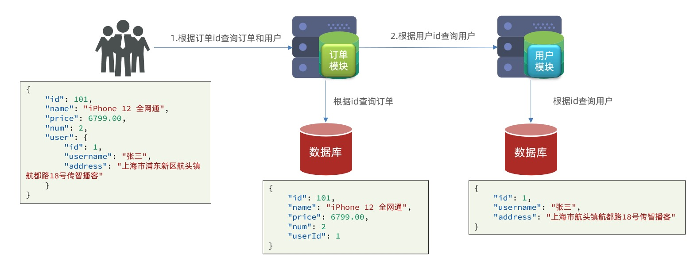

- 因此，我们需要在order-service 中向user-service 发起一个http 请求，调用`http://localhost:8081/user/{userId}` 这个接口。
- 大概步骤如下
  1. 注册一个RestTemplate 的实例到Spring 容器
  2. 修改order-service 服务中的OrderService 类中的queryOrderById 方法，根据Order 对象中的userId 查询User
  3. 将查询到的User 填充到Order 对象，一并返回

### 注册RestTemplate

- 首先我们在order-service服务中的OrderApplication启动类中，注册RestTemplate实例

  ```java
  @MapperScan("cn.itcast.order.mapper")
  @SpringBootApplication
  public class OrderApplication {
  
      public static void main(String[] args) {
          SpringApplication.run(OrderApplication.class, args);
      }
  
      @Bean
      public RestTemplate restTemplate() {
          return new RestTemplate();
      }
  }
  ```

#### 实现远程调用

- 修改order-service服务中的queryById方法

  ```java
  @Service
  public class OrderService {
  
      @Autowired
      private OrderMapper orderMapper;
      @Autowired
      private RestTemplate restTemplate;
  
      public Order queryOrderById(Long orderId) {
          // 1.查询订单
          Order order = orderMapper.findById(orderId);
          // 2. 远程查询User
          // 2.1 url地址，这里的url是写死的，后面会改进
          String url = "`http://localhost:8081/user/"` + order.getUserId();
          // 2.2 发起调用
          User user = restTemplate.getForObject(url, User.class);
          // 3. 存入order
          order.setUser(user);
          // 4.返回
          return order;
      }
  }
  ```

- 再次访问`http://localhost:8080/order/101，` 这次就能看到User数据了

  ```java
  {
  	"id": 101,
  	"price": 699900,
  	"name": "Apple 苹果 iPhone 12 ",
  	"num": 1,
  	"userId": 1,
  	"user": {
  		"id": 1,
  		"username": "柳岩",
  		"address": "湖南省衡阳市"
  	}
  }
  ```

### 提供者与消费者

- 在服务调用关系中，会有两个不同的角色
  - `服务提供者`：一次业务中，被其他微服务调用的服务（提供接口给其他微服务）
  - `服务消费者`：一次业务中，调用其他微服务的服务（调用其他微服务提供的接口）
- 但是，服务提供者与服务消费者的角色并不是绝对的，而是相对于业务而言
- 如果服务A调用了服务B，而服务B又调用的服务C，那么服务B的角色是什么？
  - 对于A调用B的业务而言：A是服务消费者，B是服务提供者
  - 对于B调用C的业务而言：B是服务消费者，C是服务提供者
- 因此服务B既可以是服务提供者，也可以是服务消费者

## Eureka注册中心

- 假如我们的服务提供者user-service提供了三个实例，占用的分别是8081、8082、8083端口
- 那我们来思考几个问题
  - `问题一`：order-service在发起远程调用的时候，该如何得知user-service实例的ip地址和端口？
  - `问题二`：有多个user-service实例地址，order-service调用时，该如何选择？
  - `问题三`：order-service如何得知某个user-service实例是否健康，是不是已经宕机？

### Eureka的结构和作用

- 这些问题都需要利用SpringCloud中的注册中心来解决，其中最广为人知的注册中心就是Eureka，其结构如下

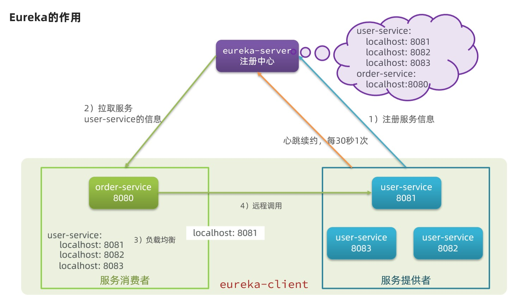

- 那么现在来回答之前的各个问题

  - 问题一：order-service如何得知user-service实例地址？

    - 获取地址信息流程如下
      1. user-service服务实例启动后，将自己的信息注册到eureka-server（Eureka服务端），这个叫服务注册
      2. eureka-server保存服务名称到服务实例地址列表的映射关系
      3. order-service根据服务名称，拉取实例地址列表，这个叫服务发现或服务拉取

  - 问题二：order-service如何从多个user-service实例中选择具体的实例？

    - order-service从实例列表中利用负载均衡算法选中一个实例地址
    - 向该实例地址发起远程调用

  - 问题三：order-service如何得知某个user-service实例是否依然健康，是不是已经宕机？

    - user-service会每隔一段时间（默认30秒）向eureka-server发起请求，报告自己的状态，成为心跳

    - 当超过一定时间没有发送心跳时，eureka-server会认为微服务实例故障，将该实例从服务列表中剔除

    - order-service拉取服务时，就能将该故障实例排除了

      注意：一个微服务，即可以是服务提供者，又可以是服务消费者，因此eureka将服务注册、服务发现等功能统一封装到了eureka-client端

- 因此，我们接下来动手实践的步骤包括
  1. 搭建注册中心
     - 搭建EurekaServer
  2. 服务注册
     - 将user-service、order-service都注册到eureka
  3. 服务发现
     - 在order-service中完成服务拉取，然后通过负载均衡挑选一个服务，实现远程调用

### 搭建eureka-server

- 首先我们注册中心服务端：eureka，这必须是一个独立的微服务

#### 创建eureka-server服务

- 在cloud-demo父工程下，创建一个子模块，这里就直接创建一个maven项目就好了，然后填写服务信息

#### 引入eureka依赖

- 引入SpringCloud为eureka提供的starter依赖：

  ```java
  <dependency>
      <groupId>org.springframework.cloud</groupId>
      <artifactId>spring-cloud-starter-netflix-eureka-server</artifactId>
  </dependency>
  ```

#### 编写启动类

- 给eureka-server服务编写一个启动类，一定要添加一个@EnableEurekaServer注解，开启eureka的注册中心功能

  ```java
  @SpringBootApplication
  @EnableEurekaServer
  public class EurekaApplication {
      public static void main(String[] args) {
          SpringApplication.run(EurekaApplication.class);
      }
  }
  ```

#### 编写配置文件

- 编写一个application.yml文件，内容如下

- 为什么也需要配置eureka的服务名称呢？

  - eureka也会将自己注册为一个服务

    ```java
    server:
      port: 10086 ## 服务端口
    spring:
      application:
        name: eureka-server ## eureka的服务名称
    eureka:
      client:
        service-url: ## eureka的地址信息
          defaultZone: http://127.0.0.1:10086/eureka
    ```

#### 启动服务

- 启动微服务，然后在浏览器访问 `http://localhost:10086/，` 看到如下结果就是成功了

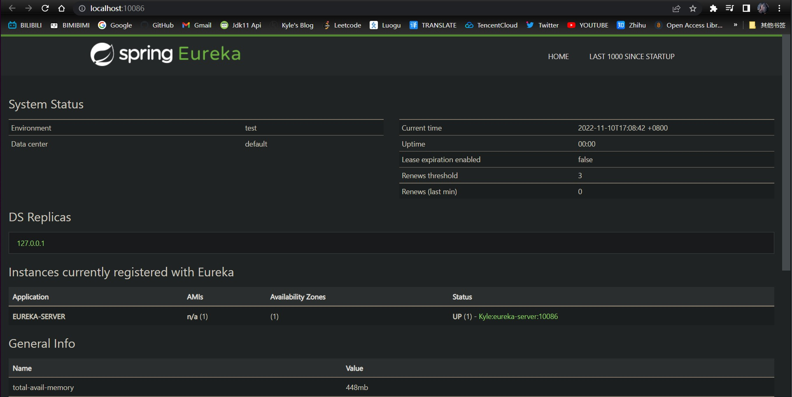

- 从图中我们也可以看出eureka确实是将自己注册为了一个服务，这里的`Kyle`是主机名，也就是127.0.0.1

  > UP (1) - Kyle:eureka-server:10086

### 服务注册

- 下面，我们将user-service注册到eureka-server中去

#### 引入依赖

- 在user-service的pom.xml文件中，引入下面的eureka-client依赖

  ```java
  <!-- eureka-client -->
  <dependency>
      <groupId>org.springframework.cloud</groupId>
      <artifactId>spring-cloud-starter-netflix-eureka-client</artifactId>
  </dependency>
  ```

#### 配置文件

- 在user-service中，修改application.yml文件，添加服务名称、eureka地址

  ```java
  spring:
    application:
      name: order-service
  eureka:
    client:
      service-url:
        defaultZone: http://127.0.0.1:10086/eureka
  ```

#### 启动多个user-service实例

- 为了演示一个服务有多个实例的场景，我们添加一个SpringBoot的启动配置，再启动一个user-service，其操作步骤就是复制一份user-service的配置，name配置为UserApplication2，同时也要配合VM选项，修改端口号`-Dserver.port=8082`，点击确定之后，在IDEA的服务选项卡中，就会出现两个user-service启动配置，一个端口是8081，一个端口是8082

- 之后我们按照相同的方法配置order-service，并将两个user-service和一个order-service都启动，然后查看eureka-server管理页面，发现服务确实都启动了，而且user-service有两个服务发现

  - 下面，我们将order-service的逻辑修改：向eureka-server拉取user-service的信息，实现服务发现

  #### 引入依赖

  - 之前说过，服务发现、服务注册统一都封装在eureka-client依赖，因此这一步与服务注册时一致

  - 在order-service的pom.xml文件中，引入eureka-client依赖

    ```java
    <dependency>
        <groupId>org.springframework.cloud</groupId>
        <artifactId>spring-cloud-starter-netflix-eureka-client</artifactId>
    </dependency>
    ```

#### 配置文件

- 服务发现也需要知道eureka地址，因此第二步与服务注册一致，都是配置eureka信息

- 在order-service中，修改application.yml文件，添加服务名称、eureka地址

  ```java
  spring:
    application:
      name: orderservice
  eureka:
    client:
      service-url:
        defaultZone: http://127.0.0.1:10086/eureka
  ```

#### 服务拉取和负载均衡

- 最后，我们要去eureka-server中拉取user-service服务的实例列表，并实现负载均衡

- 不过这些操作并不需要我们来做，是需要添加一些注解即可

- 在order-service的OrderApplication中，给RestTemplate这个Bean添加一个@LoadBalanced注解

  ```java
  @MapperScan("cn.itcast.order.mapper")
  @SpringBootApplication
  public class OrderApplication {
  
      public static void main(String[] args) {
          SpringApplication.run(OrderApplication.class, args);
      }
  
      @Bean
      @LoadBalanced
      public RestTemplate restTemplate() {
          return new RestTemplate();
      }
  }
  ```

- 修改order-service服务中的OrderService类中的queryOrderById方法，修改访问路径，用服务名来代替ip、端口

  ```java
  public Order queryOrderById(Long orderId) {
      // 1.查询订单
      Order order = orderMapper.findById(orderId);
      // 2. 远程查询User
      // 2.1 url地址，用user-service替换了localhost:8081
      String url = "http://user-service/user/" + order.getUserId();
      // 2.2 发起调用
      User user = restTemplate.getForObject(url, User.class);
      // 3. 存入order
      order.setUser(user);
      // 4.返回
      return order;
  }
  ```

- Spring会自动帮我们从eureka-server端，根据user-service这个服务名称，获取实例列表，然后完成负载均衡

### 小结

1. 搭建EurekaServer
   - 引入eureka-server依赖
   - 添加@EnableEurekaServer注解
   - 在application.yml中配置eureka地址
2. 服务注册
   - 引入eureka-client依赖
   - 在application.yml中配置eureka地址
3. 服务发现
   - 引入eureka-client依赖
   - 在application.yml中配置eureka地址
   - 在RestTemplate添加`@LoadBalanced`注解
   - 用服务提供者的服务名称远程调用

## Ribbon负载均衡

- 在这个小节，我们来说明@LoadBalanced注解是怎么实现的负载均衡功能

### 负载均衡原理

- SpringCloud底层其实是利用了一个名为Ribbon的组件，来实现负载均衡功能的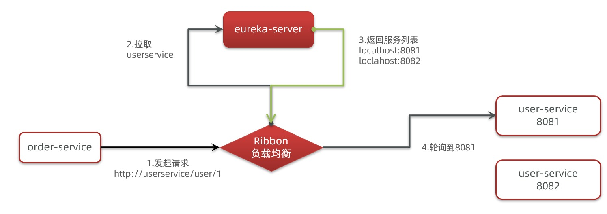

- 那么我们明明发出的请求是http://userservice/user/1， 怎么变成了`http://localhost:8080/user/1` 的呢

### 源码跟踪

- 为什么我们只输入了service名称就可以访问了呢？之前还得获取ip和端口
- 答案显然是有人帮我们根据service名称，获取到了服务实例的ip和端口。它就是LoadBalancerInterceptor，这个类会第RestTemplate的请求进行拦截，然后从Eureka根据服务id获取服务列表，随后利用负载均衡算法，得到真实的服务地址信息，替换服务id
- 那下面我们来进行源码跟踪

1. LoadBalancerInterceptor

   - 代码如下

     ```java
     public class LoadBalancerInterceptor implements ClientHttpRequestInterceptor {
         private LoadBalancerClient loadBalancer;
         private LoadBalancerRequestFactory requestFactory;
     
         public LoadBalancerInterceptor(LoadBalancerClient loadBalancer, LoadBalancerRequestFactory requestFactory) {
             this.loadBalancer = loadBalancer;
             this.requestFactory = requestFactory;
         }
     
         public LoadBalancerInterceptor(LoadBalancerClient loadBalancer) {
             this(loadBalancer, new LoadBalancerRequestFactory(loadBalancer));
         }
     
         public ClientHttpResponse intercept(final HttpRequest request, final byte[] body, final ClientHttpRequestExecution execution) throws IOException {
             URI originalUri = request.getURI();
             String serviceName = originalUri.getHost();
             Assert.state(serviceName != null, "Request URI does not contain a valid hostname: " + originalUri);
             return (ClientHttpResponse)this.loadBalancer.execute(serviceName, this.requestFactory.createRequest(request, body, execution));
         }
     }
     ```

     

   - 可以看到这里的intercept方法，拦截了用户的HTTPRequest请求，然后做了几件事

     1. request.getURI()：获取请求uri，本利中就是http://user-service/user/1
     2. originalUri.getHost()：获取uri路径的主机名，其实就是服务id，user-service
     3. this.loadBalancer.execute：处理服务id和用户请求

   - 这里的this.loadBalancer是LoadBalancerClient类型，我们继续跟入

2. LoadBalancerClient

   - 继续跟入execute方法

     ```java
     public <T> T execute(String serviceId, LoadBalancerRequest<T> request, Object hint) throws IOException {
         ILoadBalancer loadBalancer = this.getLoadBalancer(serviceId);
         Server server = this.getServer(loadBalancer, hint);
         if (server == null) {
             throw new IllegalStateException("No instances available for " + serviceId);
         } else {
             RibbonServer ribbonServer = new RibbonServer(serviceId, server, this.isSecure(server, serviceId), this.serverIntrospector(serviceId).getMetadata(server));
             return this.execute(serviceId, (ServiceInstance)ribbonServer, (LoadBalancerRequest)request);
         }
     }
     ```

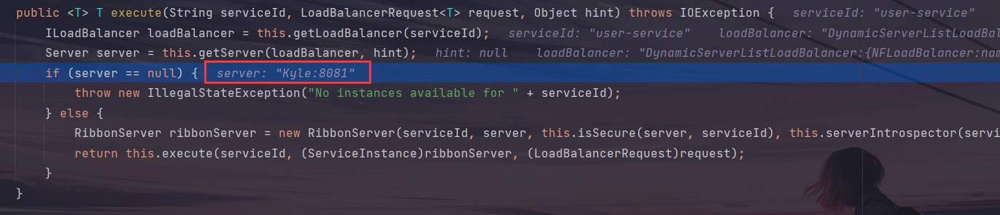

- 
- 代码是这样的
  1. getLoadBalancer(serviceId)：根据服务id获取ILoadBalancer，而ILoadBalancer会拿着服务id去eureka中获取服务列表并保存起来
  2. getServer(loadBalancer, hint)：利用内置的负载均衡算法，从服务列表中选择一个，本例中，可以看到获取到的是8081端口
- 放行后，再次访问并跟踪，这次获取到的是8082端口，果然实现了负载均衡

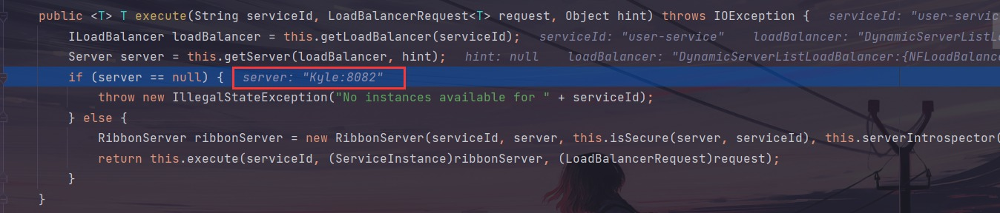

负载均衡策略IRule

- 在刚才的代码中，可以看到获取服务是通过一个getServer的方法来做负载均衡，我们继续跟入，会发现这样一段代码

  ```java
  public Server chooseServer(Object key) {
      if (this.counter == null) {
          this.counter = this.createCounter();
      }
  
      this.counter.increment();
      if (this.rule == null) {
          return null;
      } else {
          try {
              return this.rule.choose(key);
          } catch (Exception var3) {
              logger.warn("LoadBalancer [{}]:  Error choosing server for key {}", new Object[]{this.name, key, var3});
              return null;
          }
      }
  }
  ```

在try/catch代码块中，进行服务选择的是this.rule.choose(key)，那我们看看这个rule是谁

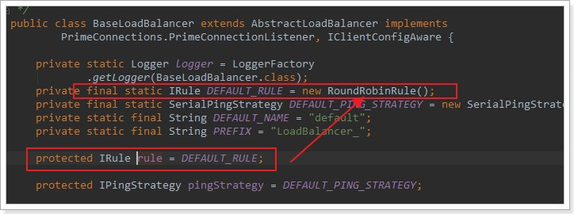

这里的rule默认值是一个RoundRobinRule，也就是轮询

那么到这里，整个负载均衡的流程我们就清楚了

**总结**

SpringCloudRibbon的底层采用了一个拦截器，拦截了RestTemplate发出的请求，对地址做了修改，用一幅图来总结一下

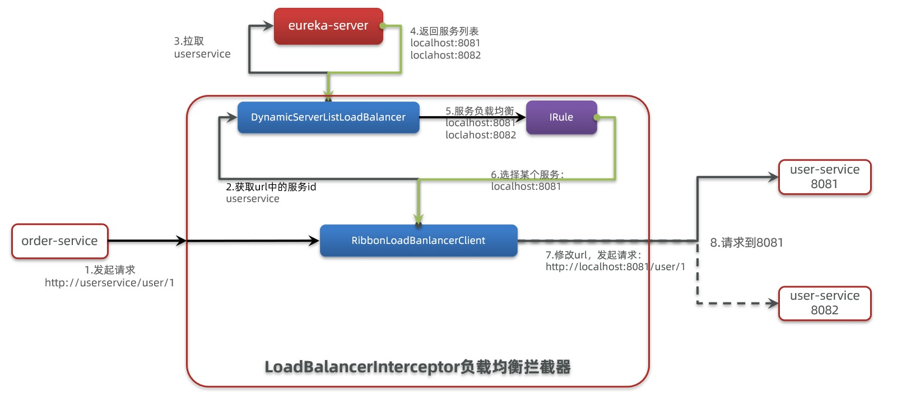

- 整个流程如下
  1. 拦截我们的RestTemplate请求：http://user-service/user/1
  2. RibbonLoadBalancerClient会从请求url中获取服务名称，也就是user-service
  3. DynamicServerListLoadBalancer根据user-service到eureka拉取服务列表
  4. eureka返回列表，localhost:8081、localhost:8082
  5. IRule利用内置负载均衡规则，从列表中选择一个，例如localhost:8081
  6. RibbonLoadBalancerClient修改请求地址，用localhost:8081替代user-service，得到`http://localhost:8081/user/1，` 发起真实请求

### 负载均衡策略

#### 负载均衡策略

- 负载均衡的规则都定义在IRule接口中，而IRule有很多不同的实现类

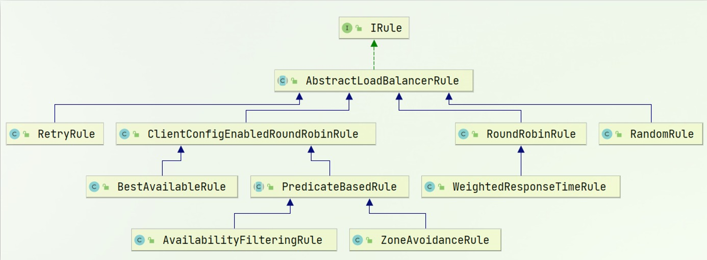

- 不同规则的含义如下

|  **内置负载均衡规则类**   |                         **规则描述**                         |
| :-----------------------: | :----------------------------------------------------------: |
|      RoundRobinRule       | 简单轮询服务列表来选择服务器。它是Ribbon默认的负载均衡规则。 |
| AvailabilityFilteringRule | 对以下两种服务器进行忽略： （1）在默认情况下，这台服务器如果3次连接失败，这台服务器就会被设置为“短路”状态。短路状态将持续30秒，如果再次连接失败，短路的持续时间就会几何级地增加。 （2）并发数过高的服务器。如果一个服务器的并发连接数过高，配置了AvailabilityFilteringRule规则的客户端也会将其忽略。并发连接数的上限，可以由客户端的..ActiveConnectionsLimit属性进行配置。 |
| WeightedResponseTimeRule  | 为每一个服务器赋予一个权重值。服务器响应时间越长，这个服务器的权重就越小。这个规则会随机选择服务器，这个权重值会影响服务器的选择。 |
|   **ZoneAvoidanceRule**   | 以区域可用的服务器为基础进行服务器的选择。使用Zone对服务器进行分类，这个Zone可以理解为一个机房、一个机架等。而后再对Zone内的多个服务做轮询。 |
|     BestAvailableRule     |       忽略那些短路的服务器，并选择并发数较低的服务器。       |
|        RandomRule         |                  随机选择一个可用的服务器。                  |
|         RetryRule         |                      重试机制的选择逻辑                      |

- 默认的实现就是ZoneAvoidanceRule，是一种轮询方案

#### 自定义负载均衡策略

- 通过定义IRule实现，可以修改负载均衡规则，有两种方式

  1. 代码方式：在order-service中的OrderApplication类中，定义一个IRule，此种方式定义的负载均衡规则，对所有微服务均有效

     ```java
     @Bean
     public IRule randomRule(){
         return new RandomRule();
     }
     ```

  2. 配置文件方式：在order-service中的application.yml文件中，添加新的配置也可以修改规则

     ```java
     user-service: ## 给某个微服务配置负载均衡规则，这里是user-service服务
       ribbon:
         NFLoadBalancerRuleClassName: com.netflix.loadbalancer.RandomRule ## 负载均衡规则 
     ```

     注意：一般使用没人的负载均衡规则，不做修改

### 饥饿加载

- Ribbon默认是采用懒加载，即第一次访问时，才回去创建LoadBalanceClient，请求时间会很长

- 而饥饿加载在则会在项目启动时创建，降低第一次访问的耗时，通过下面配置开启饥饿加载

  ```
  ribbon:
    eager-load:
      enabled: true ## 开启饥饿加载
      clients: user-service  ## 指定对user-service这个服务进行饥饿加载，可以指定多个服务
  ```

### 小结

1. Ribbon负载均衡规则

   - 规则接口是IRule
   - 默认实现是ZoneAvoidanceRule，根据zone选择服务列表，然后轮询

2. 负载均衡自定义方式

   - 代码方式：配置灵活，但修改时需要重新打包发布
   - 配置方式：直观，方便，无需重新打包发布，但是无法做全局配置（只能指定某一个微服务）

3. 饥饿加载

   - 开启饥饿加载

     ```java
     enable: true
     ```

   - 指定饥饿加载的微服务名称，可以配置多个

     ```java
     clients: 
       - user-service
       - xxx-service 
     ```

## Nacos注册中心

- 国内公司一般都推崇阿里巴巴的技术，比如注册中心，`SpringCloud Alibaba`也推出了一个名为`Nacos`的注册中心

### 认识和安装Nacos

- Nacos是阿里巴巴的产品，现在是SpringCloud中的一个组件，相比于Eureka，功能更加丰富，在国内受欢迎程度较高

- 在Nacos的GitHub页面，提供有下载链接，可以下载编译好的Nacos服务端或者源代码：

  - GitHub主页：https://github.com/alibaba/nacos
  - GitHub的Release下载页：https://github.com/alibaba/nacos/releases

- 下载好了之后，将文件解压到非中文路径下的任意目录，目录说明：

  - bin：启动脚本
  - conf：配置文件

- Nacos的默认端口是8848，如果你电脑上的其它进程占用了8848端口，请先尝试关闭该进程。

  - 如果无法关闭占用8848端口的进程，也可以进入nacos的conf目录，修改配置文件application.properties中的server.port

- Nacos的启动非常简单，进入bin目录，打开cmd窗口执行以下命令即可

  ```java
  startup.cmd -m standalone
  ```

- 之后在浏览器访问`http://localhost:8848/nacos` 即可，默认的登录账号和密码都是nacos                                                                                                                                                                                                                                                                                                                                                                                                                                                                                                                                                                                                                                                                                                                                                                                                                                                                                                                                                                                                                                                                                                                                                                                                                                                                                                                                                                                                                                                                                                                                                                                                                                                                                                                                                                                                                                                                                                                                                                                                                                                                                                                                                                                                 

### 服务注册到Nacos

- Nacos是SpringCloudAlibaba的组件，而`SpringCloud Alibaba`也遵循SpringCloud中定义的服务注册、服务发现规范。因此使用Nacos与使用Eureka对于微服务来说，并没有太大区别
- 主要差异在于
  1. 依赖不同
  2. 服务地址不同

#### 引入依赖

- 在cloud-demo父工程的pom.xml文件中引入SpringCloudAlibaba的依赖

  ```java
  <dependency>
      <groupId>com.alibaba.cloud</groupId>
      <artifactId>spring-cloud-alibaba-dependencies</artifactId>
      <version>2.2.6.RELEASE</version>
      <type>pom</type>
      <scope>import</scope>
  </dependency>
  ```

- 然后在user-service和order-service中的pom文件引入nacos-discovery依赖

  ```java
  <dependency>
      <groupId>com.alibaba.cloud</groupId>
      <artifactId>spring-cloud-starter-alibaba-nacos-discovery</artifactId>
  </dependency>
  ```

  注意：同时也要将eureka的依赖注释/删除掉

#### 配置Nacos地址

- 在user-service和order-service的application.yml中添加Nacos地址

  ```java
  spring:
    cloud:
      nacos:
        server-addr: localhost:8848
  ```

  注意：同时也要将eureka的地址注释掉

#### 重启服务

- 重启微服务后，登录nacos的管理页面，可以看到微服务信息

### 服务分级存储模型

- 一个服务可以有多个实例，例如我们的user-service，可以有
  - 127.0.0.1:8081
  - 127.0.0.1:8082
  - 127.0.0.1:8083
- 假如这些实例分布于全国各地的不同机房，例如
  - 127.0.0.1:8081，在杭州机房
  - 127.0.0.1:8082，在杭州机房
  - 127.0.0.1:8083，在上海机房
- Nacod就将在同一机房的实例，划分为一个`集群`
- 也就是说，user-service是服务，一个服务可以包含多个集群，例如在杭州，上海，每个集群下可以有多个实例，形成分级模型
- 微服务相互访问时，应该尽可能访问同集群实例，因为本地访问速度更快，房本集群内不可用时，才去访问其他集群
  - 例如：杭州机房内的order-service应该有限访问同机房的user-service，若无法访问，则去访问上海机房的user-service

#### 给user-service配置集群

- 修改user-service的application.yml文件，添加集群配置

  ```java
  spring:
    cloud:
      nacos:
        server-addr: localhost:8848
        discovery:
          cluster-name: HZ ## 集群名称，杭州
  ```

- 重启两个user-service实例

- 之后我们再复制一个user-service的启动配置，端口号设为8083，之后修改application.yml文件，将集群名称设为上海，之后启动该服务

  ```java
  spring:
    cloud:
      nacos:
        server-addr: localhost:8848
        discovery:
          cluster-name: SH ## 集群名称，上海
  ```

- 那么我们现在就启动了两个集群名称为HZ的user-service，一个集群名称为SH的user-service，在Nacos控制台看到如下结果

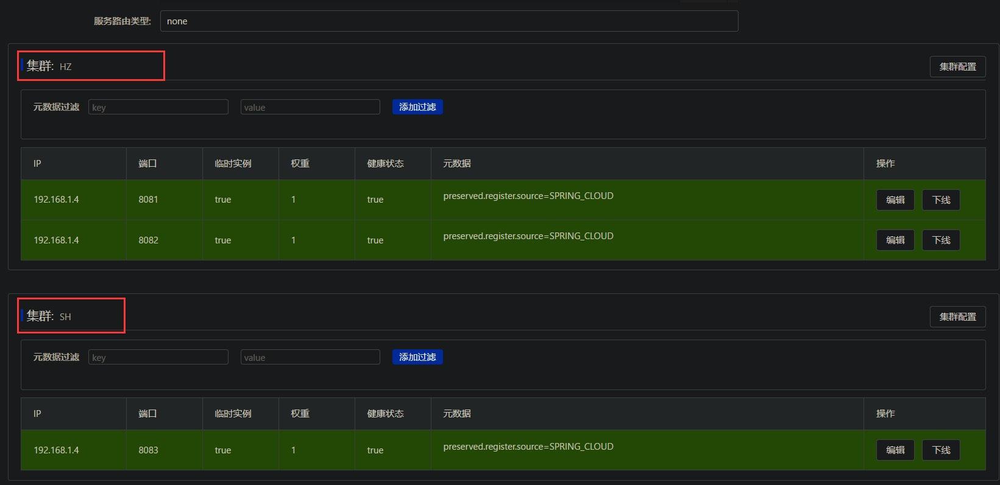

- Nacos服务分级存储模型
  1. 一级是服务，例如user-service
  2. 二级是集群，例如杭州或上海
  3. 三级是实例，例如杭州机房的某台部署了user-service的服务器
- 如何设置实例的集群属性
  - 修改application.yml文件，添加spring.cloud.nacos.discovery.cluster-name属性即可

#### 同集群优先的负载均衡

- 默认的ZoneAvoidanceRule并不能根据同集群优先来实现负载均衡

- 因此Nacos中提供了一个NacosRule的实现，可以优先从同集群中挑选实例

  1. 给order-service配置集群信息，修改其application.yml文件，将集群名称配置为HZ

     ```java
     spring:
       cloud:
         nacos:
           server-addr: localhost:8848
           discovery:
             cluster-name: HZ ## 集群名称，杭州
     ```

  2. 修改负载均衡规则

     ```java
     user-service: ## 给某个微服务配置负载均衡规则，这里是user-service服务
       ribbon:
         NFLoadBalancerRuleClassName: com.alibaba.cloud.nacos.ribbon.NacosRule ## 负载均衡规则
     ```

- 那我们现在访问`http://localhost:8080/order/101` ，同时观察三个user-service的日志输出，集群名称为HZ的两个user-service可以看到日志输出，而集群名称为SH的user-service则看不到日志输出

- 那我们现在将集群名称为HZ的两个user-service服务停掉，那么现在访问`http://localhost:8080/order/101，` 则集群名称为SH的user-service会输出日志

- NacosRule负载均衡策略

  1. 优先选择统计群服务实例列表
  2. 本地鸡群找不到提供者，才去其他集群寻找，并且会报警告
  3. 确定了可用实例列表后，再采用随机负载均衡挑选实例

### 权重配置

- 实际部署中肯定会出现这样的场景

  - 服务器设备性能由沙溢，部分实例所在的机器性能较好，而另一些较差，我么你希望性能好的机器承担更多的用户请求
  - 但默认情况下NacosRule是统计群内随机挑选，不会考虑机器性能的问题

- 因此Nacos提供了权重配置来控制访问频率，权重越大则访问频率越高

- 在Nacos控制台，找到user-service的实例列表，点击编辑，即可以修改权重

  注意：若权重修改为0，则该实例永远不会被访问
  我们可以将某个服务的权重修改为0，然后进行更新，然后也不会影响到用户的正常访问别的服务集群，之后我们可以给更新后的该服务，设置一个很小的权重，这样就会有一小部分用户来访问该服务，测试该服务是否稳定（类似于灰度测试）

### 环境隔离

- Nacos提供了namespace来实现环境隔离功能
  - nacos中可以有多个namespace
  - namespace下可以由group、service等
  - 不同的namespace之间相互隔离，例如不同的namespace的服务互相不可见

#### 创建namespace

- 默认情况下，所有的service、data、group都是在同一个namespace，名为public
- 我们点击`命名空间` -> `新建命名空间` -> `填写表单`，可以创建一个新的namespace

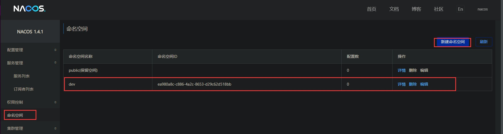


#### 给微服务配置namespace

- 给微服务配置namespace只能通过修改配置来实现

- 例如，修改order-service的application.yml文件

  ```java
  复制成功spring:
    cloud:
      nacos:
        server-addr: localhost:8848
        discovery:
          cluster-name: HZ
          namespace: ea980a8c-c886-4a2c-8653-d29c62d518bb ## 命名空间，填上图中的命名空间ID
  ```

- 重启order-service后，访问Nacos控制台，可以看到下面的结果，此时访问order-service，因为namespace不同，会导致找不到user-service，若访问`http://localhost:8080/order/101` 则会报错

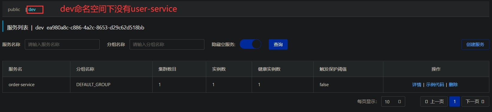

### Nacos和Eureka的区别

- Nacos的服务实例可以分为两种类型

  1. 临时实例：如果实例宕机超过一定时间，会从服务列表剔除，默认的类型
  2. 非临时实例：如果实例宕机，不会从服务列表剔除，也可以叫永久实例

- 配置一个服务实例为永久实例

  ```java
  spring:
    cloud:
      nacos:
        discovery:
          ephemeral: false ## 设置为非临时实例
  ```

- Nacos和Eureka整体结构类似，服务注册、服务拉取、心跳等待，但是也存在一些差异

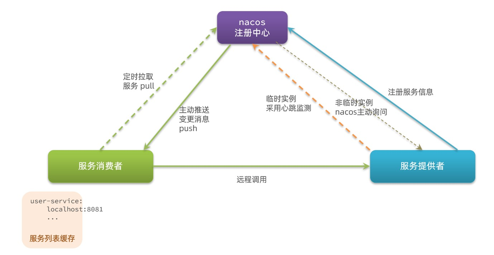

- Nacos与Eureka的共同点

  1. 都支持服务注册和服务拉取
  2. 都支持服务提供者心跳方式做健康监测，防止调用到挂掉的服务。

- Nacos与Eureka的区别

  1. Nacos支持服务端主动检测提供者状态：临时实例采用心跳模式，非临时实例采用主动检测模式（但是对服务器压力比较大，不推荐）

  2. 临时实例心跳不正常会被剔除，非临时实例则不会被剔除

  3. Nacos支持服务列表变更的消息推送模式，服务列表更新更及时

  4. Nacos集群默认采用AP方式，当急群众存在非临时实例时，采用CP模式；Eureka采用AP方式

     **AP**：优先可用性，分区时也尽量让系统能用，但数据可能“暂时不一致”。
     例：Eureka 默认就是 AP。

     **CP**：优先一致性，分区时可能拒绝服务，保证数据绝对一致。

只需要注册发现且系统较老 → Eureka；需要配置中心/动态配置/多环境隔离 → Nacos 更合适。

## Nacos配置管理

- Nacos除了可以做注册中心，同样还可以做配置管理来使用

### 统一配置管理

- 当微服务部署的实例越来越多，达到数十、数百时，诸葛修改微服务配置就会让人抓狂，而且容易出错，所以我们需要一种统一配置管理方案，可以集中管理所有实例的配置
- Nacos一方面可以将配置集中管理，另一方面可以在配置变更时，及时通知微服务，实现配置的热更新

#### 在Nacos中添加配置文件

- 如何在Nacos中管理配置呢

  - `配置列表` -> `点击右侧加号`

- 在弹出的表单中，填写配置信息

  ```java
  pattern:
    dateformat: yyyy-MM-dd HH:mm:ss
  ```

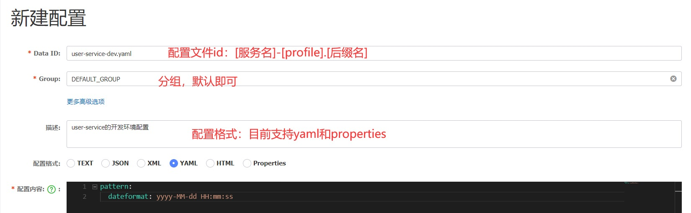

注意：只有需要热更新的配置才有放到Nacos管理的必要，基本不会变更的一些配置，还是保存到微服务本地比较好（例如数据库连接配置等）

#### 从微服务拉取配置

- 微服务要拉取Nacos中管理的配置，并且与本地的application.yml配置合并，才能完成项目启动

- 但如果上位读取application.yml，又如何得知Nacos地址呢？

- Spring引入了一种新的配置文件：bootstrap.yml文件，会在application.yml之前被读取，流程如下

  1. 项目启动
  2. 加载bootstrap.yml文件，获取Nacos地址，配置文件id
  3. 根据配置文件id，读取Nacos中的配置文件
  4. 读取本地配置文件application.yml，与Nacos拉取到的配置合并
  5. 创建Spring容器
  6. 加载bean

- 引入nacos-config依赖

  - 首先在user-service服务中，引入nacos-config的客户端依赖

    ```java
    <!--nacos配置管理依赖-->
    <dependency>
        <groupId>com.alibaba.cloud</groupId>
        <artifactId>spring-cloud-starter-alibaba-nacos-config</artifactId>
    </dependency>
    ```

- 添加bootstrap.yml

  - 然后在user-service中添加一个bootstrap.yml文件，内容如下

    ```java
    spring:
      application:
        name: user-service ## 服务名称
      profiles:
        active: dev #开发环境，这里是dev 
      cloud:
        nacos:
          server-addr: localhost:8848 ## Nacos地址
          config:
            file-extension: yaml ## 文件后缀名
    ```

- 这里会根据spring.cloud.nacos.server-addr获取Nacos地址，再根据`${spring.application.name}-${spring.profiles.active}.${spring.cloud.nacos.config.file-extension}`作为文件id，来读取配置。

- 在本例中，就是读取user-service-dev.yaml

- 测试是否真的读取到了，我们在user-service的UserController中添加业务逻辑，读取nacos中的配置信息pattern.dateformat配置

  ```java
  @Value("${pattern.dateformat}")
  private String dateformat;
  
  @GetMapping("/test")
  public String test() {
      return LocalDateTime.now().format(DateTimeFormatter.ofPattern(dateformat));
  }
  ```

- 打开浏览器，访问`http://localhost:8081/user/test，` 看到如下结果，则说明确实读取到了配置信息

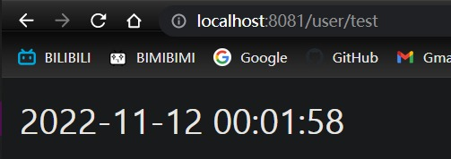

### 配置热更新

- 我们最终的目的，是修改Nacos中的配置后，微服务中无需重启即可让配置生效，也就是配置热更新
- 要实现配置热更新，可以使用两种方式

#### 方式一

- 在@Value注入的变量类上添加注解@RefreshScope（刷新作用域）

  ```java
  @Slf4j
  @RestController
  @RequestMapping("/user")
  //@RefreshScope：支持动态刷新配置（通常配合 Nacos/Config）。当配置变化并触发刷新后，dateformat 会更新
  @RefreshScope
  public class UserController {
      //@Value("${pattern.dateformat}")：从配置中心/配置文件读取 pattern.dateformat 的值，注入到 dateformat 字段。
      @Value("${pattern.dateformat}")
      private String dateformat;
  
      @GetMapping("/test")
      public String test() {
          //test()：返回当前时间，按 dateformat 指定的格式输出
          return LocalDateTime.now().format(DateTimeFormatter.ofPattern(dateformat));
      }
  }
  ```

- 测试是否热更新

  - 启动服务，打开浏览器，访问`http://localhost:8081/user/test，` 由于我们之前配置的dateformat是yyyy-MM-dd MM:hh:ss，所以看到的日期格式为`2022-11-12 22:11:03`

  - 那我们现在直接在Nacos中编辑配置信息，并保存

    ```java
    pattern:
      dateformat: yyyy年MM月dd日 HH:mm:ss
    ```

  - 无需重启服务器，直接刷新页面，看到的日期格式为`2022年11月12日 22:16:13`，说明确实是热更新

#### 方式二

- 使用@ConfigurationProperties注解代替`@Value`注解

- 在user-service服务中，添加一个类，读取pattern.dateformat属性

  ```java
  @Component
  @Data
  @ConfigurationProperties(prefix = "pattern")
  public class PatternProperties {
      private String dateformat;
  }
  ```

- - 在UserController中用这个类来代替@Value

    ```java
    @Slf4j
    @RestController
    @RequestMapping("/user")
    @RefreshScope
    public class UserController {
        @Autowired
        private PatternProperties patternProperties;
    
        @GetMapping("/test")
        public String test() {
            return LocalDateTime.now().format(DateTimeFormatter.ofPattern(patternProperties.getDateformat()));
        }
    }
    ```

  - 使用同样的方法进行测试，这里就不赘述了

- ### 配置共享

- - 其实微服务启动时，回去Nacos读取多个配置文件，例如
    - `[spring.application.name]-[spring.profiles.active].yaml`，例如：user-service-dev.yaml
    - `[spring.application.name].yaml`，例如：userservice.yaml
  - 而`[spring.application.name].yaml`不包含环境，因此可以被多个环境共享
  - 那下面我们通过案例来测试配置共享

- #### 添加一个环境共享配置

- - 我们在Nacos中添加一个Data ID为user-service.yml文件，编写的配置内容如下

    ```java
    pattern:
      envSharedValue: 多环境共享属性值
    ```

  - 修改user-service-dev.yml文件

    ```java
    pattern:
      dateformat: yyyy/MM/dd HH:mm:ss
      env: user-service开发环境配置
    ```

- #### 在user-service中读取共享配置

- - 修改我们的PatternProperties类，添加envSharedValue和env属性

    ```java
    @Component
    @Data
    @ConfigurationProperties(prefix = "pattern")
    public class PatternProperties {
        private String dateformat;
        private String envSharedValue;
        private String env;
    }
    ```

- 同时修改UserController，添加一个方法

  ```java
  @Slf4j
  @RestController
  @RequestMapping("/user")
  @RefreshScope
  public class UserController {
      @Autowired
      private PatternProperties patternProperties;
  
      @GetMapping("/prop")
      public PatternProperties prop(){
          return patternProperties;
      }
  }
  ```

- 修改UserApplication2的启动项，改变其profile值为test（改变环境），同时新建一个user-service-test.yml配置

  ```java
  pattern:
    dateformat: yyyy-MM-dd HH:mm:ss
    env: user-service测试环境配置
  ```

- 那现在，我们的UserApplication加载的是user-service-dev.yml和user-service.yml这两个配置文件

- 我们的UserApplication2加载的是user-service-test.yml和user-service.yml这两个配置文件

- 启动这两个服务，打开浏览器分别访问

  `http://localhost:8081/user/prop`

   和

  `http://localhost:8082/user/prop，看到的结果如下`

  - UserApplication（dev环境）
  - UserApplication2（test环境）

  ```java
  {
  	"dateformat": "yyyy-MM-dd HH:mm:ss",
  	"envSharedValue": "多环境共享属性值",
  	"env": "user-service测试环境配置"
  }
  ```

- 可以看出，不管是dev还是test环境，都读取到了envSharedValue这个属性的值，且dev和test也都有自己特有的属性值

#### 配置共享的优先级

- 当Nacos、服务笨蛋同时出现相同属性时，优先级也有高低之分
- 服务名-profile.yaml > 服务名.yaml > 本地配置
  - user-service-dev.yaml > user-service.yaml > application.yaml

### 搭建Nacos集群

#### 集群结构图

- Nacos生产环境下一定要部署为集群状态
- 官方给出的Nacos集群图

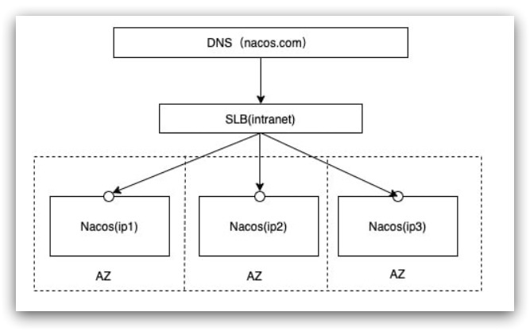

其中包含3个Nacos节点，然后一个负载均衡器代理3个Nacos。这里的负载均衡器可以使用Nginx。

我们计划的集群结构
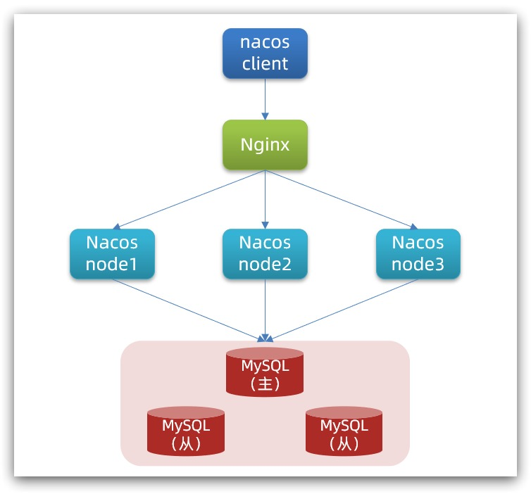

#### 搭建集群

- 搭建集群的基本步骤

  1. 搭建数据库，初始化数据库表结构

     ```java
     CREATE DATABASE IF NOT EXISTS nacos_config;
     USE nacos_config;
     CREATE TABLE `config_info` (
     `id` BIGINT(20) NOT NULL AUTO_INCREMENT COMMENT 'id',
     `data_id` VARCHAR(255) NOT NULL COMMENT 'data_id',
     `group_id` VARCHAR(255) DEFAULT NULL,
     `content` LONGTEXT NOT NULL COMMENT 'content',
     `md5` VARCHAR(32) DEFAULT NULL COMMENT 'md5',
     `gmt_create` DATETIME NOT NULL DEFAULT CURRENT_TIMESTAMP COMMENT '创建时间',
     `gmt_modified` DATETIME NOT NULL DEFAULT CURRENT_TIMESTAMP COMMENT '修改时间',
     `src_user` TEXT COMMENT 'source user',
     `src_ip` VARCHAR(50) DEFAULT NULL COMMENT 'source ip',
     `app_name` VARCHAR(128) DEFAULT NULL,
     `tenant_id` VARCHAR(128) DEFAULT '' COMMENT '租户字段',
     `c_desc` VARCHAR(256) DEFAULT NULL,
     `c_use` VARCHAR(64) DEFAULT NULL,
     `effect` VARCHAR(64) DEFAULT NULL,
     `type` VARCHAR(64) DEFAULT NULL,
     `c_schema` TEXT,
     PRIMARY KEY (`id`),
     UNIQUE KEY `uk_configinfo_datagrouptenant` (`data_id`,`group_id`,`tenant_id`)
     ) ENGINE=INNODB DEFAULT CHARSET=utf8 COLLATE=utf8_bin COMMENT='config_info';
     
     /******************************************/
     /*   数据库全名 = nacos_config   */
     /*   表名称 = config_info_aggr   */
     /******************************************/
     CREATE TABLE `config_info_aggr` (
     `id` BIGINT(20) NOT NULL AUTO_INCREMENT COMMENT 'id',
     `data_id` VARCHAR(255) NOT NULL COMMENT 'data_id',
     `group_id` VARCHAR(255) NOT NULL COMMENT 'group_id',
     `datum_id` VARCHAR(255) NOT NULL COMMENT 'datum_id',
     `content` LONGTEXT NOT NULL COMMENT '内容',
     `gmt_modified` DATETIME NOT NULL COMMENT '修改时间',
     `app_name` VARCHAR(128) DEFAULT NULL,
     `tenant_id` VARCHAR(128) DEFAULT '' COMMENT '租户字段',
     PRIMARY KEY (`id`),
     UNIQUE KEY `uk_configinfoaggr_datagrouptenantdatum` (`data_id`,`group_id`,`tenant_id`,`datum_id`)
     ) ENGINE=INNODB DEFAULT CHARSET=utf8 COLLATE=utf8_bin COMMENT='增加租户字段';
     
     
     /******************************************/
     /*   数据库全名 = nacos_config   */
     /*   表名称 = config_info_beta   */
     /******************************************/
     CREATE TABLE `config_info_beta` (
     `id` BIGINT(20) NOT NULL AUTO_INCREMENT COMMENT 'id',
     `data_id` VARCHAR(255) NOT NULL COMMENT 'data_id',
     `group_id` VARCHAR(128) NOT NULL COMMENT 'group_id',
     `app_name` VARCHAR(128) DEFAULT NULL COMMENT 'app_name',
     `content` LONGTEXT NOT NULL COMMENT 'content',
     `beta_ips` VARCHAR(1024) DEFAULT NULL COMMENT 'betaIps',
     `md5` VARCHAR(32) DEFAULT NULL COMMENT 'md5',
     `gmt_create` DATETIME NOT NULL DEFAULT CURRENT_TIMESTAMP COMMENT '创建时间',
     `gmt_modified` DATETIME NOT NULL DEFAULT CURRENT_TIMESTAMP COMMENT '修改时间',
     `src_user` TEXT COMMENT 'source user',
     `src_ip` VARCHAR(50) DEFAULT NULL COMMENT 'source ip',
     `tenant_id` VARCHAR(128) DEFAULT '' COMMENT '租户字段',
     PRIMARY KEY (`id`),
     UNIQUE KEY `uk_configinfobeta_datagrouptenant` (`data_id`,`group_id`,`tenant_id`)
     ) ENGINE=INNODB DEFAULT CHARSET=utf8 COLLATE=utf8_bin COMMENT='config_info_beta';
     
     /******************************************/
     /*   数据库全名 = nacos_config   */
     /*   表名称 = config_info_tag   */
     /******************************************/
     CREATE TABLE `config_info_tag` (
     `id` BIGINT(20) NOT NULL AUTO_INCREMENT COMMENT 'id',
     `data_id` VARCHAR(255) NOT NULL COMMENT 'data_id',
     `group_id` VARCHAR(128) NOT NULL COMMENT 'group_id',
     `tenant_id` VARCHAR(128) DEFAULT '' COMMENT 'tenant_id',
     `tag_id` VARCHAR(128) NOT NULL COMMENT 'tag_id',
     `app_name` VARCHAR(128) DEFAULT NULL COMMENT 'app_name',
     `content` LONGTEXT NOT NULL COMMENT 'content',
     `md5` VARCHAR(32) DEFAULT NULL COMMENT 'md5',
     `gmt_create` DATETIME NOT NULL DEFAULT CURRENT_TIMESTAMP COMMENT '创建时间',
     `gmt_modified` DATETIME NOT NULL DEFAULT CURRENT_TIMESTAMP COMMENT '修改时间',
     `src_user` TEXT COMMENT 'source user',
     `src_ip` VARCHAR(50) DEFAULT NULL COMMENT 'source ip',
     PRIMARY KEY (`id`),
     UNIQUE KEY `uk_configinfotag_datagrouptenanttag` (`data_id`,`group_id`,`tenant_id`,`tag_id`)
     ) ENGINE=INNODB DEFAULT CHARSET=utf8 COLLATE=utf8_bin COMMENT='config_info_tag';
     
     /******************************************/
     /*   数据库全名 = nacos_config   */
     /*   表名称 = config_tags_relation   */
     /******************************************/
     CREATE TABLE `config_tags_relation` (
     `id` BIGINT(20) NOT NULL COMMENT 'id',
     `tag_name` VARCHAR(128) NOT NULL COMMENT 'tag_name',
     `tag_type` VARCHAR(64) DEFAULT NULL COMMENT 'tag_type',
     `data_id` VARCHAR(255) NOT NULL COMMENT 'data_id',
     `group_id` VARCHAR(128) NOT NULL COMMENT 'group_id',
     `tenant_id` VARCHAR(128) DEFAULT '' COMMENT 'tenant_id',
     `nid` BIGINT(20) NOT NULL AUTO_INCREMENT,
     PRIMARY KEY (`nid`),
     UNIQUE KEY `uk_configtagrelation_configidtag` (`id`,`tag_name`,`tag_type`),
     KEY `idx_tenant_id` (`tenant_id`)
     ) ENGINE=INNODB DEFAULT CHARSET=utf8 COLLATE=utf8_bin COMMENT='config_tag_relation';
     
     /******************************************/
     /*   数据库全名 = nacos_config   */
     /*   表名称 = group_capacity   */
     /******************************************/
     CREATE TABLE `group_capacity` (
     `id` BIGINT(20) UNSIGNED NOT NULL AUTO_INCREMENT COMMENT '主键ID',
     `group_id` VARCHAR(128) NOT NULL DEFAULT '' COMMENT 'Group ID，空字符表示整个集群',
     `quota` INT(10) UNSIGNED NOT NULL DEFAULT '0' COMMENT '配额，0表示使用默认值',
     `usage` INT(10) UNSIGNED NOT NULL DEFAULT '0' COMMENT '使用量',
     `max_size` INT(10) UNSIGNED NOT NULL DEFAULT '0' COMMENT '单个配置大小上限，单位为字节，0表示使用默认值',
     `max_aggr_count` INT(10) UNSIGNED NOT NULL DEFAULT '0' COMMENT '聚合子配置最大个数，，0表示使用默认值',
     `max_aggr_size` INT(10) UNSIGNED NOT NULL DEFAULT '0' COMMENT '单个聚合数据的子配置大小上限，单位为字节，0表示使用默认值',
     `max_history_count` INT(10) UNSIGNED NOT NULL DEFAULT '0' COMMENT '最大变更历史数量',
     `gmt_create` DATETIME NOT NULL DEFAULT CURRENT_TIMESTAMP COMMENT '创建时间',
     `gmt_modified` DATETIME NOT NULL DEFAULT CURRENT_TIMESTAMP COMMENT '修改时间',
     PRIMARY KEY (`id`),
     UNIQUE KEY `uk_group_id` (`group_id`)
     ) ENGINE=INNODB DEFAULT CHARSET=utf8 COLLATE=utf8_bin COMMENT='集群、各Group容量信息表';
     
     /******************************************/
     /*   数据库全名 = nacos_config   */
     /*   表名称 = his_config_info   */
     /******************************************/
     CREATE TABLE `his_config_info` (
     `id` BIGINT(64) UNSIGNED NOT NULL,
     `nid` BIGINT(20) UNSIGNED NOT NULL AUTO_INCREMENT,
     `data_id` VARCHAR(255) NOT NULL,
     `group_id` VARCHAR(128) NOT NULL,
     `app_name` VARCHAR(128) DEFAULT NULL COMMENT 'app_name',
     `content` LONGTEXT NOT NULL,
     `md5` VARCHAR(32) DEFAULT NULL,
     `gmt_create` DATETIME NOT NULL DEFAULT CURRENT_TIMESTAMP,
     `gmt_modified` DATETIME NOT NULL DEFAULT CURRENT_TIMESTAMP,
     `src_user` TEXT,
     `src_ip` VARCHAR(50) DEFAULT NULL,
     `op_type` CHAR(10) DEFAULT NULL,
     `tenant_id` VARCHAR(128) DEFAULT '' COMMENT '租户字段',
     PRIMARY KEY (`nid`),
     KEY `idx_gmt_create` (`gmt_create`),
     KEY `idx_gmt_modified` (`gmt_modified`),
     KEY `idx_did` (`data_id`)
     ) ENGINE=INNODB DEFAULT CHARSET=utf8 COLLATE=utf8_bin COMMENT='多租户改造';
     
     
     /******************************************/
     /*   数据库全名 = nacos_config   */
     /*   表名称 = tenant_capacity   */
     /******************************************/
     CREATE TABLE `tenant_capacity` (
     `id` BIGINT(20) UNSIGNED NOT NULL AUTO_INCREMENT COMMENT '主键ID',
     `tenant_id` VARCHAR(128) NOT NULL DEFAULT '' COMMENT 'Tenant ID',
     `quota` INT(10) UNSIGNED NOT NULL DEFAULT '0' COMMENT '配额，0表示使用默认值',
     `usage` INT(10) UNSIGNED NOT NULL DEFAULT '0' COMMENT '使用量',
     `max_size` INT(10) UNSIGNED NOT NULL DEFAULT '0' COMMENT '单个配置大小上限，单位为字节，0表示使用默认值',
     `max_aggr_count` INT(10) UNSIGNED NOT NULL DEFAULT '0' COMMENT '聚合子配置最大个数',
     `max_aggr_size` INT(10) UNSIGNED NOT NULL DEFAULT '0' COMMENT '单个聚合数据的子配置大小上限，单位为字节，0表示使用默认值',
     `max_history_count` INT(10) UNSIGNED NOT NULL DEFAULT '0' COMMENT '最大变更历史数量',
     `gmt_create` DATETIME NOT NULL DEFAULT CURRENT_TIMESTAMP COMMENT '创建时间',
     `gmt_modified` DATETIME NOT NULL DEFAULT CURRENT_TIMESTAMP COMMENT '修改时间',
     PRIMARY KEY (`id`),
     UNIQUE KEY `uk_tenant_id` (`tenant_id`)
     ) ENGINE=INNODB DEFAULT CHARSET=utf8 COLLATE=utf8_bin COMMENT='租户容量信息表';
     
     
     CREATE TABLE `tenant_info` (
     `id` BIGINT(20) NOT NULL AUTO_INCREMENT COMMENT 'id',
     `kp` VARCHAR(128) NOT NULL COMMENT 'kp',
     `tenant_id` VARCHAR(128) DEFAULT '' COMMENT 'tenant_id',
     `tenant_name` VARCHAR(128) DEFAULT '' COMMENT 'tenant_name',
     `tenant_desc` VARCHAR(256) DEFAULT NULL COMMENT 'tenant_desc',
     `create_source` VARCHAR(32) DEFAULT NULL COMMENT 'create_source',
     `gmt_create` BIGINT(20) NOT NULL COMMENT '创建时间',
     `gmt_modified` BIGINT(20) NOT NULL COMMENT '修改时间',
     PRIMARY KEY (`id`),
     UNIQUE KEY `uk_tenant_info_kptenantid` (`kp`,`tenant_id`),
     KEY `idx_tenant_id` (`tenant_id`)
     ) ENGINE=INNODB DEFAULT CHARSET=utf8 COLLATE=utf8_bin COMMENT='tenant_info';
     
     CREATE TABLE `users` (
     `username` VARCHAR(50) NOT NULL PRIMARY KEY,
     `password` VARCHAR(500) NOT NULL,
     `enabled` BOOLEAN NOT NULL
     );
     
     CREATE TABLE `roles` (
     `username` VARCHAR(50) NOT NULL,
     `role` VARCHAR(50) NOT NULL,
     UNIQUE INDEX `idx_user_role` (`username` ASC, `role` ASC) USING BTREE
     );
     
     CREATE TABLE `permissions` (
     `role` VARCHAR(50) NOT NULL,
     `resource` VARCHAR(255) NOT NULL,
     `action` VARCHAR(8) NOT NULL,
     UNIQUE INDEX `uk_role_permission` (`role`,`resource`,`action`) USING BTREE
     );
     
     INSERT INTO users (username, PASSWORD, enabled) VALUES ('nacos', '$2a$10$EuWPZHzz32dJN7jexM34MOeYirDdFAZm2kuWj7VEOJhhZkDrxfvUu', TRUE);
     
     INSERT INTO roles (username, role) VALUES ('nacos', 'ROLE_ADMIN');
     ```

1. 配置Nacos

   - 我们进入Nacos（官方文件解压后的Nacos）的conf目录，修改配置文件cluster.conf.example，重命名为cluster.conf，然后添加内容，如果后面启动报错了，就把这里的127.0.0.1换成本机真实IP

     ```java
     127.0.0.1:8845
     127.0.0.1:8846
     127.0.0.1:8847
     ```

   - 然后修改application.properties文件，添加数据库配置

     ```java
     spring.datasource.platform=mysql
     
     db.num=1
     
     db.url.0=jdbc:mysql://127.0.0.1:3306/nacos_config?characterEncoding=utf8&connectTimeout=1000&socketTimeout=3000&autoReconnect=true&useUnicode=true&useSSL=false&serverTimezone=UTC
     db.user.0=root
     db.password.0=root
     ```

2. 启动Nacos集群

   - 将nacos文件夹复制3份，分别命名为：nacos1、nacos2、nacos3

   - 然后分别修改这三个文件夹中的application.properties

     - nacos1

       ```java
       server.port=8845
       ```

     - nacos2

       ```java
       server.port=8846
       ```

     - nacos3

       ```java
       server.port=8847
       ```

Nginx反向代理

- 修改conf/nginx.conf文件，将下面的配置粘贴到http块中

  ```java
  upstream nacos-cluster {
      server 127.0.0.1:8845;
      server 127.0.0.1:8846;
      server 127.0.0.1:8847;
  }
  
  server {
      listen       80;
      server_name  localhost;
  
      location /nacos {
          proxy_pass http://nacos-cluster;
      }
  }
  ```

启动nginx，然后在浏览器访问http://localhost/nacos 即可

同时将bootstrap.yml中的Nacos地址修改为localhost:80，user-service和order-service中都改

```java
spring:
  cloud:
    nacos:
      server-addr: localhost:80 ## Nacos地址
```

重启服务，在Nacos中可以看到管理的服务

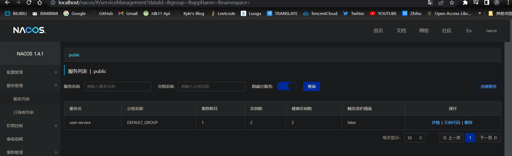

若报错，请将前面的127.0.0.1换成本机ip，例如192.168.1.7这种的

## Feign远程调用

- 先来看看我们以前利用RestTemplate发起远程调用的代码

  ```java
  String url = "http://user-service/user/" + order.getUserId();
  User user = restTemplate.getForObject(url, User.class);
  ```

- 存在以下问题：

  1. 代码可读性差，编程体验不统一
  2. 参数复杂的URL难以维护（百度随便搜一个中文名词，然后看一下url有多长，有多少参数）

- 我们可以利用Feign来解决上面提到的问题

- Feign是一个声明式的http客户端，官网地址https://github.com/OpenFeign/feign， 其作用就是帮助我们优雅的实现http请求的发送

### Feign替代RestTemplate

- Feign的使用步骤如下

  1. 引入依赖

     - 我们在order-service服务的pom文件中引入Feign的依赖

       ```java
       <dependency>
           <groupId>org.springframework.cloud</groupId>
           <artifactId>spring-cloud-starter-openfeign</artifactId>
       </dependency>
       ```

  2. 添加注解

     - 在order-service的启动类上添加`@EnableFeignClients`注解，开启Feign的功能

  3. 编写Feign客户端

     - 在order-service中新建com.itcast.order.client包，然后新建一个接口，内容如下

       ```java
       @FeignClient("user-service")
       public interface UserClient {
           @GetMapping("/user/{id}")
           User findById(@PathVariable("id") Long id);
       }
       ```

     - 这个客户端主要是基于SpringMVC的注解来声明远程调用的信息，比如

       1. 服务名称：user-service
       2. 请求方式：GET
       3. 请求路径：/user/{id}
       4. 请求参数：Long id
       5. 返回值类型：User

     - 这样，Feign就可以帮助我们发送http请求，无需自己使用RestTemplate来发送了

测试

- 修改order-service中的OrderService类中的queryOrderById方法，使用Feign客户端代替RestTemplate

DIFF

```java
@Service
public class OrderService {
    @Autowired
    private OrderMapper orderMapper;
-   @Autowired
-   private RestTemplate restTemplate;
+   @Autowired
+   private UserClient userClient;

    public Order queryOrderById(Long orderId) {
        Order order = orderMapper.findById(orderId);
-       String url = "http://user-service/user/" + order.getUserId();
-       User user = restTemplate.getForObject(url, User.class);
+       User user = userClient.findById(order.getUserId());
        order.setUser(user);
        return order;
    }
}
```

修改后的代码相较于之前，就显得优雅多了

```java
@Service
public class OrderService {
    @Autowired
    private OrderMapper orderMapper;
    @Autowired
    private UserClient userClient;

    public Order queryOrderById(Long orderId) {
        // 1. 查询订单
        Order order = orderMapper.findById(orderId);
        // 2. 利用Feign发起http请求，查询用户
        User user = userClient.findById(order.getUserId());
        // 3. 封账user到order
        order.setUser(user);
        // 4. 返回
        return order;
    }
}
```

总结

- 使用Feign的步骤
  1. 引入依赖
  2. 主启动类添加@EnableFeignClients注解
  3. 编写FeignClient接口
  4. 使用FeignClient中定义的方法替代RestTemplate

### 自定义配置

- Feign可以支持很多的自定义配置，如下表所示

|        类型         |       作用       |                          说明                          |
| :-----------------: | :--------------: | :----------------------------------------------------: |
| feign.Logger.Level  |   修改日志级别   |     包含四种不同的级别：NONE、BASIC、HEADERS、FULL     |
| feign.codec.Decoder | 响应结果的解析器 | http远程调用的结果做解析，例如解析json字符串为java对象 |
| feign.codec.Encoder |   请求参数编码   |          将请求参数编码，便于通过http请求发送          |
|   feign. Contract   |  支持的注解格式  |                 默认是SpringMVC的注解                  |
|   feign. Retryer    |   失败重试机制   | 请求失败的重试机制，默认是没有，不过会使用Ribbon的重试 |

- 一般情况下，默认值就能满足我们的使用，如果需要自定义，只需要创建自定义的@Bean覆盖默认的Bean即可，下面以日志为例来演示如何自定义配置

#### 配置文件方式

- 基于配置文件修改Feign的日志级别可以针对单个服务

  ```java
  feign:  
    client:
      config: 
        userservice: ## 针对某个微服务的配置
          loggerLevel: FULL ##  日志级别
  ```

- 也可以针对所有服务

  ```java
  feign:  
    client:
      config: 
        default: ## 这里用default就是全局配置，如果是写服务名称，则是针对某个微服务的配置
          loggerLevel: FULL ##  日志级别 
  ```

- 而日志的级别分为四种

  1. NONE：不记录任何日志信息，这是默认值
  2. BASIC：仅记录请求的方法，URL以及响应状态码和执行时间
  3. HEADERS：在BASIC的基础上，额外记录了请求和响应头的信息
  4. FULL：记录所有请求和响应的明细，包括头信息、请求体、元数据

#### Java代码方式

- 也可以基于Java代码修改日志级别，先声明一个类，然后声明一个Logger.Level的对象

  ```java
  public class DefaultFeignConfiguration {
      @Bean
      public Logger.Level feignLogLevel(){
          return Logger.Level.BASIC; //日志级别设置为 BASIC
      }
  }
  ```

- 如果要全局生效，将其放到启动类的@EnableFeignClients这个注解中

  ```java
  @EnableFeignClients(defaultConfiguration = DefaultFeignConfiguration.class)
  ```

- 如果是局部生效，则把它放到对应的@FeignClient注解中

  ```java
  @FeignClient(value = "user-service", configuration = DefaultFeignConfiguration.class)
  ```

### Feign使用优化

- Feign底层发起http请求，依赖于其他框架，其底层客户端实现包括

  1. URLConnection：默认实现，不支持连接池
  2. Apache HttpClient：支持连接池
  3. OKHttp：支持连接池

- 因此提高Frign的性能主要手段就是使用连接池，代替默认的URLConnection

- 这里我们使用Apache的HttpClient来演示

  1. 引入依赖

     - 在order-service的pom文件中引入Apache的HttpClient依赖

       ```java
       <!--httpClient的依赖 -->
       <dependency>
           <groupId>io.github.openfeign</groupId>
           <artifactId>feign-httpclient</artifactId>
       </dependency>
       ```

  2. 配置连接池

     - 在order-service的application.yml中添加配置

       ```java
       feign:
         client:
           config:
             default: ## default全局的配置
               logger-level: BASIC ## 日志级别，BASIC就是基本的请求和响应信息
         httpclient:
           enabled: true ## 开启feign对HttpClient的支持
           max-connections: 200 ## 最大的连接数
           max-connections-per-route: 50 ## 每个路径的最大连接数
       ```

- 小结，Feign的优化

  1. 日志级别尽量使用BASIC
  2. 使用HttpClient或OKHttp代替URLConnection
     - 引入feign-httpclient依赖
     - 配置文件中开启httpclient功能，设置连接池参数

### 最佳实践

- 所谓最佳实践，就是使用过程中总结的经验，最好的一种使用方式

- 仔细观察发现，Feign的客户端与服务提供者的controller代码十分相似**Feign**

  ```java
  @FeignClient(value = "user-service",configuration = DefaultFeignConfiguration.class)
  public interface UserClient {
      @GetMapping("/user/{id}")
      User findById(@PathVariable("id") Long id);
  }
  ```

**Controller**

```
@RestController
@RequestMapping("/user")
@RefreshScope
public class UserController {
    @Autowired
    private UserService userService;

    @GetMapping("/{id}")
    public User queryById(@PathVariable("id") Long id) {
        return userService.queryById(id);
    }
}
```

- 除了方法名，其余代码几乎一模一样，那有没有一种方法简化这种重复的代码编写呢？

#### 继承方式

- 这两部分相同的代码，可以通过继承来共享

  1. 定义一个API接口，利用定义方法，并基于SpringMVC注解做声明

     ```java
     public interface UserAPI{
         @GetMapping("/user/{id}")
         User findById(@PathVariable("id") Long id); 
     }
     ```

  2. Feign客户端和Controller都继承该接口

     Feign客户端

     

     ```java
     @FeignClient(value = "user-service")
     public interface UserClient extends UserAPI{}
     ```

​                Controller

​             

```java
@RestController
public class UserController implents UserAPI{
    public User findById(@PathVariable("id") Long id){
        // ...实现业务逻辑
    }
}
```


- 优点
  1. 简单
  2. 实现了代码共享
- 缺点
  1. 服务提供方、服务消费方紧耦合
  2. 参数列表中的注解映射并不会继承，所以Controller中必须再次声明方法、参数列表、注解

#### 抽取方式

- 将Feign的Client抽取为独立模块，并且把接口有关的POJO、默认的Feign配置都放到这个模块中，提供给所有消费者使用
- 例如，将UserClient、User、Feign的默认配置都抽取到一个feign-api包中，所有微服务引用该依赖包，即可直接使用

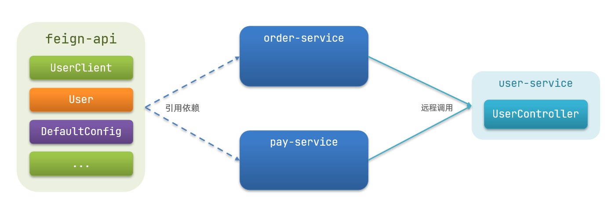

#### 实现基于抽取的最佳实践

1. 抽取

   - 首先创建一个新的module，命名为feign-api，然后在pom文件中引入feign的starter依赖

     ```java
     <dependency>
         <groupId>org.springframework.cloud</groupId>
         <artifactId>spring-cloud-starter-openfeign</artifactId>
     </dependency>
     ```

然后将order-service中编写的UserClient、User、DefaultFeignConfiguration都复制到feign-api项目中

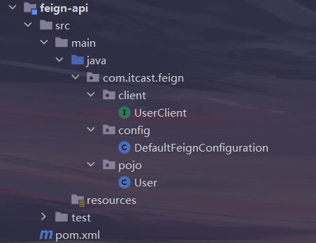

1. 在order-service中使用feign-api

   - 首先，将order-service中的UserClient、User、DefaultFeignConfiguration等类或接口删除掉

   - 然后在order-service中的pom文件中引入我们自己编写的feign-api依赖

     ```java
     <dependency>
         <groupId>cn.itcast.demo</groupId>
         <artifactId>feign-api</artifactId>
         <version>1.0</version>
     </dependency>
     ```

   - 接着修改order-service中涉及到以上三个组件的代码爆红部分

2. 解决包扫描问题

- 现在UserClient在cn.itcast.feign.clients包下，而order-service的@EnableFeignClients注解是在cn.itcast.order包下，不在同一个包，无法扫描到UserClient

  - 方式一：指定Feign应该扫描的包

    ```java
    @EnableFeignClients(basePackages = "cn.itcast.feign.clients")
    ```

  - 方式二：指定需要加载的Client接口

    ```java
    @EnableFeignClients(clients = {UserClient.class})
    ```

## Gateway服务网关

- SpringCloudGateway是SpringCloud的一个全新项目，该项目是基于Spring 5.0，SpringBoot2.0和ProjectReactor等响应式办成和事件流技术开发的网关，它旨在为微服务框架提供一种简单有效的统一的API路由管理方式

### 为什么需要网关

- Gateway网关是我们服务的守门神，是所有微服务的统一入口
- 网关的核心功能特性
  1. 请求路由
  2. 权限控制
  3. 限流
- 架构图如下

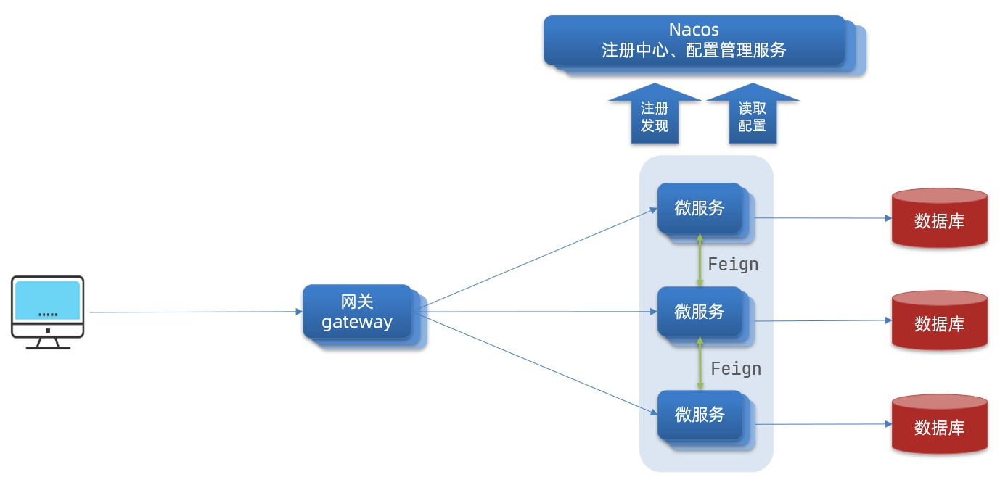


1. - 路由和负载均衡：一切请求都必须先经过gateway，但网关不处理业务，而是根据某种规则，把请求转发到某个微服务，这个过程叫路由。当然路由的目标服务有多个时，还需要做负载均衡
   - 权限控制：网关作为微服务的入口，需要校验用户是否有请求资格，如果没有则拦截
   - 限流：当请求量过高时，在网关中按照微服务能够接受的速度来放行请求，避免服务压力过大
   - 在SpringCloud中网关的实现包括两种
     1. gateway
     2. zuul
   - Zuul是基于Servlet的实现，属于阻塞式编程。而SpringCloudGateway则是基于Spring5中提供的WebFlux，属于响应式编程的实现，具备更好的性能


1. ### gateway快速入门

2. - 下面，我们就来演示一下网关的基本路由功能，基本步骤如下

     创建SpringBoot工程gateway，引入网关依赖

     创建一个maven工程就行，引入依赖如下

     ```java
     <!--网关-->
     <dependency>
         <groupId>org.springframework.cloud</groupId>
         <artifactId>spring-cloud-starter-gateway</artifactId>
     </dependency>
     <!--nacos服务发现依赖-->
     <dependency>
         <groupId>com.alibaba.cloud</groupId>
         <artifactId>spring-cloud-starter-alibaba-nacos-discovery</artifactId>
     </dependency>
     ```

     编写启动类

     ```java
     @SpringBootApplication
     public class GatewayApplication {
         public static void main(String[] args) {
             SpringApplication.run(GatewayApplication.class,args);
         }
     }
     ```

编写基础配置和路由规则

编写基础配置和路由规则

```java
server:
  port: 10010 ## 网关端口
spring:
  application:
    name: gateway ## 服务名称
  cloud:
    nacos:
      server-addr: localhost:80 ## nacos地址（我这里还是用的nginx反向代理，你们可以启动一个单体的nacos，用8848端口）
    gateway:
      routes:
        - id: user-service ## 路由id，自定义，只需要唯一即可
          uri: lb://user-service ## 路由的目标地址，lb表示负载均衡，后面跟服务名称
          ## uri: `http://localhost:8081` ## 路由的目标地址，http就是固定地址
          predicates: ## 路由断言，也就是判断请求是否符合路由规则的条件
            - Path=/user/** ## 这个是按照路径匹配，只要是以/user开头的，就符合规则
        - id: order-service ## 按照上面的写法，再配置一下order-service
          uri: lb://order-service 
          predicates: 
            - Path=/order/** 
```

启动网关服务进行测试

- 重启网关，访问

  `http://localhost:10010/user/1时，符合/user/**规则，请求转发到`

  http://user-service/user/1，结果如下

  ```java
  {
      "id": 1,
      "username": "柳岩",
      "address": "湖南省衡阳市"
  }
  ```

- 访问

  `http://localhost:10010/order/101时，符合/order/**规则，请求转发到`

  http://order-service/order/101，结果如下

  ```java
  {
      "id": 101,
      "price": 699900,
      "name": "Apple 苹果 iPhone 12 ",
      "num": 1,
      "userId": 1,
      "user": {
          "id": 1,
          "username": "柳岩",
          "address": "湖南省衡阳市"
      }
  }
  ```

网关路由的流程图

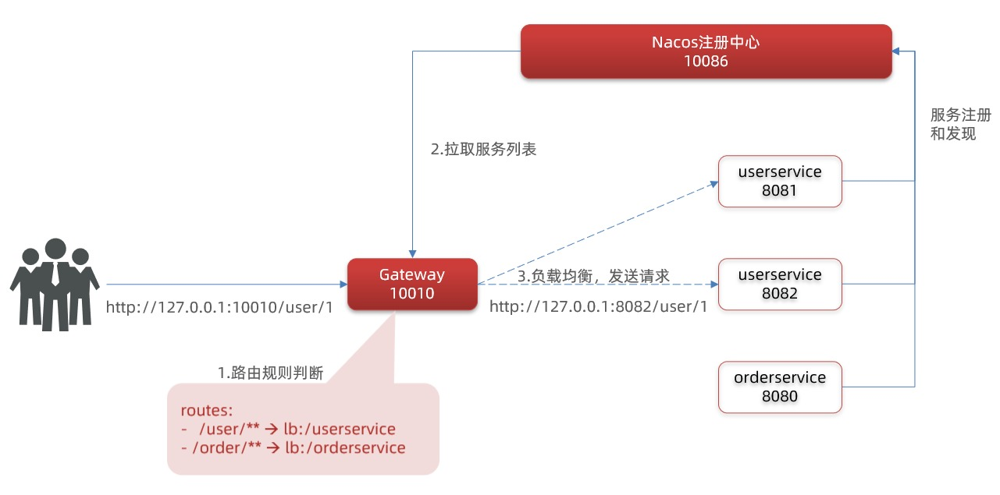

- 总结
  - 网关搭建的步骤
    1. 创建项目，引入nacos和gateway依赖
    2. 配置application.yml，包括服务基本信息，nacos地址、路由
  - 路由配置包括
    1. 路由id：路由的唯一表示
    2. 路由目标（uri）：路由的目标地址，http代表固定地址，lb代表根据服务名称负载均衡
    3. 路由断言（predicates）：判断路由的规则
    4. 路由过滤器（filters）：对请求或相应做处理
- 接下来我们就来重点学习路由断言和路由过滤器的详细知识

### 断言工厂

- 我们在配置文件中写的断言规则只是字符串，这些字符串会被`Predicate Factory`读取并处理，转变为路由判断的条件
- 例如`Path=/user/**`是按照路径匹配，这个规则是由`org.springframework.cloud.gateway.handler.predicate.PathRoutePredicateFactory`类来处理的，像这样的断言工厂，在SpringCloudGatewway还有十几个

|  **名称**  |            **说明**            |                           **示例**                           |
| :--------: | :----------------------------: | :----------------------------------------------------------: |
|   After    |      是某个时间点后的请求      |    - After=2037-01-20T17:42:47.789-07:00[America/Denver]     |
|   Before   |     是某个时间点之前的请求     |    - Before=2031-04-13T15:14:47.433+08:00[Asia/Shanghai]     |
|  Between   |    是某两个时间点之前的请求    | - Between=2037-01-20T17:42:47.789-07:00[America/Denver], 2037-01-21T17:42:47.789-07:00[America/Denver] |
|   Cookie   |     请求必须包含某些cookie     |                   - Cookie=chocolate, ch.p                   |
|   Header   |     请求必须包含某些header     |                  - Header=X-Request-Id, \d+                  |
|    Host    | 请求必须是访问某个host（域名） |          - Host=**.somehost.org,**.anotherhost.org           |
|   Method   |     请求方式必须是指定方式     |                      - Method=GET,POST                       |
|    Path    |    请求路径必须符合指定规则    |                - Path=/red/{segment},/blue/**                |
|   Query    |    请求参数必须包含指定参数    |              - Query=name, Jack或者- Query=name              |
| RemoteAddr |    请求者的ip必须是指定范围    |                 - RemoteAddr=192.168.1.1/24                  |
|   Weight   |            权重处理            |                                                              |

- 关于更详细的使用方法，可以参考官方文档：https://docs.spring.io/spring-cloud-gateway/docs/current/reference/html/#gateway-request-predicates-factories

### 过滤器工厂

- GatewayFilter是网关中提供的一种过滤器，可以对进入网关的请求和微服务返回的响应做处理

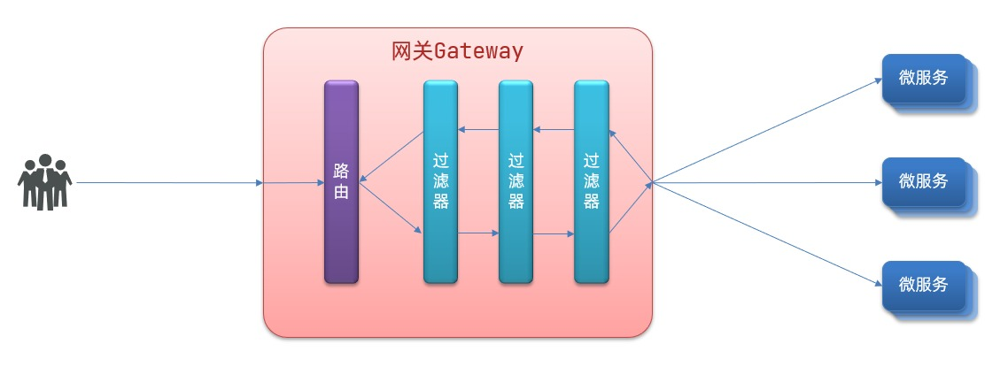

#### 路由过滤器的种类

- Spring提供了31中不同的路由过滤器工厂，例如

|       **名称**       |           **说明**           |
| :------------------: | :--------------------------: |
|   AddRequestHeader   |   给当前请求添加一个请求头   |
| RemoveRequestHeader  |    移除请求中的一个请求头    |
|  AddResponseHeader   |  给响应结果中添加一个响应头  |
| RemoveResponseHeader | 从响应结果中移除有一个响应头 |
|  RequestRateLimiter  |        限制请求的流量        |

- 官方文档的使用举例

  ```
  spring:
    cloud:
      gateway:
        routes:
        - id: add_request_header_route
          uri: https://example.org
          filters:
          - AddRequestHeader=X-Request-red, blue
  ```

- This listing adds X-Request-red:blue header to the downstream request’s headers for all matching requests.

- 关于更详细的使用方法，可以参考官方文档：https://docs.spring.io/spring-cloud-gateway/docs/current/reference/html/#gateway-request-predicates-factories

#### 请求头过滤器

- 下面我们以AddRequestHeader为例，作为讲解

  需求：给所有进入user-service的请求都添加一个请求头：Truth=Welcome to Kyle’s Blog!

- 只需要修改gateway服务的application.yml文件，添加路由过滤即可

  ```java 
  server:
    port: 10010 ## 网关端口
  spring:
    application:
      name: gateway ## 服务名称
    cloud:
      nacos:
        server-addr: localhost:80 ## nacos地址
      gateway:
        routes:
          - id: user-service
            uri: lb://user-service
            predicates:
              - Path=/user/**
            filters:
              - AddRequestHeader=Truth, Welcome to Kyle's Blog! ## 添加请求头
  ```

- 当前过滤器写在user-service路由下，因此仅仅对访问user-service的请求有效，我们在UserController中编写对应的方法来测试

  ```java
  @GetMapping("/test")
  public void test(@RequestHeader("Truth") String tmp) {
      System.out.println(tmp);
  }
  ```

- 重启网关和user-service，打开浏览器访问`http://localhost:10010/user/test，` 控制台会输出`Welcome to Kyle's Blog!`，证明我们的配置已经生效

#### 默认过滤器

- 如果要对所有的路由都生效，则可以将过滤器工厂写到default下，格式如下

  ```java
  server:
    port: 10010 ## 网关端口
  spring:
    application:
      name: gateway ## 服务名称
    cloud:
      nacos:
        server-addr: localhost:80 ## nacos地址
      gateway:
        routes:
          - id: user-service
            uri: lb://user-service
            predicates:
              - Path=/user/**
        default-filters: 
          - AddRequestHeader=Truth, Welcome to Kyle's Blog! ## 添加请求头
  ```

- 重启网关服务，打开浏览器访问`http://localhost:10010/user/test，` 控制台依旧会输出`Welcome to Kyle's Blog!`，证明我们的配置已经生效

#### 小结

- 过滤器的作用是什么？
  - 对路由的请求或响应做加工处理，比如添加请求头
  - 配置在路由下的过滤器只对当前路由请求生效
- default-filters的作用是什么？
  - 对所有路由都生效的过滤器

### 全局过滤器

- 上面提到的31中过滤器的每一种的作用都是固定的，如果我们希望拦截请求，做自己的业务逻辑，则无法实现，这就要用到我们的全局过滤器了

- #### 全局过滤器的作用

- - 全局过滤器的作用也是处理一切进入网关的请求和微服务响应，与GatewayFilter的作用一样。区别在于GatewayFilter通过配置定义，处理的逻辑是固定的，而GlobalFilter的逻辑需要我们自己编写代码实现

  - 定义的方式就是实现GlobalFilter接口

    ```java
    public interface GlobalFilter {
        /**
         *  处理当前请求，有必要的话通过{@link GatewayFilterChain}将请求交给下一个过滤器处理
         *
         * @param exchange 请求上下文，里面可以获取Request、Response等信息
         * @param chain 用来把请求委托给下一个过滤器 
         * @return {@code Mono<Void>} 返回标示当前过滤器业务结束
         */
        Mono<Void> filter(ServerWebExchange exchange, GatewayFilterChain chain);
    }
    ```

    - GlobalFilter：全局过滤器接口，实现它的类会对 **所有路由** 生效。

    - `Mono<Void>`：响应式类型（Reactor），表示**异步处理**，没有返回值，但会在完成时通知。

    - filter(ServerWebExchange exchange, GatewayFilterChain chain)

      ：核心方法

      - exchange：请求上下文，包含 Request、Response、请求路径、头信息等，可在这里读取或修改。
      - chain：过滤器链，调用 chain.filter(exchange) 才会把请求交给 **下一个过滤器** 或最终路由处理。

  - 在filter中编写自定义逻辑，可以实现下列功能

    1. 登录状态判断
    2. 权限校验
    3. 请求限流等

- #### 自定义全局过滤器

- - 需求：定义全局过滤器，拦截请求，判断请求参数是否满足下面条件

    1. 参数中是否有authorization
    2. authorization参数值是否为admin

  - 如果同时满足，则放行，否则拦截

  - 具体实现如下

    - 在gateway模块下新建cn.itcast.gateway.filter包，然后在其中编写AuthorizationFilter类，实现GlobalFilter接口，重写其中的filter方法

      ```java
      public class AuthorizationFilter implements GlobalFilter {
          @Override
          public Mono<Void> filter(ServerWebExchange exchange, GatewayFilterChain chain) {
              // 1. 获取请求参数
              MultiValueMap<String, String> params = exchange.getRequest().getQueryParams();
              // 2. 获取authorization参数
              String authorization = params.getFirst("authorization");
              // 3. 校验
              if ("admin".equals(authorization)) {
                  // 4. 满足需求则放行
                  return chain.filter(exchange);
              }
              // 5. 不满足需求，设置状态码，这里的常量底层就是401，在restFul中401表示未登录
              exchange.getResponse().setStatusCode(HttpStatus.UNAUTHORIZED);
              // 6. 结束处理
              return exchange.getResponse().setComplete();
          }
      }
      ```

重启网关，测试我们的拦截器是否生效，打开浏览器访问`http://localhost:10010/user/1，无法正常访问；加上需要的请求参数访问http://localhost:10010/user/1?authorization=admin，` 可以看到正常数据

```java
{
    "id": 1,
    "username": "柳岩",
    "address": "湖南省衡阳市"
}
```

#### 过滤器执行顺序

- 请求进入网关会碰到三类过滤器：当前路由的过滤器、DefaultFilter、GlobalFilter
- 请求路由后，会将当前路由过滤器和DefaultFilter、GlobalFilter，合并到一个过滤器链（集合）中，排序后依次执行每个过滤器

那么排序的规则是什么呢？

- 每个过滤器都必须指定一个int类型的order值，order值越小，优先级越高，执行顺序越靠前（默认值为2147483647，即int最大值）

- GlobalFilter通过实现Ordered接口，或者添加@Order注解来指定order值，需要我们自己指定

  - 实现Ordered接口

  - ```java
    public class AuthorizationFilter implements GlobalFilter, Ordered {
        @Override
        public Mono<Void> filter(ServerWebExchange exchange, GatewayFilterChain chain) {
            //ServerWebExchange → 封装了请求和响应的对象     //GatewayFilterChain → 过滤器链，用于放行请求
            // 1. 获取请求参数
            MultiValueMap<String, String> params = exchange.getRequest().getQueryParams();
            // 2. 获取authorization参数
            String authorization = params.getFirst("authorization");
            // 3. 校验
            if ("admin".equals(authorization)) {
                // 4. 满足需求则放行
                return chain.filter(exchange);
            }
            // 5. 不满足需求，设置状态码，这里的常量底层就是401，在restFul中401表示未登录
            exchange.getResponse().setStatusCode(HttpStatus.UNAUTHORIZED);
            // 6. 结束处理
            return exchange.getResponse().setComplete();
        }
    
        @Override
        public int getOrder() {
            return -1;
        }
    }
    ```

  - 使用

```java
@Order(-1)
@Component
public class AuthorizationFilter implements GlobalFilter {
    @Override
    public Mono<Void> filter(ServerWebExchange exchange, GatewayFilterChain chain) {
        // 1. 获取请求参数
        MultiValueMap<String, String> params = exchange.getRequest().getQueryParams();
        // 2. 获取authorization参数
        String authorization = params.getFirst("authorization");
        // 3. 校验
        if ("admin".equals(authorization)) {
            // 4. 满足需求则放行
            return chain.filter(exchange);
        }
        // 5. 不满足需求，设置状态码，这里的常量底层就是401，在restFul中401表示未登录
        exchange.getResponse().setStatusCode(HttpStatus.UNAUTHORIZED);
        // 6. 结束处理
        return exchange.getResponse().setComplete();
    }
}
```

- - 路由过滤器和defaultFilter的order由Spring指定，默认是按照声明顺序从1递增

  - 当过滤器的order值一样时，会按照defaultFilter > 路由过滤器 > GlobalFilter的顺序执行

    - 例如下面这种情况下的order值就会相同，如果我们在自定义全局过滤器中设定的order也为1，那么也会冲突

      ```java
      server:
        port: 10010 ## 网关端口
      spring:
        application:
          name: gateway ## 服务名称
        cloud:
          nacos:
            server-addr: localhost:80 ## nacos地址
          gateway:
            routes:
              - id: user-service
                uri: lb://user-service
                predicates:
                  - Path=/user/**
                filters:
                  - AddRequestHeader=Truth, Welcome to Kyle's Blog! ## 1
                  - AddRequestHeader=Truth, Welcome to Kyle's Blog! ## 2
                  - AddRequestHeader=Truth, Welcome to Kyle's Blog! ## 3
            default-filters:
              - AddRequestHeader=Truth, Welcome to Kyle's Blog! ## 1
              - AddRequestHeader=Truth, Welcome to Kyle's Blog! ## 2
              - AddRequestHeader=Truth, Welcome to Kyle's Blog! ## 3
      ```

  - 详细内容，可以查看源码：

    - `org.springframework.cloud.gateway.route.RouteDefinitionRouteLocator#getFilters()`方法是先加载defaultFilters，然后再加载某个route的filters，然后合并。
    - `org.springframework.cloud.gateway.handler.FilteringWebHandler#handle()`方法会加载全局过滤器，与前面的过滤器合并后根据order排序，组织过滤器链

### 跨域问题

#### 什么是跨域问题

- 跨域：域名不一致就是跨域，主要包括
  1. 域名不同：`www.baidu.com`和`www.baidu.org`，`www.js.com`和`miaosha.js.com`
  2. 域名相同，端口不同：localhost:8080和localhost:8081
- 跨域问题：浏览器禁止请求的发起者与服务端发生跨域ajax请求，请求被浏览器拦截的问题
- 解决方案：CORS
  - CORS是一个W3C标准，全称是”跨域资源共享”（Cross-origin resource sharing）。
  - 它允许浏览器向跨源服务器，发出XMLHttpRequest请求，从而克服了AJAX只能同源使用的限制。

#### 解决跨域问题

- 在gateway服务的application.yml文件中，添加下面的配置

  ```java
  spring:
    cloud:
      gateway:
        globalcors: ## 全局的跨域处理
          add-to-simple-url-handler-mapping: true ## 解决options请求被拦截问题
          corsConfigurations:
            '[/**]':
              allowedOrigins: ## 允许哪些网站的跨域请求 
                - "`http://localhost:9527"`
              allowedMethods: ## 允许的跨域ajax的请求方式
                - "GET"
                - "POST"
                - "DELETE"
                - "PUT"
                - "OPTIONS"
              allowedHeaders: "*" ## 允许在请求中携带的头信息
              allowCredentials: true ## 是否允许携带cookie
              maxAge: 360000 ## 这次跨域检测的有效期
  ```

## Spring Cloud系列】- [RestTemplate](https://so.csdn.net/so/search?q=RestTemplate&spm=1001.2101.3001.7020)使用详解**

RestTemplate的GET方法 ！这是Spring中最常用的HTTP客户端工具。

##  RestTemplate GET方法详解
###  两大核心方法族
##  getForObject 方法详解
###  基础版本：getForObject(URI url, Class responseType)
```java
@Test
public void TestRestGetMethod() throws Exception {
    RestTemplate restTemplate = new RestTemplate();
    URI url = URI.create("http://api.goyeer.com:8888/
    user");
    String response = restTemplate.getForObject(url, 
    String.class);
}
```
特点 ：

 直接返回响应体

自动反序列化 → String.class 指定返回类型

适合简单场景

###  参数替换版：getForObject(String url, Class responseType, Object… uriVariables)
```java
@Test
public void TestGetForObjcetByArgument() throws 
Exception {
    RestTemplate restTemplate = new RestTemplate();
    String appkey = "Goy_20200034_MES";
    String appSecret = 
    "GY202305-0801-41d4-a716-9998880";
    String url = "http://api.goyeer.com:8888/
    getToken?appkey={1}&appsecret={2}";
    String responseToken = restTemplate.getForObject
    (url, String.class, appkey, appSecret);
}
```
参数替换机制 ：

```java
// 原始URL模板
"http://api.goyeer.com:8888/getToken?appkey={1}&
appsecret={2}"

// 参数按顺序替换
{1} → appkey
{2} → appSecret

// 最终URL
"http://api.goyeer.com:8888/getToken?
appkey=Goy_20200034_MES&
appsecret=GY202305-0801-41d4-a716-9998880"
### 3?? Map参数版：`getForObject(String url, Class responseType, Map<String, ?> uriVariables)`
```java
@Test
public void TestGetForObjectByMap() throws Exception 
{
    Map<String, Object> map = new HashMap();
    map.put("appkey", "Goy_20200034_MES");
    map.put("appSecret", 
    "GY202305-0801-41d4-a716-9998880");
    
    RestTemplate restTemplate = new RestTemplate();
    String url = "http://api.goyeer.com:8888/user?
    appkey={appkey}&appsecret={appSecret}";
    String response = restTemplate.getForObject(url, 
    String.class, map);
}
Map参数优势 ：

- ✅ 参数名匹配 → 按名称替换，不是按顺序
- ✅ 可读性好 → 参数名一目了然
- ✅ 灵活组合 → 可以动态添加参数
##  getForEntity 方法详解
### 基础版本：getForEntity(URI url, Class responseType)
```java
@Test
public void TestGetForEntity() throws Exception {
    RestTemplate restTemplate = new RestTemplate();
    URI url = URI.create("http://api.goyeer.com:8888/
    user");
    ResponseEntity<String> response = restTemplate.
    getForEntity(url, String.class);
    
    int httpCode = response.getStatusCode().value
    ();  // 状态码
    String resp = response.getBody
    ();                // 响应体
    
    System.out.println("状态码: " + 
    httpCode);        // 200, 404, 500等
    System.out.println("响应体: " + resp);
}
### 5?? 参数替换版：`getForEntity(String url, Class responseType, Object… uriVariables)`
```java
@Test
public void TestGetForEntityByArgument() throws Exception {
    RestTemplate restTemplate = new RestTemplate();
    String appkey = "Goy_20200034_MES";
    String appSecret = "GY202305-0801-41d4-a716-9998880";
    String url = "http://api.goyeer.com:8888/getToken?appkey={1}&appsecret={2}";

    ResponseEntity<String> response = restTemplate.getForEntity(url, String.class, appkey, appSecret);

    int httpCode = response.getStatusCode().value();
    String resp = response.getBody();

    System.out.println("状态码: " + httpCode);
    System.out.println("响应体: " + resp);
}
```
### 6?? Map参数版：`getForEntity(String url, Class responseType, Map<String, ?> uriVariables)`
```java
@Test
public void TestGetForEntityByMap() throws Exception {
    RestTemplate restTemplate = new RestTemplate();
    Map<String, Object> map = new HashMap<>();
    map.put("appkey", "Goy_20200034_MES");
    map.put("appSecret", "GY202305-0801-41d4-a716-9998880");

    String url = "http://api.goyeer.com:8888/getToken?appkey={appkey}&appsecret={appsecret}";
    ResponseEntity<String> response = restTemplate.getForEntity(url, String.class, map);

    int httpCode = response.getStatusCode().value();
    String resp = response.getBody();

    System.out.println("状态码: " + httpCode);
    System.out.println("响应体: " + resp);
}
```


