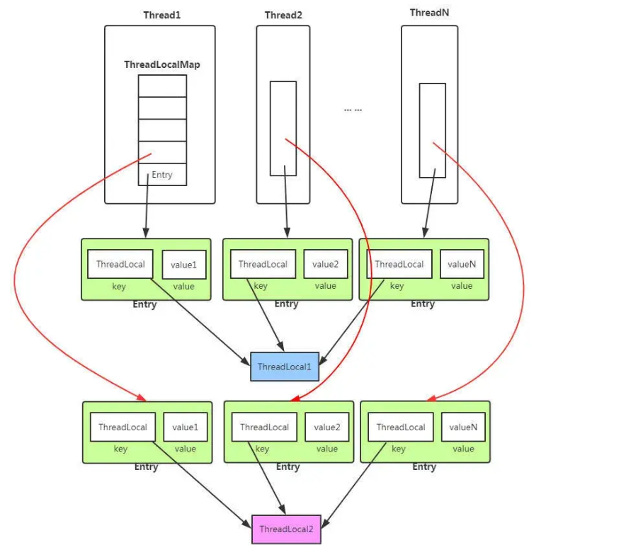

1.Java 的线程安全是怎么实现的

线程安全本质上就是多个线程同时操作共享数据时，结果不能乱。
最核心是三块：原子性、可见性、有序性。
Java 里主要靠几种手段：第一是加锁，比如 synchronized 或显示锁，保证同一时间只有一个线程能进来；第二是 volatile，保证变量修改后别的线程能立刻看到；第三是原子类，底层用 CAS，适合做一些简单的无锁操作。


## wait 状态线程恢复到 running 状态的方式

wait 状态的线程恢复运行主要靠两种方式：

- 一种是其他线程调用 `notify()` 或 `notifyAll()` 唤醒它，唤醒后线程会重新抢锁，抢到锁才能继续执行；
- 另一种是通过 `LockSupport.unpark()` 给线程发放许可，解除 `park()` 造成的等待状态，让线程恢复运行。


### 两种核心恢复方式

1. **通过 `notify()` / `notifyAll()` 唤醒**

   其他线程调用同步对象的 `notify()` 或 `notifyAll()` 方法，唤醒处于 wait 状态的线程。

   `notify()`：随机唤醒等待队列中的一个线程；

   `notifyAll()`：唤醒等待队列中的所有线程。

   被唤醒的线程需要重新竞争锁，获取到锁后才能进入就绪（可运行）状态，等待 CPU 调度后恢复运行。

2. **通过 `LockSupport.unpark(Thread)` 解除等待**

   当线程因获取锁失败进入 Waiting 状态时（本质是调用了 `LockSupport.park()`），解锁时会执行 `LockSupport.unpark(Thread)` 方法，给线程发放 “许可”，解除等待状态，线程恢复就绪。

## notify 和 notifyAll 的区别?

同样是唤醒等待的线程，同样最多只有一个线程能获得锁，同样不能控制哪个线程获得锁。区别在于:
notify:唤醒一个线程，其他线程依然处于wait的等待唤醒状态，如果被唤醒的线程结束时没调用notify，其他线程就永远没人去唤醒，只能等待超时，或者被中断

notifyAll:所有线程退出wait的状态，开始竞争锁，但只有一个线程能抢到，这个线程执行完后，其他线程又会有一个幸运儿脱颖而出得到锁

## notify 选择哪个线程?

notify在源码的注释中说到notify选择唤醒的线程是任意的，但是依赖于具体实现的jvm。

## volatile保证原子性吗?

volatile关键字并没有保证我们的变量的原子性，volatile是Java虚拟机提供的一种轻量级的同步机制，主要有这三个特性:
保证可见性
不保证原子性
禁止指令重排

### 那我们要如何保证原子性?

可以通过synchronized来保证原子性。

# 线程

## 1.线程的生命周期？


Java 线程常见状态有：新建、可运行、阻塞、等待、超时等待、结束。
线程刚创建是新建，调用 start 之后进入可运行；

抢不到锁可能阻塞；

调用等待相关方法会进入等待或超时等待

执行完了就是结束。

## **2. 线程的 waiting 状态和 timed_waiting 的区别**

这两个状态最大的区别就是：有没有超时时间。

waiting 是一直等，没人唤醒它，它就可能一直不动。
timed_waiting 是等一段时间，时间到了自己会回来。

比如：

- wait() 是无限等
- sleep(1000) 是等 1 秒
- wait(1000) 也是带超时的等

所以一句话就是：
一个是“死等”，一个是“限时等”。


## 3.什么是进程和线程？之间的关系是？

进程可以理解成一个正在运行的程序实例，它是资源分配的基本单位。
线程是进程里的执行单元，是 CPU 调度的基本单位。

一个进程可以有多个线程，线程共享进程资源，但线程之间并发执行时要注意同步和线程安全。


## Java 中停止线程运行的方法

Java 里停止线程**不推荐直接暴力终止**

主流方式是用`interrupt()`打标记，然后在线程里自己判断状态来退出：

要么抛异常终止，要么直接 return 结束 run 方法。

像 stop () 这种强制停止的方法已经废弃了，会把线程直接杀死，连收尾工作都做不了，很容易出问题。


Java 中停止线程的常见方法如下：

1. **异常法停止**：调用线程的`interrupt()`方法标记中断状态，在线程的`run()`方法中判断`Thread.interrupted()`状态，若为中断状态则抛出异常，终止线程执行。
2. **在沉睡中停止**：线程处于`sleep()`、`wait()`等阻塞状态时，调用`interrupt()`方法会抛出`InterruptedException`异常，终止线程执行。
3. **`stop()`暴力停止**：调用`stop()`方法可强制终止线程，但该方法已被废弃，会导致线程无法完成清理工作，破坏数据一致性，存在严重安全问题。
4. **使用`return`停止线程**：调用`interrupt()`标记中断状态后，在`run()`方法中判断线程状态，若为中断状态则执行`return`语句，终止线程执行。


## 调用 interrupt 是如何让线程抛出异常的？

面试版本：

`interrupt()`本身不会直接终止线程，它只是给线程打了个 “中断标记”：如果线程正卡在`sleep()`/`wait()`这种阻塞方法里，就会被唤醒并抛出`InterruptedException`；

如果线程正在正常运行，就只是标记状态，需要自己判断标记来决定要不要退出。


每个线程都维护着一个中断状态标记位（布尔值，初始为false），调用Thread.interrupt()后，线程会根据自身状态做出不同响应：

1.如果线程正在执行可中断的阻塞方法（如`sleep()、wait()、join()`）：

​      调用interrupt()会直接解除线程的阻塞状态，并抛出`InterruptedException`异常。
2.如果线程处于运行状态（未阻塞）：
​     interrupt()只会设置线程的中断状态为true，不会直接抛出异常，需要线程主动通过Thread.interrupted()轮询中断状态，决定后续操作。

### 如果是靠变量来停止线程，缺点是什么?

用自定义`volatile`变量停止线程的核心缺点是**无法立即响应中断请求**：

- 线程只有在循环的下一次迭代中，才会判断变量状态，决定是否退出；
- 如果线程正在执行循环体内的耗时操作（比如`sleep()`），即使外部已经修改了变量，线程也无法立刻感知，必须等到当前操作完成、进入下一次循环判断时才会退出。

```java
while (!isInterrupt) {
    System.out.println("线程进入休眠");
    Thread.sleep(1000); // 耗时操作
    System.out.println("执行后续步骤");
}
```

当主线程修改`isInterrupt = true`后，线程不会立刻停止，而是会先执行完`sleep(1000)`，再打印 “执行后续步骤”，直到下一次循环判断时才退出。


# 锁

## 1.如何解决并发冲突？synchronized、ReentrantLock，乐观锁和悲观锁，公平锁和非公平锁

解决并发冲突，本质上就是让多个线程操作共享资源时别把数据搞乱。常见手段有加锁、原子类、减少共享、线程隔离。
`synchronized 和 ReentrantLock` 都能解决并发问题，前者写法简单，后者更灵活，可以手动加解锁、支持可中断、支持公平锁。
乐观锁适合冲突没那么高的场景，先假设没人抢，提交时再检查；悲观锁适合冲突比较激烈的场景，上来就锁住。
公平锁是先来先得，非公平锁是谁抢到算谁的；公平锁更公平，但吞吐一般会差一点，默认更常用的是非公平锁。


## synchronized 支持重入吗？如何实现的？


`synchronized` 是支持**可重入**的。

它的底层给每个锁维护了**线程 ID**和**锁计数器**两个东西：

- 当线程第一次获取锁时，把计数器变成 1，并记录当前线程 ID；
- 同一个线程再次获取这把锁，计数器直接 +1，不会阻塞；
- 每次退出同步代码块，计数器 -1，减到 0 才真正释放锁。

这样就能保证同一个线程多次加锁不会自己把自己锁死，这就是可重入的实现原理。


synchronized 是基于原子性的内部锁机制，是可重入的，因此在一个线程调用 synchronized 方法的同时在其方法体内部调用该对象另一个 synchronized 方法，也就是说一个线程得到一个对象锁后再次请求该对象锁，是允许的，这就是 synchronized 的可重入性。

synchronized 底层是利用计算机系统 mutex Lock 实现的。每一个可重入锁都会关联一个线程 ID 和一个锁状态 status。

当一个线程请求方法时，会去检查锁状态。

1. 如果锁状态是 0，代表该锁没有被占用，使用 CAS 操作获取锁，将线程 ID 替换成自己的线程 ID。
2. 如果锁状态不是 0，代表有线程在访问该方法。此时，如果线程 ID 是自己的线程 ID，如果是可重入锁，会将 status 自增 1，然后获取到该锁，进而执行相应的方法；如果是非重入锁，就会进入阻塞队列等待。

在释放锁时，

1. 如果是可重入锁的，每一次退出方法，就会将 status 减 1，直至 status 的值为 0，最后释放该锁。
2. 如果是非重入锁的，线程退出方法，直接就会释放该锁。

# 线程池

## 1.线程池如何创建？ThreadPoolExecutor 和 Executors


真实项目里一般会优先直接用 ThreadPoolExecutor 创建线程池。
因为直接创建可以把核心线程数、最大线程数、队列大小、拒绝策略这些关键参数都控制住，风险更小。
Executors 也能快速创建，但有些默认配置不够安全，比如队列可能过大，容易把内存打满。
所以面试里最好答成：能用，但生产上更推荐手动指定参数。

### 创建线程池核心参数？**

创建线程池时，核心参数我一般会重点看这几个：

- corePoolSize：核心线程数，表示线程池平时保持的线程数量
- maximumPoolSize：最大线程数，表示线程池最多能开多少线程
- workQueue：任务队列，核心线程满了之后，新任务先放到这里
- keepAliveTime：空闲线程存活时间，超过核心线程数的那些线程，空闲太久会被回收
- threadFactory：线程工厂，用来控制线程怎么创建，比如线程名
- handler：拒绝策略，当线程数到上限、队列也满了，就看怎么处理新任务

“线程池核心参数主要有**核心线程数**、**最大线程数**、**任务队列**、**空闲线程存活时间**、**线程工厂和拒绝策略**。**执行流程一般是先用核心线程**，核心线程满了进队列，队列满了再扩到最大线程数，再满就触发拒绝策略。”

## 2.线程池核心线程 2 个，最大线程 4 个，队列 10 个，什么时候启用第三个线程？拒绝策略是什么？如果队列没有上限会怎样？什么情况下队列会满？


参数是：

- 核心线程数 2
- 最大线程数 4
- 队列容量 10

执行顺序是：

1. 前 2 个任务来了，先创建 2 个核心线程执行
2. 之后再来的任务，先进入队列
3. 当核心线程都忙，队列也满了，也就是队列放满 10 个以后，再来新任务，才会启用第 3 个线程
4. 然后再来任务，可能启用第 4 个线程
5. 如果已经到最大线程数 4，队列也满了，再来新任务，就触发拒绝策略

所以第 3 个线程什么时候启用？
答案是：核心线程 2 个都在忙，并且队列已经塞满 10 个任务之后，新的任务到来时才会启用。

**拒绝策略**常见有 4 种：

- 直接抛异常
- 由调用方自己执行
- 丢弃当前任务
- 丢弃队列里最老的任务，再尝试提交当前任务

如果队列没有上限，会有什么问题？
最典型的问题就是**任务会一直堆积**，**线程池可能永远不会扩到最大线程数**，结果就是：

- 响应越来越慢
- 内存占用越来越大
- 严重时可能把机器拖垮

什么情况下队列会满？
就是生产任务的速度持续大于消费速度。
比如接口请求突然暴增、下游服务很慢、任务执行时间变长，这时候任务进来的速度比线程处理得快，队列就会越堆越多，最终堆满。


## 3.谈谈你对 ThreadLocal 的理解*

**面试版本：**ThreadLocal 本质上是一种**线程本地存储机制**，用来实现**线程间数据隔离**。

它不是靠加锁保证安全，而是给每个线程单独分配一份变量副本，线程之间互不干扰。

底层原理是：每个 Thread 对象内部都维护了一个 **ThreadLocalMap**，以 ThreadLocal 实例作为 key，要存储的数据作为 value。所以同一个 ThreadLocal 在不同线程里，访问到的都是自己独立的数据，不会互相覆盖。

它适合存放**线程内共享、线程间隔离**的信息，比如用户上下文、事务信息、数据库连接、traceId 等，可以避免方法之间层层传递参数。

优点是无锁、性能好；但要注意两点：

1. **它不能做线程间数据共享**；
2. **在线程池里用完必须调用 remove ()**，否则线程复用会导致旧数据残留，甚至引发内存泄漏。


### 扩展：

`ThreadLocal` 是 Java 中用于**解决线程安全问题的一种机制**，它允许创建线程局部变量，即每个线程都有自己独立的变量副本，从而避免了线程间的资源共享和同步问题。



从内存结构图，我们可以看到：

- `Thread`类中，有个`ThreadLocal.ThreadLocalMap`的成员变量。
- `ThreadLocalMap`内部维护了`Entry`数组，每个`Entry`代表一个完整的对象，`key`是`ThreadLocal`本身，`value`是`ThreadLocal`的泛型对象值。

------

### ThreadLocal 的作用

- **线程隔离**：`ThreadLocal` 为每个线程提供了独立的变量副本，这意味着线程之间不会相互影响，可以安全地在多线程环境中使用这些变量而不必担心数据竞争或同步问题。
- **降低耦合度**：在同一个线程内的多个函数或组件之间，使用 `ThreadLocal` 可以减少参数的传递，降低代码之间的耦合度，使代码更加清晰和模块化。
- **性能优势**：由于 `ThreadLocal` 避免了线程间的同步开销，所以在大量线程并发执行时，相比传统的锁机制，它可以提供更好的性能。

------

### ThreadLocal 的原理

`ThreadLocal` 的实现依赖于 `Thread` 类中的一个 `ThreadLocalMap` 字段，这是一个存储 `ThreadLocal` 变量本身和对应值的映射。每个线程都有自己的 `ThreadLocalMap` 实例，用于存储该线程所持有的所有 `ThreadLocal` 变量的值。

当你创建一个 `ThreadLocal` 变量时，它实际上就是一个 `ThreadLocal` 对象的实例。每个 `ThreadLocal` 对象都可以存储任意类型的值，这个值对每个线程来说是独立的。

- 当调用 `ThreadLocal` 的 `get()` 方法时，`ThreadLocal` 会检查当前线程的 `ThreadLocalMap` 中是否有与之关联的值。
- 如果有，返回该值；
- 如果没有，会调用 `initialValue()` 方法（如果重写了的话）来初始化该值，然后将其放入 `ThreadLocalMap` 中并返回。
- 当调用 `set()` 方法时，`ThreadLocal` 会将给定的值与当前线程关联起来，即在当前线程的 `ThreadLocalMap` 中存储一个键值对，键是 `ThreadLocal` 对象自身，值是传入的值。
- 当调用 `remove()` 方法时，会从当前线程的 `ThreadLocalMap` 中移除与该 `ThreadLocal` 对象关联的条目。

------

### 可能存在的问题

当一个线程结束时，其 `ThreadLocalMap` 也会随之销毁，但是 `ThreadLocal` 对象本身不会立即被垃圾回收，直到没有其他引用指向它为止。

因此，在使用 `ThreadLocal` 时需要注意，如果不显式调用 `remove()` 方法，或者线程结束时未正确清理 `ThreadLocal` 变量，可能会导致内存泄漏，因为 `ThreadLocalMap` 会持续持有 `ThreadLocal` 变量的引用，即使这些变量不再被其他地方引用。

因此，实际应用中需要在使用完 `ThreadLocal` 变量后调用 `remove()` 方法释放资源

## 4.ThreadLocalMap 的哈希冲突如何解决

面试版本：

`ThreadLocal` 中的 `ThreadLocalMap` 采用**开放地址法**来解决哈希冲突，具体实现是**线性探测**：当计算出的哈希槽位已被占用时，就通过 `nextIndex` 方法以步长为 1 的方式依次向后查找下一个空槽位（到达数组末尾则回到开头继续查找），直到找到可用位置后再插入 Entry，以此避免哈希冲突带来的存储问题。

### 扩展：

在 `ThreadLocal` 中采取的是 **开放地址法** 的方法来解决哈希冲突。当遇到哈希冲突时，会再次进行 **探测**，探测的意思其实就是去寻找下一个空位。

关于这个探测有非常多的实现方式，常见的有：

- **线性探测**：如果当前位置被占用，则依次往后查找，直到找到一个空槽位。
- **二次探测**：如果当前位置被占用，双向地去找。`di = i + 1, i - 1, i + 3, i - 3`
- **双重哈希**：使用两个哈希函数，根据第一个哈希函数的结果找到一个位置，如果该位置已被占用，则使用第二个哈希函数计算下一个位置，以此类推，直到找到一个空槽位。

在 `ThreadLocal` 里面采用的时是最简单的 **线性探测**。

```java
private ThreadLocalMap(ThreadLocalMap parentMap) {
    Entry[] parentTable = parentMap.table;
    int len = parentTable.length;
    setThreshold(len);
    table = new Entry[len];

    for (int j = 0; j < len; j++) {
        Entry e = parentTable[j];
        if (e != null) {
            @SuppressWarnings("unchecked")
            ThreadLocal<Object> key = (ThreadLocal<Object>) e.get();
            if (key != null) {
                Object value = key.childValue(e.value);
                Entry c = new Entry(key, value);
                int h = key.threadLocalHashCode & (len - 1);
                // 这里采用的是线性探测，一直找到空的位置
                while (table[h] != null)
                    h = nextIndex(h, len);
                table[h] = c;
                size++;
            }
        }
    }
}

private static int nextIndex(int i, int len) {
    // 步长为1，一直往右边去找
    return ((i + 1 < len) ? i + 1 : 0);
}
```

## **5. synchronized 可以修饰变量吗**

不可以。
它只能修饰方法，或者写在代码块上，本质上锁的是一段代码执行过程，不是某个变量。
如果想保证变量可见性，一般会想到 volatile；如果是想保证复合操作安全，比如自增这种，就还是要加锁或者用原子类。

## 6.ThreadLocalMap 的 key 是如何计算的。

`ThreadLocalMap` 的 key 哈希计算分为两步：首先，每个 `ThreadLocal` 对象在创建时，会通过 `AtomicInteger` 原子类，以固定魔数 `0x61c88647` 为步长生成唯一的 哈希码，保证哈希码均匀分布；然后在 映射内部 ，用这个哈希码和内部数组长度减一做按位与运算（性能比取模更好），得到该对象在数组里的存储位置索引，完成键的哈希定位。

# JMM

## 1.简述一下JMM内存模型**

JMM 就是 Java 内存模型，可以把它理解成 Java 规定的一套“**多线程读写共享变量的规则**”。因为线程有自己的工作内存，不是每次都直接读主内存，所以会有可见性、原子性和有序性问题。JMM 的作用就是定义：线程什么时候能看到别的线程改过的值，哪些操作不能乱排，哪些场景需要同步。**JMM 解决的是多线程下共享变量怎么安全读写的问题。**

## **2. 介绍一下 volatile 的作用，volatile 是怎么保证可见性和防止指令重排的**

volatile 主要有两个作用，第一是**保证可见性**，第二**是防止部分指令重排**。

可见性就是说，一个线程改了值，别的线程马上能看到，不会一直读缓存里的旧值；防止重排是因为 JVM 在 volatile **读写前后会加内存屏障**，保证某些指令顺序不能乱。要注意，volatile 不能保证 i++ 这种复合操作的原子性，所以它更适合做状态标记、开关变量，不适合直接做高并发计数。**volatile 保证可见性和有序性，但不保证复合操作原子性。**

## volatile 可以保证线程安全吗

**面试版本：**

volatile **不能完全保证**线程安全。它只能保证**可见性**（一个线程改了变量，其他线程立刻看到）和**禁止指令重排**，但保证不了**原子性**。像 `i++` 这种复合操作（读取、改值、写入）不是原子的，多线程同时执行会导致数据覆盖，所以要保证线程安全，得用 synchronized 或锁来保障原子性。

线下版本：

volatile 关键字可以保证**可见性**，但**不能保证原子性**，因此**不能完全保证线程安全**。volatile 关键字用于修饰变量，当一个线程修改了 volatile 修饰的变量的值，其他线程能够立即看到最新的值，从而避免了线程之间的数据不一致。

但是，volatile 并不能解决多线程并发下的**复合操作**问题，比如 `i++` 这种操作不是原子操作，如果多个线程同时对 `i` 进行自增操作，volatile 不能保证线程安全。对于复合操作，需要使用 synchronized 关键字或者 Lock 来保证原子性和线程安全。

### 


# 其他