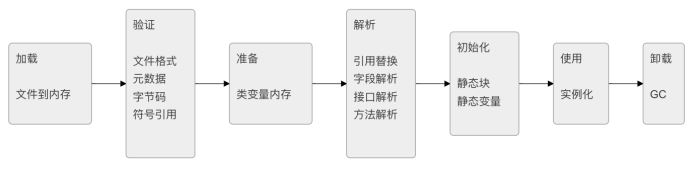
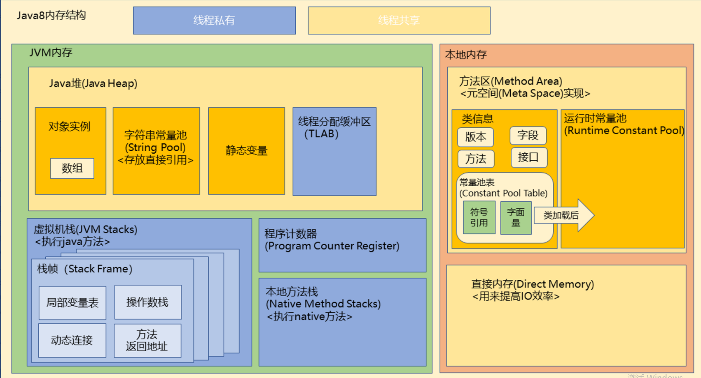
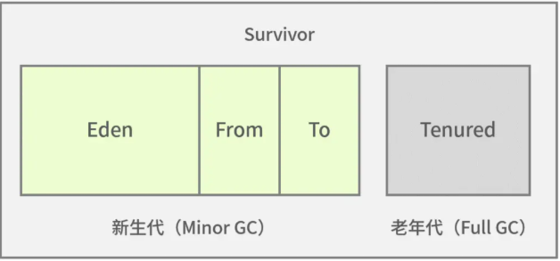

# JVM面试题

## 内存模型

1. ```
   JVM内存模型
   ```

   - 线程独占：栈、本地方法栈、程序计数器
   - 线程共享：堆、方法区

2. ```
   栈
   ```

   - 又称方法栈，线程私有的，线程执行方法是都会创建一个栈帧，用来存储局部变量表、操作栈、动态链接、方法出口等信息。调用方法时执行入栈，方法返回时执行出栈

3. ```
   本地方法栈
   ```

   - 与栈类似，也是用来保存执行方法的信息，执行Java方法是使用占，执行Native方法时是使用本地方法栈

4. ```
   程序计数器
   ```

   - 保存当前线程执行的字节码位置，每个线程工作时都有独立的计数器，值为执行Java方法服务，执行Native方法时，程序计数器为空

5. ```
   堆
   ```

   - JVM内存管理最大的一块，堆被线程共享，目的是存放对象的实例，几乎所有对象的实例都会放在这里。当堆没有可用空间时，会抛出OOM异常(Out of Menory内存溢出)，根据对象的存活周期不同，JVM把对象进行分代管理，由垃圾回收器进行垃圾的回收管理

6. ```
   方法区
   ```

   - 又称非堆区，用于存储已被虚拟机加载的类信息、常量、静态变量、即时编译器优化后的代码等数据
   - 1.7的永久代和1.8的源空间都是方法区的一种实现

7. ```
   JVM内存可见性
   ```

   - JMM是定义程序中变量的访问规则，线程对变量的操作只能在自己的工作内存中进行，而不能直接对主内存操作，由于指令重排，可能会导致读写的顺序被打乱，因此JMM需要提供原子性、可见性、有序性保证

## 2.说说类加载和卸载





1. `加载`：通过类的全限定名，查找此类的字节码文件，利用字节码文件创建Class对象
2. 链接：分为三个阶段
   - `验证`：确保Class文件符合当前虚拟机的要求，不会危害到虚拟机自身安全（前面的文章中修改魔数cafebabe之后，验证就失败了）
   - `准备`：进行内存分配，为static修饰的类变量分配内存，并设置初始值(0或null)，不包含final修饰的静态变量，因为final变量在编译时就分配好了
   - `解析`：将常量池中的符号引用替换为直接引用的过程，直接引用为直接指向目标的指针或者相对偏移量等
3. `初始化`：主要完成静态块执行以及静态变量的复制，先初始化父类，再初始化当前类。初始化是懒惰的，只有对类主动使用的时候才会初始化

### 加载机制

- 加载机制：双亲委派模式
  - 当一个类加载器收到类加载请求时，它首先会将这个请求委托给父类加载器去处理。如果父类加载器无法加载该类，则该类加载器才会自己去加载这个类。
  - 优点：避免类的重复加载，避免Java的核心API被篡改

### 3.卸载过程

- 类卸载的实现依赖于JVM的垃圾回收机制。当一个类不再被引用时，JVM可能会通过垃圾回收机制将该类的实例回收

## 4.简述一下JVM内存模型**

JVM内存模型（JVM Memory Model，JMM）是**Java虚拟机用来描述多线程程序中各个线程之间以及线程和内存之间的交互关系的规范**。JMM定义了线程的工作内存和主内存之间的交互方式，并规定了在何时如何把工作内存中的数据同步回主内存，或者如何从主内存中读取数据到工作内存中。JMM的设计目的是为了保证在多线程程序中，无论运行在什么平台和处理器架构上，Java程序都能达到一致的内存访问效果。Java开发人员在编写多线程时必须遵守JMM规范来保证程序的正确性


## **5. JIT 是什么，作用？**

JIT 可以理解成“即时编译”。
Java 代码先编译成字节码，程序运行时，JVM 会把那些经常执行的热点代码再编译成本地机器码，这样后面执行会更快。
它的作用就是提升运行效率。
所以可以理解成，Java 一开始是“先解释执行”，跑着跑着发现这段代码很常用，就把它编译得更快。

## **6. JVM 内存区域的划分，每一部分的作用**



JVM 内存区域常见可以分这几块：

- 程序计数器：记录当前线程执行到哪一行了
- 虚拟机栈：**方法调用时**用的，存**局部变量**、**方法信息**这些
- 本地方法栈：给**本地方法**用
- 堆：存**对象**，是垃圾回收最主要的区域
- 方法区：存类**信息、常量、静态变量**这些

## 7.**为什么java有跨平台性?**

面试版本：

Java 的跨平台性核心在于**一次编译、到处运行**的机制：Java 源代码会被编译成与**平台无关的字节码（.class 文件）**，之后由不同操作系统上的 Java 虚拟机（JVM）来加载和执行，**JVM 通过抽象层屏蔽了底层硬件和操作系统的差异**，让同一份字节码可以在 Windows、Linux、macOS 等不同平台的 JVM 上正常运行，从而实现了跨平台特性。


详细版本：

Java 虚拟机定义了一种 Java 内存模型（Java memory model, JMM）来屏蔽掉各种硬件和操作系统的内存访问差异，简单理解也就是说 Java 虚拟机相当于是在源码和平台之间抽象了一层出来，专门处理一些平台之间访问的兼容问题，使得源码可以**一次编译到处运行**。

Java 源代码先是经过编译器进行编译，变成.class 文件，由类加载器加载进内存运行，这种字节码文件与具体的平台和机器硬件无关。

Java 程序员只需在任意平台将 Java 代码编译成.class 文件，就可以在任意平台下的 JVM 中运行，从而隔绝了平台和机器硬件的差异，实现了跨平台。


# 垃圾回收

## **1. 垃圾回收算法以及垃圾回收器**


垃圾回收算法常见有这些：

- 标记清除
- 复制
- 标记整理
- 分代收集

简单说下特点：

- 标记清除：会有内存碎片
- 复制：适合存活对象少的场景
- 标记整理：清完后更规整，但整理有成本
- 分代收集：按对象生命周期分不同区域处理

常见垃圾回收器：

- Serial
- ParNew
- CMS
- G1

## **2. 详细比较 CMS 和 G1 的区别？优缺点以及使用场景**

CMS 的目标是尽量减少停顿时间，它更适合对**响应时间**比较**敏感**的场景。
优点是停顿时间通常比较短，缺点是会产生内存碎片，而且对 CPU 比较敏感，老年代回收失败时可能退化成更重的回收。

G1 是把堆分成很多小块，按区域回收。
它的优点是更容易控制停顿时间，整体更均衡，也能较好处理大堆内存；缺点是实现更复杂，在某些场景下吞吐不一定比老方案更好。

使用场景上一般可以这么说：

- 老项目以前常见 CMS
- 现在新项目更常用 G1
- 如果堆比较大、希望兼顾吞吐和停顿，G1 更常见

## **3. 介绍一下 Java 的 GC 机制**

GC 就是垃圾回收，核心任务是**自动回收不再被使用的对象内存**。一般先通过“可达性分析”判断对象还有没有被引用，没引用的就是垃圾。现在主流 JVM 一般是分代回收，新生代对象多、存活短，就频繁回收；老年代对象少但大，回收频率低。常见过程是：新对象先进新生代，经过多次回收还活着的，会晋升到老年代。常见收集器像 G1、ZGC，重点都是尽量减少停顿。**GC 本质是自动内存管理，核心是判断对象是否存活，然后分代回收减少停顿。**


## 4.对象存储在哪个区？

面试版本：

Java 对象主要存储在**堆区**，但 JVM 会通过逃逸分析判断对象**是否逃逸**，如果对象不会逃逸，就会通过标量替换将对象拆解为成员变量，分配到线程私有的栈上，这样方法结束后数据会自动销毁，能降低垃圾回收压力；逃逸分析和标量替换在 JDK7 后默认开启，对应的 JVM 参数分别是`-XX:+DoEscapeAnalysis`和`-XX:+EliminateAllocations`。


详细版本：

对象主要存储在堆区中，不过 Java 对象**并不一定都是分配在堆内存上**，如果 JVM 确定一个对象不会逃逸，它可以选择将这个对象分配在线程的栈上而不是堆上。栈是线程私有的内存区域，当方法执行结束时，栈上的数据会被自动销毁。

栈上分配依赖于逃逸分析和标量替换。

- **标量替换**：就是将对象拆解为其成员变量。例如，如果一个对象包含整数、浮点数和其他基本数据类型的字段，那么这些字段将被单独分配到栈上。解决不会因为没有一大块连续空间导致对象内存不够分配的问题。
- **标量**：标量即不可被进一步分解的量，JAVA 的基本数据类型就是标量（如：int，long 等基本数据类型以及 reference 类型等）。
- **聚合量**：聚合量就是可以被进一步分解的量，通常是对象，JAVA 中对象就是可以被进一步分解的聚合量，对象包含多个成员变量。

相关的 JVM 参数：

- 逃逸分析：`-XX:+DoEscapeAnalysis`（JDK7 以后默认开启）
- 标量替换：`-XX:+EliminateAllocations`（JDK7 以后默认开启）

通过逃逸分析和栈上分配，JVM 可以减少垃圾回收的频率和开销。这有助于提高应用程序的性能，特别是在存在大量临时对象的情况下，因为这些对象可以更快地释放，而不会给垃圾回收器带来过大的压力。

## 5.垃圾清理的对象的分代介绍一下？

面试版本：

JVM 堆内存分为**新生代**和**老年代**，新生代又包含 Eden 区和 From、To 两个 Survivor 区：大部分新对象在 Eden 区生成，Eden 区满后触发 Minor GC，存活对象复制到 Survivor From 区；From 区满后，存活对象再复制到 To 区，多次 Minor GC 后仍存活的对象会晋升到老年代；新生代回收是 Minor GC，特点是频繁且快速，老年代回收是 Full GC/Major GC，速度更慢且通常伴随一次 Minor GC。

详细版本：

JVM 将堆空间分成了新生代和老生代，如下图所示：



通过上图，可以看到新生代和老年代的对比，Minor GC 发生在新生代，而 Full GC 发生在老年代。新生代分为三个区，一个 Eden 区和两个 Survivor 区。

先来看下 Eden 区的作用，大部分新生成的对象都是在 Eden 区，Eden 区满了之后便没有内存给新对象使用，Eden 区便会 Minor GC 回收无用内存，剩下的存活对象便会转移到 Survivor 区。

那两个 Survivor 区的作用分别是什么呢？两者其实是对称分布的，一个是 From 区，一个是 To 区。从 Eden 区存活下来的对象首先会被复制到 From 区，当 From 区满时，此时还存活的对象会被转移到 To 区，经历了多次的 Minor GC 后，还存活的对象就会被复制到老年代，老年代的 GC 一般叫作 FullGC 或者 MajorGC。

我们对比下新生代垃圾回收和老年代垃圾回收的区别，如下表所示：

| 类型           | 发生时机       | 特点                                        |
| -------------- | -------------- | ------------------------------------------- |
| MinorGC        | 新生代垃圾收集 | 频繁、快速                                  |
| FullGC/MajorGC | 老年代垃圾收集 | 一般会伴随一次 MinorGC，速度要比 MinorGC 慢 |

# 内存模型