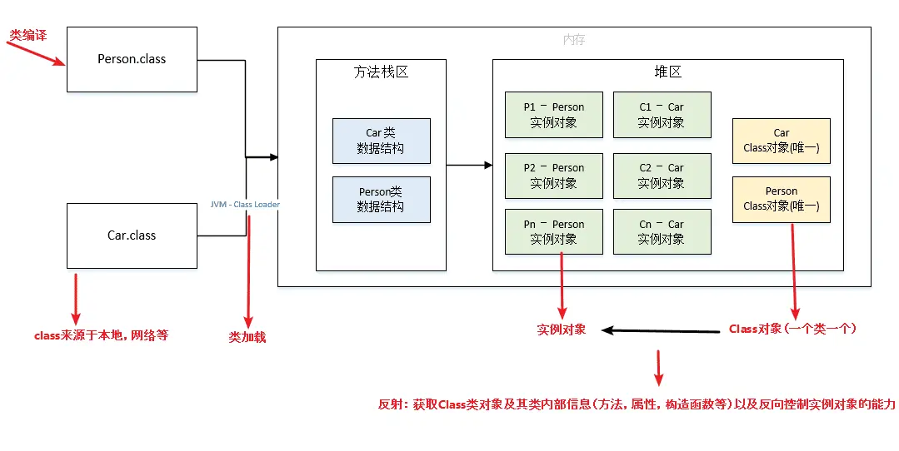

## 

# Java基础

## 1.Java 注解讲讲，是一个类还是一个接口

注解不是普通类，本质上可以理解为一种特殊接口。我们写的是 `@interface`，编译后也是继承了 `java.lang.annotation.Annotation` 这套体系。
平时用注解主要有三层含义：一层是做标记，比如 `@Override`；一层是给框架提供元数据，比如 Spring 的 `@Autowired、@Transactional`；再往下是结合反射或 APT，在运行时或编译期读取注解并做处理。

## 2.讲讲反射

反射就是程序在运行期拿到类的结构信息，并且动态创建对象、调用方法、访问字段。核心入口就是 `Class`，再往下是 `Method、Field、Constructor`。（`Class`代表类的 “元信息”，是反射的入口`Field`代表类的属性（成员变量）`Method`代表类的方法`Constructor`代表类的构造方法）
它的优点是灵活，像 Spring 的 IOC、AOP、MyBatis，底层都大量依赖反射。缺点也很明显，一是性能比直接调用差，二是破坏封装，三是可读性差。现在很多框架会配合缓存、字节码增强去降低反射开销。


扩展：

反射具有以下特性：
1. 运行时类信息访问：反射机制允许程序在运行时获取类的完整结构信息，包括类名、包名、父类、实现的接口、构造函数、方法和字段等。
2. 动态对象创建：可以使用反射API动态地创建对象实例，即使在编译时不知道具体的类名。这是通过Class类的newInstance()方法或Constructor对象的newInstance()方法实现的。
3. 动态方法调用：可以在运行时动态地调用对象的方法，包括私有方法。这通过Method类的invoke()方法实现，允许你传入对象实例和参数值来执行方法。
4. 访问和修改字段值：反射还允许程序在运行时访问和修改对象的字段值，即使是私有的。这是通过Field类的get()和set()方法完成的。



## **3. 基本数据类型和包装类区别**

第一，基本类型是直接存值的，包装类是对象。
第二，基本类型默认值是固定的，比如 int 默认是 0；包装类默认值是 null。
第三，包装类可以配合泛型、集合来用，基本类型不行，比如 `List<int>` 不可以，只能用 `List<Integer>`。

## **4. HashMap 的 put 过程**

往 HashMap 里放数据，先根据 key 算 hash，再定位它应该落到数组的哪个位置。
如果这个位置没人，就直接放进去；如果已经有元素了，就看是不是同一个 key，是同一个就覆盖，不是同一个就发生哈希冲突，挂到链表上，或者在一定条件下转成红黑树。
如果插入后元素太多，超过扩容阈值了，还会触发扩容，把原来的数据重新分布。

## **5. HashMap 转红黑树过程，链表和红黑树时间复杂度**

这个题核心是为什么要转红黑树。
因为如果一个桶里冲突特别多，链表会越来越长，查找效率就会变差，所以在链表长度达到一定条件后，会转成红黑树，提高查找效率。

可以这么答：

HashMap 底层原来是数组加链表。
当某个桶上的链表太长，而且数组容量也达到要求后，就会把这个链表转成红黑树。这样做是为了避免极端情况下查找太慢。

时间复杂度上：

- 链表查找一般是 O(n)
- 红黑树查找一般是 O(logn)

所以转红黑树的本质就是：
用更复杂一点的数据结构，换取冲突严重时更稳定的性能。

## 6.char字符为几个字节

- byte：1 个字节
- short：2 个字节
- int：4 个字节
- long：8 个字节
- float：4 个字节
- double：8 个字节
- char：2 个字节


# JAVASE

## 集合

### 1.Java 数组和链表的区别，ArrayList 和 LinkedList？

1.数组是连续内存，查下标快，但是中间插入删除成本高，因为要搬数据；链表内存不连续，插入删除方便，但是查找慢。
2.ArrayList 底层是动态数组，适合查多改少；LinkedList 底层是双向链表，适合频繁插入删除。
不过真实开发里，大多数场景我还是更常用 ArrayList，因为遍历和随机访问更常见，而且整体性能通常更稳。


### 2.讲讲集合**

一类是 Collection，主要放单个元素，常见的像 List、Set、Queue；另一类是 Map，存键值对。
List 有序可重复，Set 无序或部分有序但不能重复，Queue 更偏队列场景，Map 就是按 key 找 value。


### 3.ArrayList 和 HashMap 的扩容机制

ArrayList 底层是数组，数组满了就扩容。一般是扩到原来的 1.5 倍，然后把老数据拷过去，所以如果一直频繁追加，扩容本身是有成本的。

HashMap 扩容一般发生在元素个数超过阈值的时候。它默认容量和负载因子一起决定什么时候扩。扩容后容量通常变成原来的 2 倍，然后把原来的元素重新分布到新的桶里。

共同点就是：底层空间不够了就开新空间，再迁移数据


#### ArrayList的扩容机制说一下

ArrayList在添加元素时，如果当前元素个数已经达到了内部数组的容量上限，就会触发扩容操作。

ArrayList的扩容操作主要包括以下几个步骤：

• 计算新的容量：一般情况下，新的容量会扩大为原容量的1.5倍（在JDK 10之后，扩容策略做了调整），
  然后检查是否超过了最大容量限制。

• 创建新的数组：根据计算得到的新容量，创建一个新的更大的数组。

• 将元素复制：将原来数组中的元素逐个复制到新数组中。

• 更新引用：将ArrayList内部指向原数组的引用指向新数组。

• 完成扩容：扩容完成后，可以继续添加新元素。

ArrayList的扩容操作涉及到数组的复制和内存的重新分配，所以在频繁添加大量元素时，扩容操作可能会影响性能。为了减少扩容带来的性能损耗，可以在初始化ArrayList时预分配足够大的容量，避免频繁触发扩容操作。

之所以扩容是 1.5 倍，是因为 1.5 可以充分利用移位操作，减少浮点数或者运算时间和运算次数。


### 4.使用for循环对ArrayList在遍历的时候进行删除会有什么问题？

ArrayList 底层是数组，删除元素后后面的元素会整体前移。所以用 for 循环边遍历边删，容易出现漏删、漏遍历，严重时还可能下标越界。如果是增强 for，还可能触发并发修改异常。一般删除时更推荐倒序遍历，或者直接用迭代器的 remove 方法。


###  5.使用Iterator对List集合进行删除操作时会报什么异常？

当使用 Iterator 遍历 List 集合时，如果直接使用 List 的 remove 方法来删除元素，在大多数情况下会抛出 ConcurrentModificationException 异常。

这是因为 List 集合在遍历过程中会维护一个内部的修改计数（modCount）。当通过 List 自身的 remove 方法删除元素时，modCount 会被修改，而 Iterator 在创建时会记录当时的 modCount，在后续遍历过程中会检查 modCount 是否发生变化。如果发生变化，就会认为集合的结构被非法修改，从而抛出异常。

以下是一个使用 ArrayList 和 Iterator 可能会抛出异常的示例：

```java
import java.util.ArrayList;
import java.util.Iterator;
import java.util.List;
public class ListIteratorRemoveExample {
    public static void main(String[] args) {
        List<String> list = new ArrayList<>();
        list.add("A");
        list.add("B");
        list.add("C");
        Iterator<String> iterator = list.iterator();
        while (iterator.hasNext()) {
            String element = iterator.next();
            if ("B".equals(element)) {
                list.remove(element);
                // 这里会抛出ConcurrentModificationException
            }
        }
    }
}

```

在这个例子中，当遍历到元素 B 时，使用 list.remove(element) 来删除元素。这会导致 list 的 **modCount** 发生改变，而 iterator 在遍历过程中检测到 modCount 与它期望的值不一致，就会抛出 ConcurrentModificationException 异常。

正确的做法是使用 Iterator 本身的 remove 方法来删除元素。Iterator 的 remove 方法会在内部正确地处理 modCount，从而避免抛出异常。

### 6.Iterator 底层原理实现

迭代器本质上就**是一个遍历集合的对象**。在 Java 中，`Iterator` 是一个接口，它定义了遍历集合元素的基本方法。其主要方法包括 `hasNext()` 和 `next()`。`hasNext()` 用于判断集合中是否还有下一个元素，`next()` 用于返回下一个元素。

它内部一般会记录当前遍历到哪个位置，同时还会记录集合被修改的次数。
每次取下一个元素时，它都会检查集合是不是被别人偷偷改过，如果发现修改次数对不上，就直接报并发修改异常。

### 7.ArrayList 的底层原理是什么？


ArrayList 是 Java 里的**动态数组**，底层靠`Object[]`数组存数据，满了就自动扩容到原来的 1.5 倍，把老数据拷到新数组里；它随机访问很快，但中间插入删除要挪元素，适合读多写少的场景，频繁增删的话更适合用 LinkedList。


ArrayList 是 Java 中的动态数组，其底层原理是基于数组实现的。

具体来说，ArrayList 内部使用一个`Object`类型的数组来存储元素。当我们向 ArrayList 中添加元素时，它会自动调整数组的大小以适应新的元素。当数组的容量不足以容纳新元素时，ArrayList 会创建一个更大的数组，并将原数组中的元素复制到新数组中。

这种动态调整数组大小的策略可以确保 ArrayList 具有可变长度的特性，可以根据需要动态添加或删除元素，而无需手动管理数组的大小。

需要注意的是，由于 ArrayList 底层使用数组实现，所以在插入或删除元素时，需要将后续的元素进行移动，这可能会影响性能，特别是当 ArrayList 中的元素数量很大时。因此，在需要频繁进行插入和删除操作的场景下，可能需要考虑使用 LinkedList 等其他数据结构来替代 ArrayList。

### 8.ArrayList 是线程安全的吗？

ArrayList 不是线程安全的，在多线程环境下，如果多个线程同时对同一个 ArrayList 实例进行操作（如添加、删除、修改等），会导致数据不一致的问题。


### 9.为什么不是线程安全的，具体来说是哪里不安全？（源码层面）


面试版本

ArrayList 线程不安全的根源在**`add`方法的两行核心代码**：`ensureCapacityInternal(size+1)`和`elementData[size++] = e`。高并发下会出现三种问题：

一是两个线程同时覆盖同一个数组位置，导致后面`size++`后出现 null 值；

二是线程先后`size++`后，下一个线程会访问越界下标；

三是`size++`不是原子操作，多个线程会覆盖 size 值，导致最终 size 比实际添加的元素少。


在高并发添加数据下，ArrayList 会暴露三个问题：

- 部分值为 null（我们并没有 add null 进去）
- 索引越界异常
- size 与我们 add 的数量不符

为了知道这三种情况是怎么发生的，ArrayList add 增加元素的代码如下：

```java
public boolean add(E e) {
    ensureCapacityInternal(size + 1);  // Increments modCount!!
    elementData[size++] = e;
    return true;
}
```

`ensureCapacityInternal()`这个方法的详细代码我们可以暂时不看，它的作用就是判断如果将当前的新元素加到列表后面，列表的`elementData`数组的大小是否满足，如果`size + 1`的这个需求长度大于了`elementData`这个数组的长度，那么就要对这个数组进行扩容。

大体可以分为三步：

- 判断数组需不需要扩容，如果需要的话，调用`grow`方法进行扩容；
- 将数组的 size 位置设置值（因为数组的下标是从 0 开始的）；
- 将当前集合的大小加 1

下面我们来分析三种情况是如何产生的：

- **部分值为 null**：线程 1 走到了扩容那里发现当前 size 是 9，而数组容量是 10，所以不用扩容，这时候 cpu 让出执行权，线程 2 也进来了，发现 size 是 9，而数组容量是 10，所以不用扩容，这时候线程 1 继续执行，将数组下标索引为 9 的位置 set 值了，还没有来得及执行`size++`，这时候线程 2 也来执行了，又把数组下标索引为 9 的位置 set 了一遍，这时候两个先后进行`size++`，导致下标索引为 10 的地方就为 null 了。
- **索引越界异常**：线程 1 走到扩容那里发现当前 size 是 9，数组容量是 10，所以不用扩容，cpu 让出执行权，线程 2 也发现不用扩容，这时候数组的容量就是 10，而线程 1 set 完之后`size++`，这时候线程 2 再进来 size 就是 10，数组的大小只有 10，而你要设置下标索引为 10 的就会越界（数组的下标索引从 0 开始）；
- **size 与我们 add 的数量不符**：这个基本上每次都会发生，这个理解起来也很简单，因为`size++`本身就不是原子操作，可以分为三步：获取 size 的值，将 size 的值加 1，将新的 size 值覆盖掉原来的，线程 1 和线程 2 拿到一样的 size 值加完了同时覆盖，就会导致一次没有加上，所以肯定不会与我们 add 的数量保持一致的；

### 10.ArrayList 和 LinkedList 的应用场景，什么时候该用哪个？

- **ArrayList** 适用于**需要频繁访问集合元素的场景**。它基于**数组**实现，可以**通过索引快速访问元素**，因此在按索引查找、遍历和随机访问元素的操作上具有较高的性能。当需要频繁访问和遍历集合元素，并且集合大小不经常改变时，推荐使用 ArrayList。
- **LinkedList** 适用于**频繁进行插入和删除操作的场景**。它基于**链表**实现，**插入和删除元素**的操作只需要**调整节点的指针，**因此在插入和删除操作上具有较高的性能。当需要频繁进行插入和删除操作，或者集合大小经常改变时，可以考虑使用 LinkedList。

## 异常

当使用 Iterator 遍历 List 集合时，如果直接使用 List 的 remove 方法来删除元素，在大多数情况下会抛出 ConcurrentModificationException 异常。

这是因为 List 集合在遍历过程中**会维护一个内部的修改计数**（modCount）。当通过 List 自身的 remove 方法删除元素时，modCount 会被修改，而 Iterator 在创建时会记录当时的 modCount，在后续遍历过程中会检查 modCount 是否发生变化。如果发生变化，就会认为集合的结构被非法修改，从而抛出异常。

以下是一个使用 ArrayList 和 Iterator 可能会抛出异常的示例：

### 1.异常怎么处理？throw 和 try-catch-finally 的适用场景？

一种是当前层自己处理，一种是往上抛。
try-catch 适合当前层知道怎么兜底、怎么记录日志、怎么给用户返回友好提示的场景；

throw 更适合当前层处理不了，把异常交给上层统一处理，比如业务层抛给全局异常处理器。

finally 一般是做资源释放，比如连接、流、锁这些收尾动作。
**能处理就 try-catch，处理不了就往上抛，不要硬吞异常。**

#### 扩展：trycatch捕获异常


```java
try {
    可能出现异常的代码;
} catch(异常类名 变量名) {
    异常的处理代码;
}
```

目的：当代码出现异常时，可以让程序继续往下执行。

```java
int[] arr = {1, 2, 3, 4, 5, 6};
try{
    //可能出现异常的代码;
    System.out.println(arr[10]);//此处出现了异常。程序就会在这里创建一个ArrayIndexOutOfBoundsException对象
                                //new ArrayIndexOutOfBoundsException();
                                //拿着这个对象到catch的小括号中对比。看括号中的变量是否可以接收这个对象
                                //如果能被接收，就表示该异常就被捕获（抓住）。执行catch里面对应的代码
                                //当catch里面所有的代码执行完毕后，继续执行try...catch体系下面的其他代码
}catch(ArrayIndexOutOfBoundsException e){
    //如果出现了ArrayIndexOutOfBoundsException异常，我该如何处理
    System.out.println("索引越界了");
}

System.out.println("看i我执行了吗？");

```

灵魂一问：如果try中没有遇到问题，怎么执行？

灵魂二问：如果try中可能会遇到多个问题，怎么执行？

灵魂三问：如果try中遇到的问题没有被捕获，怎么执行？

灵魂四问：如果try中遇到了问题，那么try下面的其他代码还会执行吗？


灵魂一问：如果try中没有遇到问题，怎么执行？
        会把try里面所有的代码全部执行完毕，不会执行catch里面的代码
注意：
        只有当出现了异常才会执行catch里面的代码


​    灵魂二问：如果try中可能会遇到多个问题，怎么执行？
​        会写多个catch与之对应
​        前情：
​            我们如果要捕获多个异常，这些异常中如果存在父子关系的话，那么父类一定要写在下面

​       了解性：
​        在JDK7之后，我们可以在catch中同时捕获多个异常，中间用 | 进行隔开
​        表示如果出现了A异常或者B异常的话，采取同一种处理方案

```java
//JDK7
int[] arr = {1, 2, 3, 4, 5, 6};

try{
    System.out.println(arr[10]);//ArrayIndexOutOfBoundsException
    System.out.println(2/0);//ArithmeticException
    String s = null;
    System.out.println(s.equals("abc"));
}catch(ArrayIndexOutOfBoundsException | ArithmeticException e){
    System.out.println("索引越界了");
}catch(NullPointerException e){
    System.out.println("空指针异常");
}catch (Exception e){
    System.out.println("Exception");
}

```


自己处理（捕获异常）灵魂三问：
如果try中遇到的问题没有被捕获，怎么执行？
相当于try...catch的代码白写了，最终还是会交给虚拟机进行处理。


自己处理（捕获异常）灵魂四问：
如果try中遇到了问题，那么try下面的其他代码还会执行吗？
下面的代码就不会执行了，直接跳转到对应的catch当中，执行catch里面的语句体
但是如果没有对应catch与之匹配，那么还是会交给虚拟机进行处理


