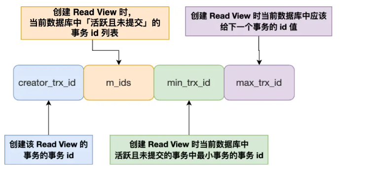
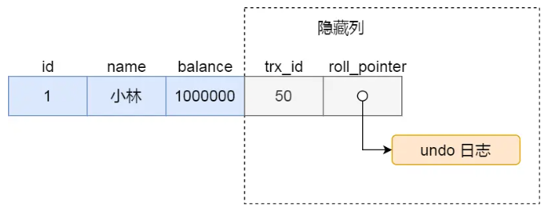
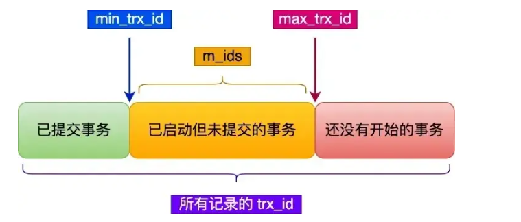
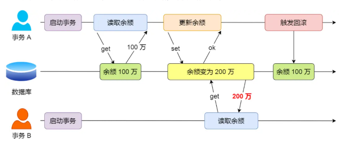
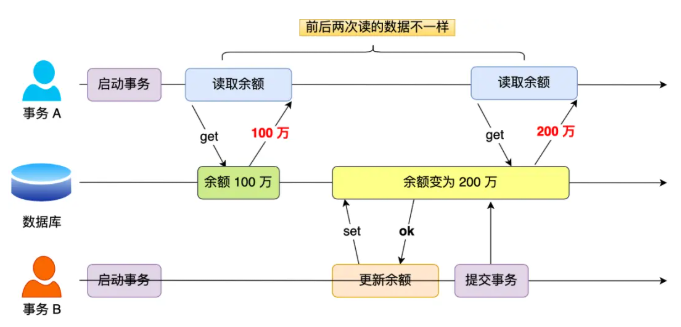
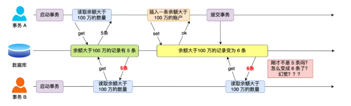
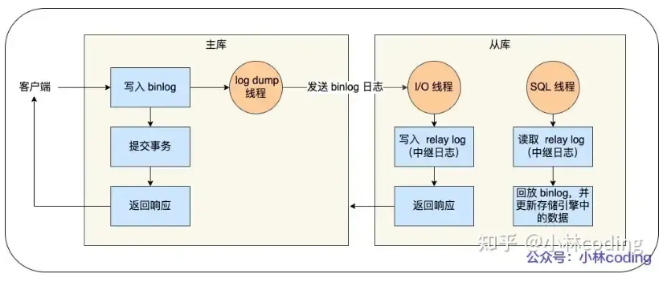

## **3. InnoDB 数据结构**


InnoDB 的数据是按页来管理的，表数据和索引底层主要用 B+ 树组织。
主键索引的叶子节点直接存整行数据，所以叫聚簇索引；普通索引的叶子节点存的是主键值，查到后还要再回主键索引找一次，这就是回表。


InnoDB 还有缓冲池、日志、事务这些机制.

## **4. B+ 树和二叉树区别**

**MySQL / 数据结构**。

普通二叉树层高容易很高，数据一多，查一次要走很多层，不适合磁盘场景。
B+ 树是多叉树，一个节点可以存很多 key，所以树会更矮，磁盘 IO 次数更少，更适合数据库索引。
另外 B+ 树的叶子节点之间通常是有序链表，范围查询特别方便，这也是数据库很喜欢它的原因。

## **5. 事务隔离级别**

标准的 4 个隔离级别：

- 读未提交
- 读已提交
- 可重复读
- 串行化

隔离级别越高，并发性能一般越差，但数据越稳定。
MySQL 里默认一般是可重复读

## **6.可重复读怎么实现的**


## **7. MySQL 中的内存碎片说一下**


MySQL 在频繁插入、删除、更新之后，数据页里可能会出现不连续、空洞变多的情况，这类现象可以理解成碎片。
碎片多了以后，空间利用率会下降，扫描和访问效率也可能变差。

如果是 InnoDB，数据和索引都是按页管理的，频繁变化后页内、页间都可能出现碎片。
常见处理思路就是做表整理、重建表，或者在设计上尽量减少大规模频繁变更带来的影响。

# 索引

## 1.MySQL 索引的分类？

按功能分，有主键索引、唯一索引、普通索引、联合索引；

按存储方式分，常见有聚簇索引和非聚簇索引。
如果是 InnoDB，主键索引对应的是聚簇索引，叶子节点直接存整行数据；普通索引叶子节点一般存主键值，需要时再回表。


## 2.索引的数据结构？**

MySQL 里最常见的是 B+ 树。
数据库不用普通二叉树，主要是因为数据量大时树会太高，磁盘 IO 次数太多；B+ 树一个节点能存很多 key，树更矮，更适合磁盘场景。
而且 B+ 树叶子节点之间是有序的，范围查询很方便。

如果追问哈希索引，你再补一句：哈希更适合等值查找，不适合范围查询。

## 3.执行计划里索引长度有什么用？


这次查询实际用了索引的多少字节。
它可以帮助我们判断联合索引到底用了几列，是不是只用了前缀，是不是没完全利用上。
比如联合索引建了三列，结果执行计划里看出来只用到前两列，那就说明后面的条件可能没真正吃到索引。
所以它的价值主要是辅助分析索引利用率。

## 4.MySQL 哪些场景会导致索引失效？※※

第一，在索引列上做函数、计算、类型转换，索引容易失效。
第二，联合索引没有按最左匹配来用。
第三，模糊查询如果是前面带百分号，基本走不了索引。
第四，or 用得不合适，也可能导致索引效果不好。
第五，表里数据量不大，或者筛出来的数据太多，数据库觉得全表扫更划算，也可能不走索引。
**MySQL -> 索引**

## 5.InnoDB 的索引介绍一下

InnoDB 最核心的索引结构就是 B+ 树。
主键索引是**聚簇索引**，叶子节点直接存整行数据；

普通索引叶子节点存的是主键值，所以通过普通索引查数据时，很多时候还要再回主键索引找一次。
所以 InnoDB 里主键设计很重要，因为整张表的数据本身就是按主键组织的。

## 6.为什么回表慢？

回表慢，本质上是因为查了两次。
**先走普通索引**，拿到主键，再根据主键去聚簇索引里查整行数据。
如果扫描的数据很多，就会多出大量随机读取，性能自然会差。
所以优化思路一般就是尽量让查询走覆盖索引，也就是在索引里就把需要的字段拿全，别再回表。

## 7.MySQL 联合索引的排序是怎么样的？区分度怎么理解？什么时候把一个字段放进联合索引？什么时候会把低区分度状态值加进索引？


先说联合索引的排序。
联合索引在底层是**按建索引**时字段的顺序来排的。
比如 `(a, b, c)`，会先按 a 排，a 相同再按 b 排，b 相同再按 c 排。
所以它遵循最左匹配原则，查询条件最好从左往右用。

再说区分度。
区分度可以理解成“这个字段把数据区分开的能力强不强”。
像用户 id、订单号，区分度就很高；性别、状态这种值就很少，区分度就低。
区分度越高，通常越适合放在索引前面，因为筛选能力强。

什么时候把字段放进联合索引？
一般看几个点：

- 这个字段是不是高频查询条件

- 它是不是经常和别的字段一起查

- 它能不能减少回表

- 它的顺序能不能兼顾筛选、排序、分组

  

**什么时候会把低区分度状态值放进索引？**
不是说低区分度就一定不能放。
如果查询经常是这种形式：

- where status = '待处理' and create_time > ?
- where status = '已失败' and retry_count < ?

那状态值虽然区分度低，但如果它经常和别的高区分度字段一起出现，放在联合索引里仍然有价值。
通常它不适合单独建索引，但可以作为联合索引中的一列，尤其是在业务查询高度固定的时候。


## 8.数据库的索引失效的几个例子

面试版本：数据库索引失效常见有这几种情况：

一是使用左模糊或左右模糊查询会失效；

二是对索引列使用函数或做表达式计算会失效；

三是字符串类型的索引列和数字比较时发生隐式类型转换会失效；

四是联合索引没遵循最左匹配原则会失效；

五是 WHERE 子句里 OR 前后的列只有一侧是索引列时会失效。


6 种会发生索引失效的情况：

- 当我们使用左或者左右模糊匹配的时候，也就是 like % xx 或者 like % xx% 这两种方式都会造成索引失效；
- 当我们在查询条件中对索引列使用函数，就会导致索引失效。
- 当我们在查询条件中对索引列进行表达式计算，也是无法走索引的。
- MySQL 在遇到字符串和数字比较的时候，会自动把字符串转为数字，然后再进行比较。如果字符串是索引列，而条件语句中的输入参数是数字的话，那么索引列会发生隐式类型转换，由于隐式类型转换是通过 CAST 函数实现的，等同于对索引列使用了函数，所以就会导致索引失效。
- 联合索引要能正确使用需要遵循最左匹配原则，也就是按照最左优先的方式进行索引的匹配，否则就会导致索引失效。
- 在 WHERE 子句中，如果在 OR 前的条件列是索引列，而在 OR 后的条件列不是索引列，那么索引会失效。


# SQL优化

## 1.怎么优化慢查询？/了解sql优化吗※※※

“先定位，再优化”。
先通过慢查询日志、监控、执行计划找到真正慢的 SQL，再看它有没有走索引、扫了多少行、有没有回表、排序、临时表。再结合业务看是不是查的数据太多、关联太复杂、分页太深。
优化常见手段就是：补合适索引、改 SQL 写法、少查无用字段、避免深分页、必要时做缓存或者拆分。

重点是体现有排查顺序，不是上来就说“加索引”。


# 锁

## 1.MySQL 怎么实现乐观锁？比如扣减存款怎么做？

乐观锁的核心思想是：
**默认先不加锁，更新时再判断这条数据是不是被别人改过。**

最常见有两种做法：

第一种，用版本号。
表里加一个 version 字段，更新时带上旧版本号：

```java
update account
set balance = balance - 100, version = version + 1
where id = 1 and version = 3 and balance >= 100;

```

如果更新成功，说明这期间没人改过；如果影响行数是 0，说明版本不对，或者余额不够，需要重试或提示失败。

第二种，用当前值做条件。
比如直接把原余额带上：

```java
update account
set balance = balance - 100
where id = 1 and balance = 1000;

```

但这种方式一般不如版本号通用，所以生产里更常见的是版本号方案。


乐观锁不是先锁住，而是更新时带条件，只有数据版本没变才更新成功。

## 2.讲一下 mysql 里的锁？


MySQL 的锁按范围分**全局锁**、**表级锁**和**行级锁**：

全局锁会让整个库只读，用来做全库备份；

表级锁包括表锁、元数据锁、意向锁和自增锁，元数据锁是为了**保护表结构不被乱改**；

行级锁只有 InnoDB 支持，包含记录锁、间隙锁和临键锁，临键锁是为了在可重复读级别下解决幻读问题。


在 MySQL 里，根据加锁的范围，可以分为全局锁、表级锁和行级锁三类。

- **全局锁**：通过 `flush tables with read lock` 语句会将整个数据库就处于只读状态了，这时其他线程执行以下操作，增删改或者表结构修改都会阻塞。全局锁主要应用于做全库逻辑备份，这样在备份数据库期间，不会因为数据或表结构的更新，而出现备份文件的数据与预期的不一样。

- 表级锁：MySQL 里面表级别的锁有这几种：

  - 表锁：通过 `lock tables` 语句可以对表加表锁，表锁除了会限制别的线程的读写外，也会限制本线程接下来的读写操作。
  - 元数据锁（MDL）：当我们对数据库表进行操作时，会自动给这个表加上 MDL，对一张表进行 CRUD 操作时，加的是 MDL 读锁；对一张表做结构变更操作的时候，加的是 MDL 写锁；MDL 是为了保证当用户对表执行 CRUD 操作时，防止其他线程对这个表结构做了变更。
  - 意向锁：当执行插入、更新、删除操作，需要先对表加上「意向独占锁」，然后对该记录加独占锁。意向锁的目的是为了快速判断表里是否有记录被加锁。
  - AUTO-INC 锁：针对自增主键的锁，用于保证自增 ID 生成的唯一性。

- 行级锁：InnoDB 引擎是支持行级锁的，而 MyISAM 引擎并不支持行级锁。

  - 记录锁（Record Lock）：锁住的是一条记录。而且记录锁是有 S 锁和 X 锁之分的，满足读写互斥，写写互斥。
  - 间隙锁（Gap Lock）：只存在于可重复读隔离级别，目的是为了解决可重复读隔离级别下幻读的现象。
  - Next-Key Lock 称为临键锁，是 Record Lock + Gap Lock 的组合，锁定一个范围，并且锁定记录本身。

  

### 


# 事务

## 1.谈谈你对数据库中的事务的理解


面试版本：

数据库事务有**原子性**、**一致性**、**隔离性**、**持久性**这四大核心特性：

原子性保证事务里的操作要么全成要么全败，出错就回滚；

一致性保证事务前后数据的完整性约束不变；

隔离性让多个并发事务互不干扰，避免数据不一致；

持久性保证事务提交后修改永久生效，就算系统故障也不会丢失。

在 MySQL 的 InnoDB 引擎里，持久性靠重做日志保证，原子性靠回滚日志保证，隔离性靠多版本并发控制或锁机制实现，一致性则是前三者共同保障的结果。


mysql 事务具备 ACID 特性：

- **原子性（Atomicity）**：一个事务中的所有操作，要么全部完成，要么全部不完成，不会结束在中间某个环节，而且事务在执行过程中发生错误，会被回滚到事务开始前的状态，就像这个事务从来没有执行过一样，就好比买一件商品，购买成功时，则给商家付了钱，商品到手；购买失败时，则商品在商家手中，消费者的钱也没花出去。
- **一致性（Consistency）**：是指事务操作前和操作后，数据满足完整性约束，数据库保持一致性状态。比如，用户 A 和用户 B 在银行分别有 800 元和 600 元，总共 1400 元，用户 A 给用户 B 转账 200 元，分为两个步骤，从 A 的账户扣除 200 元和对 B 的账户增加 200 元。一致性就是要求上述步骤操作后，最后的结果是用户 A 还有 600 元，用户 B 有 800 元，总共 1400 元，而不会出现用户 A 扣除了 200 元，但用户 B 未增加的情况（该情况，用户 A 和 B 均为 600 元，总共 1200 元）。
- **隔离性（Isolation）**：数据库允许多个并发事务同时对其数据进行读写和修改的能力，隔离性可以防止多个事务并发执行时由于交叉执行而导致数据的不一致，因为多个事务同时使用相同的数据时，不会相互干扰，每个事务都有一个完整的数据空间，对其他并发事务是隔离的。也就是说，消费者购买商品这个事务，是不影响其他消费者购买的。
- **持久性（Durability）**：事务处理结束后，对数据的修改就是永久的，即便系统故障也不会丢失。

MySQL InnoDB 引擎通过什么技术来保证事务的这四个特性的呢？

- 持久性是通过 redo log（重做日志）来保证的；
- 原子性是通过 undo log（回滚日志）来保证的；
- 隔离性是通过 MVCC（多版本并发控制）或锁机制来保证的；
- 一致性则是通过持久性 + 原子性 + 隔离性来保证；


## 2.介绍 MVCC 的原理

MVCC 即**多版本并发控制**，核心是通过**数据快照**和**版本链**实现**非阻塞读**，**让多个事务能同时读取同一行数据而互不干扰**。它主要靠 Read View 和隐藏字段实现：

InnoDB 表的聚簇索引里有事务 ID 和回滚指针两个隐藏列，用来记录数据版本和版本链；

Read View 相当于数据快照，读提交隔离级别在每次查询前生成新快照，可重复读则在事务第一次查询时生成快照并复用，再通过快照里的活跃事务 ID 列表、最小 / 最大事务 ID 等规则，判断数据版本对当前事务是否可见，最终实现并发事务的隔离和非阻塞读取。


扩展：

MVCC 允许多个事务同时读取同一行数据，而不会彼此阻塞，每个事务看到的数据版本是该事务开始时的数据版本。这意味着，如果其他事务在此期间修改了数据，正在运行的事务仍然看到的是它开始时的数据状态，从而实现了非阻塞读操作。

对于「读提交」和「可重复读」隔离级别的事务来说，它们是通过 Read View 来实现的，它们的区别在于创建 Read View 的时机不同，大家可以把 Read View 理解成一个数据快照，就像相机拍照那样，定格某一时刻的风景。

- 「读提交」隔离级别是在「每个 select 语句执行前」都会重新生成一个 Read View；
- 「可重复读」隔离级别是执行第一条 select 时，生成一个 Read View，然后整个事务期间都在用这个 Read View。

Read View 有四个重要的字段：



- m_ids：指的是在创建 Read View 时，当前数据库中「活跃事务」的事务 id 列表，注意是一个列表，“活跃事务” 指的就是，启动了但还没提交的事务。
- min_trx_id：指的是在创建 Read View 时，当前数据库中「活跃事务」中事务 id 最小的事务，也就是 m_ids 的最小值。
- max_trx_id：这个并不是 m_ids 的最大值，而是创建 Read View 时当前数据库中应该给下一个事务的 id 值，也就是全局事务中最大的事务 id 值 + 1；
- creator_trx_id：指的是创建该 Read View 的事务的事务 id。

对于使用 InnoDB 存储引擎的数据库表，它的聚簇索引记录中都包含下面两个隐藏列：



- trx_id，当一个事务对某条聚簇索引记录进行改动时，就会把该事务的 id 记录在 trx_id 隐藏列里；
- roll_pointer，每次对某条聚簇索引记录进行改动时，都会把旧版本的记录写入到 undo 日志中，然后这个隐藏列是个指针，指向每一个旧版本记录，于是就可以通过它找到修改前的记录。

在创建 Read View 后，我们可以将记录中的 trx_id 划分这三种情况：



一个事务去访问记录的时候，除了自己的更新记录总是可见之外，还有这几种情况：

- 如果记录的 trx_id 值小于 Read View 中的 min_trx_id 值，表示这个版本的记录是在创建 Read View 前已经提交的事务生成的，所以该版本的记录对当前事务可见。

- 如果记录的 trx_id 值大于等于 Read View 中的 max_trx_id 值，表示这个版本的记录是在创建 Read View 后才启动的事务生成的，所以该版本的记录对当前事务不可见。

- 如果记录的 trx_id 值在 Read View 的 min_trx_id 和 max_trx_id 之间，需要判断 trx_id 是否在 m_ids 列表中：

  

  ○ 如果记录的 trx_id 在 m_ids 列表中，表示生成该版本记录的活跃事务依然活跃着（还没提交事务），所以该版本的记录对当前事务不可见。

  

  ○ 如果记录的 trx_id 不在 m_ids 列表中，表示生成该版本记录的活跃事务已经被提交，所以该版本的记录对当前事务可见。

这种通过「版本链」来控制并发事务访问同一个记录时的行为就叫 MVCC（多版本并发控制）。

## 3.事务并发会产生什么现象？

面试版本：

事务并发时主要会出现三种问题**：一是脏读**，也就是一个事务读到了另一个未提交事务修改的数据，若对方回滚就会读到无效数据；**二是不可重复读**，指同一个事务内多次读取同一条数据，结果因为其他事务提交了修改而不一样；**三是幻读**，指同一个事务内多次按条件查询记录数量，结果因为其他事务提交了插入 / 删除操作，导致前后数量不一致。


详细版本：

MySQL 服务端是允许多个客户端连接的，这意味着 MySQL 会出现同时处理多个事务的情况。

那么在同时处理多个事务的时候，就可能出现脏读、不可重复读、幻读的问题。

接下来，通过举例子给大家说明，这些问题是如何发生的。

------

### 脏读

如果一个事务「读到」了另一个「未提交事务修改过的数据」，就意味着发生了「脏读」现象。

举个栗子。

假设有 A 和 B 这两个事务同时在处理，事务 A 先开始从数据库中读取小林的余额数据，然后再执行更新操作，如果此时事务 A 还没有提交事务，而此时正好事务 B 也从数据库中读取小林的余额数据，那么事务 B 读取到的余额数据是刚才事务 A 更新后的数据，即使没有提交事务。

因为事务 A 是还没提交事务的，也就是它随时可能发生回滚操作，如果在上面这种情况事务 A 发生了回滚，那么事务 B 刚才得到的数据就是过期的数据，这种现象就被称为脏读。



------

### 不可重复读

在一个事务内多次读取同一个数据，如果出现前后两次读到的数据不一样的情况，就意味着发生了「不可重复读」现象。

举个栗子。

假设有 A 和 B 这两个事务同时在处理，事务 A 先开始从数据库中读取小林的余额数据，然后继续执行代码逻辑处理，**在这过程中如果事务 B 更新了这条数据，并提交了事务**，那么当事务 A 再次读取该数据时，就会发现前后两次读到的数据是不一致的，这种现象就被称为不可重复读。



------

### 幻读

在一个事务内多次查询某个符合查询条件的「记录数量」，如果出现前后两次查询到的记录数量不一样的情况，就意味着发生了「幻读」现象。

举个栗子。

假设事务 A 先从数据库查询账户余额大于 100 万的记录，发现共有 5 条，然后事务 B 插入了一条余额超过 100 万的账号，并提交了事务，此时数据库超过 100 万余额的账号个数就变为 6。

然后事务 A 再次查询账户余额大于 100 万的记录，此时查询到的记录数量有 6 条，发现和前一次读到的记录数量不一样了，就感觉发生了幻觉一样，这种现象就被称为幻读。




## 4.可重复读如何解决幻读？/Mysql如何防止幻读


面试版本：

在**可重复读隔离级别**下，MySQL 主要通过两种方式解决幻读：普通查询用多版本并发控制，靠**数据快照**实现无锁幻读规避；

加锁查询则用记录锁加间隙锁的组合锁，锁住范围防止新数据插入。


详细版本：

当同一个查询在不同的时间产生不同的结果集时，事务中就会出现所谓的幻象问题。例如，如果 SELECT 执行了两次，但第二次返回了第一次没有返回的行，则该行是 "幻像" 行。

按理论来说，只有到 可串行化 的最高隔离级别才能解决幻读问题，但是 MySql 在可重复读的隔离级别下就已经通过一些手段解决了幻读问题：

- 针对快照读（普通 select 语句），是通过 MVCC 方式解决了幻读。无锁化，生成 ReadView 时版本链上已经提交的事务可见。
- 针对当前读（select ... for update 等语句），是通过 next-key lock（记录锁 + 间隙锁）方式解决了幻读。每次都读最新记录，通过锁来控制并发。

这两个解决方案是很大程度上解决了幻读现象，但是还是有个别的情况造成的幻读现象是无法解决的。

------

## 5.如果要在一个表里面加入一个新的字段应该注意什么？

要注意这个表**是否有被其他事务正在读写**，如果有其他事务正在读写这张表，这时候在表增加字段可能会造成阻塞的问题。因为读写一张表的时候，加的是 MDL 读锁（表级锁），而且对一个表增加字段的时候会产生 MDL 写锁，这时候就发生了 MDL 读写锁冲突的问题。

------

## 隔离性有那些隔离级别？

## 

### 四个隔离级别*

1. **读未提交（Read Uncommitted）**：事务未提交的变更，其他事务就能看到。

2. **读已提交（Read Committed）**：只有事务提交后的变更，其他事务才能看到。

3. **可重复读（Repeatable Read）**：事务执行过程中，看到的数据和启动时一致（MySQL InnoDB 默认级别）。

4. **串行化（Serializable）**：对记录加读写锁，事务串行执行，完全避免并发问题。

   

针对不同的隔离级别，并发事务时可能发生的现象也会不同。

在「读未提交」隔离级别下，可能发生脏读、不可重复读和幻读现象;
在「读已提交」隔离级别下，可能发生不可重复读和幻读现象，但是不可能发生脏读现象;

在「可重复读」隔离级别下，可能发生幻读现象，但是不可能脏读和不可重复读现象;

在「串行化」隔离级别下，脏读、不可重复读和幻读现象都不可能会发生。


### Mysql默认是那个级别？

MySQL 默认隔离级别是「可重复读」，可以很大程度上避免幻读现象的发生（注意是很大程度上避免，并不是彻底避免），所以 MySQL 并不会使用「串行化」隔离级别来避免幻读现象的发生，因为使用「串行化」隔离级别会影响性能。


## 间隙锁的原理

间隙锁（Gap Lock）称为间隙锁，只存在于可重复读隔离级别，目的是为了解决可重复读隔离级别下幻读的现象。

假设，表中有一个范围 id 为（3，5）间隙锁，那么其他事务就无法插入 id = 4 这条记录了，这样就有效的防止幻读现象的发生。

间隙锁虽然存在 X 型间隙锁和 S 型间隙锁，但是并没有什么区别，间隙锁之间是兼容的，即两个事务可以同时持有包含共同间隙范围的间隙锁，并不存在互斥关系，因为间隙锁的目的是防止插入幻记录而提出的。


## 什么时候会加间隙锁？*

当你用 `for update` 做等值查询，但这条数据在表里不存在时，MySQL 会给这个查询加一个**间隙锁**，锁住这个不存在的数据前后的区间，防止别的事务往里面插数据，以此解决幻读问题。比如查 `id=2` 不存在，就会锁住 `(1,5)` 这个区间，别的事务想插 `id=3` 就会被挡住。

当使用**唯一索引**进行**等值查询**，且查询记录不存在时，InnoDB 会将 `next-key lock`（临键锁）退化成**间隙锁**。

### 示例流程

1. 事务 A 执行：`select * from user where id = 2 for update;`（表中不存在 `id=2` 的记录）

2. 事务会加两把锁：

   - 表级锁：X 型意向锁（IX）
   - 行级锁：X 型间隙锁，锁住的范围是 `(1, 5)`

   

3. 效果：其他事务插入 `id=2/3/4` 时会被阻塞；插入 `id=1/5` 时会报主键冲突（因为记录已存在）。


## MySQL 如何保证原子性？

MySQL 是靠 **undo log** 来保证事务原子性的。

每个事务执行修改操作前，MySQL 会先把修改前的旧数据写进 undo log 里。如果事务执行失败、报错或者执行了回滚命令，就可以通过 undo log 把数据恢复到修改前的状态，保证整个事务要么全部执行成功，要么全部回滚，这就实现了原子性。如果数据库在事务执行中崩溃，重启后也会根据 undo log 自动回滚未提交的事务。


通过 **undo log** 来保证原子性的。

undo log 是一种用于撤销回退的日志。在事务没提交之前，MySQL 会先记录更新前的数据到 undo log 日志文件里面，当事务回滚时，可以利用 undo log 来进行回滚。

**流程图逻辑：**

1. 事务开始

2. 执行事务

3. 记录 Undo Log

4. 检查是否发生崩溃：

   - 是 → 回滚事务

   - 否 → 检查是否 Commit：

     - 否 → 回滚事务
     - 是 → 事务已提交

     


## undo log 撤销的具体过程？

undo log 的撤销逻辑很简单：**执行什么操作，就记录对应的 “反向操作” 信息，回滚时直接执行反向操作即可**。比如插入就记主键，删记录；删除就记原数据，再插回去；更新就记旧值，改回去。


每当 InnoDB 引擎对一条记录进行操作（修改、删除、新增）时，要把回滚时需要的信息都记录到 undo log 里，比如：

- 在**插入**一条记录时，要把这条记录的主键值记下来，这样之后回滚时只需要把这个主键值对应的记录删掉就好了；
- 在**删除**一条记录时，要把这条记录中的内容都记下来，这样之后回滚时再把由这些内容组成的记录插入到表中就好了；
- 在**更新**一条记录时，要把被更新的列的旧值记下来，这样之后回滚时再把这些列更新为旧值就好了。

在发生回滚时，就读取 undo log 里的数据，然后做原先相反操作。比如当 delete 一条记录时，undo log 中会把记录中的内容都记下来，然后执行回滚操作的时候，就读取 undo log 里的数据，然后进行 insert 操作。

## 怎么决定建立哪些索引？

建索引主要看字段在**查询里的使用频率和区分度**：

- 适合建索引的情况：有唯一性约束的字段、经常出现在 WHERE/ORDER BY/GROUP BY 里的字段，这些能直接提升查询效率；
- 不适合建索引的情况：查询里用不到的字段、重复度很高的字段（比如性别）、数据量很小的表、频繁更新的字段，这些建了索引反而会拖慢写入速度，甚至优化器会直接不走索引。


什么时候适用索引？

- 字段有唯一性限制的，比如商品编码；
- 经常用于 `WHERE` 查询条件的字段，这样能够提高整个表的查询速度，如果查询条件不是一个字段，可以建立联合索引。
- 经常用于 `GROUP BY` 和 `ORDER BY` 的字段，这样在查询的时候就不需要再去做一次排序了，因为我们都已经知道了建立索引之后在 B+Tree 中的记录都是排序好的。

什么时候不需要创建索引？

- `WHERE` 条件、`GROUP BY`、`ORDER BY` 里用不到的字段，索引的价值是快速定位，如果起不到定位的字段通常是不需要创建索引的，因为索引是会占用物理空间的。
- 字段中存在大量重复数据，不需要创建索引，比如性别字段，只有男女，如果数据库表中，男女的记录分布均匀，那么无论搜索哪个值都可能得到一半的数据。在这些情况下，还不如不要索引，因为 MySQL 还有一个查询优化器，查询优化器发现某个值出现在表的数据行中的百分比很高的时候，它一般会忽略索引，进行全表扫描。
- 表数据太少的时候，不需要创建索引；
- 经常更新的字段不用创建索引，比如不要对电商项目的用户余额建立索引，因为索引字段频繁修改，会频繁维护索引结构，带来额外开销。


##  最左匹配是什么，举个例子？


最左匹配原则就是：**联合索引**是**按定义顺序排序的**，只有从**索引的第一个字段开始**，连续使用条件才能用上索引；**如果跳过前面的字段，直接用后面的字段查，索引就会失效**。比如 `(a,b,c)` 这个索引，`where a=1 and c=3` 只能用到 a 字段的索引，c 字段用不上，因为中间的 b 被跳过了。


最左匹配原则是**联合索引的匹配规则**，核心逻辑是：联合索引会按照索引定义的顺序，从最左边的字段开始依次匹配，只有连续的前缀条件才能用上索引，不遵循该规则会导致索引失效。

以联合索引 `(a, b, c)` 为例：

- 能用上索引的查询条件：

  - `where a = 1`
  - `where a = 1 and b = 2`
  - `where a = 1 and b = 2 and c = 3`

  

- 无法用上索引的查询条件：

  - `where b = 2`
  - `where c = 3`
  - `where b = 2 and c = 3`

  

原因是联合索引的结构是**先按 a 排序，a 相同再按 b 排序，b 相同再按 c 排序**，只有 a 是全局有序的，b、c 只在 a 相同的局部范围内有序。因此，查询必须从最左边的字段开始连续匹配，否则无法利用索引的有序性快速查找。


# 存储索引

## 讲一讲 mysql 的引擎吧，你有什么了解？

MySQL 最常用的两个存储引擎是 InnoDB 和 MyISAM：InnoDB 支持事务，是聚簇索引，用行锁，并发好，但 count (*) 要全表扫；MyISAM 不支持事务，是非聚簇索引，用表锁，并发差，但 count (*) 直接读变量更快，现在 MySQL 默认已经是 InnoDB 了。


MySQL 中常用的存储引擎分别是：MyISAM 存储引擎、InnoDB 存储引擎，他们的区别在于：

- **事务**：InnoDB 支持事务，MyISAM 不支持事务，这是 MySQL 将默认存储引擎从 MyISAM 变成 InnoDB 的重要原因之一。
- **索引结构**：InnoDB 是聚簇索引，MyISAM 是非聚簇索引。聚簇索引的文件存放在主键索引的叶子节点上，因此 InnoDB 必须要有主键，通过主键索引效率很高。但是辅助索引需要两次查询，先查询到主键，然后再通过主键查询到数据。因此，主键不应该过大，因为主键太大，其他索引也都会很大。而 MyISAM 是非聚簇索引，数据文件是分离的，索引保存的是数据文件的指针。主键索引和辅助索引是独立的。
- **锁粒度**：InnoDB 最小的锁粒度是**行锁**，MyISAM 最小的锁粒度是**表锁**。一个更新语句会锁住整张表，导致其他查询和更新都会被阻塞，因此并发访问受限。
- **count 的效率**：InnoDB 不保存表的具体行数，执行 `select count(*) from table` 时需要全表扫描。而 MyISAM 用一个变量保存了整个表的行数，执行上述语句时只需要读出该变量即可，速度很快。


# 主从复制

## MySQL 主从复制了解吗


MySQL 主从复制靠 binlog 实现异步同步，流程分三步：主库先写 binlog 再提交事务；从库用 I/O 线程拉取 binlog 写到中继日志；最后用 SQL 线程回放更新数据，实现主从一致，还能通过读写分离分担库压力。



MySQL 的主从复制依赖于 binlog，也就是记录 MySQL 上的所有变化并以二进制形式保存在磁盘上。复制的过程就是将 binlog 中的数据从主库传输到从库上。这个过程一般是**异步**的，也就是主库上执行事务操作的线程不会等待复制 binlog 的线程同步完成。

MySQL 集群的主从复制过程梳理成 3 个阶段：

- **写入 Binlog**：主库写 binlog 日志，提交事务，并更新本地存储数据。
- **同步 Binlog**：把 binlog 复制到所有从库上，每个从库把 binlog 写到暂存日志中。
- **回放 Binlog**：回放 binlog，并更新存储引擎中的数据。

具体详细过程如下：

- MySQL 主库在收到客户端提交事务的请求之后，会先写入 binlog，再提交事务，更新存储引擎中的数据，事务提交完成后，返回给客户端 “操作成功” 的响应。
- 从库会创建一个专门的 I/O 线程，连接主库的 log dump 线程，来接收主库的 binlog 日志，再把 binlog 信息写入 relay log 的中继日志里，再返回给主库 “复制成功” 的响应。
- 从库会创建一个用于回放 binlog 的线程，去读 relay log 中继日志，然后回放 binlog 更新存储引擎中的数据，最终实现主从的数据一致性。

在完成主从复制之后，你就可以在写数据时只写主库，在读数据时只读从库，这样即使写请求会锁表或者锁记录，也不会影响读请求的执行。

## 主从延迟都有什么处理方法？

**强制走主库方案**：对于大事务或资源密集型操作，直接在主库上执行，避免从库的额外延迟。

## B + 树的特点是什么？

面试版本：

B + 树是自平衡的多路查找树，所有叶子在同一层，操作复杂度是对数级；

非叶子节点只存索引，不存实际数据，用来指路；

所有数据都存在叶子节点里，而且叶子之间用指针连成链表，特别适合范围查询，所以 MySQL InnoDB 索引就用了 B + 树。

详细版本：

- B + 树是一种自平衡的多路查找树，所有叶节点都位于同一层，保证了树的平衡，使得搜索、插入和删除操作的时间复杂度为对数级别。
- 非叶节点仅包含索引信息，不存储具体的数据记录，它们只用来引导搜索到正确的叶节点。非叶节点的子树指针与关键字数量相同，每个子树指针指向一个子树，子树中的所有键值都在某个区间内。
- 所有数据记录都存储在叶节点中，且叶节点中的数据是按关键字排序的。叶节点包含实际的数据和关键字，它们是数据存储和检索的实体单元。叶节点之间通过指针相互链接，形成一个链表，便于范围查询和顺序遍历。

