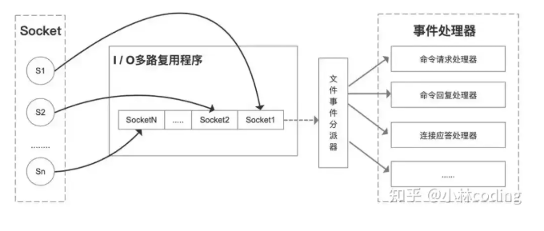
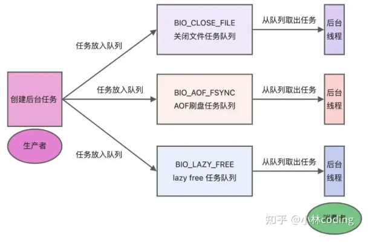
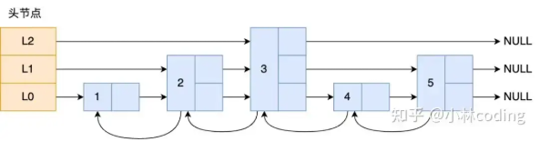
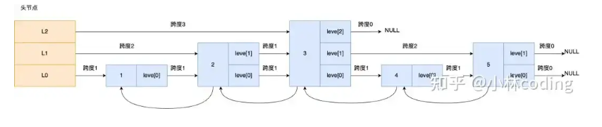
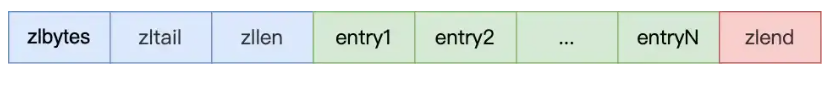
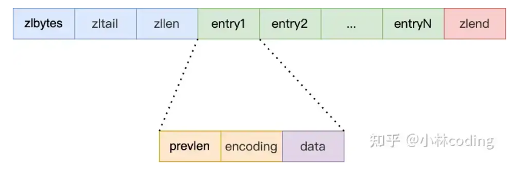
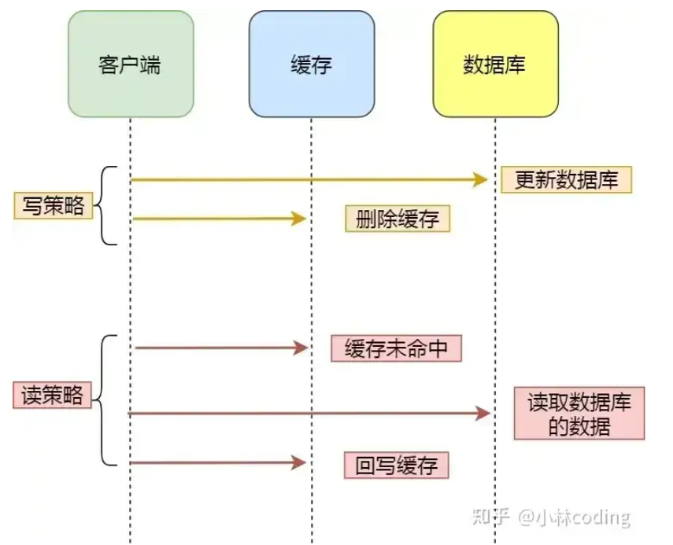
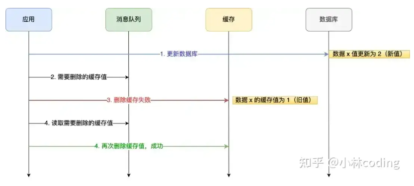

## **1. Redis IO 模型**

命令处理主要是单线程，网络读写在新版本里可以配合多线程优化。

为什么单线程还能快？
因为 Redis 本身是内存操作，执行很快，而且单线程避免了大量锁竞争和线程切换开销。
它底层用的是多路复用，也就是一个线程可以同时盯很多连接，谁有数据就处理谁，所以效率并不低。


Redis 不是简单粗暴地一个连接一个线程，而是靠多路复用提升网络处理效率，核心命令执行还是单线程模型。

## **2. Redis 淘汰策略，LRU、LFU**


Redis 内存满了，又来了新数据，这时候就要决定淘汰谁。

常见策略里，面试最爱问的就是这两个：

- LRU：最近最少使用。谁最近最久没被访问，就优先淘汰谁。
- LFU：最不经常使用。谁访问次数更少，就更容易被淘汰。

一般来说：

- 如果业务更看重“最近热点”，LRU 比较常见
- 如果业务更看重“长期热点”，LFU 更有优势
- Redis 里不只有这两种，还有只淘汰设置了过期时间的数据、随机淘汰、不淘汰等策略

## **3. Redis 的线程模型介绍**


Redis 的核心命令执行，主要还是单线程。
它快的原因不是线程多，而是因为它主要操作内存，而且单线程省掉了很多锁竞争和线程切换开销。

在新版本里，网络读写这部分可以用多线程优化，但执行命令的核心逻辑还是单线程思路。
所以：
Redis 是“核心执行单线程，网络处理可以多线程优化”。

## **4. Redis 的数据结构有哪些**

属于八股：Redis

常见的 Redis 数据类型有这些：

- 字符串
- 列表
- 哈希
- 集合
- 有序集合
- Stream

## 5.缓存穿透、击穿**


缓存穿透是指**查一个根本不存在的数据**，请求每次都打到数据库，因为缓存里也没有。
常见解决办法是：参数校验、布隆过滤器、查不到也缓存一个空值。

缓存击穿是指某个**热点 key 正好过期了，这一瞬间大量请求同时打到数据库**。
常见解决办法是：热点数据不过期、加互斥锁、逻辑过期、提前刷新。

缓存雪崩，就是大量 key 同时过期。

### 缓存雪崩、击穿、穿透解决方案


缓存雪崩是大量缓存同时失效，解决办法是**打散过期时间、加互斥锁或后台定时更新**；缓存击穿是**热点 key 突然失效，用互斥锁或让热点 key 永不过期**；缓存穿透是**查不存在的数据，靠校验请求、存空值或布隆过滤器挡住**，不让请求打到数据库。


缓存雪崩解决方案

- **均匀设置过期时间**：避免将大量缓存数据设置为同一过期时间，可给过期时间加上随机数，防止缓存同时失效。
- **互斥锁**：当缓存未命中时，加互斥锁保证同一时间只有一个请求构建缓存（从数据库读取并更新到 Redis），构建完成后释放锁；未获取锁的请求可等待、返回空值或默认值，同时要设置锁超时避免死锁。
- **后台更新缓存**：让缓存 “永久有效”，将缓存更新工作交给后台线程定时处理，业务线程不再负责缓存重建。

------

缓存击穿解决方案

- **互斥锁方案**：保证同一时间只有一个业务线程更新缓存，未获取锁的请求要么等待锁释放后重新读取缓存，要么返回空值或默认值。
- **不给热点数据设置过期时间**：由后台异步更新缓存，或在热点数据即将过期前提前通知后台线程更新缓存并重置过期时间。

------

缓存穿透解决方案

- **非法请求限制**：在 API 入口处校验请求参数合法性，过滤非法值和不存在字段，恶意请求直接返回错误，避免进一步访问缓存和数据库。
- **缓存空值 / 默认值**：针对查询不存在的数据，在缓存中设置空值或默认值，让后续请求直接从缓存读取，不再查询数据库。
- **布隆过滤器**：写入数据库时用布隆过滤器标记数据，请求时先查询布隆过滤器判断数据是否存在，不存在则直接返回，避免穿透到数据库；Redis 自身也支持布隆过滤器。

### 


## **6. Redis 为什么那么快/性能好的原因是？****

Redis 之所以快，主要有三点：

一是绝大部分操作在内存中完成，用了高效的数据结构，性能瓶颈不在 CPU；

二是单线程模型避免了多线程竞争和切换开销，也不会有死锁问题；

三是靠 I/O 多路复用，用一个线程同时处理大量客户端连接的读写事件，实现高并发处理

## **7. Redis 7.0 后加入了多线程，具体针对哪一方面的**

Redis 7 之后的多线程，重点不是把所有命令都改成多线程并发执行，**核心还是用在网络读写、协议解析、后台任务这些地方**，而不是把数据命令处理完全并行化。真正对共享数据结构的核心命令执行，主线程仍然是主角，这样做是为了保持实现简单，也避免大量加锁把性能吃掉。**Redis 的多线程主要优化的是 IO 和一些辅助处理，不是把业务命令彻底改成多线程抢锁执行。**

## **8. Redis 持久化机制有几种，RDB 会丢数据吗**

Redis 持久化主要有两种：RDB 和 AOF。RDB 是定时把某个时间点的数据做成快照，恢复快，文件也紧凑；AOF 是把写命令追加记录下来，数据更完整。RDB 会不会丢数据？会。因为它是按时间点做快照，比如你 5 分钟做一次快照，那宕机时，最近这几分钟的数据就可能丢。AOF 相对更稳，尤其是每秒刷盘的策略，最多丢 1 秒左右数据。实际生产里很多时候是两种一起开，兼顾恢复速度和数据安全。**RDB 恢复快但可能丢一段时间的数据，AOF 更安全但文件更大、恢复更慢。**

## 9.**Redis怎么实现的io多路复用？**

面试版本：

Redis **是单线程的**，为了避免单个客户端 I/O 阻塞导致整个服务不可用，它采用了 I/O 多路复用技术：用**一个线程**同时**监控多个客户端连接的读写状态**，把每个连接封装成事件，等连接就绪后再处理，这样就不会阻塞等待；普通查询靠事件驱动处理，加锁查询则用锁控制并发，整体提升了单线程下的网络通信性能。

------

详解：

为什么 Redis 中要使用 I/O 多路复用这种技术呢？

因为 Redis 是跑在「单线程」中的，所有的操作都是按照顺序线性执行的，但是由于读写操作等待用户输入或输出都是阻塞的，所以 I/O 操作在一般情况下往往不能直接返回，这会导致某一文件的 I/O 阻塞导致，整个进程无法对其它客户提供服务。而 I/O 多路复用就是为了解决这个问题而出现的。为了让单线程 (进程) 的服务端应用同时处理多个客户端的事件，Redis 采用了 IO 多路复用机制。

这里「多路」指的是多个网络连接客户端，「复用」指的是复用同一个线程 (单进程)。I/O 多路复用其实是使用一个线程来检查多个 Socket 的就绪状态，在单个线程中通过记录跟踪每一个 socket（I/O 流）的状态来管理处理多个 I/O 流。



Redis 的 I/O 多路复用模型描述说明:

- 一个 socket 客户端与服务端连接时，会生成对应一个套接字描述符 (套接字描述符是文件描述符的一种)，每一个 socket 网络连接其实都对应一个文件描述符。
- 多个客户端与服务端连接时，Redis 使用 I/O 多路复用程序 将客户端 socket 对应的 FD 注册到监听列表 (一个队列) 中。当客服端执行 read、write 等操作命令时，I/O 多路复用程序会将命令封装成一个事件，并绑定到对应的 FD 上。
- 文件事件处理器使用 I/O 多路复用模块同时监控多个文件描述符（fd）的读写情况，当 accept、read、write 和 close 文件事件产生时，文件事件处理器就会回调 FD 绑定的事件处理器处理相关命令操作。
- 例如：以 Redis 的 I/O 多路复用程序 epoll 函数为例。多个客户端连接服务端时，Redis 会将客户端 socket 对应的 fd 注册进 epoll，然后 epoll 同时监听多个文件描述符 (FD) 是否有数据到来，如果有数据来了就通知事件处理器赶紧处理，这样就不会存在服务端一直等待某个客户端给数据的情形。
- 整个文件事件处理器是在单线程上运行的，但是通过 I/O 多路复用模块的引入，实现了同时对多个 FD 读写的监控，当其中一个 client 端达到写或读的状态，文件事件处理器就马上执行，从而就不会出现 I/O 堵塞的问题，提高了网络通信的性能。
- Redis 的 I/O 多路复用模式使用的是 Reactor 设置模式的方式来实现。

## Redis 的网络模型是怎样的？

面试版本

Redis 6.0 之前用的是**单 Reactor 单线程网络模型**，靠一个线程处理所有连接的接收、读写和命令执行，实现简单且适合 Redis 这种内存级快速操作的场景，但没法充分利用多核 CPU；到 6.0 之后，把网络 I/O 部分改成多线程来提升并行度，不过命令执行还是保持单线程，避免并发问题。

------

Redis 6.0 版本之前，是用的是单 Reactor 单线程的模式


单 Reactor 单进程的方案因为全部工作都在同一个进程内完成，所以实现起来比较简单，不需要考虑进程间通信，也不用担心多进程竞争。但是，这种方案存在 2 个缺点：

- 第一个缺点，因为只有一个进程，无法充分利用 多核 CPU 的性能；
- 第二个缺点，Handler 对象在业务处理时，整个进程是无法处理其他连接的事件的，如果业务处理耗时比较长，那么就造成响应的延迟；

所以，单 Reactor 单进程的方案不适用计算机密集型的场景，只适用于业务处理非常快速的场景。

Redis 是由 C 语言实现的，在 Redis 6.0 版本之前采用的正是「单 Reactor 单进程」的方案，因为 Redis 业务处理主要是在内存中完成，操作的速度是很快的，性能瓶颈不在 CPU 上，所以 Redis 对于命令的处理是单进程的方案。

到 Redis 6.0 之后，就将网络 IO 的处理改成多线程的方式了，目的是为了这是因为随着网络硬件的性能提升，Redis 的性能瓶颈有时会出现在网络 I/O 的处理上。

所以为了提高网络 I/O 的并行度，Redis 6.0 对于网络 I/O 采用多线程来处理。但是对于命令的执行，Redis 仍然使用单线程来处理，所以大家不要误解 Redis 有多线程同时执行命令。

------

### 

## Redis 哪些地方使用了多线程

Redis 并非完全单线程，它在多处使用了多线程：一是后台线程，2.6 版起处理关闭文件、AOF 刷盘，4.0 版后新增异步释放内存的线程，避免阻塞主线程；二是 6.0 版后引入多线程 I/O，用来并行处理网络读写，提升并发性能，但命令执行仍保持单线程，默认会额外创建 6 个线程，包括 3 个后台线程和 3 个 I/O 线程。


Redis 单线程指的是「接收客户端请求 -> 解析请求 -> 进行数据读写等操作 -> 发送数据给客户端」这个过程是由一个线程（主线程）来完成的，这也是我们常说 Redis 是单线程的原因。但是，Redis 程序并不是单线程的，Redis 在启动的时候，是会启动后台线程（BIO）的：

- Redis 在 2.6 版本，会启动 2 个后台线程，分别处理关闭文件、AOF 刷盘这两个任务；

- Redis 在 4.0 版本之后，新增了一个新的后台线程，用来异步释放 Redis 内存，也就是 lazyfree 线程。

  例如执行 unlink key/flushdb async/ flushall async

   等命令，会把这些删除操作交给后台线程来执行，好处是不会导致 Redis 主线程卡顿。因此，当我们要删除一个大 key 的时候，不要使用 del命令删除，因为 del是在主线程处理的，这样会导致 Redis 主线程卡顿，因此我们应该使用 unlink命令来异步删除大 key。

之所以 Redis 为「关闭文件、AOF 刷盘、释放内存」这些任务创建单独的线程来处理，是因为这些任务的操作都是很耗时的，如果把这些任务都放在主线程来处理，那么 Redis 主线程就很容易发生阻塞，这样就无法处理后续的请求了。后台线程相当于一个消费者，生产者把耗时任务丢到任务队列中，消费者（BIO）不停轮询这个队列，拿出任务就去执行对应的方法即可。



虽然 Redis 的主要工作（网络 I/O 和执行命令）一直是单线程模型，但是在 Redis 6.0 版本之后，也采用了多个 I/O 线程来处理网络请求，这是因为随着网络硬件的性能提升，Redis 的性能瓶颈有时会出现在网络 I/O 的处理上。

所以为了提高网络 I/O 的并行度，Redis 6.0 对于网络 I/O 采用多线程来处理。但是对于命令的执行，Redis 仍然使用单线程来处理，所以大家不要误解 Redis 有多线程同时执行命令。

Redis 官方表示，Redis 6.0 版本引入的多线程 I/O 特性对性能提升至少是一倍以上。

Redis 6.0 版本支持的 I/O 多线程特性，默认情况下 I/O 多线程只针对发送响应数据（write client socket），并不会以多线程的方式处理读请求（read client socket）。要想开启多线程处理客户端读请求，就需要把 Redis.conf 配置文件中的 `io-threads-do-reads` 配置项设为 yes。

```
//读请求也使用io多线程
io-threads-do-reads yes
```

同时，Redis.conf 配置文件中提供了 I/O 多线程个数的配置项。

```
// io-threads N，表示启用 N-1 个 I/O 多线程（主线程也算一个 I/O 线程）
io-threads 4
```

关于线程数的设置，官方的建议是如果为 4 核的 CPU，建议线程数设置为 2 或 3，如果为 8 核 CPU 建议线程数设置为 6，线程数一定要小于机器核数，线程数并不是越大越好。因此，Redis 6.0 版本之后，Redis 在启动的时候，默认情况下会**额外创建 6 个线程**（这里的线程数不包括主线程）：

- Redis-server：Redis 的主线程，主要负责执行命令；
- bio_close_file、bio_aof_fsync、bio_lazy_free：三个后台线程，分别异步处理关闭文件任务、AOF 刷盘任务、释放内存任务；
- io_thd_1、io_thd_2、io_thd_3：三个 I/O 线程，io-threads 默认是 4，所以会启动 3（4-1）个 I/O 多线程，用来分担 Redis 网络 I/O 的压力。


## 跳表和压缩列表是怎么实现的？

跳表是 Zset 的底层实现，它是多层级有序链表，靠随机生成节点层数实现 O (logN) 查找，节点里存元素、权重和**多层指针**，还带后向指针方便倒序；

压缩列表是 Redis 为省内存设计的连续内存结构，**靠表头字段快速定位首尾元素**，节点里存前节点长度、数据类型长度和实际数据，但会有连锁更新问题，后来被 quicklist 和 listpack 优化。

## 跳表

Redis 只有 Zset 对象的底层实现用到了跳表，跳表的优势是能支持平均 O (logN) 复杂度的节点查找。

链表在查找元素的时候，因为需要逐一查找，所以查询效率非常低，时间复杂度是 O (N)，于是就出现了跳表。跳表是在链表基础上改进过来的，实现了一种「多层」的有序链表，这样的好处是能快速定位数据。


那跳表长什么样呢？我这里举个例子，下图展示了一个层级为 3 的跳表：



图中头节点有 L0~L2 三个头指针，分别指向了不同层级的节点，然后每个层级的节点都通过指针连接起来：

- L0 层级共有 5 个节点，分别是节点 1、2、3、4、5；
- L1 层级共有 3 个节点，分别是节点 2、3、5；
- L2 层级只有 1 个节点，也就是节点 3。

如果我们要在链表中查找节点 4 这个元素，只能从头开始遍历链表，需要查找 4 次，而使用了跳表后，只需要查找 2 次就能定位到节点 4，因为可以在头节点直接从 L2 层级跳到节点 3，然后再往前遍历找到节点 4。

可以看到，这个查找过程就是在多个层级上跳来跳去，最后定位到元素。当数据量很大时，跳表的查找复杂度就是 O (logN)。

那跳表节点是怎么实现多层级的呢？这就需要看「跳表节点」的数据结构了，如下：

```java
typedef struct zskiplistNode {
    //Zset 对象的元素值
    sds ele;
    //元素权重值
    double score;
    //后向指针
    struct zskiplistNode *backward;

    //节点的level数组，保存每层上的前向指针和跨度
    struct zskiplistLevel {
        struct zskiplistNode *forward;
        unsigned long span;
    } level[];
} zskiplistNode;
```

Zset 对象要同时保存「元素」和「元素的权重」，对应到跳表节点结构里就是 sds 类型的 ele 变量和 double 类型的 score 变量。每个跳表节点都有一个后向指针（struct zskiplistNode *backward），指向前一个节点，目的是为了方便从跳表的尾节点开始访问节点，这样倒序查找时很方便。

跳表是一个带有层级关系的链表，而且每一层级可以包含多个节点，每一个节点通过指针连接起来，实现这一特性就是靠跳表节点结构体中的 zskiplistLevel 结构体类型的 level 数组。

level 数组中的每一个元素代表跳表的一层，也就是由 zskiplistLevel 结构体表示，比如 level [0] 就表示第一层，level [1] 就表示第二层。zskiplistLevel 结构体里定义了「指向下一个跳表节点的指针」和「跨度」，跨度时用来记录两个节点之间的距离。

比如，下面这张图，展示了各个节点的跨度。



第一眼看到跨度的时候，以为是遍历操作有关，实际上并没有任何关系，遍历操作只需要用前向指针（struct zskiplistNode *forward）就可以完成了。

Redis 跳表在创建节点的时候，随机生成每个节点的层数，并没有严格维持相邻两层的节点数量比例为 2:1 的情况。

具体的做法是，跳表在创建节点时候，会生成范围为 [0-1] 的一个随机数，如果这个随机数小于 0.25（相当于概率 25%），那么层数就增加 1 层，然后继续生成下一个随机数，直到随机数的结果大于 0.25 结束，最终确定该节点的层数。

这样的做法，相当于每增加一层的概率不超过 25%，层数越高，概率越低，层高最大限制是 64。

虽然我前面讲解跳表的时候，图中的跳表的「头节点」都是 3 层高，但是其实如果层高最大限制是 64，那么在创建跳表「头节点」的时候，就会直接创建 64 层高的头节点。


### 跳表的时间复杂度是多少？

跳表中查找一个元素的时间复杂度为 O (logn)，空间复杂度是 O (n)。

### 为什么 MySQL 不用 SkipList?

B + 树的高度在 3 层时存储的数据可能已达千万级别，但对于跳表而言同样去维护千万的数据量那么所造成的跳表层数过高而导致的磁盘 io 次数增多，也就是使用 B + 树在存储同样的数据下磁盘 io 次数更少。

------

## 压缩列表

压缩列表是 Redis 为了节约内存而开发的，它是由连续内存块组成的顺序型数据结构，有点类似于数组。



压缩列表在表头有三个字段：

- zlbytes，记录整个压缩列表占用对内存字节数；
- zltail，记录压缩列表「尾部」节点距离起始地址由多少字节，也就是列表尾的偏移量；
- zllen，记录压缩列表包含的节点数量；
- zlend，标记压缩列表的结束点，固定值 0xFF（十进制 255）。

在压缩列表中，如果我们要查找定位第一个元素和最后一个元素，可以通过表头三个字段（zllen）的长度直接定位，复杂度是 O (1)。而查找其他元素时，就没有这么高效了，只能逐个查找，此时的复杂度就是 O (N) 了，因此压缩列表不适合保存过多的元素。另外，压缩列表节点（entry）的构成如下：



压缩列表节点包含三部分内容：

- prevlen，记录了「前一个节点」的长度，目的是为了实现从后向前遍历；
- encoding，记录了当前节点实际数据的「类型和长度」，类型主要有两种：字符串和整数。
- data，记录了当前节点的实际数据，类型和长度都由 encoding 决定；

当我们往压缩列表中插入数据时，压缩列表就会根据数据类型是字符串还是整数，以及数据的大小，会使用不同空间大小的 prevlen 和 encoding 这两个元素里保存的信息，这种根据数据大小和类型进行不同的空间大小分配的设计思想，正是 Redis 为了节省内存而采用的。

压缩列表的缺点是会发生连锁更新的问题，因此连锁更新一旦发生，就会导致压缩列表占用的内存空间要多次重新分配，这就会直接影响到压缩列表的访问性能。

所以说，虽然压缩列表紧凑型的内存布局能节省内存开销，但是如果保存的元素数量增加了，或是元素变大了，会导致内存重新分配，最糟糕的是会有「连锁更新」的问题。

**因此，压缩列表只会用于保存的节点数量不多的场景，只要节点数量足够小，即使发生连锁更新，也是能接受的。**

虽说如此，Redis 针对压缩列表在设计上的不足，在后来的版本中，新增设计了两种数据结构：quicklist（Redis 3.2 引入）和 listpack（Redis 5.0 引入）。这两种数据结构的设计目标，就是尽可能地保持压缩列表节省内存的优势，同时解决压缩列表的「连锁更新」的问题。


## 如何保证缓存的一致性？

面试版本：

缓存本身基于 CAP 理论牺牲强一致性来换性能，设置过期时间也得拿捏好长短；要解决数据不一致和删缓存异常，主要有两个方案：一是用消息队列做删缓存重试，失败了就重新尝试，成功再移除消息，不过会有点业务代码侵入；二是订阅 MySQL binlog，通过 Canal 采集数据变更日志，再异步删缓存，这种方式更解耦且能保证最终一致性。




缓存是通过牺牲强一致性来提高性能的。这是由 CAP 理论决定的。缓存系统适用的场景就是非强一致性的场景，它属于 CAP 中的 AP。所以，如果需要数据库和缓存数据保持强一致，就不适合使用缓存。所以使用缓存提升性能，就是会有数据更新的延迟。这需要我们在设计时结合业务仔细思考是否适合用缓存。然后缓存一定要设置过期时间，这个时间太短、或者太长都不好：

- 太短的话请求可能会比较多的落到数据库上，这也意味着失去了缓存的优势。
- 太长的话缓存中的脏数据会使系统长时间处于一个延迟的状态，而且系统中长时间没有人访问的数据一直存在内存中不过期，浪费内存。

但是，通过一些方案优化处理，是可以**最终一致性**的。

针对删除缓存异常的情况，可以使用 2 个方案避免：

- 删除缓存重试策略（消息队列）
- 订阅 binlog，再删除缓存（Canal + 消息队列）

#### 消息队列方案

我们可以引入**消息队列**，将第二个操作（删除缓存）要操作的数据加入到消息队列，由消费者来操作数据。

- 如果应用删除缓存失败，可以从消息队列中重新读取数据，然后再次删除缓存，这个就是**重试机制**。当然，如果重试超过的一定次数，还是没有成功，我们就需要向业务层发送报错信息了。
- 如果删除缓存成功，就要把数据从消息队列中移除，避免重复操作，否则就继续重试。

举个例子，来说明重试机制的过程。



重试删除缓存机制还可以，就是会造成好多业务代码入侵。

------

#### 订阅 MySQL binlog，再操作缓存

「先更新数据库，再删缓存」的策略的第一步是更新数据库，那么更新数据库成功，就会产生一条变更日志，记录在 binlog 里。

于是我们就可以通过订阅 binlog 日志，拿到具体要操作的数据，然后再执行缓存删除，阿里巴巴开源的 Canal 中间件就是基于这个实现的。

Canal 模拟 MySQL 主从复制的交互协议，把自己伪装成一个 MySQL 的从节点，向 MySQL 主节点发送 dump 请求，MySQL 收到请求后，就会开始推送 Binlog 给 Canal，Canal 解析 Binlog 字节流之后，转换为便于读取的结构化数据，供下游程序订阅使用。

下图是 Canal 的工作原理：

```
数据库 --(binlog)--> Canal 中间件 --> 缓存的服务
                                      |
                                      ↓
                                  删除缓存
                                      |
                                      ↓
                                    Redis
```

将 binlog 日志采集发送到 MQ 队列里面，然后编写一个简单的缓存删除消费者订阅 binlog 日志，根据更新 log 删除缓存，并且通过 ACK 机制确认处理这条更新 log，保证数据缓存一致性。


# Redis 和 MySQL 如何保证一致性

Redis 和 MySQL 保证一致性，常用的方案是**先更数据库、再删缓存**，再给缓存加过期时间兜底。

理论上并发读写会出现不一致：读请求没写完缓存时，写请求更了数据库、删了缓存，最后读请求把旧值写回缓存。但实际中缓存操作比数据库快很多，这种情况概率极低，而且就算出现，下一次请求会缓存不命中，从数据库读最新值，不会一直不一致。再给缓存加过期时间，就算有脏数据，过期后也会自动更新，最终保证一致。、

------


可以采用「先更新数据库，再删除缓存」的更新策略 + 过期时间来兜底。

我们用「读 + 写」请求的并发的场景来分析。

假如某个用户数据在缓存中不存在，请求 A 读取数据时从数据库中查询到年龄为 20，在未写入缓存中时另一个请求 B 更新数据。它更新数据库中的年龄为 21，并且清空缓存。这时请求 A 把从数据库中读到的年龄为 20 的数据写入到缓存中。

最终，该用户年龄在缓存中是 20（旧值），在数据库中是 21（新值），缓存和数据库数据不一致。

从上面的理论上分析，先更新数据库，再删除缓存也是会出现数据不一致性的问题，但是在实际中，这个问题出现的概率并不高。

因为缓存的写入通常要远远快于数据库的写入，所以在实际中很难出现请求 B 已经更新了数据库并且删除了缓存，请求 A 才更新完缓存的情况。

而一旦请求 A 早于请求 B 删除缓存之前更新了缓存，那么接下来的请求就会因为缓存不命中而从数据库中重新读取数据，所以不会出现这种不一致的情况。

所以，「先更新数据库 + 再删除缓存」的方案，是可以保证数据一致性的。

而且为了确保万无一失，还给缓存数据加上了「过期时间」，就算在这期间存在缓存数据不一致，有过期时间来兜底，这样也能达到最终一致。

## 

