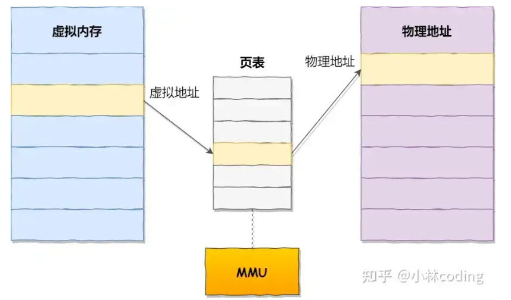
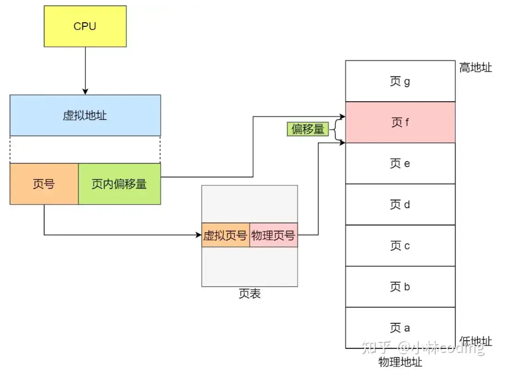

## *1.为什么 kill -9 可以杀死进程，进程被杀死后操作系统会有哪些变化**

kill -9 本质上是发了一个不能被忽略、不能被捕获的强制终止信号。
收到这个信号后，进程基本没有机会做善后，就会被系统直接干掉。

进程被杀后，操作系统一般会做这些事：

- 回收进程占用的大部分资源，比如内存
- 关闭它打开的文件描述符
- 把进程从调度队列里移除
- 通知父进程子进程状态变化

如果这个进程还有子进程，是否受影响，要看具体关系和管理方式，不是一定全部一起死。kill -9 是最强硬的方式，所以一般排查问题时不会优先上来就用，最好先尝试正常退出。

## **2. 进程退出会做哪些事**

进程退出时，系统一般会做资源清理和状态回收。

常见的包括：

- 释放进程占用的内存
- 关闭打开的文件、网络连接等资源
- 回收大部分内核资源
- 保存退出状态，供父进程获取
- 把进程从运行队列中移除

如果父进程没有及时回收子进程退出状态，子进程可能会短暂变成僵尸进程。

------

## **3. 说说 Linux 常用指令**

我常用的大概分几类：

- 文件和目录：ls、cd、pwd、mkdir、rm
- 查看文件：cat、less、tail
- 查找和搜索：find、grep
- 进程相关：ps（查看当前进程快照）、top（看整体 CPU 使用情况）、kill
- 权限相关：chmod、chown
- 网络相关：netstat、ss
- 系统状态：df、du、free


排查问题时最常用的是 tail 看日志，grep 搜关键字，ps 和 top 看进程，ss 或 netstat 看端口占用。

## **4. 操作系统进程的调度过程**


进程调度说白了就是，操作系统决定“下一秒让谁用 CPU”。
一个进程先进入就绪队列，调度器从里面挑一个出来执行；执行过程中如果时间片到了、遇到 IO 阻塞了，或者有更高优先级任务来了，就可能被切走，再换别的进程上 CPU。
整个过程就是：就绪、运行、被打断、再回就绪。
核心点就是操作系统不断在多个进程之间分配 CPU 时间。

## **4. 什么是内核态？什么是用户态？内核态和用户态的进程？**


**用户态**就是**普通程序运行的状态**，权限比较小，不能直接操作硬件。
**内核态**就是操作系统核心代码运行的状态，权限很高，可以访问硬件、管理内存、管理进程。

严格来说，不是说“有一种进程叫内核态进程，有一种叫用户态进程”，而是同一个进程在执行不同操作时，会在用户态和内核态之间切换。
比如你写个普通 Java 程序，大部分时间在用户态；当它发起系统调用，比如读文件、发网络请求时，就会切到内核态，由操作系统帮它完成。

## **5. 进程和线程的状态，切换的时机**

**操作系统 和 Java 并发**


进程常见状态可以记成：新建、就绪、运行、阻塞、结束。
线程在 Java 里常见状态有：新建、可运行、阻塞、等待、超时等待、结束。

切换时机常见有这些：

- 时间片用完了
- 发起 IO，被阻塞了
- 等锁，没抢到
- 调了 sleep、wait
- 当前线程执行完了

## 6.**讲一下io多路复用**


# 进程与线程

## 讲一下银行家算法

银行家算法的核心思想，就是在分配给进程资源前，**首先判断这个进程的安全性**，也就是预执行，判断分配后是否产生死锁现象。如果系统当前资源能满足其执行，则尝试分配，如果不满足则让该进程等待。

通过不断检查剩余可用资源是否满足某个进程的最大需求，如果可以则加入安全序列，并把该进程当前持有的资源回收；不断重复这个过程，看最后能否实现让所有进程都加入安全序列。**安全序列一定不会发生死锁，但没有死锁不一定是安全序列。**


详解：

系统发生死锁是很正常的，我们需要主动去预防死锁，即进行有序的资源分配，使用银行家算法。银行家算法是最有代表性的避免死锁的算法。为什么叫银行家算法呢？就是这个算法的逻辑很像银行放货的逻辑，也就是尽可能避免坏账的出现。银行家算法的业务逻辑如下。

- **不负荷执行**：一个进程的最大需求量不超过系统拥有的总资源数，才会被接纳执行。
- **可分期**：一个进程可以分期请求资源，但总请求书不可超过最大需求量。
- **推迟分配**：当系统现有资源数小于进程需求时，对进程的需求可以延迟分配，但总让进程在有限时间内获取资源。

听起来有点绕，我们还是举个例子来说明。假如系统中有三类互斥资源 R1、R2、R3，可用资源数分别是 9、8、5，在指定时刻有 P1、P2、P3、P4 和 P5 这五个进程，这些进程的对三类互斥资源的最大需求量和已分配资源数如下表所示，那么系统如何先后运行这五个进程，不会发生死锁问题？

表格

| 进程 | 最大需求量（分别为 R1 R2 R3） | 已分配资源数（分别为 R1 R2 R3） |
| :--: | :---------------------------: | :-----------------------------: |
|  P1  |             6 5 2             |              1 2 1              |
|  P2  |             2 2 1             |              2 1 1              |
|  P3  |             8 1 1             |              2 1 0              |
|  P4  |             1 2 1             |              1 2 0              |
|  P5  |             3 4 4             |              1 1 3              |

------

**第一步：分析**

首先分析首次需求的资源，**系统剩余可用资源数分别是 2、1、0**，各进程需要的资源数如下表所示。

资源 R1 的剩余可用资源数 = 9 - 1 - 2 - 2 - 1 - 1 = 2。

资源 R2 的剩余可用资源数 = 8 - 2 - 1 - 1 - 2 - 1 = 1。

资源 R3 的剩余可用资源数 = 5 - 1 - 1 - 0 - 0 - 3 = 0。

表格

| 进程 | 最大需求量 | 已分配资源数 | 首次分配需要的资源数 |
| :--: | :--------: | :----------: | :------------------: |
|  P1  |   6 5 2    |    1 2 1     |        5 3 1         |
|  P2  |   2 2 1    |    2 1 1     |        0 1 0         |
|  P3  |   8 1 1    |    2 1 0     |        6 0 1         |
|  P4  |   1 2 1    |    1 2 0     |        0 0 1         |
|  P5  |   3 4 4    |    1 1 3     |        2 3 1         |

根据银行家算法**不负荷原则**【一个进程的最大需求量不超过系统拥有的总资源数，才会被接纳执行】，优先给进程 P2 执行，因为剩余的 0 1 0 资源够让 P2 执行。

------

**第二步：执行 P2**

P2 执行之后，释放了刚刚放入的 2 1 0 资源，而且可以释放已分配的 2 1 1 资源，所以此时的资源剩余量。

资源 R1 的剩余可用资源数 = 原资源数 - 执行 P2 消耗数 + P2 执行完释放的资源数 = 2 - 0 + (2 + 0) = 4。

资源 R2 的剩余可用资源数 = 原资源数 - 执行 P2 消耗数 + P2 执行完释放的资源数 = 1 - 1 + (1 + 1) = 2。

资源 R3 的剩余可用资源数 = 原资源数 - 执行 P2 消耗数 + P2 执行完释放的资源数 = 0 - 0 + (0 + 1) = 1。

**执行完成 P2 后，操作系统剩余可用资源数为 4 2 1。**

表格

| 进程 | 最大需求量 | 已分配资源数 | 第二次分配需要的资源数 |
| :--: | :--------: | :----------: | :--------------------: |
|  P1  |   6 5 2    |    1 2 1     |         5 3 1          |
|  P2  |    完成    |     完成     |          完成          |
|  P3  |   8 1 1    |    2 1 0     |         6 0 1          |
|  P4  |   1 2 1    |    1 2 0     |         0 0 1          |
|  P5  |   3 4 4    |    1 1 3     |         2 3 1          |

------

**第三步：执行 P4**

此时操作系统剩余可用资源数为 4 2 1，只能执行进程 P4，因为其他进程资源不够。

P4 执行之后，释放了刚刚放入的 0 0 1 资源，而且可以释放已分配的 1 2 1 资源，所以此时的资源剩余量。

资源 R1 的剩余可用资源数 = 原资源数 - 执行 P4 消耗数 + P4 执行完释放的资源数 = 4 - 0 + (1 + 0) = 5。

资源 R2 的剩余可用资源数 = 原资源数 - 执行 P4 消耗数 + P4 执行完释放的资源数 = 2 - 0 + (2 + 0) = 4。

资源 R3 的剩余可用资源数 = 原资源数 - 执行 P4 消耗数 + P4 执行完释放的资源数 = 1 - 1 + (1 + 1) = 2。

**执行完成 P4 后，操作系统剩余可用资源数为 5 4 2。**

表格

| 进程 | 最大需求量 | 已分配资源数 | 第三次分配需要的资源数 |
| :--: | :--------: | :----------: | :--------------------: |
|  P1  |   6 5 2    |    1 2 1     |         5 3 1          |
|  P2  |    完成    |     完成     |          完成          |
|  P3  |   8 1 1    |    2 1 0     |         6 0 1          |
|  P4  |    完成    |     完成     |          完成          |
|  P5  |   3 4 4    |    1 1 3     |         2 3 1          |

------

**第四步：执行 P5**

此时操作系统剩余可用资源数为 5 4 2，只能执行进程 P5，因为其他进程资源不够。

P5 执行之后，释放了刚刚放入的 2 3 1 资源，而且可以释放已分配的 1 1 3 资源，所以此时的资源剩余量。

资源 R1 的剩余可用资源数 = 原资源数 - 执行 P5 消耗数 + P5 执行完释放的资源数 = 5 - 2 + (1 + 2) = 6。

资源 R2 的剩余可用资源数 = 原资源数 - 执行 P5 消耗数 + P5 执行完释放的资源数 = 4 - 3 + (1 + 3) = 5。

资源 R3 的剩余可用资源数 = 原资源数 - 执行 P5 消耗数 + P5 执行完释放的资源数 = 2 - 1 + (3 + 1) = 5。

**执行完成 P5 后，操作系统剩余可用资源数为 6 5 5。**

表格

| 进程 | 最大需求量 | 已分配资源数 | 第三次分配需要的资源数 |
| :--: | :--------: | :----------: | :--------------------: |
|  P1  |   6 5 2    |    1 2 1     |         5 3 1          |
|  P2  |    完成    |     完成     |          完成          |
|  P3  |   8 1 1    |    2 1 0     |         6 0 1          |
|  P4  |    完成    |     完成     |          完成          |
|  P5  |    完成    |     完成     |          完成          |

------

**第五步：执行 P1 或者 P3**

此时操作系统剩余可用资源数为 6 5 5，可以执行 P1 或 P3。

所以安全执行顺序为 `p2 => p4 => p5 => p1 => p3` 或 `p2 => p4 => p5 => p3 => p1`。


## 讲下为什么进程之下还要设计线程，线程之间怎么通信的

设计线程是为了在进程内实现并发，同时避免多进程的高开销，线程共享地址空间且能并行执行；

线程间通信主要靠五种同步方式：**互斥锁保证独占访问**、**读写锁优化读多写少场景**、**条件变量实现等待唤醒**、**自旋锁用忙等待减少上下文切换**、**信号量控制资源访问次数**，这些方式共同解决了线程间数据安全和协作的问题。


### 为什么要设计线程

我们举个例子，假设你要编写一个视频播放器软件，那么该软件功能的核心模块有三个：

- 从视频文件当中读取数据；
- 对读取的数据进行解压缩；
- 把解压缩后的视频数据播放出来；

对于单进程的实现方式，我想大家都会是以下这个方式：

```
main()
{
  while(1)
  {
    // 读取文件数据
    Read();
    // 解压缩数据
    Decompress();
    // 播放解压缩数据的数据
    Play();
  }
}
```

对于单进程的这种方式，存在以下问题：

- 播放出来的画面和声音会不连贯，因为当 CPU 能力不够强的时候，Read 的时候可能进程就等在这了，这样就会导致等半天才进行数据解压和播放；
- 各个函数之间不是并发执行，影响资源的使用效率；

那改进成多进程的方式：

```
main()
{
  while(1)
  {
    // 读取文件数据
    Read();
  }
}
```

```
main()
{
  while(1)
  {
    // 解压缩数据
    Decompress();
  }
}
```

```
main()
{
  while(1)
  {
    // 播放解压缩数据的数据
    Play();
  }
}
```

对于多进程的这种方式，依然会存在问题：

- 进程之间如何通信，共享数据？
- 维护进程的系统开销较大，如创建进程时，分配资源、建立 PCB；终止进程时，回收资源、撤销 PCB；进程切换时，保存当前进程的状态信息；

那到底如何解决呢？需要有一种新的实体，满足以下特性：

- 实体之间可以并发运行；
- 实体之间共享相同的地址空间；

这个新的实体，就是**线程 (Thread)**，线程之间可以并发运行且共享相同的地址空间。

------

### 线程间的通信方式

Linux 系统提供了五种用于线程通信的方式：**互斥锁、读写锁、条件变量、自旋锁和信号量**。

- **互斥锁（Mutex）**：互斥量 (mutex) 从本质上说是一把锁，在访问共享资源前对互斥量进行加锁，在访问完成后释放互斥量上的锁。对互斥量进行加锁以后，任何其他试图再次对互斥锁加锁的线程将会阻塞直到当前线程释放该互斥锁。如果释放互斥锁时有多个线程阻塞，所有在该互斥锁上的阻塞线程都会变成可运行状态，第一个变为运行状态的线程可以对互斥锁加锁，其他线程将会看到互斥锁依然被锁住，只能回去再次等待它重新变为可用。

  

- **条件变量（Condition Variables）**：条件变量 (cond) 是在多线程程序中用来实现 "等待 --> 唤醒" 逻辑常用的方法。条件变量利用线程间共享的全局变量进行同步的一种机制，主要包括两个动作：一个线程等待 "条件变量的条件成立" 而挂起；另一个线程使 "条件成立"。为了防止竞争，条件变量的使用总是和一个互斥锁结合在一起。线程在改变条件状态前必须首先锁住互斥量，函数 pthread_cond_wait 把自己放到等待条件的线程列表上，然后对互斥锁解锁 (这两个操作是原子操作)。在函数返回时，互斥量再次被锁住。

  

- **自旋锁（Spinlock）**：自旋锁通过 CPU 提供的 CAS 函数（Compare And Swap），在「用户态」完成加锁和解锁操作，不会主动产生线程上下文切换，所以相比互斥锁来说，会快一些，开销也小一些。一般加锁的过程，包含两个步骤：第一步，查看锁的状态，如果锁是空闲的，则执行第二步；第二步，将锁设置为当前线程持有；使用自旋锁的时候，当发生多线程竞争锁的情况，加锁失败的线程会「忙等待」，直到它拿到锁。CAS 函数就把这两个步骤合并成一条硬件级指令，形成原子指令，这样就保证了这两个步骤是不可分割的，要么一次性执行完两个步骤，要么两个步骤都不执行。这里的「忙等待」可以用 while 循环等待实现，不过最好是使用 CPU 提供的 PAUSE 指令来实现「忙等待」，因为可以减少循环等待时的耗电量。

  

- **信号量（Semaphores）**：信号量可以是命名的（有名信号量）或无名的（仅限于当前进程内的线程），用于控制对资源的访问次数。通常信号量表示资源的数量，对应的变量是一个整型（sem）变量。另外，还有两个原子操作的系统调用函数来控制信号量的，分别是：P 操作：将 sem 减 1，相减后，如果 sem < 0，则进程 / 线程进入阻塞等待，否则继续，表明 P 操作可能会阻塞；V 操作：将 sem 加 1，相加后，如果 sem <= 0，唤醒一个等待中的进程 / 线程，表明 V 操作不会阻塞；

  

- **读写锁（Read-Write Locks）**：读写锁从字面意思我们也可以知道，它由「读锁」和「写锁」两部分构成，如果只读取共享资源用「读锁」加锁，如果要修改共享资源则用「写锁」加锁。所以，读写锁适用于能明确区分读操作和写操作的场景。读写锁的工作原理是：当「写锁」没有被线程持有时，多个线程能够并发地持有读锁，这大大提高了共享资源的访问效率，因为「读锁」是用于读取共享资源的场景，所以多个线程同时持有读锁也不会破坏共享资源的数据。但是，一旦「写锁」被线程持有后，读线程的获取读锁的操作会被阻塞，而且其他写线程的获取写锁的操作也会被阻塞。所以说，写锁是独占锁，因为任何时刻只能有一个线程持有写锁，类似互斥锁和自旋锁，而读锁是共享锁，因为读锁可以被多个线程同时持有。知道了读写锁的工作原理后，我们可以发现，读写锁在读多写少的场景，能发挥出优势

# 内存管理

## 讲一下页表

页表是**虚拟内存和物理内存的映射表**，Linux 里每页是 4KB，靠内存管理单元**把虚拟地址转成物理地址**；虚拟地址分成页号和页内偏移，先查页表找到物理页号，再拼上偏移得到物理地址；分页不会有外部碎片，但程序不足一页时会浪费内存，产生内部碎片，访问不存在的页还会触发缺页异常去分配物理内存。


分页是把整个虚拟和物理内存空间切成一段段固定尺寸的大小。这样一个连续并且尺寸固定的内存空间，我们叫页（Page）。在 Linux 下，每一页的大小为 4KB。虚拟地址与物理地址之间通过页表来映射，如下图：



页表是存储在内存里的，**内存管理单元（MMU**）就做将虚拟内存地址转换成物理地址的工作。

而当进程访问的虚拟地址在页表中查不到时，系统会产生一个**缺页异常**，进入系统内核空间分配物理内存、更新进程页表，最后再返回用户空间，恢复进程的运行。

内存分页由于内存空间都是预先划分好的，也就不会像内存分段一样，在段与段之间会产生间隙非常小的内存，这正是分段会产生外部内存碎片的原因。而**采用了分页，页与页之间是紧密排列的，所以不会有外部碎片。**

但是，因为内存分页机制分配内存的最小单位是一页，即使程序不足一页大小，我们最少只能分配一个页，所以页内会出现内存浪费，所以针对**内存分页机制会有内部内存碎片的现象**。

在分页机制下，虚拟地址分为两部分**，页号和页内偏移**。页号作为页表的索引，**页表**包含物理页每页所在**物理内存的基地址**，这个基地址与页内偏移的组合就形成了物理内存地址，见下图。



总结一下，对于一个内存地址转换，其实就是这样三个步骤：

- 把虚拟内存地址，切分成页号和偏移量；
- 根据页号，从页表里面，查询对应的物理页号；
- 直接拿物理页号，加上前面的偏移量，就得到了物理内存地址。


# Linux 常用指令分类详解


top：查看资源使用情况，类似 windows 里的任务管理器

df /du：查看磁盘

ps：查看进程

kill：杀死进程

chmod /chown：文件权限管理

ls ll cd pwd mkdir rmdir rm cp mv touch：简单操作

| 指令      | 全称 / 含义             | 核心作用                                               |
| --------- | ----------------------- | ------------------------------------------------------ |
| **ls**    | list                    | 列出目录下的文件 / 文件夹                              |
| **ll**    | ls -l（别名）           | 列出目录下文件的**详细信息**（权限、大小、修改时间等） |
| **cd**    | change directory        | 切换当前工作目录                                       |
| **pwd**   | print working directory | 显示当前所在的**绝对路径**                             |
| **mkdir** | make directory          | 创建新的目录（文件夹）                                 |
| **rmdir** | remove directory        | 删除**空的**目录（只能删空文件夹）                     |
| **rm**    | remove                  | 删除文件 / 目录（功能强，需谨慎）                      |
| **cp**    | copy                    | 复制文件 / 目录                                        |
| **mv**    | move                    | 移动 / 重命名文件 / 目录                               |
| **touch** | touch                   | 创建**空文件**，或更新文件的时间戳                     |

find：查找文件

vi vim cat more less tail head grep：查看日志相关

| 需求场景                   | 首选命令      |
| -------------------------- | ------------- |
| 实时追踪日志               | `tail -f`     |
| 查看大文件、上下翻页、搜索 | `less`        |
| 查看小文件全部内容         | `cat`         |
| 过滤 / 搜索日志内容        | `grep`        |
| 编辑日志 / 配置文件        | `vim`         |
| 查看文件开头 / 末尾        | `head`/`tail` |

ping curl netstat ssh telnet ifconfig：网络通讯相关、


**ping**：测试网络是否连通，检测目标地址是否可达

**curl**：发起网络请求，常用于测试接口、获取网页内容

**netstat**：查看端口占用、网络连接状态

**ssh**：远程安全登录服务器，进行命令行操作

**telnet**：测试目标 IP + 端口是否能通，简单远程连接

**ifconfig**：查看本机网卡、IP 地址、子网掩码等网络信息


tar gzip gunzip zip unzip：解压缩


# 调度算法

## 操作系统进程调度算法


进程调度算法主要有这 6 种，核心逻辑和特点可以一句话概括：

1. **FCFS（先来先服务）**：按到达顺序执行，简单公平，但对短作业不友好；
2. **SJF（最短作业优先）**：优先跑短作业，吞吐量高，但长作业容易饿死；
3. **HRRN（高响应比优先）**：按响应比调度，既照顾短作业，也不让长作业一直等；
4. **RR（时间片轮转）**：给每个进程分时间片轮流跑，公平响应快，关键是时间片长度；
5. **HPF（最高优先级）**：按优先级调度，分静态和动态，抢占式能及时响应高优先级任务，但可能饿死低优先级进程；
6. **多级反馈队列**：综合了时间片和优先级，短作业快处理，长作业慢慢跑，是现在通用系统的主流算法。


操作系统中常见的进程调度算法有以下 6 种：

### 1. 先来先服务调度算法（FCFS）

- 原理：非抢占式调度，每次从就绪队列中选择最先进入队列的进程，一直运行到进程退出或被阻塞，再调度下一个进程。
- 特点：看似公平，但对长作业友好、对短作业不友好，会导致短作业等待时间过长；适用于 CPU 繁忙型作业，不适用于 I/O 繁忙型作业。

### 2. 最短作业优先调度算法（SJF）

- 原理：优先选择运行时间最短的进程执行，能提高系统吞吐量。
- 特点：对短作业友好，但容易导致长作业 “饥饿”（长期得不到调度），出现极端不公平现象。

### 3. 高响应比优先调度算法（HRRN）

- 原理：综合权衡长短作业，每次调度前计算响应比优先级，选择优先级最高的进程执行。

  优先级公式：

  ```
  优先级 = (等待时间 + 要求服务时间) / 要求服务时间
  ```

- 特点：兼顾长短作业 —— 等待时间相同时，短作业响应比更高；服务时间相同时，等待时间越长响应比越高，避免长作业饥饿。

### 4. 时间片轮转调度算法（RR）

- 原理：给每个进程分配固定时间片，进程在时间片内运行，时间片用完则被剥夺 CPU，回到队尾等待下一轮调度；若进程提前阻塞 / 结束，则立即切换 CPU。
- 特点：公平、简单、使用广泛；时间片长度是关键 —— 太短会导致频繁上下文切换，降低 CPU 效率；太长则退化为 FCFS，短作业响应时间变长，合理值一般为 20~50ms。

### 5. 最高优先级调度算法（HPF）

- 原理：从就绪队列中选择优先级最高的进程执行，优先级分为两类：
  - 静态优先级：创建进程时确定，运行期间不变；
  - 动态优先级：运行中调整，如进程等待时间越长优先级越高、运行时间越长优先级越低。
- 分类：分为抢占式和非抢占式，抢占式优先级更高的进程到达时会立即抢占 CPU；缺点是可能导致低优先级进程饥饿。

### 6. 多级反馈队列调度算法（MFQ）

- 原理：时间片轮转 + 最高优先级的综合算法：
  1. 设置多个队列，优先级从高到低，优先级越高时间片越短；
  2. 新进程进入最高优先级队列，按 FCFS 调度，时间片用完未完成则降级到下一级队列；
  3. 只有高优先级队列为空时，才调度低优先级队列的进程；高优先级进程到达时，会抢占低优先级进程的 CPU。
- 特点：兼顾长短作业，短作业在高优先级队列快速完成，长作业逐步降级到低优先级队列，既保证了短作业响应时间，又避免了长作业饥饿，是通用操作系统常用的调度算法。