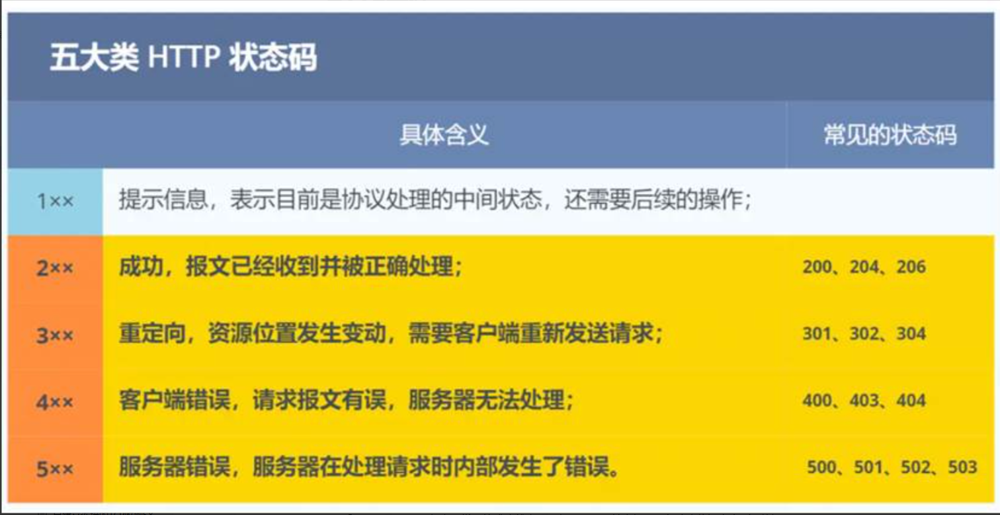
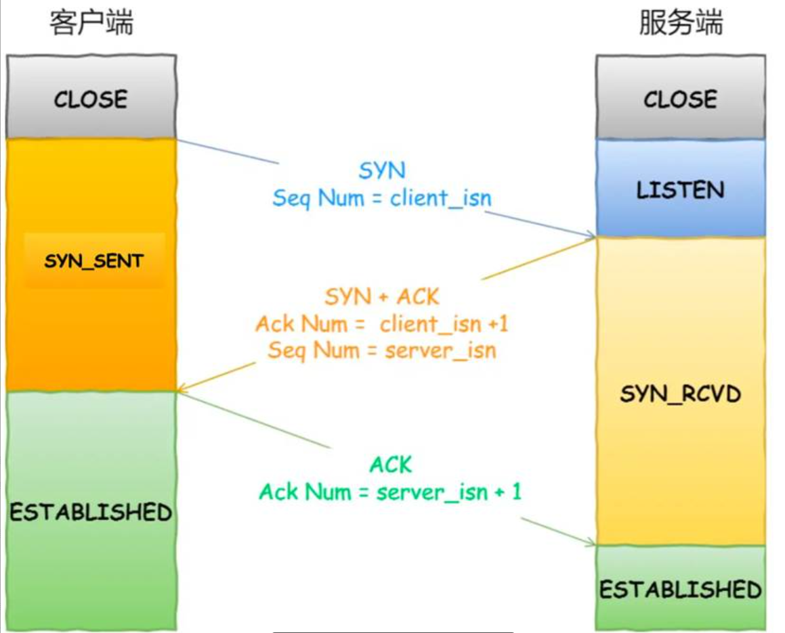
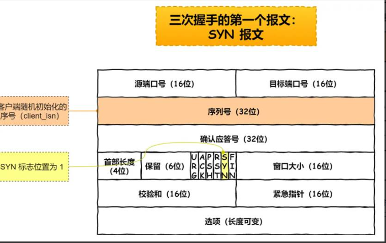
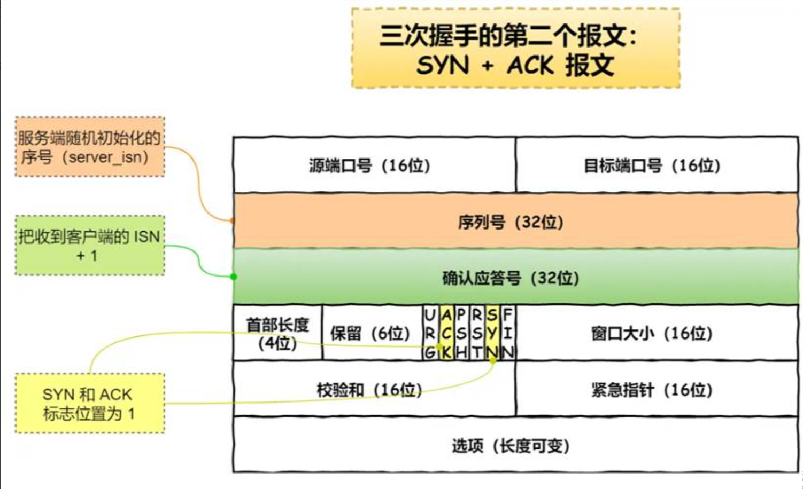
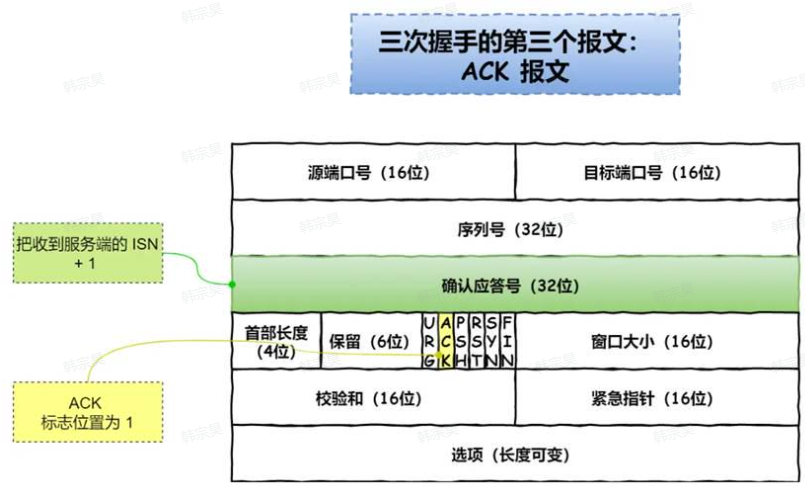
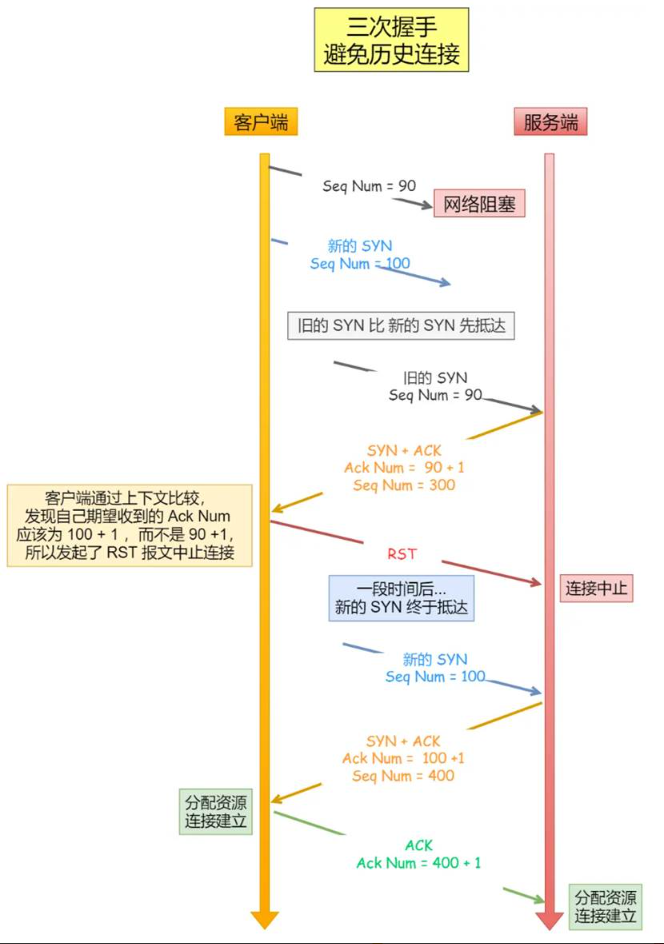
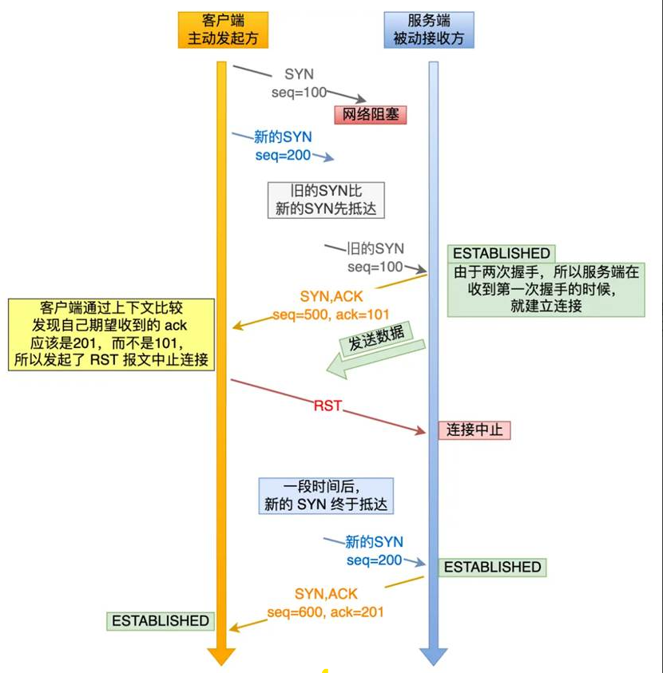
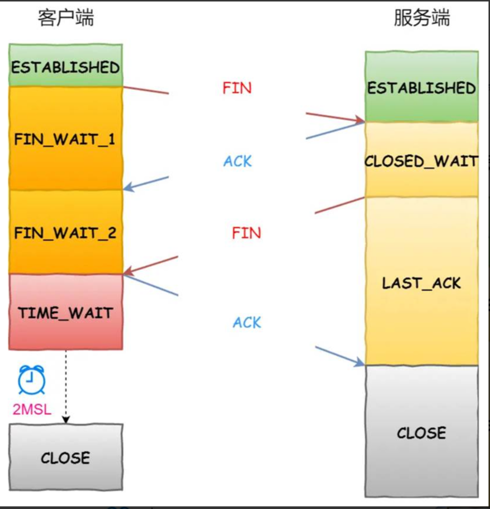
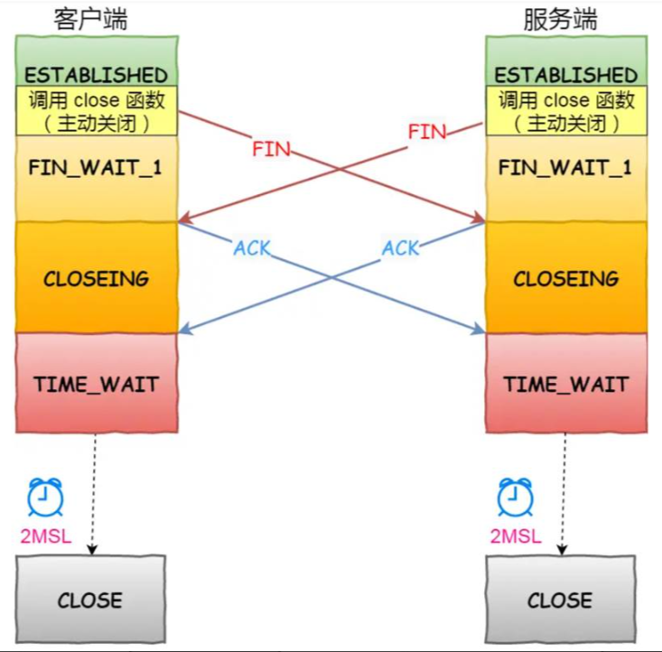
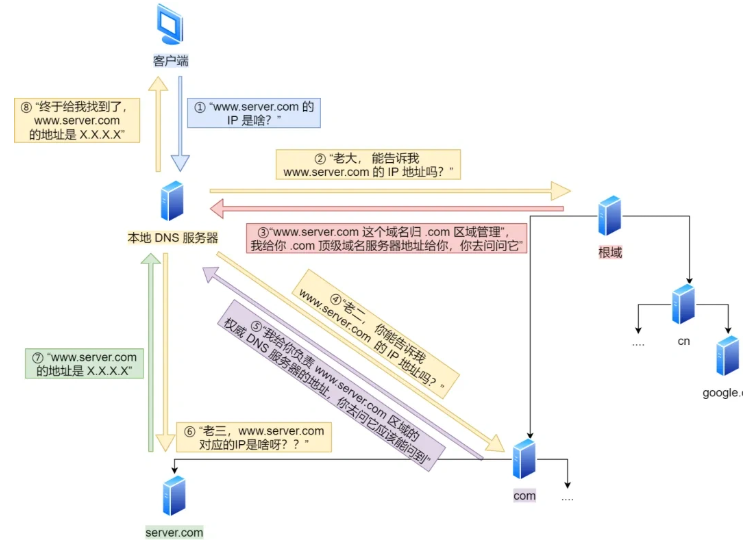

# HTTP系列

## 1.HTTP 和 HTTPS 区别**

**安全层面**：HTTP 明文传输，数据容易被窃听 / 篡改；HTTPS 基于 SSL/TLS 加密，是安全的。

**连接流程**：HTTP 只有 TCP 三次握手；HTTPS 多了一步 **SSL/TLS 握手**来协商加密密钥。

**端口号**：HTTP 用 **80** 端口，HTTPS 用 **443** 端口。

**证书与身份**：HTTPS 必须向 CA 申请证书，用于验证服务器身份，HTTP 不需要。

扩展：

HTTP基础

状态码：

 

1xx 类状态码属于提示信息，是协议处理中的一种中间状态，实际用到的比较少。

2xx 类状态码表示服务器成功处理了客户端的请求，也是我们最愿意看到的状态。

• [200 OK] 是最常见的成功状态码，表示一切正常。如果是非 HEAD 请求，服务器返回的响应头都会有 body
  数据。

• [204 No Content] 也是常见的成功状态码，与 200 OK 基本相同，但响应头没有 body 数据。

• [206 Partial Content] 是应用于 HTTP 分块下载或断点续传，表示响应返回的 body 数据并不是资源的全部，
  而是其中的一部分，也是服务器处理成功的状态。

3xx 类状态码表示客户端请求的资源发生了变动，需要客户端用新的 URL 重新发送请求获取资源，也就是重定向。

• [301 Moved Permanently] 表示永久重定向，说明请求的资源已经不存在了，需改用新的 URL 再次访问。

• [302 Found] 表示临时重定向，说明请求的资源还在，但暂时需要用另一个 URL 来访问。

301 和 302 都会在响应头里使用字段 Location，指明后续要跳转的 URL，浏览器会自动重定向新的 URL。

• [304 Not Modified] 不具有跳转的含义，表示资源未修改，重定向已存在的缓存文件，也称缓存重定向，也就是告诉客户端可以继续使用缓存资源，用于缓存控制。

4xx 类状态码表示客户端发送的报文有误，服务器无法处理，也就是错误码的含义。

• [400 Bad Request] 表示客户端请求的报文有错误，但只是个笼统的错误。

• [403 Forbidden] 表示服务器禁止访问资源，并不是客户端的请求出错。

• [404 Not Found] 表示请求的资源在服务器上不存在或未找到，所以无法提供给客户端。

5xx 类状态码表示客户端请求报文正确，但是服务器处理时内部发生了错误，属于服务器端的错误码。

• [500 Internal Server Error] 与 400 类型，是个笼统通用的错误码，服务器发生了什么错误，我们并不知道。

• [501 Not Implemented] 表示客户端请求的功能还不支持，类似“即将开业，敬请期待”的意思。

• [502 Bad Gateway] 通常是服务器作为网关或代理时返回的错误码，表示服务器自身工作正常，访问后端服务器发生了错误。

• [503 Service Unavailable] 表示服务器当前很忙，暂时无法响应客户端，类似“网络服务正忙，请稍后重试”的意思。

## **2. HTTP2.0 和其他版本的区别**

先和 HTTP1.1 对比。

HTTP1.1 最大的问题是**效率不高**，请求多的时候容易**阻塞**。
HTTP2 做了几个关键优化：

- 一个连接里可以并发处理多个请求，不用像以前那样排队严重
- 头部可以压缩，减少重复数据传输
- 支持服务端主动推送资源
- 传输更偏二进制，解析效率更高

扩展：

HTTP1.1 相对于 HTTP1.0：

连接方式：HTTP/1.0 为短连接，HTTP/1.1 支持长连接。

管道：支持管道网络传输，第一个请求发出去了，不必等其回来，就可以发第二个请求出去，但接收响应必须按发送的顺序接收，如果某个请求被阻塞，后续请求都会被阻塞，就出现了队头阻塞，默认关闭，而且大部分浏览器都没有支持，所以HTTP1.1还是看成“一问一答”，只不过是在同一个TCP连接即可

状态响应码：HTTP/1.1 中新加入了大量的状态码

缓存机制：在 HTTP/1.0 中主要使用 Header 里的 If-Modified-Since,Expires 来做为缓存判断的标准，HTTP/1.1 则引入了更多的缓存控制策略例如 Entity tag，If-Unmodified-Since, If-Match, If-None-Match 等更多可供选择的缓存头来控制缓存策略。

带宽：HTTP/1.0 中，存在一些浪费带宽的现象，例如客户端只是需要某个对象的一部分，而服务器却将整个对象送过来了，并且不支持断点续传功能，HTTP/1.1 则在请求头引入了 range 头域，它允许只请求资源的某个部分，即返回码是 206（Partial Content），这样就方便了开发者自由的选择以便于充分利用带宽和连接。

Host 头（Host Header）处理：HTTP/1.1 引入了 Host 头字段，允许在同一 IP 地址上托管多个域名，从而支持虚拟主机的功能。而 HTTP/1.0 没有 Host 头字段，无法实现虚拟主机。

HTTP2.0 相对于 HTTP1.1：

多路复用： HTTP/2.0 在同一连接上可以同时传输多个请求和响应，互不干扰。即在一个连接里，客户端和浏览器都可以同时发送多个请求和响应，而不用按照顺序一一对应，这样避免了”队头堵塞”（服务器可以处理完就可以直接返回）。1 个 TCP 连接包含多个 Stream，Stream 里可以包含 1 个或多个 Message（一般一个Stream只会对应一个Message），Message 对应 HTTP/1 中的请求或响应，由 HTTP 头部和包体构成。Message 里包含一条或者多个 Frame，Frame 是 HTTP/2 最小单位，以二进制压缩格式存放 HTTP/1 中的内容。针对不同的 HTTP 请求用独一无二的 Stream ID 来区分，接收端可以通过 Stream ID 有序组装成 HTTP 消息，不同 Stream 的帧是可以乱序发送的，因此可以并发不同的 Stream，也就是 HTTP/2 可以并行交错地发送请求和响应。

二进制帧： HTTP/2.0 使用二进制帧进行数据传输，而 HTTP/1.1 则使用文本格式的报文。二进制帧更加紧凑和高效，减少了传输的数据量和带宽消耗。

头部压缩（Header Compression）： HTTP/1.1 支持Body压缩，Header不支持压缩。HTTP/2.0 支持对Header压缩，使用了专门为Header压缩而设计的 HPACK 算法（在客户端和服务器同时维护一张头信息表，所有字段都存入这个表，生成一个索引号，以后就不发送同样字段了，只发送索引号，这样就提高速度了），减少了网络开销。

服务器推送： HTTP/2.0 支持服务器推送，可以在客户端请求一个资源时，将其他相关资源一并推送给客户端，从而减少了客户端的请求次数和延迟。而 HTTP/1.1 需要客户端自己发送请求来获取相关资源。双方都可以建立 Stream，客户端建立的Stream ID是奇数，服务端是偶数

基于HTTPS：HTTP2.0是基于HTTPS的，保证了安全性

HTTP3.0 相对于 HTTP2.0：

**传输协议**： HTTP/2.0 是基于 TCP 协议实现的，HTTP/3.0 新增了 QUIC（Quick UDP Internet Connections） 协议来实现可靠的传输，提供与 TLS/SSL 相当的安全性，具有较低的连接和传输延迟。你可以将 QUIC 看作是 UDP 的升级版本，在其基础上新增了很多功能比如加密、重传等等。HTTP/3.0 之前名为 HTTP-over-QUIC，从这个名字中我们也可以发现，HTTP/3 最大的改造就是使用了 QUIC。

**连接建立**： HTTP/2.0 需要经过经典的 TCP 三次握手过程（由于安全的 HTTPS 连接建立还需要 TLS 握手，共需要大约 3 个 RTT）。由于 QUIC 协议的特性（TLS 1.3，TLS 1.3 除了支持 1 个 RTT 的握手，还支持 0 个 RTT 的握手）连接建立仅需 0-RTT 或者 1-RTT。这意味着 QUIC 在最佳情况下不需要任何的额外往返时间就可以建立新连接。

**队头阻塞**： HTTP/2.0 多请求复用一个 TCP 连接，一旦发生丢包，就会阻塞住所有的 HTTP 请求（TCP层次的队头阻塞）。由于 QUIC 协议的特性，HTTP/3.0 在一定程度上解决了队头阻塞问题，一个连接建立多个不同的数据流，这些数据流之间独立互不影响，某个数据流发生丢包了，其数据流不受影响（本质上是多路复用+轮询）。

**错误恢复**： HTTP/3.0 具有更好的错误恢复机制，当出现丢包、延迟等网络问题时，可以更快地进行恢复和重传。而 HTTP/2.0 则需要依赖于 TCP 的错误恢复机制。

**安全性**： HTTP/2.0 和 HTTP/3.0 在安全性上都有较高的要求，支持加密通信，但在实现上有所不同。HTTP/2.0 使用 TLS 协议进行加密，而 HTTP/3.0 基于 QUIC 协议，包含了内置的加密和身份验证机制，可以提供更强的安全性。

**连接迁移**： TCP中通过四元组确定一条唯一的TCP连接，当网络从4G切换到WIFI时，IP地址发生变化，就需要重新建立连接，而QUIC通过连接ID标识通讯的两个端点，客户端和服务器可以各自选择一组 ID 来标记自己，因此即使移动设备的网络变化后，导致 IP 地址变化了，只要仍保有上下文信息（比如连接 ID、TLS 密钥等），就可以“无缝”地复用原连接，消除重连的成本，没有丝毫卡顿感，达到了连接迁移的功能。

## **3. 客户端和服务器用 HTTPS 通信的具体过程**

HTTPS 通信大概分两步。

第一步，先**建立安全连接**。
客户端先跟服务器打招呼，告诉对方自己支持哪些加密方式；服务器返回证书，客户端验证这个证书是不是可信、是不是过期、是不是这个域名的。验证通过后，双方协商出后面通信要用的密钥。

第二步，再正式传业务数据。
后面的请求和响应内容，都是用刚才协商好的密钥加密后再传输的。

##  **4.客户端发起请求是直接到服务器吗**

正常情况下，不一定直接到业务服务器。
真实线上一般中间会经过很多层，比如：

- 浏览器先查域名对应的 IP
- 可能先到 CDN
- 再到负载均衡
- 再到 Nginx 或网关
- 最后才到真正的应用服务器

所以大多数互联网项目里，客户端看到的是“访问一个域名”，但后面真正处理请求的，往往已经经过好几层转发了。

## **5. Nginx 有哪些作用**

Nginx / 服务器中间件

- 反向代理：客户端访问的是 Nginx，由它转发到后端服务
- 负载均衡：把请求分摊到多台机器上
- 静态资源服务：图片、前端页面、静态文件可以直接由它处理
- 动静分离：静态走 Nginx，动态请求转给后端
- 统一入口：隐藏后端真实地址
- 还可以做限流、简单鉴权、跨域处理、灰度发布这些

## HTTP/1.1 怎么对请求做拆包，具体来说怎么拆的？

HTTP/1.1 靠 **Content-Length** 拆包。客户端发请求时，在 header（请求头） 里带上请求体的字节数；服务端收到后，按这个长度去 socket 里读对应字节，这样就能把完整的请求体从数据流里准确拆出来，避免粘包 / 拆包问题。

在 HTTP/1.1 中，请求的拆包是通过 **"Content-Length"** 头字段来进行的。该字段指示了请求正文的长度，服务器可以根据该长度来正确接收和解析请求。

具体来说，当客户端发送一个 HTTP 请求时，会在请求头中添加 **"Content-Length"** 字段，该字段的值表示请求正文的字节数。

服务器在接收到请求后，会根据 **"Content-Length"** 字段的值来确定请求的长度，并从请求中读取相应数量的字节，直到读取完整个请求内容。

这种基于 **"Content-Length"** 字段的拆包机制可以确保服务器正确接收到完整的请求，避免了请求的丢失或截断问题。

### 

# 6.TCP系列

## 6.1为什么需要TCP?

IP层是不可靠的，它不保证网络包的按序交付以及数据完整性

应用层应该只负责应用通讯之间的数据，并不需要关心数据是如何传输的，所以应该在应用层和网络层添加一个传输层保证数据的传输可靠

## 6.2什么是TCP?

TCP是面向连接的、可靠的、基于字节流的传输层通信协议

• 面向连接：一定是「一对一」才能连接，不能像 UDP 协议可以一个主机同时向多个主机发送消息，也就是一对多，是无法做到的；

• 可靠的：无论的网络链路中出现了怎样的链路变化，TCP 都可以保证一个报文一定能够到达接收端（但如果对方宕机了那没得说）

• 字节流：用户消息通过 TCP 协议传输时，消息可能会被操作系统「分组」成多个的 TCP 报文，如果接收方的程序如果不知道「消息的边界」，是无法读出一个有效的用户消息的。并且 TCP 报文是「有序的」，当「前一个」TCP 报文没有收到的时候，即使它先收到了后面的 TCP 报文，那么也不能扔给应用层去处理，同时对「重复」的 TCP 报文会自动丢弃。

## 6.3 TCP和UDP

连接：

• TCP 是面向连接的传输层协议，传输数据前先要建立连接。

• UDP 不需要连接，即刻传输数据。

服务对象：

• TCP 是一对一的两点服务，即一条连接只有两个端点。

• UDP 支持一对一、一对多、多对多的交互通信

可靠性：

• TCP 是**可靠交付数据**的，数据可以无差错、不丢失、不重复、按序到达。

• UDP 是**尽最大努力交付**，**不保证可靠交付数据**。但是我们可以基于 UDP 传输协议实现一个可靠的传输协议，比如 QUIC 协议

拥塞控制、流量控制：

• TCP 有**拥塞控制**和**流量控制**机制，保证数据传输的安全性。

• UDP 则没有，即使网络非常拥堵了，也不会影响 UDP 的发送速率。

首部开销：

• TCP 首部长庋较长，会有一定的开销，首部在没有使用「选项」字段时是 20 个字节，如果使用了「选项」字段则会变长的。

• UDP 首部只有 8 个字节，并且是固定不变的，开销较小。

传输方式：

• TCP 是流式传输，没有边界，但保证顺序和可靠。

• UDP 是一个包一个包的发送，是有边界的，但可能会丢包和乱序。

分片不同：

• TCP 的数据大小如果大于 MSS 大小，则会在传输层进行分片，目标主机收到后，也同样在传输层组装 TCP 数据包，如果中途丢失了一个分片，只需要传输丢失的这个分片。

• UDP 的数据大小如果大于 MTU 大小，则会在 IP 层进行分片，目标主机收到后，在 IP 层组装数据，接着再传给传输层。

应用场景：

• TCP一般用于FTP文件传输、HTTP/HTTPS等

• UDP一般用于DNS、视频、音频、直播等

UDP为什么要有包长度？

没有包长度确实也可以算出来，但是因为网络设备硬件设计和处理方便，首部长度需要是4字节的整数倍，加个包长度可以填充

TCP和UDP可以共用一个端口吗？

可以，在网络层根据IP包头的协议号就知道该数据包是TCP还是UDP，就可以确定发给哪个模块处理

面向字节、面向报文？

UDP是面向报文的，一个UDP报文就是一个用户消息

TCP是面向字节流的，一个消息可能被拆分为多个报文，这就会出现粘包和半包问题，这需要交给应用层解决：

• 固定长度的消息

• 特殊字符作为边界

• 自定义消息结构

## 6.4 TCP三次握手

TCP通过三次握手建立链接，随后的数据通信通过该链接进行：

一开始，客户端和服务端都处于CLOSE状态，现实服务端主动监听某个端口，处于LISTEN状态。

客户端会随机初始化序号(client_isn)，将此序号置于TCP首部的「序号」字段中，同时把SYN标志位置为1,表示SYN报文。接着把第一个SYN报文发送给服务端，表示向服务端发起连接，该报文不包含应用层数据，之后客户端处于 SYN-SENT 状态。

服务端收到客户端的SYN报文后，首先服务端也随机初始化自己的序号(server_isn)，将此序号填入TCP首部的「序号」字段中，其次把 TCP首部的「确认应答号」字段填入client_isn+1,接着把SYN和ACK标志位置为1。最后把该报文发给客户端，该报文也不包含应用层数据，之后服务端处于SYN-RCVD状态。

客户端收到服务端报文后，还要向服务端回应最后一个应答报文，首先该应答报文TCP首部ACK标志位置为1，其次「确认应答号」字段填入server_isn+1，最后把报文发送给服务端，这次报文可以携带客户到服务端的数据，之后客户端处于ESTABLISHED状态。
服务端收到客户端的应答报文后，也进入ESTABLISHED状态。

### TCP 三次握手流程

第一次握手（客户端 → 服务器）：客户端主动打开连接，发送 SYN 报文（SYN=1，seq=x ，x 是客户端初始序列号 ），进入 SYN-SENT 状态 。
第二次握手（服务器 → 客户端）：服务器监听端口收到 SYN 报文，回复 SYN+ACK 报文（SYN=1，ACK=1，seq=y ，ack=x+1 ，y 是服务器初始序列号 ），进入 SYN-RCVD 状态 。
第三次握手（客户端 → 服务器）：客户端收到 SYN+ACK 报文，回复 ACK 报文（ACK=1，seq=x+1，ack=y+1 ），进入 ESTABLISHED 状态；服务器收到 ACK 报文后，也进入 ESTABLISHED 状态，连接建立完成，双方开始数据传输 

### 避免历史连接:

防止I旧的重复连接初始化造成混乱
我们考虑一个场景，客户端先发送了SYN(seq=90)报文，然后客户端宕机了，而且这个SYN报文还被网络阻塞了，服务端并没有收到，接着客户端重启后，又重新向服务端建立连接，发送了SYN(seq=100)报文

1.一个「旧SYN报文」比「最新的SYN」报文早到达了服务端，那么此时服务端就会回一个SYN+ACK报文给客户端，此报文中的确认号是91 (90+1).
2.客户端收到后，发现自己期望收到的确认号应该是100+1,而不是90+1，于是就会回RST报文。
3.服务端收到RST报文后，就会释放连接。
4.后续最新的SYN抵达了服务端后，客户端与服务端就可以正常地完成三次握手了。

如果在收到RST之前收到新的SYN，也就是**第二次握手之后又来新的握手请求**，服务端会回Challenge Ack报文给客户端，这个ack不是确认新的握手请求，而是**上一次的ack确认号**，也就是91(90+1)，客户端收到此ACK后，发现不是自己期望的101，而是91，就会回RST报文;**如果是第三次握手之后又来新的握手请求**，服务端也是回Challenge Ack。

所以服务端在第二次握手后，**如果收到新的SYN请求，就会回一个Challenge Ack**，**客户端收到后，如果是历史握手请求，就不管，如果之前建立的是历史握手请求，会发现Ack对不上，于是双方断开连接。**

**如果是两次握手，就无法**阻止历史连接，两次握手的情况下，服务端没有中间状态给客户端来阻止历史连接，导致服务端可能建立一个历史连接，造成资源浪费。

两次握手后，服务端就创立了连接，并开始推送数据，但这其实是个历史连接，发的数据没用，白白浪费资源

**同步双方初始序列号:**
TCP协议的通信双方，都必须维护一个「序列号」，序列号是可靠传输的一个关键因素，它的作用:

接收方可以去除重复的数据;

接收方可以根据数据包的序列号按序接收;

可以标识发送出去的数据包中，哪些是已经被对方收到的(通过ACK报文中的序列号知道)

可见，序列号在TCP连接中占据着非常重要的作用，所以当客户端发送携带「初始序列号」的SYN报文的时候，需要服务端回一个ACK应答报文，表示客户端的SYN报文已被服务端成功接收，那当服务端发送「初始序列号」给客户端的时候，依然也要得到客户端的应答回应，这样一来一回，才能确保双方的初始序列号能被可靠的同步。如果是两次握手，服务端不知道客户端有没有收到自己的序列号

双方确认对方的接收发信息的能力:
第一次握手:
客户端:啥也不知道
服务端:对方的发送，自己的接收没问题

第二次握手:

客户端:自己的发送、接收，对方的发送、接收都没问题

服务端:对方的发送，自己的接收没问题

第三次握手:
客户端:自己的发送、接收，对方的发送、接收都没问题

服务端:自己的发送、接收，对方的发送、接收都没问题

### 第一次握手丢失了，会怎样？

如果客户端迟迟收不到服务端的 SYN-ACK 报文（第二次握手），就会触发「超时重传」机制，重传 SYN 报文，而且重传的 SYN 报文的序列号都是一样的。

超时时间看操作系统内核，有的1s，有的3s。

重传次数看参数/proc/sys/net/ipv4/tcp_syn_retries，默认是5

每次超时重传的时间是上次的2倍，总耗时是 1+2+4+8+16+32=63 秒

如果一直没回应，就会断开连接

### 第二次握手丢失了，会怎样？

客户端迟迟没有收到第二次握手，那么客户端就觉得可能自己的 SYN 报文（第一次握手）丢失了，于是客户端就会触发超时重传机制，重传 SYN 报文，如果一直没收到第二次握手，就会断开连接

服务端就收不到第三次握手，于是服务端这边会触发超时重传机制，重传 SYN-ACK 报文。如果一直没收到第三次握手，就断开连接

SYN-ACK报文最大重传次数看参数/proc/sys/net/ipv4/tcp_synack_retries，默认是5

### 第三次握手丢失了，会怎样？

服务端收不到第三次握手，以为自己的第二次握手丢失了，就会触发超时重传机制，重传 SYN-ACK 报文，直到收到第三次握手，或者达到最大重传次数断开连接。如果此时客户端发送数据，服务端会回RST报文，因为服务端这边连接还没建立，客户端收到RST后重新开始第一次握手

### 为什么是三次握手？不是一次、两次、四次？

首先，一次是不可能的，因为TCP要双方建立连接，所以肯定至少要一问一答来保证双方是正常能通讯的，不然就变UDP了
然后，三次已经能建立稳定连接了，所以四次会多余一次开销，没必要，接下来只需要说明为什么两次不行即可
三次握手才可以阻止重复历史连接的初始化
三次握手才可以同步双方的初始序列号
 三次握手才让双方确认对方的接收发信息的能力

## 6.5   TCP四次挥手

双方都可以主动断开链接：

客户端打算关闭连接，此时会发送一个TCP首部**FIN标志**位被置为1的报文，也即FIN报文，之后客户端进入FIN_WAIT_1状态。

服务端收到该报文后，就向客户端发送**ACK应答报文**，接着服务端进入**CLOSE_WAIT状态**

客户端收到服务端的ACK应答报文后，之后进入**FIN_WAIT_2**状态。

**等待服务端处理完数据后**，应用程序调用close函数，也向客户端发送FIN报文，之后服务端进入**LAST_ACK**状态。

客户端收到服务端的FIN报文后，回一个ACK应答报文，之后进入**TIME_WAIT**状态

服务端收到了ACK应答报文后，就进入了**CLOSE状态**，至此服务端已经完成连接的关闭。

客户端在经过2MSL一段时间后，自动进入CLOSE状态，至此客户端也完成连接的关闭。

### 为什么需要四次挥手？

• 关闭连接时，客户端向服务端发送 FIN 时，仅仅表示客户端不再发送数据了但是还能接收数据。

• 服务端收到客户端的 FIN 报文时，先回一个 ACK 应答报文，而服务端可能还有数据需要处理和发送，等服务端不再发送数据时，才发送 FIN 报文给客户端来表示同意现在关闭连接。

• 客户端需要回复第四次挥手ACK，服务端收到后才知道对方关闭连接了，不然服务端不清楚对方是否收到了第三次挥手，是否正常关闭连接了

从上面过程可知，服务端**通常需要等待完成数据的发送和处理**，所以服务端的 ACK 和 FIN 一般都会分开发送，因此是需要四次挥手。但是在「没有数据要发送」并且「开启了 TCP 延迟确认机制」（默认开启）的情况下，那么第二和第三次挥手就会**合并传输**，这样就出现了三次挥手，所以四次挥手是可以变成三次挥手的

### TCP延时确认机制：

• 当有响应数据要发送时，ACK 会随着响应数据一起立刻发送给对方

• 当没有响应数据要发送时，ACK 将会延迟一段时间，以等待是否有响应数据可以一起发送

• 如果在延迟等待发送 ACK 期间，对方的第二个数据报文又到达了，这时就会立刻发送 ACK

### 第一次挥手丢失了，会怎样？

客户端迟迟收不到 ACK 的话，就会触发**超时重传**机制，重传 FIN 报文，重发次数由 tcp_orphan_retries（默认7）参数控制。

当客户端重传 FIN 报文的次数超过 tcp_orphan_retries 后，就不再发送 FIN 报文，则会在等待一段时间（时间为上一次超时时间的 2 倍），**如果还是没能收到第二次挥手，那么直接进入到 close 状态。**

### 第二次挥手丢失了，会怎样？

客户端会以为自己的第一次挥手丢失，触发重传

### 第三次挥手丢失了，会怎样？

服务端收不到第四次挥手，会触发重传，重发次数由 tcp_orphan_retries 参数控制。如果一直收不到就断开连接

客户端如果是通过close()函数关闭连接的，表示关闭发送和接收数据，如果 tcp_fin_timeout（默认60s）时间内还是没能收到服务端的第三次挥手（FIN 报文），那么客户端就会断开连接。如果是通过shutdown()函数关闭连接，表示只关闭发送，可以接收，这时候如果一直收不到第三次挥手，连接会一直存在

### 第四次挥手丢失了，会怎样？

服务端会以为自己的第三次挥手丢失了，触发重传

客户端重复接收到第三次挥手时，会**重置TIME_WAIT的时间**

### 为什么要有TIME_WAIT?

主动发起关闭连接的一方，才会有 TIME_WAIT 状态。

需要 TIME-WAIT 状态，主要是两个原因：

• 防止历史连接中的数据，被后面相同四元组的连接错误的接收；TIME_WAIT的时间足以让历史数据包丢失在网络中，再出现的数据包一定都是新建立连接所产生的。

• 保证「被动关闭连接」的一方，能被正确的关闭；等待足够的时间以确保最后的 ACK（第四次挥手）能让被动关闭方接收，从而帮助其正常关闭连接。

### 为什么TIME_WAIT等待的时间是2MSL？

MSL 是 Maximum Segment Lifetime，报文最大生存时间（30s），它是任何报文在网络上存在的最长时间，超过这个时间报文将被丢弃。

TIME_WAIT 等待 2 倍的 MSL，比较合理的解释是：网络中可能存在来自自身发送方的数据包，当这些发送方的数据包被接收方处理后又会向对方发送响应，所以一来一回需要等待 2 倍的时间。

**设置为2MSL，相当于至少允许报文丢失一次**，比如，若 ACK（第四次挥手）在一个 MSL 内丢失，这样被动方重发的 FIN（第三次挥手）会在第 2 个 MSL 内到达，如果重发的FIN也丢失了，那么TIME_WAIT也过期了，也没什么影响，不会影响到下一个TCP连接！

### **TIME_WAIT过多会怎样？**

• 第一是占用系统资源，比如文件描述符、内存资源、CPU 资源、线程资源等；

• 第二占用端口资源，端口资源也是有限的，一般可以开启的端口口为 32768 ~ 61000，也可以通过 net.ipv4.ip_local_port_range参数指定范围。

### 服务端大量出现TIME_WAIT？

说明服务端主动断开了连接，只有主动关闭连接的一方才有TIME_WAIT：

• 第一个场景：HTTP 没有使用长连接，一个HTTP请求对应一个TCP连接

• 第二个场景：HTTP 长连接超时

• 第三个场景：HTTP 长连接的请求数量达到上限

### 双方都时断开连接？

等待第二次挥手的时候收到了对方的第一次回收，就知道两边都想关闭，直接进入TIME_WAIT

## 6.6用了TCP数据就一定不会丢吗？

**建立连接时丢包**

如果对方全连接或半连接满了，会拒绝TCP请求建立

**流量控制丢包**

发送数据过快，超出流控队列（内核中控制数据流量的队列）的长度

**网卡丢包**

RingBuffer过小会溢出，丢包

超出网卡处理能力

超出对方内核接收缓冲区大小

两端之间网络传输丢包

### 对于这些丢包现象，采取TCP协议可以解决吗？

TCP保证的可靠性，是传输层的可靠性。也就是说，TCP只保证数据从A机器的传输层可靠地发到B机器的传输层。

至于数据到了接收端的传输层之后，能不能保证到应用层，TCP并不管。

假设现在，我们输入一条消息，从聊天框发出，走到传输层TCP协议的发送缓冲区，不管中间有没有丢包，最后通过重传都保证发到了对方的传输层TCP接收缓冲区，此时接收端回复了一个ack，发送端收到这个ack后就会将自己发送缓冲区里的消息给扔掉。到这里TCP的任务就结束了。

TCP任务是结束了，但聊天软件的任务没结束。

聊天软件还需要将数据从TCP的接收缓冲区里读出来，如果在读出来这一刻，手机由于内存不足或其他各种原因，导致软件崩溃闪退了。

发送端以为自己的消息已经发给对方了，但接收端却并没有收到这条消息。

于是乎，消息就丢了。

**这种问题在两个用户之间加个服务器作为中间中转就行**

对于发送方，只要**定时跟服务端的内容对账一下**，就知道哪条消息没发送成功，直接重发就好了。

如果接收方的聊天软件崩溃了，重启后跟服务器稍微通信一下就知道少了哪些数据，同步上来就是了，所以也不存在上面提到的丢包情况。

**两端通信的时候也能对账，为什么还要引入第三端服务器？**

• 第一，如果是两端通信，你聊天软件里有1000个好友，你就得建立1000个连接。但如果引入服务端，你只需要跟服务端建立1个连接就够了，聊天软件消耗的资源越少，手机就越省电。

• 第二，就是安全问题，如果还是两端通信，随便一个人找你对账一下，你就把聊天记录给同步过去了，这并不合适吧。如果对方别有用心，信息就泄露了。引入第三方服务端就可以很方便的做各种鉴权校验。

• 第三，是软件版本问题。软件迭代用户手机之后，软件要不断新功能且用户说了算了，如果还是两端通信，且两端的软件版本跨度太大，很容易产生各种兼容性问题，引入第三端服务器，就可以强制部分过低版本升级，否则不能使用软件。但对于大部分兼容性问题，给服务端加兼容逻辑就好了，不需要强制用户更新软件。

## 网络有什么常用的通信协议？

- HTTP：用于在 Web 浏览器和 Web 服务器之间传输超文本的协议，是目前最常见的应用层协议。
- HTTPS：在 HTTP 的基础上添加了 SSL/TLS 加密层，用于在不安全的网络上安全地传输数据。
- TCP：面向连接的传输层协议，提供可靠的数据传输服务，保证数据的顺序和完整性。
- UDP：无连接的传输层协议，提供了数据包传输的简单服务，适用于实时性要求高的应用。
- IP：网络层协议，用于在网络中传输数据包，定义了数据包的格式和传输规则。

------

## 前后端交互用的是什么协议？

用 HTTP 和 HTTPS 协议比较多。

前端通过 HTTP 协议向服务器端发送请求，服务器端接收请求并返回相应的数据，实现了前后端的交互。HTTP 协议简单、灵活，适用于各种类型的应用场景。

## DNS 基于什么协议实现？UDP 还是 TCP？

DNS 基于 UDP 协议实现，DNS 使用 UDP 协议进行域名解析和数据传输。

### 为什么是 udp？

因为基于 UDP 实现 DNS 能够提供低延迟、简单快速、轻量级的特性，更适合 DNS 这种需要快速响应的域名解析服务。

- **低延迟**：UDP 是一种无连接的协议，不需要在数据传输前建立连接，因此可以减少传输时延，适合 DNS 这种需要快速响应的应用场景。
- **简单快速**：UDP 相比于 TCP 更简单，没有 TCP 的连接管理和流量控制机制，传输效率更高，适合 DNS 这种需要快速传输数据的场景。
- **轻量级**：UDP 头部较小，占用较少的网络资源，对于小型请求和响应来说更加轻量级，适合 DNS 这种频繁且短小的数据交换。

尽管 UDP 存在丢包和数据包损坏的风险，但在 DNS 的设计中，这些风险是可以被容忍的。DNS 使用了一些机制来提高可靠性，例如查询超时重传、请求重试、缓存等，以确保数据传输的可靠性和正确性。

### http 的特点是什么？

HTTP 具有简单、灵活、易用、通用等特点，是一种广泛应用于 Web 通信的协议。

- **基于文本**：HTTP 的消息是以**文本形式传输**，易于阅读和调试，但相比二进制协议效率较低。
- **可扩展性**：HTTP 协议本身不限制数据的内容和格式，可以通过**扩展头部、方法等来支持新的功能**。
- **灵活性**：HTTP **支持不同的数据格式**（如 HTML、JSON、XML 等），适用于多种应用场景。
- **无状态**：每个请求之间相互独立，服务器不会保留之前请求的状态信息，需要通过其他手段（如 Cookies、Session）来维护状态。

# 网络编程/IO

## 网络模型

**应用层：**

我们常见的应用就是在应用层，应用层也有应用层协议，如 HTTP、DNS、FTP、Telent、SMTP等

应用层不关注数据如何传输，直接把数据的传输交给下一层，即交给传输层，应用层工作于用户态，传输层及以下工作于内核态

**传输层：**

为应用层提供网络通信支持，但不涉及网络传输，分为 TCP 和 UDP 两个协议

**网络层：**

负责网络包的封装、分片、路由、转发，如IP、ICMP

**网络接口层：**

负责网络包在物理网络中的传输，比如网络包的封帧、MAC寻址、差错检验等

真正的物理层次传输数据

## 说一下 BIO、NIO、AIO**

BIO 就是同步阻塞。
一个连接过来，线程可能一直卡在那里等数据，简单，但是并发高了扛不住。

NIO 就是同步非阻塞。
线程不会一直傻等，可以通过多路复用同时盯很多连接，谁准备好了就处理谁，所以更适合高并发。

AIO 就是异步非阻塞。
发起操作后，不用自己一直等，等系统处理完了再通知线程

## 知道的 IO 模型，介绍下

常见 IO 模型一般可以说这几种：

- 阻塞 IO
- 非阻塞 IO
- IO 多路复用
- 信号驱动 IO
- 异步 IO

一般重点讲前三个，再补一句异步 IO。

# 其他

## 限流了解么？

限流是当高并发或者瞬时高并发时，为了保证系统的稳定性、可用性，对超出服务处理能力之外的请求进行拦截，对访问服务的流量进行限制。

常见的限流算法有四种：固定窗口限流算法、滑动窗口限流算法、漏桶限流算法和令牌桶限流算法。

- **固定窗口 限流算法**：实现最简单，按固定时间窗口统计请求数，缺点是窗口切换时会出现 “两倍流量突刺”，容易击穿阈值。
- **滑动窗口 限流算法**：固定窗口的改进版，窗口随时间滑动，解决了突刺问题，精度更高，但实现复杂度和计算开销更高。
- **漏桶 限流算法**：能够对流量起到整流的作用，让随机不稳定的流量以固定的速率流出，但是不能解决流量突发的问题。
- **令牌桶算法**：作为漏斗算法的一种改进，除了能够起到平滑流量的作用，还允许一定程度的流量突发。