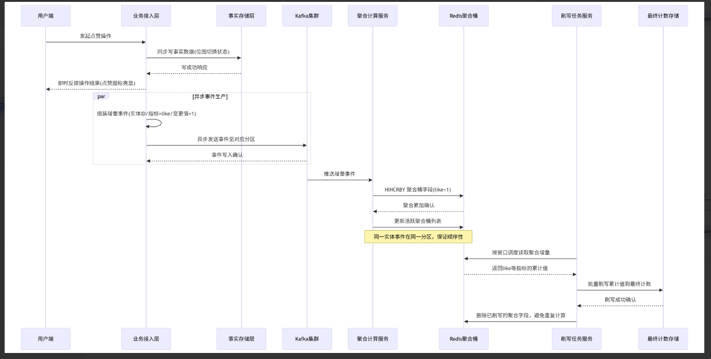

# 知光

## 认证双令牌模式

​      在知光APP中，采用Spring Security+JWT的双令牌机制，将短期的accessToken与长期的refreshToken 分离:
accessToken负责高性能、无状态的接口访问认证
refreshToken负责长期会话的续期与控制。
​      这样既提升了账号安全性(缩小单次泄露的影响范围、支持强制下线与风控)，又保证了用户的长期免登录体验，同时兼顾了分布式架构下的扩展性和会话管理能力。

### 什么是双令牌

#### accessToken(访问令牌)

作用:
每次访问业务接口时，用来证明“我是某某用户”。
比如你现在的 Authorization:Bearer xxx 就是 accessToken.
特点:
     有效期很短(比如15分钟、30分钟)
内部自带用户ID、角色、权限等信息(JWT的payload)。
      后端只需要校验签名和是否过期，一般不查数据库，性能好、扩展性强。
使用方式:
前端每次调/api/v1/xxx时带上它用以权限认证。

#### refreshToken (刷新令牌)

**作用**
    不直接访问业务接口，只用来换取新的accessToken。当前accessToken过期了，前端拿refreshToken调/auth/refresh 这种接口，就能拿到一对新的accessToken + refreshToken.
  **特点:**
有效期较长(比如7天、14天甚至30天)。
一般只在少数几个认证接口使用:/1ogin、/refresh。
可以结合Redis/数据库做黑名单、版本号等控制(更容易做“踢下线”注销”)。

### **为什么要用双令牌，而不是一个长有效期的token?**

安全性更高
如果只有一个长生命周期的JWT:
比如你设一个JWT直接30天不过期，一旦这个token被窃取，黑客可以在30天内随便伪装成用户操作，风险非常大。
又因为JWT一般是“无状态”的，后端默认不会存储、也不回收，因此很难"立刻让这个token失效"双令牌的改进:
accessToken只活15~30分钟--即使被盗，黑客最多用这一小段时间。
refreshToken一般只在“刷新接口”使用，你可以:

把refreshToken保存得更安全(比如HttpOnly Cookie、只在后端存一份、只允许HTTPS)针对refreshToken做更严格检查:设备信息、IP、User-Agent、单点登录等。
一旦发现泄露或用户手动“退出登录”，直接把对应的refreshToken在 Redis标记失效:
     老的refreshToken无法再换新token;
   accessToken也会因为短时过期，自然失效;
这样就实现**“可控的强制下线”。**
**短命的accessToken+ 受控的refreshToken，比一个长命JWT安全得多。**

**提升用户体验(减少频繁登录)**
只有一个短期JWT时:
你为了安全，把过期时间设得很短(例如30分钟)
那用户会频繁被“踢回登录页面”，体验很差。双令牌的玩法是:
accessToken失效后，前端用refreshToken悄悄调一次刷新接口，换一对新的;对用户来说，整个过程是“无感”的:
   只要refreshToken还没过期，就能一直续命;
   只有在refreshToken真正过期(比如7天不登录)之后，才需要重新输账号密码。

### 兼顾“无状态扩展性"和“可控的登录状态”

accessToken校验可以完全无状态(只靠签名+过期时间)，非常适合分布式，集群部署:
       任意一个服务实例都能根据JWT自己完成认证。
refreshToken可以是“轻状态”的:
        把 refreshToken ID 存到 Redis;
**可以做:**
单点登录(同一用户只允许一个刷新token生效);

踢人下线(删除某个refreshToken记录);

安全风控(记录设备、IP，异常则禁止刷新)

这样就可以做到:
业务接口层(多服务)只管校验accessToken，不查库，性能高;
认证中心/网关少量存refreshToken的状态，用来集中管理登录会话，引入“可控的在线状态”。


## 面试：

#### 解释一下什么叫做双令牌模式

“双令牌模式就是把认证拆成两类令牌：**Access Token** 和 **Refresh Token。**
Access Token 短期有效，用于访问接口；Refresh Token 长期有效，只用于换新 Access Token。
这样做的好处是：既保证安全（短令牌泄露风险窗口小），又保证体验（用户不需要频繁登录），并且后端可以通过 Redis 对 Refresh Token 做吊销和强制下线管理。”

#### 访问令牌与刷新令牌的有效期分别是多少？为什么这样设置

本项目里配置是：

1. Access Token

   15 分钟

2. Refresh Token

   7 天

为什么这么设：

1. Access Token

   短有效期（15 分钟）

   - 被窃取后的可利用窗口更短，安全性更高。

2. Refresh Token

   长一些（7 天）

   - 用户不用频繁重新登录，体验更好。

3. 两者配合

   - 短期凭证负责“安全”，长期凭证负责“续航”。


#### 登录状态是无状态还是有状态？有什么区别？为什么这样选择？

本项目的登录状态不是纯粹的一种，而是 **“访问态无状态，刷新态有状态” 的混合方案**。

**Access Token** 是无状态的。后端不保存登录 session，每次请求只校验 JWT 本身，所以服务可以横向扩展，压力更小。

**Refresh Token** 是有状态的。虽然它也是 JWT，但项目把它的 jti 存到了 Redis 白名单里，刷新时不仅验签，还会查 Redis 是否存在，这样才能支持登出、单端失效、全端下线。


区别很简单：

- 无状态：服务端不存会话，性能和扩展性好，但 access token 一旦发出去，不容易立刻废掉。
- 有状态：服务端保存状态，能主动撤销，但会增加 Redis 依赖和状态管理成本。

为什么这样选：因为它同时兼顾了 **性能** 和 **安全**。高频请求走无状态 access token，减轻服务端压力；低频续签走有状态 refresh token，用 Redis 补上“可撤销、可踢下线”的能力。

1.

```java
.sessionManagement(session -> 
    session.sessionCreationPolicy(SessionCreationPolicy.STATELESS)
)
```

签发 access token 的逻辑在 [JwtService.java]

```JAVA
Instant accessExpiresAt = issuedAt.plus(properties.getJwt().getAccessTokenTtl());
```

2.

```java
    /**
     * 将刷新令牌写入白名单，设置过期时间。
     *
     * @param userId  用户 ID。
     * @param tokenId 刷新令牌 ID。
     * @param ttl     生存时间（Redis TTL）。
     */
    @Override
    public void storeToken(long userId, String tokenId, Duration ttl) {
        String key = key(userId, tokenId);
        redisTemplate.opsForValue().set(key, "1", ttl);
    }

    /**
     * 撤销单个刷新令牌。
     *
     * @param userId  用户 ID。
     * @param tokenId 刷新令牌 ID。
     */
    @Override
    public void revokeToken(long userId, String tokenId) {
        redisTemplate.delete(key(userId, tokenId));
    }


```

#### 验证码是怎么做的？过期时间用什么做的

本项目的验证码是基于 Redis 实现的：服务端生成 6 位随机验证码后写入 Redis，并通过 TTL 控制 5 分钟过期；同时用 Redis 额外做 60 秒发送间隔限制和每日 10 次发送上限。校验时会校验验证码、记录输错次数，成功后立即删除，保证一次性使用。

过期时间是用 **Redis 的 TTL 机制** 做的。验证码保存到 Redis 后，会直接调用 expire(key, ttl) 设置生存时间，到了 5 分钟 Redis 会自动删除这个 key，不需要额外定时任务。


#### 接口授权中，用户userid是怎么拿到的

```java
    @PatchMapping
    public ProfileResponse patch(@AuthenticationPrincipal Jwt jwt,
                                 @Valid @RequestBody ProfilePatchRequest request) {
        long userId = jwtService.extractUserId(jwt);

        return profileService.updateProfile(userId, request);
    }
```

接口授权里，userId 是从 **JWT 访问令牌** 里拿到的，不是前端手传的。**避免前端自己传 userId 造成越权**。服务端只信令牌里的身份。long userId = jwtService.extractUserId(jwt);

#### 项目中是如歌对接口鉴权的？（要知道公告接口以及需要token鉴权的接口分别有哪些，怎么拦截鉴权的）

项目接口鉴权是基于 JWT 做的。公开接口，比如登录、注册、验证码、首页公开内容，会在安全配置里放行；其他接口默认都要求携带 token。请求进来后先由安全框架统一校验 token，校验通过后再从令牌里解析当前用户身份，业务代码全程使用服务端解析出的用户 ID，而不是信任前端传参，这样可以防止越权。

## 一、方案背景:高并发行为计数的核心痛点

在社交、电商等高频交互场景中，用户的点赞(like)、收藏(fav)、评论等行为会产生**海量计数更新请求**。“同步直写最终计数”的方案在高并发下暴露诸多致命问题，成为系统性能瓶颈，具体可归纳为三大核心痛点

#### (一)写热点与写放大问题突出

**1.高频细粒度写入引发热点压力**:用户每一次行为操作都直接`写入最终计数存储`，形成高频次、细粒度的写请求。热门实体(如爆款帖子、大V)的计数键会成为“热点行”，集中占用存储节点的CPU、IO资源，导致响应延迟飙升。
**2.随机写加剧存储负担**:不同指标(like/fav/comment)的独立更新的是同一实体的不同字段，会产生大量随机写操作。这不仅增加了存储层的IO开销(尤其是磁盘存储的随机寻道成本)，还会引发严重的锁竞争，进一步放大尾延迟。
**3.网络与存储成本浪费:**单条行为的计数更新数据量极小，但高频请求会占用大量网络带宽;同时，存储层需要处理海量零散写请求，硬件资源利用率低，导致成本浪费。

#### (二)一致性与用户体验的平衡难题

用户行为计数场景存在**“双重需求矛盾”:**
**一方面**，用户操作后需要"即时生效”的交互反馈(如点击点赞后立即显示“已点赞”状态)，这要求用户维度的状态具备强一致性;

**另一方面**，实体的总计数(如某Feed的总点赞数)对实时性要求较低，允许秒级最终一致。

传统方案要么为了总计数一致性牺牲交互体验(同步写阻塞用户操作)，要么为了体验牺牲一致性(异步写导致总计数更新延迟且可能丢失)，无法实现两者的合理平衡。

#### (三)可扩展性与容灾能力不足

**1.同步写架构难以水平扩展**:当行为量突发增长时，存储层的写压力会直接传导至整个链路，而同步写模式下无法通过简单增加节点分摊压力，系统扩容成本高、响应慢。
**2.缺乏容错与回滚机制**:一旦存储层出现故障，直接写操作会导致计数丢失或错乱;同时，新功能灰度、故障恢复时缺乏数据回放与补偿能力，运维风险高。
基于上述痛点，本设计通过“**异步解耦+写聚合+批量刷写**”的核心思路，在保障用户体验的前提下，彻底解决高并发计数的性能与稳定性问题。

### 二、核心设计思想

核心逻辑是**“解耦与聚合**”:通过三层架构拆分写路径，将"高频细粒度写"转化为“低频批量写"，同时平衡用户体验与系统性能，具体设计思想如下:

**1.路径解耦**:将写路径拆分为“同步事实写”和“异步汇总写”。**同步路径仅处理用户维度的即时状态更新(保障交互体验)，异步路径处理总计数的汇总与落地(降低系统压力)**，两者通过事件队列解耦，互不影响。

**2.写聚合优化:**引入中间聚合层，将同一实体、同一指标在时间窗口内的多次增量更新聚合为一次批量更新。通过"时间窗口折叠”减少最终存储的写次数，从根源上解决写放大问题。
**a.可靠传输保**障:使用Kafka作为事件中间件，实现增量事件的高可靠传输、水平扩展与容灾备份。支持事件回放、灰度发布与故障降级，提升系统灵活性。

**3.幂等与原子性保障:**全链路设计确保**“至少一次投递"+“幂等处理”**，避免重复计数;关键环节采用原子操作，防止数据错乱，确保最终计数的准确性。

### 三、核心架构与流程设计

本方案的整体架构分为“生产端(行为采集)、中间层(事件传输+聚合)、消费端(批量刷写)“三层，各层分工明确、协同工作，以下详细拆解每层设计与完整流程:

#### (一)整体架构概览




包含Kafka事件队列与Redis聚合层，负责事件可靠传输与增量聚合;

消费端:独立部署的消费服务与刷写任务，负责聚合增量的批量刷写与最终计数落地。

#### (二)详细流程设计

**1.第一步:同步快速路径(保障用户体验)**
用户触发行为操作(如点赞、取消点赞)后，首先进入同步路径，核心目标是**"即时响应、状态可见”**，流程如下:

**触发事实写:**同步更新用户维度的事实状态存储(如使用Redis位图、布隆过滤器或数据库行存储)。例如，用户点赞某Feed时，更新"user:123:like:feed”的位图，标记该用户已点赞，确保用户再次访问时能即时看到自己的操作状态。
**轻量无阻塞:同步路径仅执行单**一、原子的状态更新操作，无复杂计算与锁竞争，确保响应时间控制在毫秒级，不阻塞用户交互。
**失败快速反馈**:若同步写失败(如缓存超时直接返回用户操作失败，避免用户感知虚假成功”，同时触发重试机制，确保状态一致性。

```java
    @PostMapping("/like")
    public ResponseEntity<Map<String, Object>> like(@Valid @RequestBody ActionRequest req,
                                                    @AuthenticationPrincipal Jwt jwt) {
        long uid = jwtService.extractUserId(jwt);
        boolean changed = counterService.like(req.getEntityType(), req.getEntityId(), uid);
        return ResponseEntity.ok(Map.of(
                "changed", changed, // 标识这次操作是否改变状态（避免重复点击）
                "liked", counterService.isLiked(req.getEntityType(), req.getEntityId(), uid)
        ));
    }
```

**2.第二步:事件生产(异步解耦)**

同步路径完成后，异步触发增量事件生产，将计数更新请求剥离到Kafka队列，流程如下:

**构造增量事件:**事件包含核心字段:实体标识(entityId，如Feed ID)、实体类型(entityType，如feed/article) 、指标类型(metric,如like/fav)、变更值(delta,如+1/-1)、时间戳(timestamp)、幂等键(idempotentKey,如"user123_feed456_like_1699999999”)、事实层版本号(version,用于去重)

**异步写入Kafka:**通过异步线程将事件写入Kafka，不阻塞同步路径。生产端配置如下:

可靠性配置:acks=all(确保所有ISR副本写入成功)、开启幂等生产(enable.idempotence=true)，避免事件丢失或重复生产;

性能优化:设置合理的linger.ms(如5ms，批量发送)、batch.size (如16KB，批量大小)，启用z4/zstd压缩，提升吞吐并降低网络开销;

分区策略:以entityId为分区键(hash(entityId)%分区数)，确保同一实体的所有事件进入同一Kafka分区，保障事件顺序，且在消费端集中处理，避免跨分区乱序。

*可选outbox模式*

Outbox事件驱动模式(用户关系)(本项目中，关注等操作采用Outbox模式，点赞没有):对于核心业务场景，可采用“本地事务+Outbox表”保障事件生产与业务写的一致性。具体为:在同一数据库事务中，更新业务状态(如用户点赞记录)与写入Outbox表(存储事件数据)，再通过独立进程读取Outbox表并投递到Kafka，彻底避免“业务成功但事件丢失”的情况。

```java
    private boolean toggle(String etype, String eid, long uid, String metric, int idx, boolean add) {
        // 固定分片定位：按用户ID映射到 chunk 与分片内 bit 偏移，避免单键膨胀与热点
        long chunk = BitmapShard.chunkOf(uid);
        // 分片内位偏移
        long bit = BitmapShard.bitOf(uid);
        String bmKey = CounterKeys.bitmapKey(metric, etype, eid, chunk);
        List<String> keys = List.of(bmKey);
        List<String> args = List.of(String.valueOf(bit), add ? "add" : "remove");
        Long changed = redis.execute(toggleScript, keys, args.toArray());
        boolean ok = changed == 1L;
        if (ok) {
            int delta = add ? 1 : -1;
            // 产出计数事件（异步聚合），分区按实体维度保证同实体事件顺序
            eventProducer.publish(CounterEvent.of(etype, eid, metric, idx, uid, delta));
            // 本地事件：触发缓存失效/旁路更新等快速路径
            eventPublisher.publishEvent(CounterEvent.of(etype, eid, metric, idx, uid, delta));
        }
        return ok;
    }
```

**3.第三步:事件消费与聚合累加(中间层缓冲)**

Kafka消费端不直接写最终计数，而是先将增量事件聚合到中间层(Redis)，实现“批量折叠”，流程如下:

**消费端部署:**采用Kafka消费组模式，支持水平扩展(消费组内消费者数量≤分区数)，每个消费者独占处理部分分区，确保同一分区的事件顺序消费。
聚合桶设计:
                    键结构:聚合桶健为 `agg:{schema}:(entityType}:{entityId}:{timeslot},`其中timeSlot为时间槽(如小时级“2024100114”)，用于拆分键空间，**避免跨时段集中失效与热点聚集**;
                      存储结构:采用Redis Hash类型，Hash的字段为指标名称(如like/fav)，值为该指标在当前时间窗口内的累计增量。例如, agg:V1:feed:456:2024100114 的Hash字段like值为10,代表该Feed在14时的点赞累计增量为10。

**原子累加操作:**消费端接收到事件后，执行Redis HINCRBY命令，将事件中的delta值累加到对应聚合桶的指标字段中。该操作是原子性的，无需加锁，支持高并发写入，且幂等(重复消费同一事件会重复累加delta，但后续刷写逻辑会避免重复落地)
**活跃聚合桶管理:**通过Redis Set或SortedSet维护“活跃聚合桶列表”(如active:agg:V1:feed:2024100114)，每次更新聚合桶时，将桶键加入该列表，便于刷写任务快速定位需要处理的聚合桶，避免全量扫描。
**聚合桶TTL设置:**为聚合桶设置合理的TTL(如2小时)，确保长时间无更新的陈旧桶自动清理，避免Redis内存膨胀;同时，TTL需长于刷写周期，防止刷写前桶被清理。CounterAggregationConsumer.java

```
    @KafkaListener(topics = CounterTopics.EVENTS, groupId = "counter-agg")
    public void onMessage(String message, Acknowledgment ack) throws Exception {
        CounterEvent evt = objectMapper.readValue(message, CounterEvent.class);
        String aggKey = CounterKeys.aggKey(evt.getEntityType(), evt.getEntityId());
        String field = String.valueOf(evt.getIdx());
        try {
            // 将增量持久化到 Redis Hash
            redis.opsForHash().increment(aggKey, field, evt.getDelta());
            // 成功后提交位点，绑定“已持久化”语义
            ack.acknowledge();
        } catch (Exception ex) {
            // 不提交位点以便重试
        }
    }
```

## 搜索系统实现方案

#### 一、为什么要单独做一个搜索模块

随着项目中 知文（knowpost）内容规模的增长，基于数据库的查询方式会逐渐暴露出以下问题：
      LIKE / MySQL 全文索引
     对中文不友好，分词能力弱
     难以体现“相关性强弱”，结果排序不自然，不理想

而且很难同时支持：
◦标题权重更高
◦热度（点赞 / 浏览）加权
◦高亮命中片段
◦联想建议（Suggest）
◦深分页（from/size 性能差）

因此，搜索模块的目标不只是“能搜到”，而是：

搜得快、搜得准，并且能随着业务扩展。
      核心目标可以概括为四点：
 1.用户通过关键词快速找到想要的知文
 2.排序符合用户直觉：标题命中 > 热度高 > 更新更近
 3.返回结构与 Feed / 我的知文完全一致（复用 FeedItemResponse）
 4.内容发布或修改后，能在较短时间内被搜索到（准实时


## 定制化Redis SDS

https://www.douyin.com/video/7584337972196199732

我们的计数系统不再将点赞数、粉丝数等计数直接落到 MySQL，而是采用 **Redis + 自定义 SDS 二进制结构（CountInt）** 做统一存储。  
对每个用户，仅使用一个 Redis Key 存放一组计数：

- 笔记维度的：阅读数、点赞数、收藏数、评论数、转发数
- 用户维度的：关注数、粉丝数、发布作品数、获得点赞数、获得收藏数

通过紧凑的**二进制布局消除字段名和 Redis Hash 元数据开销**，相比常规 Hash 结构**大幅降低内存占用**，并简化 CPU 访问路径。

计数系统被视作对底层“事实表”的**高性能近实时视图**：业务写入时只更新关系表、作品表等真实数据，而计数由专门的**计数模块异步更新 Redis**，彻底将计数逻辑从核心交易路径中拆出，降低了主链路的**写放大和耦合度**。

为了弥补“不落库兜底”带来的风险，我们在 Redis 层开启 **RDB 快照 + AOF 持久化**，保证重启后计数可以恢复到接近宕机前的状态；同时定期从业务事实表进行 **离线聚合对账**，对 Redis 中偏离真实值的计数进行自动修正，使整体系统具有**“可恢复、可自愈”**的能力。这样既保留了 Redis 内存计数的极致性能和低延迟，又在可靠性上达到了业务可接受的标准，非常适合点赞数、粉丝数等高频读写计数场景。


### **一、为什么计数系统单独用 Redis，而不是继续用 MySQL**

计数类数据（浏览量、点赞数、收藏数、关注数、粉丝数等）有几个典型特征：

- **读写极高频**：一个热门用户/热门作品，计数每秒都在变。
- **更新粒度小且随机**：每次只改一个数，还可能集中打在少数热点 Key 上。
- **对“绝对强一致”要求没那么死**：`10001` 和 `9999` 对用户来说差别不大，比起“页面加载很慢/操作失败”，用户更在乎“流畅”。

如果计数都落在 MySQL：

- 热点行会频繁 `UPDATE`，行锁、redo log 压力巨大，很容易撑爆。
- 想做分库分表，计数又和业务数据纠缠在一起，拆分困难。
- 任意一个计数维度新增或变更，都要改表结构，DDL 成本很高。

**所以**：把计数抽出成一个独立的**“计数服务 + Redis 存储”**，是更合理的架构拆分。


### **二、为什么采用 Redis SDS + 二进制定制化结构（CountInt）**

#### **1. 内存开销更小**

如果用普通 Redis 结构（比如 Hash）存一个用户的计数：

```java
1   key = ucnt:123
2   field: followCount, fanCount, workCount, likeCount, favCount
3   value: 100, 50, 20, 999, 12
```

问题：

- 每个 field 都要存一遍 字符串名字（"followCount"等），有额外开销。
- Hash 结构内部还有指针、ziplist/hashtable 元数据。
- 用户量一大，会浪费很多内存。

而我们设计的：

```java

1   key = ucnt:123
2   value = 一个连续的二进制块（CountInt）：
3   [ offset0: followCount ][ offset1: fanCount ][ offset2: workCount ]
4   [ offset3: likeWorkCount ][ offset4: favWorkCount ]

```

特点：

- **没有字段名，只有值。**
- 一个用户只占一个 Key（SDS + 一块连续内存）。
- 对 CPU 来说，访问就是“起始地址 + 类型偏移”，非常友好。

在千万级用户规模下，这种布局能比“Redis Hash + 字符串字段”省下非常可观的内存。

#### **2. CPU 访问模式友好，性能更高**

访问方式很简单：

- 想读关注数： base + FOLLOW_OFFSET
- 想改粉丝数： base + FAN_OFFSET

不需要哈希字段查找、不需要解析字符串，**减少了一层哈希和对象查找**，在高频调用下，对延迟是有实际收益的。

#### **3. 模型清晰： 一个用户 = 一个 CountInt**

- 每个用户一个 Key，对应一块 CountInt。
- 所有计数字段的含义由“计数 Schema 中心”统一管理（例如：第1位是关注数、第2位是粉丝数......）。
- 一眼就能对齐“用户维度的计数”，方便压测、迁移和清理。

```java
                Key = ucnt:123

        +---------------------------+
        |            SDS            |
        |                           |
        |   readCount: 208          | -----> offset0
        |   likeCount: 27           | -----> offset1
        |   favCount: 16            | -----> offset2
        |   commentCount: 2         | -----> offset3
        |   shareCount: 10          | -----> offset4
        |                           |
        +---------------------------+

```

### **三、为什么计数“不落库兜底”，而是完全依赖 Redis**

这里的设计理念是：

> 业务事实（比如一条作品、一条关注关系）由数据库持久化；
> 计数只是**“对事实的聚合视图”**，完全可以由 Redis 维护 + 对账修正。

这么做的好处：

#### **1. 写路径极简**

- 业务写关注/作品时，只落 DB 事实表，不需要同时更新一堆计数表。
- 计数更新专门由**“计数服务消费者（Kafka）”**根据事件来操作 Redis。
- 关注主链路只管写事实，计数成为一个独立子系统，**职责单一（面向对象六大原则：单一职责原则）**。

#### **2. 架构拆分干净**

- MySQL 只保存真实业务数据（作品表、关系表等），其 schema 更稳定。
- 计数系统独立演进，不会频繁拖累 DB 的 DDL 与读写负载。

#### **3. 计数抽象为“近实时视图”**

- 对用户来说，看到的“粉丝数”“点赞数”只要大体准确即可，允许毫秒级的延迟与极小概率误差。
- 给计数从“必须强一致的账本”降级为“可修复的视图”，你就能换来极大的性能和扩展性。

### **四、RDB + AOF：在“不落库”的前提下保证可恢复**

“完全不落 MySQL”听起来会担心： Redis 崩了计数是不是都没了？
这里必须配合：

#### **1. RDB 快照（RDB）**

- 定期（比如 5 分钟/15 分钟）为 Redis 做一份内存快照；
- Redis 重启时可以很快从快照恢复到某个时间点的整体状态。

#### **2. AOF 日志（Append Only File）**

- 开启 AOF，策略 appendfsync everysec；
- 每一条计数更新（INCR/DECR/自定义 Lua）都会被持久化写入到 AOF；
- Redis 重启时：先加载 RDB，再重放 AOF，将状态恢复到**接近宕机前**的时刻；
- 理论上最多丢失 1 秒左右的操作，这个风险你可以结合业务承受能力评估，一般是可以接受的。

#### **3. 多副本 + 主从（后续可扩展）**

- 为 Redis 部署主从 + 哨兵或集群；
- **任一实例挂掉，可以自动切换到其他副本继续提供服务。**

即使计数不保存在 MySQL，只要 Redis 的 RDB/AOF 机制配置合理，
重启后计数状态仍然能在一个极小误差范围内恢复。

### **五、定期对账：让 Redis 计数具备“自愈能力”**

虽然 RDB + AOF 已经让 Redis 足够可靠，但仍可能存在极端情况（例如硬盘损坏、配置错误、AOF 手工误操作等），这时就要靠**对账机制**来兜底。

**对账的基本思路：**

- 事实表是权威：

  粉丝数 → 由 follow/follower 关系表按 user_id 聚合；
  点赞数 → 由“位图”按作品或用户聚合；
  收藏数 → 同理。

- 定期任务（每天凌晨/每周）：

  a. 从 DB 内部聚合出某一批用户的“真实计数”；
  b. 从 Redis 读出对应用户的当前计数；
  c. 对比差值，生成“修正操作”，重新写入 Redis。

可以做成：

- 全量批次：一天或一周扫完整库；
- 或滚动窗口：每天对活跃用户、近24小时有行为的用户做对账即可。

通过对账：

- 即使中途某些事件没成功写入 Redis、或者重启时丢失了少量 AOF 日志，也可以**在对账时被拉回正确值**；
- 系统从“可能永远偏差”变成“短期偏差，长期收敛到正确”。